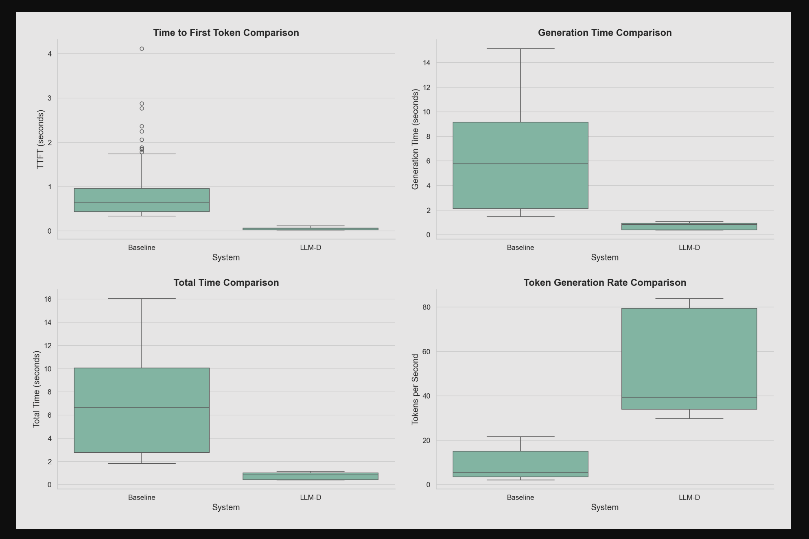
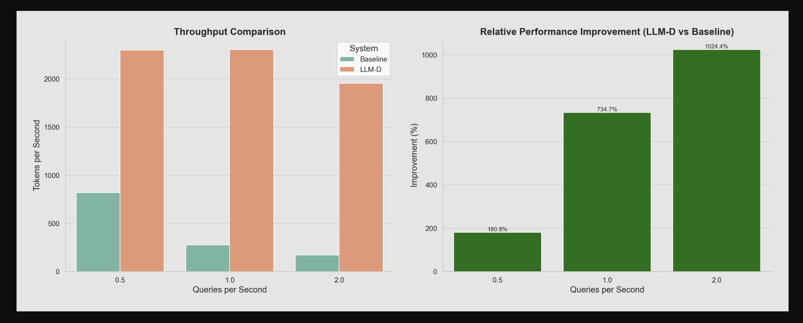
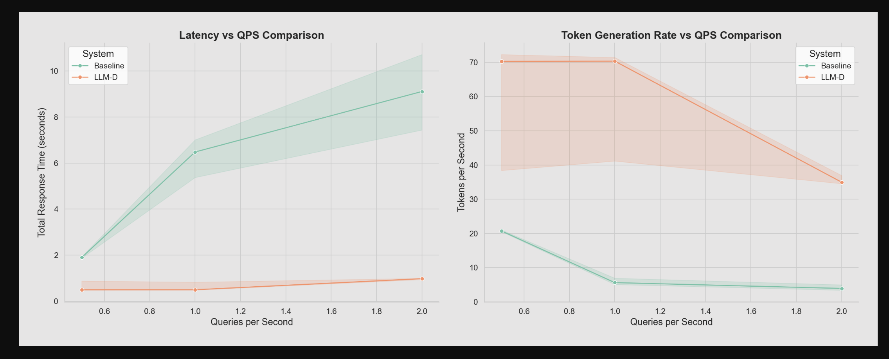

# Comparing Two LLM Deployments with FMPerf

This guide explains how to run benchmarks that compare two different LLM deployments (e.g., comparing a baseline model against an optimized version).
It uses [fmperf](https://github.com/fmperf-project/fmperf), specifically [fmperf's run_benchmark](https://github.com/fmperf-project/fmperf/blob/main/fmperf/utils/Benchmarking.py#L48)
The environment vars are configured via a [configmap](./workload-configmap.yaml).

The comparison consists of:

1. A benchmark job for the first LLM deployment (baseline)
2. A benchmark job for the second LLM deployment (e.g., LLM-D)
3. A retriever pod that consolidates the results

## Prerequisites

1. A running Kubernetes cluster
2. Two LLM deployments with accessible inference endpoints
3. The `fmperf` namespace created in your cluster

## Benchmark Structure

```
compare-jobs.yaml
├── baseline-fmperf-benchmark (Job)
│   ├── fmperf (Container running benchmark)
│   └── retriever (Container collecting results)
└── llmd-fmperf-benchmark (Job)
    ├── fmperf (Container running benchmark)
    └── retriever (Container collecting results)

compare-retriever.yaml
└── compare-retriever (Pod that consolidates results from both benchmarks)
```

## Example Analysis Results

Here are examples of the visualizations generated by the analysis script:

### Latency Comparison

*This visualization shows key latency metrics between the baseline and optimized deployments, including time to first token, generation time, total response time, and token generation rate.*

### Throughput Comparison

*This visualization shows throughput metrics, including tokens per second and the relative performance improvement of the optimized deployment over the baseline.*

### QPS Performance Comparison

*This visualization shows how performance scales with increasing query load, including latency vs QPS and token generation rate vs QPS.*

## Configuration

### 1. Set Up Required Resources

First, create the required PVCs, RBAC resources, and ConfigMap:

```bash
# Create the namespace if it doesn't exist
kubectl create namespace fmperf

# Create the PVCs for storing results
kubectl apply -f ./compare-baseline-llmd/pvc-compare.yaml

# Apply ServiceAccount and RBAC permissions
kubectl apply -f sa.yaml
kubectl apply -f rbac.yaml

# Create the ConfigMap with workload configurations
kubectl apply -f workload-configmap.yaml
```

### 2. Configure the Benchmark Jobs

The benchmark jobs are configured in `compare-baseline-llmd/compare-jobs.yaml`. Key configuration elements include:

#### Baseline Benchmark:
- **Service Endpoint**: Update `FMPERF_ENDPOINT_URL` with your baseline service endpoint
- **Model Configuration**: Set `FMPERF_WORKLOAD_FILE` to point to your baseline workload configuration
- **Stack Configuration**: Set `FMPERF_STACK_NAME` and `FMPERF_STACK_TYPE` for your baseline deployment

#### LLM-D/Optimized Benchmark:
- **Service Endpoint**: Update `FMPERF_ENDPOINT_URL` with your optimized service endpoint
- **Model Configuration**: Set `FMPERF_WORKLOAD_FILE` to point to your optimized workload configuration
- **Stack Configuration**: Set `FMPERF_STACK_NAME` and `FMPERF_STACK_TYPE` for your optimized deployment

### 3. Run the Benchmark Jobs

Due to PVC access mode limitations (ReadWriteOnce), you must run the benchmark jobs first, and then run the retriever pod after the jobs complete:

```bash
# Run the benchmark jobs
kubectl apply -f ./compare-baseline-llmd/compare-jobs.yaml

# Monitor the jobs
kubectl get jobs -n fmperf baseline-fmperf-benchmark llmd-fmperf-benchmark -w

# Wait for both jobs to complete before proceeding
```

### 4. Run the Retriever Pod

After both benchmark jobs have completed, run the retriever pod to consolidate the results:

```bash
# Run the retriever pod
kubectl apply -f ./compare-baseline-llmd/compare-retriever.yaml

# Check the status of the retriever pod
kubectl get pod -n fmperf compare-retriever
```

The retriever pod copies the tar files from both benchmark jobs into a consolidated results PVC.

### 5. Accessing and Analyzing the Results

After the benchmark jobs have completed, the compare-retriever pod will consolidate all results in a single location:

```bash
# Run the retriever pod to consolidate results (only after benchmark jobs complete)
kubectl apply -f ./compare-baseline-llmd/compare-retriever.yaml

# Check the status of the retriever pod
kubectl get pod -n fmperf compare-retriever
```

Once the compare-retriever pod is running, you can copy the results directly to your local machine:

```bash
# Create local directories for the results
mkdir -p ./compare-results

# List the contents of the consolidated results directory
kubectl exec -n fmperf compare-retriever -- ls -la /results

# Copy results directly to your local machine
kubectl cp fmperf/compare-retriever:/results/ ./compare-results
```

Now analyze the results using the comparison script:

```bash
# Find the results directory that was created
ls -la ./compare-results

# Set the TIMESTAMP environment variable for easy reference
export TIMESTAMP=$(ls -la ./compare-results | grep "compare-run-" | head -1 | awk '{print $9}' | sed 's/compare-run-//')
echo "Using timestamp: $TIMESTAMP"

# Run the comparison analysis on the collected results
# Note: After kubectl cp, both baseline and llm-d results are in the same directory with different prefixes
python ./compare-baseline-llmd/analyze-compare-results.py \
  --baseline-dir ./compare-results/compare-run-$TIMESTAMP \
  --llmd-dir ./compare-results/compare-run-$TIMESTAMP \
  --output-dir ./compare-results/analysis
```

The script will create an `analysis` directory inside `compare-results` with:

- Comparative visualizations (latency, throughput, QPS)
- Statistics on performance improvements
- A README.md file explaining the plots

The README.md is generated using the `readme-analyze-compare-template.md` template, which provides a standardized format for understanding the benchmark results.

### 6. Viewing the Analysis Results

The analysis script generates several visual reports and a detailed README.md in the output directory:

```bash
# List the generated analysis files
ls -la ./compare-results/analysis/plots
```

#### View README with grip (recommended)

[Grip](https://github.com/joeyespo/grip) renders Markdown files with GitHub styling for better visualization:

```bash
# Install grip if needed
pip install grip

# Navigate to the plots directory
cd ./compare-results/analysis/plots

# Generate HTML and view in browser (--browser opens it automatically)
grip README.md --browser

The plots include:
- `latency_comparison.png` - Compares response time metrics between systems
- `throughput_comparison.png` - Compares throughput and shows relative improvement
- `qps_comparison.png` - Shows how each system scales with increasing load

The compare-retriever pod will remain running for 6 hours after collecting results, giving you plenty of time to copy the results if needed.
