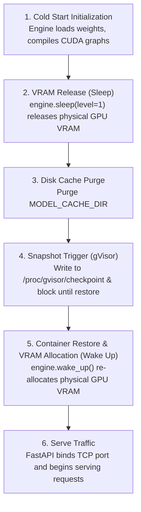

# GKE Fast Pod Snapshot Utility for vLLM

A modular container snapshot provider and vLLM lifespan wrapper that enables fast pod checkpointing and restoration on Google Kubernetes Engine (GKE) with GKE Sandbox (gVisor) and NVIDIA GPUs.

---

## Overview

Deploying large language models (LLMs) on Kubernetes often incurs high cold-start latencies due to downloading weights, loading them into memory, allocating GPU VRAM, and compiling CUDA graphs.

This package provides a drop-in launcher and snapshot provider that hooks into vLLM's FastAPI application lifespan to:
1. Initialize the vLLM engine and compile CUDA graphs during container cold start.
2. Put the vLLM engine to sleep (`engine.sleep(level=1)`) to release physical GPU VRAM while preserving virtual memory mappings.
3. Purge cached model weight files from disk to minimize the checkpoint storage footprint.
4. Trigger a gVisor userspace checkpoint via `/proc/gvisor/checkpoint`.
5. Restore the container and wake up the engine (`engine.wake_up()`) to re-allocate physical GPU VRAM upon restoration before binding HTTP ports and serving traffic.

> [!NOTE]
> This README is intended for developers maintaining and integrating this snapshot utility. For the user-facing deployment guide, cluster configuration, and end-to-end benchmark walkthroughs, refer to the [`/guides`](../../../guides) directory.

---

## Architecture & Lifecycle

The snapshot lifecycle is orchestrated inside the FastAPI application lifespan context manager ([`vllm/wrapper.py`](vllm/wrapper.py)):



---

## Package Layout & Components

```
docker/scripts/snapshot/
├── __init__.py           # Package exports (GKESnapshotProvider, patch_vllm_lifespan, get_snapshot_provider)
├── launcher.py           # CLI entrypoint wrapping vllm serve
├── providers.py          # GKESnapshotProvider and provider factory
├── test_providers.py     # Unit test suite
├── README.md             # Developer documentation
└── vllm/
    ├── __init__.py       # vLLM integration exports
    └── wrapper.py        # FastAPI lifespan context manager patch
```

### Component Details

- **[`launcher.py`](launcher.py)**:
  CLI entrypoint intended to replace `vllm serve` or `python3 -m vllm.entrypoints.openai.api_server`. It dynamically intercepts `vllm.entrypoints.openai.api_server.build_app` to apply `patch_vllm_lifespan()` to the FastAPI application before passing control to `vllm.entrypoints.cli.main()`.

- **[`vllm/wrapper.py`](vllm/wrapper.py) (`patch_vllm_lifespan`)**:
  Wraps the FastAPI application's `router.lifespan_context`. During startup, after the original lifespan context initializes the vLLM engine:
  - Calls `await engine.sleep(level=1)` to release physical GPU memory.
  - Calls `snapshot_provider.trigger()` in a separate thread.
  - Upon process resumption, calls `await engine.wake_up()` to restore GPU memory mappings.
  - Resumes the lifespan lifecycle, allowing Uvicorn to bind TCP ports.

- **[`providers.py`](providers.py) (`GKESnapshotProvider`)**:
  Handles the low-level interaction with gVisor's `/proc/gvisor/checkpoint` interface:
  - `clear_cache()`: Recursively deletes downloaded model weight files from `MODEL_CACHE_DIR` to reduce checkpoint size.
  - `is_available()`: Checks if the procfs checkpoint trigger file is writable.
  - `trigger()`: Clears the cache, opens `/proc/gvisor/checkpoint`, writes `1` to initiate checkpointing, and blocks on a 1-byte read until the container is restored.

- **[`providers.py`](providers.py) (`get_snapshot_provider`)**:
  Factory function that returns a `GKESnapshotProvider` if `SNAPSHOT_PROVIDER=gke_gvisor`, or `None` if unset/disabled.

---

## Configuration & Environment Variables

### Snapshot Configuration

| Variable | Description | Default |
| :--- | :--- | :--- |
| `SNAPSHOT_PROVIDER` | Provider backend. Set to `gke_gvisor` to enable GKE gVisor snapshotting. If unset or any other value, snapshotting is disabled. | `""` (disabled) |
| `MODEL_CACHE_DIR` | Path to the local model weight cache directory to purge before triggering the checkpoint (e.g. `/root/.cache/huggingface/hub`). | `None` |

### gVisor & NCCL Compatibility Settings

Inside GKE Sandbox (gVisor), certain hardware and kernel primitives (such as host-level POSIX shared memory and GPU P2P memory access) are restricted. Set the following environment variables on the container to ensure stable execution:

| Variable | Value | Purpose |
| :--- | :---: | :--- |
| `NCCL_P2P_DISABLE` | `1` | Disables GPU peer-to-peer communication, which is unsupported in gVisor. |
| `NCCL_SHM_DISABLE` | `1` | Disables host POSIX shared memory transport for NCCL to avoid sandbox permission errors. |
| `NCCL_SOCKET_IFNAME` | `lo` | Binds NCCL communication to the local loopback interface. |
| `GLOO_SOCKET_IFNAME` | `lo` | Binds Gloo communication to the local loopback interface. |
| `TORCH_NCCL_ENABLE_MONITORING` | `0` | Disables PyTorch NCCL watchdog threads that can interfere with gVisor checkpoint freezing. |
| `TORCH_NCCL_ASYNC_ERROR_HANDLING` | `0` | Disables asynchronous error handling threads during checkpointing. |

### CLI Flags & Rationale

> [!IMPORTANT]
> When serving models with `safetensors`, always pass `--safetensors-load-strategy eager` to vLLM.
>
> - **Why:** By default, safetensors uses `mmap` (memory-mapping files directly from disk). If cached weight files are deleted before the snapshot to reduce storage size, memory-mapped file descriptors become invalid.
> - Setting `--safetensors-load-strategy eager` forces vLLM to copy weights directly into RAM so disk caches can be safely purged.

---

## Infrastructure Requirements & Caveats

For complete cluster and storage setup instructions, refer to the official Google Cloud documentation:
- [About GKE Pod Snapshots](https://cloud.google.com/kubernetes-engine/docs/concepts/pod-snapshots)
- [Enable Pod Snapshots on GKE](https://cloud.google.com/kubernetes-engine/docs/how-to/pod-snapshots#enable)
- [Configure Snapshot Storage (GCS & Workload Identity)](https://cloud.google.com/kubernetes-engine/docs/how-to/pod-snapshots#store-snapshots)
- [GKE Sandbox (gVisor) Overview](https://cloud.google.com/kubernetes-engine/docs/concepts/sandbox-pods)

### Key Technical Caveats

1. **Single-Rank Scope**:
   This wrapper is designed for single-rank model deployments (e.g. single-GPU or tensor-parallel within a single pod). Multi-node / multi-rank distributed barrier coordination across pods during checkpointing is not supported.
2. **Workload-Triggered Policy**:
   In the GKE `PodSnapshotPolicy`, ensure `spec.triggerConfig.type` is set to `workload` (with `postCheckpoint: resume`). If set to `manual`, GKE will ignore container-initiated writes to `/proc/gvisor/checkpoint`.
3. **gVisor Localhost Isolation**:
   Inside gVisor sandboxes, direct `kubectl port-forward pod/<pod-name>` does not route to `localhost` inside the sandbox due to network stack isolation. Test connectivity using an in-cluster test pod or via a Kubernetes `Service`.
4. **Hierarchical Namespace GCS Buckets**:
   GKE Pod Snapshots require a GCS bucket created with hierarchical namespace enabled (`--enable-hierarchical-namespace`).

---

## Kubernetes Manifests

### 1. Storage Configuration (`PodSnapshotStorageConfig`)

Defines the GCS backend for storing snapshot images:

```yaml
apiVersion: podsnapshot.gke.io/v1
kind: PodSnapshotStorageConfig
metadata:
  name: pod-snapshot-storage-config
spec:
  snapshotStorageConfig:
    gcs:
      bucket: "my-snapshot-bucket"
      path: "/"
      tokenSource: "podKSA"
```

### 2. Snapshot Policy (`PodSnapshotPolicy`)

Configures automated, workload-triggered snapshots targeting the model server pods:

```yaml
apiVersion: podsnapshot.gke.io/v1
kind: PodSnapshotPolicy
metadata:
  name: pod-snapshot-policy
  namespace: default
spec:
  storageConfigName: pod-snapshot-storage-config
  selector:
    matchLabels:
      app: vllm-server
  triggerConfig:
    type: workload       # Allows the Python container to trigger the snapshot
    postCheckpoint: resume
```

### 3. Model Server Deployment

Deploys the vLLM container running inside GKE Sandbox (gVisor) with the snapshot launcher and required compatibility settings:

```yaml
apiVersion: apps/v1
kind: Deployment
metadata:
  name: vllm-server
  namespace: default
spec:
  replicas: 2
  selector:
    matchLabels:
      app: vllm-server
  template:
    metadata:
      labels:
        app: vllm-server
    spec:
      runtimeClassName: gvisor
      nodeSelector:
        sandbox.gke.io/runtime: gvisor
        cloud.google.com/gke-accelerator: nvidia-l4
      containers:
      - name: vllm
        image: vllm/vllm-openai:latest
        command:
        - python3
        - -m
        - docker.scripts.snapshot.launcher
        args:
        - --model
        - meta-llama/Llama-3.1-8B-Instruct
        - --safetensors-load-strategy
        - eager
        - --gpu-memory-utilization
        - "0.90"
        - --port
        - "8000"
        env:
        # Snapshot configuration
        - name: SNAPSHOT_PROVIDER
          value: "gke_gvisor"
        - name: MODEL_CACHE_DIR
          value: "/root/.cache/huggingface/hub"
        - name: HUGGING_FACE_HUB_TOKEN
          valueFrom:
            secretKeyRef:
              name: hf-token
              key: token
        # gVisor and NCCL compatibility settings
        - name: VLLM_HOST_IP
          value: "127.0.0.1"
        - name: MASTER_ADDR
          value: "127.0.0.1"
        - name: MASTER_PORT
          value: "29500"
        - name: NCCL_SOCKET_IFNAME
          value: "lo"
        - name: GLOO_SOCKET_IFNAME
          value: "lo"
        - name: NCCL_P2P_DISABLE
          value: "1"
        - name: NCCL_SHM_DISABLE
          value: "1"
        - name: TORCH_NCCL_ENABLE_MONITORING
          value: "0"
        - name: TORCH_NCCL_ASYNC_ERROR_HANDLING
          value: "0"
        resources:
          limits:
            nvidia.com/gpu: 1
        volumeMounts:
        - name: shm
          mountPath: /dev/shm
      volumes:
      - name: shm
        emptyDir:
          medium: Memory
          sizeLimit: 4Gi
```

---

## How GKE Matches Pods to Snapshots

With policy-based snapshotting (`PodSnapshotPolicy`), GKE transparently matches restored pods to the correct snapshot without needing hardcoded snapshot IDs:

1. **Distilled Pod Spec Hash:** GKE computes a hash over runtime-critical pod fields (container image, commands, arguments, environment variables, and sandbox settings).
2. **Node Compatibility Metadata:** GKE captures essential node metadata (node machine type, GPU accelerator type, and driver version).
3. **Lookup & Restoration:** When a new replica is scheduled, GKE matches the pod's distilled hash and node metadata to the most recent matching `PodSnapshot` in the cluster and restores directly from GCS.

---

## Monitoring & Verifying Snapshots

### 1. Monitor Snapshot Creation

Watch the `PodSnapshot` status during the initial cold start:

```bash
kubectl get podsnapshots -w
```

Status progression:
1. `AwaitingCheckpoint`: GKE signaled gVisor to freeze the container runtime.
2. `AllSnapshotsAvailable`: Snapshot files have been uploaded to GCS and are ready for restoration.

### 2. Verify Restore Logs

When a new pod restores from the snapshot, the vLLM logs show an instant wake-up:

```logs
(APIServer pid=1) [llm-d.snapshot.wrapper] INFO: Process restored from snapshot checkpoint. Resuming engine...
(APIServer pid=1) [llm-d.snapshot.wrapper] INFO: Executing engine.wake_up() to restore VRAM...
(EngineCore pid=55) INFO: It took 0.002859 seconds to wake up tags {'kv_cache', 'weights'}.
(APIServer pid=1) INFO: Application startup complete.
```

### 3. In-Cluster Verification

Because gVisor sandboxes isolate localhost from the host runtime namespace, test HTTP inference using an in-cluster test pod:

```bash
kubectl run curl-test --rm -i --restart=Never \
  --image=cfmanteiga/alpine-bash-curl-jq:latest \
  -- /bin/sh -c 'curl -sS -X POST "http://<SERVICE_IP>:8000/v1/completions" \
    -H "Content-Type: application/json" \
    -d "{\"model\": \"meta-llama/Llama-3.1-8B-Instruct\", \"prompt\": \"Hello!\"}" | jq'
```

Or expose via a Kubernetes Service and port-forward to the Service:

```bash
kubectl expose deployment vllm-server --port=8000 --target-port=8000 --name=vllm-service
kubectl port-forward service/vllm-service 8000:8000
curl http://localhost:8000/v1/models
```

---

## Running Unit Tests

Run the test suite locally using Python's standard `unittest` runner or `pytest`:

```bash
python3 -m unittest docker/scripts/snapshot/test_providers.py
```

Or:

```bash
pytest docker/scripts/snapshot/test_providers.py
```
