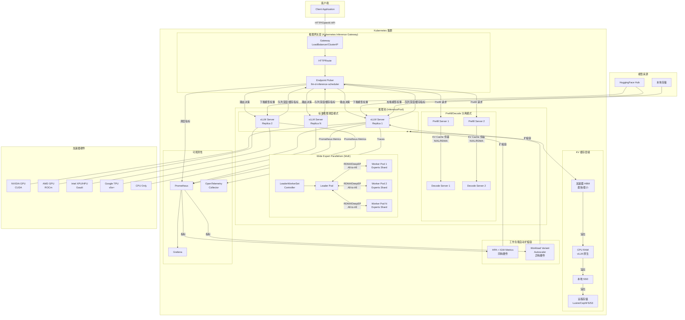
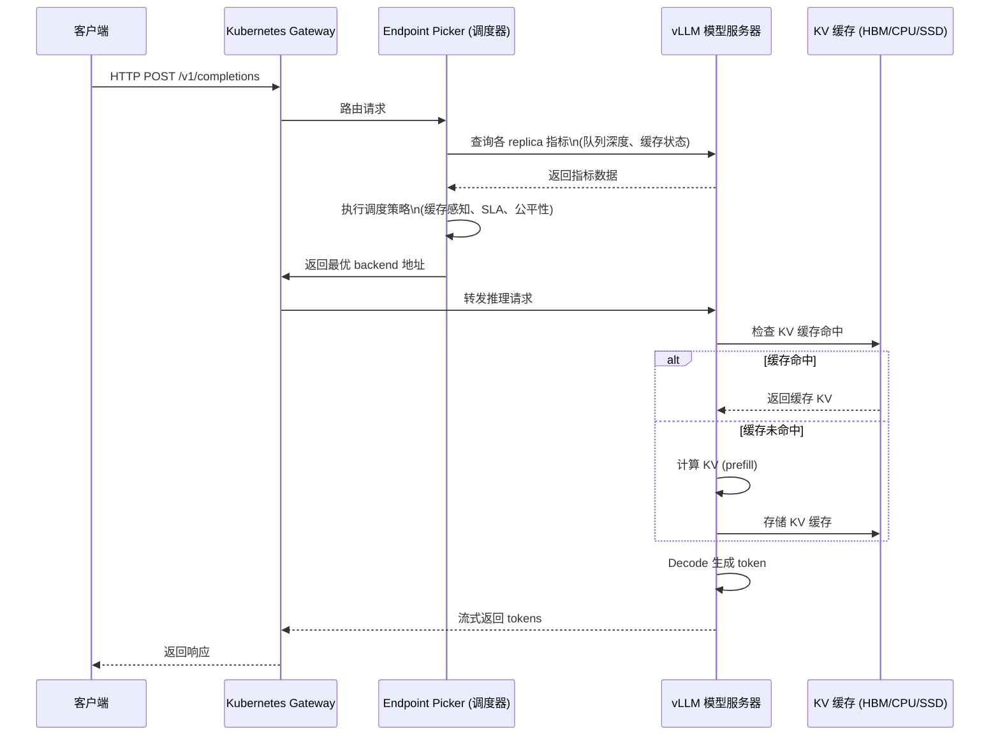
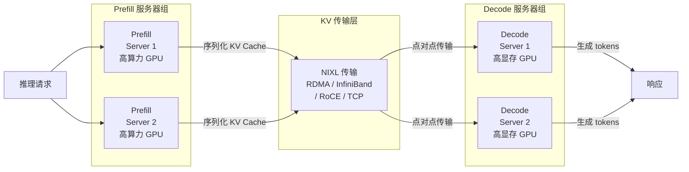
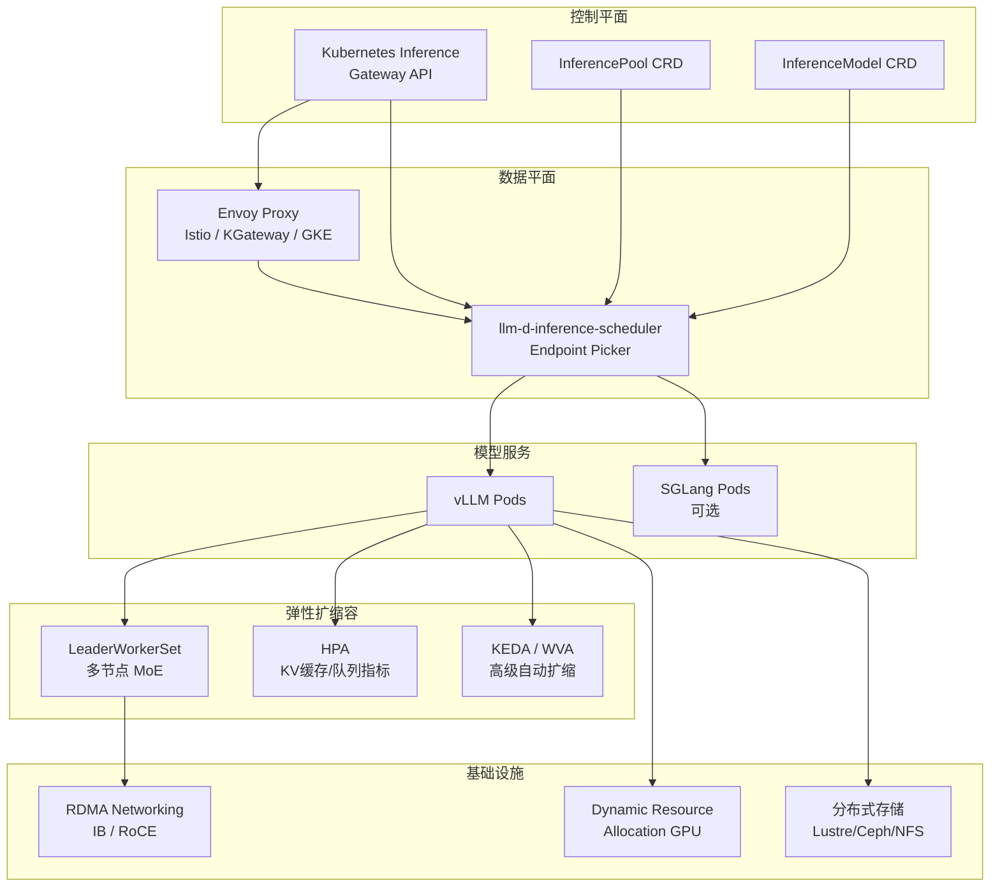
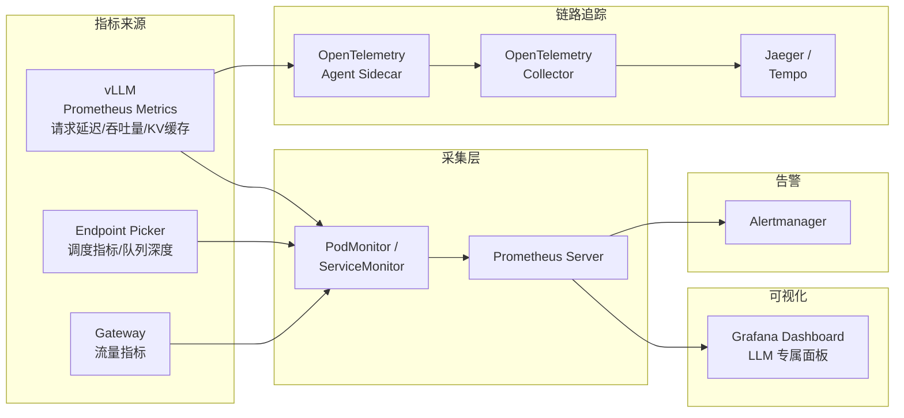

# llm-d 架构图

## 系统总体架构

---

## 请求处理数据流

---

## Prefill/Decode 分离架构

---

## 组件交互关系

---

## 部署路径 (Well-Lit Paths)

| 路径 | 适用场景 | 组件 | 硬件要求 |
|------|---------|------|---------|
| **推理调度** | 通用生产环境 | vLLM + 智能负载均衡 | 2×TP GPU，8+ replicas |
| **P/D 分离** | 大模型 (120B+)，长 Prompt | Prefill/Decode 分离 + NIXL | RDMA 互联 |
| **Wide EP** | 超大 MoE 模型 (DeepSeek-R1) | LeaderWorkerSet + DeepEP | 32+ GPU + 全互联 RDMA |
| **分级 KV 缓存** | 高并发，长 Prompt 重用 | vLLM KVConnector + 多级存储 | 大容量 SSD / 远程存储 |
| **工作负载自动扩缩** | 流量波动，混合硬件 | HPA / WVA | 取决于上述模式 |

---

## 容器镜像与硬件支持矩阵

| 镜像 | 硬件 | 框架 |
|------|------|------|
| `Dockerfile.cuda` | NVIDIA GPU | CUDA |
| `Dockerfile.rocm` | AMD GPU | ROCm |
| `Dockerfile.xpu` | Intel GPU | XPU (i915/xe) |
| `Dockerfile.hpu` | Intel Gaudi | HPU |
| `Dockerfile.cpu` | x86/ARM CPU | PyTorch CPU |

---

## 可观测性架构

