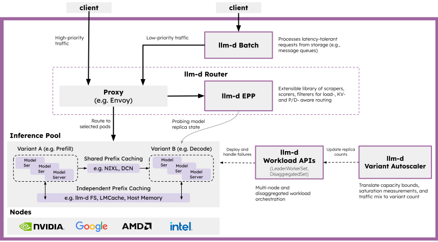

# Architecture

High-level guide to llm-d architecture. The llm-d architecture is organized into seven core functional areas:

  <picture>
    <source media="(prefers-color-scheme: dark)">
    
  </picture>

## 1. Router

The [llm-d Router](router/README.md) is the intelligent entry point for inference requests, providing LLM-aware load balancing, request queuing, and policy enforcement without reimplementing a full network proxy:

- **[InferencePool](router/inferencepool.md)**: The Kubernetes custom resource that bridges Gateway routing with backend model servers via label selectors and `ext-proc` attachment.
- **[Proxy](router/proxy.md)**: A high-performance L7 proxy conformant with the Gateway API Inference Extension (GAIE) that accepts user requests and consults the EPP via the `ext-proc` protocol.
- **[Endpoint Picker (EPP)](router/epp.md)**: The routing engine that scores and selects model server pods based on real-time metrics, KV-cache affinity, and configured policies.
- **[Request Handling](router/request-handling.md)**: Request parsing, header extraction, and admission control.
- **[Flow Control](router/flow-control.md)**: Multi-priority queuing, fair-share scheduling, and proactive overload protection.
- **[Request Scheduling](router/scheduling.md)**: Extensible Filter-Score-Pick pipeline selecting optimal candidate endpoints.
- **[Data Layer](router/datalayer.md)**: Real-time telemetry ingestion from model servers and Kubernetes APIs.
- **[EPP Configuration](router/configuration.md)**: Declarative YAML configuration schema and plugin setup.
- **[Latency Predictor](router/latency-predictor.md)**: Online ML regression models predicting TTFT and TPOT to enforce latency SLOs.

See [Router](router/README.md) for full details.

## 2. Model Servers

The [Model Servers](model-servers/README.md) layer consists of accelerator-native inference engines that load model weights and execute forward passes:

- **[vLLM](model-servers/vllm.md)**: Default engine featuring PagedAttention, native tiered offloading, NixlConnector RDMA for P/D disaggregation, and wide expert parallelism.
- **[SGLang](model-servers/sglang.md)**: High-performance engine featuring RadixAttention, HiCache hierarchical caching, prefill bootstrap room coordination, and Mooncake/Nixl transfer backends.
- **TensorRT-LLM (`trtllm-serve`)**: NVIDIA's high-throughput engine with optimized In-Flight Batching and specialized kernels.

See [Model Servers](model-servers/README.md) for telemetry protocols, metric specifications, and dynamic LoRA serving.

## 3. Disaggregation

The [Disaggregation](disaggregation/README.md) section covers decoupling compute-bound and memory-bound phases as well as scaling mixture-of-experts models across multi-node slices:

- **[Disaggregated Serving](disaggregation/pd-disaggregation.md)**: Separating prefill (compute-bound) and decode (memory-bound) stages across specialized workers with high-speed RDMA KV transfer.
- **[Wide Expert Parallelism](disaggregation/wide-expert-parallelism.md)**: Distributed serving for large Mixture-of-Experts (MoE) models combining data-parallel attention, expert-parallel MLP layers, and rank-aware routing.

See [Disaggregation](disaggregation/README.md) for full details.

## 4. KV Cache Management

llm-d provides a comprehensive ecosystem for managing and reusing the KV cache across the inference pool:

- **[Prefix-Cache Aware Routing](kv-management/prefix-cache-aware-routing.md)**: Heuristic and precise techniques to maximize cache hits.
- **[KV-Cache Indexing](kv-management/kv-indexer.md)**: Event-driven tracking of cache state across all model servers.
- **[KV Offloading](kv-management/kv-offloader.md)**: Tiered storage hierarchy (CPU, SSD) for extending cache capacity.
- **[P2P KV-Cache Sharing](kv-management/p2p-kv-cache-sharing.md)**: Pulling cached prefix KV blocks from a peer's CPU tier instead of recomputing them.

See [KV Cache Management](kv-management/README.md) for full details.

## 5. Workload APIs

The [Workload APIs](workload-apis/README.md) provide Kubernetes custom resources for managing distributed model groups and synchronized serving topologies:

- **[LeaderWorkerSet (LWS)](workload-apis/leaderworkerset.md)**: Kubernetes SIG workload controller for deploying multi-node accelerator pod groups with leader-worker topology, gang scheduling, and all-or-nothing restart semantics.
- **[DisaggregatedSet](workload-apis/disaggregatedset.md)**: Workload controller orchestrating multi-role disaggregated serving topologies (such as prefill and decode) as synchronized, versioned slices.

See [Workload APIs](workload-apis/README.md) for full details.

## 6. Autoscaling

llm-d supports proactive, SLO-aware autoscaling driven by metrics exported by the EPP:

- **[KEDA + EPP Metrics](autoscaling/keda-epp.md)**: Scaling on real-time queuing signals (queue depth, pool saturation, token backlog) using KEDA Prometheus triggers.
- **[SLO-Aware Autoscaling](autoscaling/slo-aware-keda.md)**: Closed-loop control scaling replicas based on estimated latency headroom against SLO targets.
- **[Workload Variant Autoscaler (WVA)](autoscaling/wva.md)**: Global multi-variant optimization across heterogeneous hardware (deprecated).

See [Autoscaling](autoscaling/README.md) for full details.

## 7. Batch and Async Serving

Batch and offline inference workloads are handled by two modular components that can be deployed independently or together:

- **[Batch Gateway](batch/batch-gateway.md)**: An OpenAI-compatible Batch API (`/v1/batches`, `/v1/files`) for submitting, tracking, and managing batch inference jobs.
- **[Async Processor](batch/async-processor.md)**: A lightweight dispatch agent that pulls requests from message queues (Redis, Pub/Sub) and meters dispatch against flow control.

See [Batch and Async Serving](batch/README.md) for full details.
