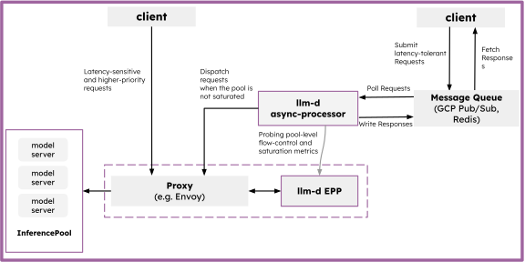
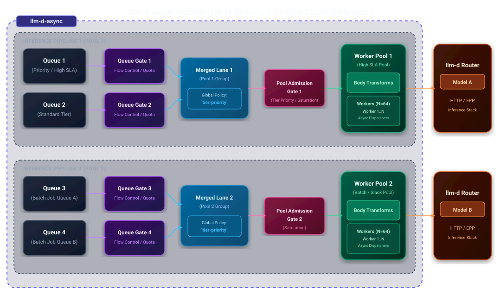

# Async Processor Architecture

The Async Processor is a lightweight dispatch agent that pulls inference requests from message queues and forwards them to the llm-d Router. It uses dispatch gates, isolated worker pools, request body transforms, and merge policies to regulate dispatch rates and process background workloads efficiently without overflowing inference servers.

  <picture>
    <source media="(prefers-color-scheme: dark)">
    
  </picture>

### Internal Pipeline Architecture

  <picture>
    <source media="(prefers-color-scheme: dark)">
    
  </picture>

## How It Works

1. **Queue Gate & Poll** — Before pulling messages from queues, requests pass through queue-level **Dispatch Gates** to regulate message flow and ingestion based on system metrics and capacity.
2. **Merge** — Polled messages from multiple input queues or topic subscriptions are combined according to the configured **Request Merge Policy** for the target worker pool.
3. **Worker Pool Admission Gate** — Merged requests pass through a **Worker Pool Admission Gate** (e.g., local max concurrency, pool-level saturation or budget gates) that verifies whether the worker pool has capacity and budget to accept new work.
4. **Transform** — Admitted requests pass through **Request Body Transforms** to normalize payload schemas or inject routing headers and parameters.
5. **Dispatch** — Concurrent workers in the designated **Worker Pool** dispatch HTTP requests to the llm-d Router with deadline propagation.
6. **Result** — On success, results are written back to a result queue. On retryable failure (rate limiting, transient errors), the request is re-queued with exponential backoff.

## Dispatch Gates

Dispatch gates regulate the flow of requests by controlling message ingestion rates when polling requests from message queues, as well as worker pool admission and downstream dispatch rates. By evaluating metrics before messages are pulled and admitted into worker pipelines, gates prevent overload on downstream inference servers and maintain system stability.

Gates can be configured at two distinct levels:
- **Queue / Subscription Level**: Controls flow and ingestion before messages are polled and merged.
- **Worker Pool Admission Level**: Controls entry into the worker pool execution pipeline (regulating per-pool concurrency, budget, and saturation).

| Gate type | Behavior |
|-----------|----------|
| `constant` | Always open — no throttling. |
| `redis` | Reads budget values from Redis keys, allowing external orchestrators to dynamically adjust rate limits per queue or pool. |
| `prometheus-saturation` | Queries Prometheus for model server saturation metrics (e.g., KV cache pressure, queue depth). Allows ingestion and admission when saturation is below a configurable threshold. |
| `prometheus-budget` | Computes available downstream capacity directly from metrics. |
| `local-max-concurrency` | Restricts local concurrency within a worker pool to cap in-flight requests. |

## Worker Pools & Request Merge Policies

### Worker Pools

The Async Processor uses a multi-tenant pipeline model based on **Worker Pools**. Instead of relying on a single global worker pool, requests are assigned to designated worker pools, each operating with an independent set of concurrent workers.

- **Isolation**: Saturated or blocked worker pools do not affect the processing or throughput of other worker pools.
- **Dedicated Concurrency**: Each pool defines its own worker count, concurrency limits, and admission gates.
- **Queue-to-Pool Mapping**: Multiple queue configurations can route requests to the same worker pool, but a single queue configuration can only route to a single worker pool.

### Request Merge Policies

When multiple queue configurations route requests to the same worker pool, a **Request Merge Policy** controls how incoming requests from those separate queue channels are combined into the pool's single processing pipeline after passing queue-level dispatch gates.

The two supported merge policies are:

| Policy | Description |
|--------|-------------|
| `random-robin` | Default policy. Randomly picks messages from all queues configured for a given pool. |
| `tier-priority` | Buckets requests into 6 strict priority lanes using routing tags (`(classification, tier)`). Within each bucket, it round-robins across different client channels and stamps the chosen priority header (`x-gateway-priority` by default). |

Per-worker-pool merging ensures backpressure from one merged channel only impacts its associated worker pool, maintaining multi-tenant isolation.

## Request Body Transforms

Request body-transform plugins handle rewriting the outgoing body and `Content-Type` based on per-message metadata. The default JSON path is preserved byte-for-byte when no plugin applies.

## Message Queue Integrations

| Implementation | Characteristics |
|---------------|-----------------|
| Redis Sorted Set | Persisted, priority-ordered by deadline. Supports per-queue gate configurations. |
| Redis Pub/Sub | Ephemeral, fan-out delivery. |
| GCP Pub/Sub | Cloud-native, scalable. Supports per-subscription gating. |

## Concurrency and Retries

- **Configurable Parallelism**: Worker pools define independent concurrency limits (default 64 per pool) for parallel processing.
- **Deadline Enforcement**: Each request carries a deadline from the queue message. Workers abandon requests that cannot complete before their deadline.
- **Exponential Backoff**: Retryable failures are re-queued with backoff (base 2s, max 60s, with jitter). Fatal errors (bad payload, unrecoverable failures) are not retried.

## Observability

Prometheus metrics include request totals, success/failure counts, retry counts, deadline-exceeded counts, shedded request counts, gate decisions, dispatch budgets, and request latency histograms.

## Related

- [Async Processor Well-Lit Path](../../../well-lit-paths/workloads/batch-serving/asynchronous-processing.md) — a guide for deploying the Async Processor.
- [Async Processor Repository](https://github.com/llm-d-incubation/llm-d-async) — source code and Helm chart.
- [Batch Gateway](batch-gateway.md) — composes with the Async Processor for batch job management.
