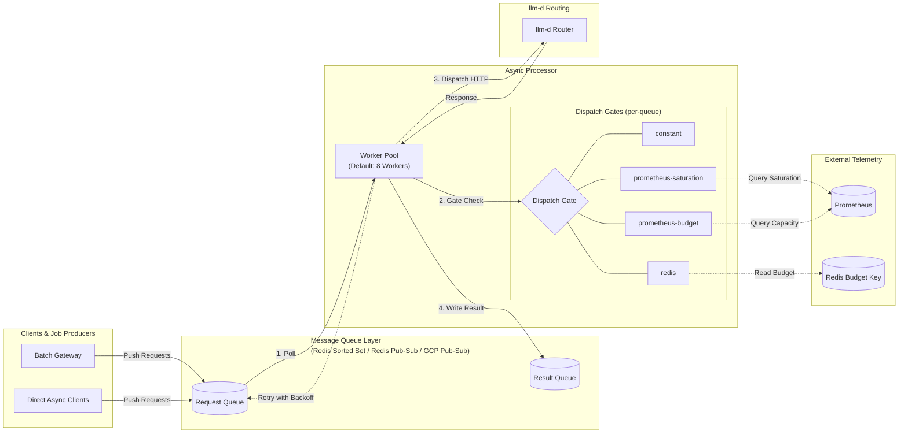

# Async Processor Architecture

The Async Processor is a lightweight dispatch agent that pulls inference requests from message queues and forwards them to the llm-d Router. It uses dispatch gates to regulate dispatch rate based on system metrics, ensuring that the dispatched workloads don't overflow the inference servers.

## How It Works

1. **Poll** — workers pull requests from one or more message queues.
2. **Gate** — before dispatching, each request passes through a dispatch gate that checks whether the system has capacity. If the gate is closed (budget = 0), the request waits.
3. **Dispatch** — the worker sends an HTTP request to the llm-d Router with deadline propagation.
4. **Result** — on success, results are written back to a queue. On retryable failure (rate limiting, transient errors), the request is re-queued with exponential backoff.

## Dispatch Gates

The dispatch gate controls the rate by which the processor sends requests. Each queue can have its own gate, allowing independent dispatch control per workload.

| Gate type | Behavior |
|-----------|----------|
| `constant` | Always open — no throttling. |
| `redis` | Reads a budget value from a Redis key, allowing external systems to control dispatch rate. |
| `prometheus-saturation` | Queries Prometheus for model server saturation metrics. Dispatches when saturation is below a configurable threshold. |
| `prometheus-budget` | Computes available capacity from downstream metrics. |

## Message Queue Integrations

| Implementation | Characteristics |
|---------------|-----------------|
| Redis Sorted Set | Persisted, priority-ordered by deadline. Supports per-queue gate configuration. |
| Redis Pub/Sub | Ephemeral, fan-out delivery. Single global gate. |
| GCP Pub/Sub | Cloud-native, scalable. Supports per-subscription gating. |

## Concurrency and Retries

- **Worker pool** — configurable number of concurrent workers (default 8) process requests in parallel.
- **Deadline enforcement** — each request carries a deadline from the queue message. Workers abandon requests that cannot complete before their deadline.
- **Exponential backoff** — retryable failures are re-queued with backoff (base 2s, max 60s, with jitter). Fatal errors (bad payload, unrecoverable failures) are not retried.

## Observability

Prometheus metrics include request totals, success/failure counts, retry counts, deadline-exceeded counts, shedded request counts, and request latency histograms.

## Related

- [Async Processor Well-Lit Path](../../../well-lit-paths/workloads/batch-serving/asynchronous-processing.md) — a guide for deploying the Async Processor.
- [Async Processor Repository](https://github.com/llm-d-incubation/llm-d-async) — source code and Helm chart.
- [Batch Gateway](batch-gateway.md) — composes with the Async Processor for batch job management.
