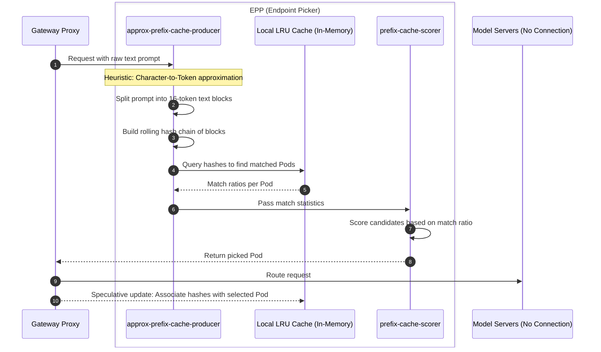
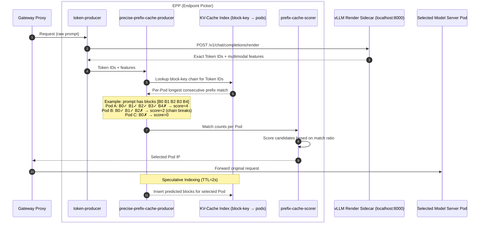

# Prefix-Cache Aware Routing

Prefix-cache aware routing is a core technique managed by the **llm-d Router** (specifically via its **Endpoint Picker (EPP)** component) to reduce tail latency and increase throughput. By routing requests to model server replicas that already contain the relevant Key-Value (KV) cache for a prompt's prefix, the system avoids redundant "prefill" computation, saving both time and accelerator (GPU/TPU) resources. This technique expects the underlying model servers to support KV-caching across requests, such as vLLM's [Automatic Prefix Caching](https://docs.vllm.ai/en/latest/features/automatic_prefix_caching/) feature.

llm-d provides two distinct implementations of this capability, catering to different operational requirements and precision needs.

---

## 1. Approximate Implementation

The approximate implementation is designed to be lightweight and requires no external dependencies beyond the standard EPP deployment.

### Components

- [**`approx-prefix-cache-producer`**](https://github.com/llm-d/llm-d-router/tree/main/pkg/epp/framework/plugins/requestcontrol/dataproducer/approximateprefix) (DataProducer plugin)
- [**`prefix-cache-scorer`**](https://github.com/llm-d/llm-d-router/tree/main/pkg/epp/framework/plugins/scheduling/scorer/prefix) (Scorer plugin)

### How it Works

1. **Approximation**: Since the EPP does not natively contain a tokenizer, it approximates tokens using character-to-token ratios.
2. **Hashing**: The `approx-prefix-cache-producer` splits the incoming prompt into fixed-size blocks (e.g., 16 tokens approximated as characters) and builds a rolling hash chain.
3. **Local Index**: The EPP maintains an in-memory LRU index of which prefix hashes were recently sent to which Pods.
4. **Scoring**: The `prefix-cache-scorer` reads the match information and assigns a score based on the ratio of matched blocks to total prompt blocks.
5. **Learning**: After a routing decision is made, the EPP updates its local index, assuming the selected Pod will now host that prefix.

### Pros & Cons

- **Pros**: Extremely lightweight; no need for a tokenizer sidecar; no network connectivity required to model servers (ZMQ); does not require explicit model server integration as it doesn't expect the model servers to communicate KV-cache events.
- **Cons**: Can diverge from actual model server state (e.g., if a Pod evicts a prefix due to memory pressure); less precise than token-based matching.

---

## 2. Precise Implementation

The precise implementation provides 100% accuracy by leveraging actual token data and real-time state updates from the model servers.

### Components

- [**`token-producer`**](https://github.com/llm-d/llm-d-router/tree/main/pkg/epp/framework/plugins/requestcontrol/dataproducer/tokenizer) (DataProducer plugin)
- [**`precise-prefix-cache-producer`**](https://github.com/llm-d/llm-d-router/tree/main/pkg/epp/framework/plugins/requestcontrol/dataproducer/preciseprefixcache) (DataProducer plugin) — owns the KV-block index
- [**`prefix-cache-scorer`**](https://github.com/llm-d/llm-d-router/tree/main/pkg/epp/framework/plugins/scheduling/scorer/prefix) (Scorer plugin) — scores using the producer's match info via `prefixMatchInfoProducerName: precise-prefix-cache-producer`
- **KV-Cache Indexer** (EPP Data Layer component)

### How it Works

1. **Exact Tokenization**: The `token-producer` plugin sends the prompt to vLLM's HTTP render endpoint (`/v1/completions/render`) — typically a `vllm launch render` sidecar in the EPP pod (loopback) or a shared render Service — to get exact Token IDs. (The legacy gRPC-over-UDS tokenizer backend is deprecated.)
2. **Real-time Events**: Model servers (like vLLM) are configured to emit `KVEvents` over ZeroMQ (ZMQ) whenever their internal KV cache changes (blocks added or evicted).
3. **Global Index**: The **KV-Cache Indexer** subscribes to these events and maintains a precise, globally consistent view of exactly which token blocks reside on which Pods.
4. **Precise Matching**: The `prefix-cache-scorer`, reading the `precise-prefix-cache-producer`'s match info, scores each candidate pod by how much of the exact Token-ID prefix is resident in this global index.
5. **Speculative Indexing**: To close the "blind spot" between a routing decision and the arrival of the subsequent `KVEvent`, the producer can proactively add "speculative" entries to the index immediately after routing.

### Pros & Cons

- **Pros**: 100% precision; handles complex cache eviction policies; natively supports Prefill/Decode disaggregation (by identifying specific blocks for transfer).
- **Cons**: Requires additional infrastructure (vLLM render endpoint, ZMQ connectivity); slightly higher resource overhead; requires model server support for emitting KV-cache events.

---

## Comparison Summary

| Feature | Approximate | Precise |
|---|---|---|
| **Precision** | Heuristic (Character-based) | 100% (Token-based) |
| **State Source** | Local EPP assumptions | Real-time `KVEvents` from Model Servers |
| **Dependencies** | None | vLLM render endpoint, ZMQ |
| **Use Case** | Simple, homogeneous workloads | Complex, high-scale production serving |
| **P/D Disagg Support** | Basic | Advanced/Native |

### Composition with KV Cache Management

Both implementations are part of the broader **KV Cache Management** ecosystem in llm-d. While the Approximate implementation is self-contained, the Precise implementation relies on the [KV-Cache Indexer](kv-indexer.md) and can work in tandem with [KV Offloading](kv-offloader.md) to manage cache state across accelerator and host memory boundaries.
