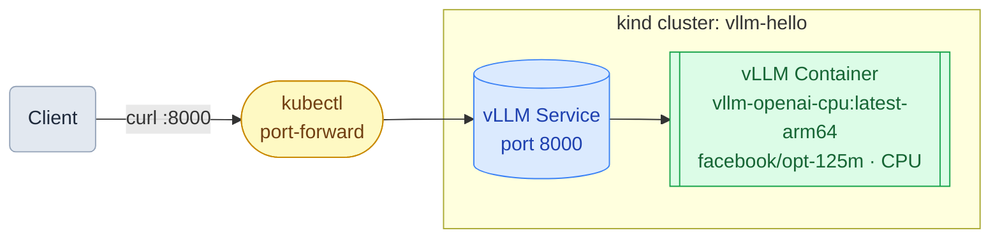

# Guide 1: Run vLLM on a kind Cluster

*Part 1 of 6 — [Overview](README.md) | [Getting Started](../README.md)*

This guide runs a vLLM inference server on a local Kubernetes cluster using [kind](https://kind.sigs.k8s.io/) on macOS. Because kind uses Docker and Mac lacks GPU passthrough to containers, vLLM runs in **CPU mode** with a small model (`facebook/opt-125m`).

## Architecture



## Prerequisites

- [Docker Desktop](https://www.docker.com/products/docker-desktop/) installed and running
- [Homebrew](https://brew.sh/) installed

## 1. Install Tools

```bash
brew install kind kubectl helm
```

## 2. Create a kind Cluster

```bash
kind create cluster --name vllm-hello
```

Verify the cluster is up:

```bash
kubectl cluster-info --context kind-vllm-hello
```

## 3. Deploy vLLM

```bash
kubectl apply -f - <<EOF
apiVersion: apps/v1
kind: Deployment
metadata:
  name: vllm
spec:
  replicas: 1
  selector:
    matchLabels:
      app: vllm
  template:
    metadata:
      labels:
        app: vllm
    spec:
      enableServiceLinks: false
      containers:
      - name: vllm
        image: vllm/vllm-openai-cpu:latest-arm64
        args:
        - facebook/opt-125m
        - --gpu-memory-utilization
        - "0.3"
        env:
        - name: VLLM_CPU_KVCACHE_SPACE
          value: "1"
        ports:
        - containerPort: 8000
        resources:
          requests:
            memory: "2Gi"
            cpu: "1"
          limits:
            memory: "4Gi"
            cpu: "2"
---
apiVersion: v1
kind: Service
metadata:
  name: vllm
spec:
  selector:
    app: vllm
  ports:
  - port: 8000
    targetPort: 8000
EOF
```

Watch the pod come up:

```bash
kubectl get pods -w
```

The pod goes through two slow phases on the first run:

| Phase | Status | Typical duration |
|---|---|---|
| Pulling `vllm/vllm-openai-cpu` image (~5 GB) | `ContainerCreating` | 3–8 min depending on network |
| Loading model `facebook/opt-125m` | `Running` but not yet ready | 2–3 min |

Wait until `READY` shows `1/1`:

```
NAME                    READY   STATUS    RESTARTS   AGE
vllm-xxxxxxxxx-xxxxx    1/1     Running   0          10m
```

## 4. Port-Forward the Service

In a separate terminal, forward local port 8000 to the vLLM service:

```bash
kubectl port-forward svc/vllm 8000:8000
```

## 5. Test the Endpoint

List available models:

```bash
curl http://localhost:8000/v1/models
```

Send a completion request:

```bash
curl http://localhost:8000/v1/completions \
  -H "Content-Type: application/json" \
  -d '{
    "model": "facebook/opt-125m",
    "prompt": "San Francisco is known for",
    "max_tokens": 50
  }'
```

Sample response:

```json
{
  "id": "cmpl-91488644697b152d",
  "object": "text_completion",
  "created": 1777413603,
  "model": "facebook/opt-125m",
  "choices": [
    {
      "index": 0,
      "text": " being the safest place to visit for everything from whales to scallops.",
      "finish_reason": "length"
    }
  ],
  "usage": {
    "prompt_tokens": 6,
    "completion_tokens": 50,
    "total_tokens": 56
  }
}
```

## 6. Clean Up

If you are continuing to the next guide, skip this section — the cluster and vLLM deployment must remain running.

To delete the cluster entirely:

```bash
kind delete cluster --name vllm-hello
```

---

[Next: Run llm-d on a kind Cluster →](02-llmd.md)
