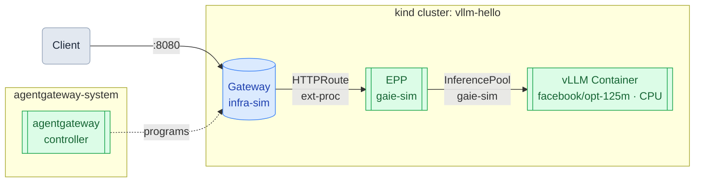

# Run llm-d on a kind Cluster (Mac)

*Part 2 of 6 — [Overview](README.md) | [Getting Started](../README.md)*

[llm-d](https://llm-d.ai/) adds a scheduling and routing layer on top of vLLM: a **Gateway** that accepts incoming requests and an **EPP** (Endpoint Policy Processor) that performs KV-cache-aware, load-aware routing to vLLM pods.

This guide deploys the llm-d scheduling layer into the same `vllm-hello` cluster from the [Run vLLM on a kind Cluster](01-vllm.md) guide and routes requests through it to the real vLLM pod.

## Architecture



> **Prerequisite**: Complete the [Run vLLM on a kind Cluster](01-vllm.md) guide first. The `vllm-hello` cluster must be running with `kind`, `kubectl`, and `helm` installed.

## 1. Install CRDs

Install the Kubernetes Gateway API CRDs:

```bash
kubectl apply --server-side -f https://github.com/kubernetes-sigs/gateway-api/releases/download/v1.5.0/standard-install.yaml
```

Install the Agentgateway CRDs and controller:

```bash
helm upgrade -i agentgateway-crds \
  oci://cr.agentgateway.dev/charts/agentgateway-crds \
  --create-namespace --namespace agentgateway-system \
  --version v1.1.0
```

```bash
helm upgrade -i agentgateway \
  oci://cr.agentgateway.dev/charts/agentgateway \
  --namespace agentgateway-system \
  --version v1.1.0 \
  --set inferenceExtension.enabled=true \
  --wait
```

Install the Gateway API Inference Extension CRDs (provides `InferencePool`, `InferenceModel`):

```bash
kubectl apply -f https://github.com/kubernetes-sigs/gateway-api-inference-extension/releases/download/v1.4.0/manifests.yaml
```

## 2. Add Helm Repositories

```bash
helm repo add llm-d-infra https://llm-d-incubation.github.io/llm-d-infra/
```

```bash
helm repo update
```

## 3. Label the vLLM Deployment

Confirm the vLLM deployment from the prerequisite guide is running:

```bash
kubectl get deployment vllm
```

The EPP's InferencePool selects pods by label. Patch the deployment to add the required labels:

```bash
kubectl patch deployment vllm --type=merge -p '
spec:
  template:
    metadata:
      labels:
        llm-d.ai/inference-serving: "true"
        llm-d.ai/guide: simulated-accelerators
        llm-d.ai/accelerator-variant: cpu
        llm-d.ai/model: random'
```

Verify the labels are on the pod:

```bash
kubectl get pods -l llm-d.ai/inference-serving=true
```

## 4. Deploy the Gateway

```bash
helm install infra-sim llm-d-infra/llm-d-infra \
  --version v1.4.0 \
  --set gateway.provider=agentgateway
```

## 5. Deploy the EPP

```bash
helm install gaie-sim \
  oci://registry.k8s.io/gateway-api-inference-extension/charts/inferencepool \
  --version v1.4.0 \
  -f <(curl -s https://raw.githubusercontent.com/llm-d/llm-d/main/guides/recipes/scheduler/base.values.yaml) \
  -f <(curl -s https://raw.githubusercontent.com/llm-d/llm-d/main/guides/simulated-accelerators/gaie-sim/values.yaml) \
  --set inferenceExtension.monitoring.prometheus.enabled=false \
  --set inferenceExtension.monitoring.prometheus.auth.enabled=false
```

## 6. Apply the HTTPRoute

```bash
kubectl apply -f https://raw.githubusercontent.com/llm-d/llm-d/main/guides/simulated-accelerators/httproute.yaml
```

## 7. Verify the Deployment

Check all pods are running:

```bash
kubectl get pods
```

Expect the vLLM pod plus EPP and gateway pods:

```
NAME                              READY   STATUS    RESTARTS   AGE
epp-...                           1/1     Running   0          1m
gateway-...                       1/1     Running   0          1m
vllm-...                          1/1     Running   0          20m
```

Check the InferencePool was created:

```bash
kubectl get inferencepool
```

## 8. Send Requests via llm-d

Port-forward the gateway:

```bash
kubectl port-forward svc/infra-sim-inference-gateway 8080:80
```

Send a completion request through the llm-d scheduling layer:

```bash
curl http://localhost:8080/v1/completions \
  -H "Content-Type: application/json" \
  -d '{
    "model": "facebook/opt-125m",
    "prompt": "San Francisco is known for",
    "max_tokens": 50
  }'
```

Sample response:

```json
{
  "id": "cmpl-56b28a36-357f-4790-884c-0e7b93de2aec",
  "object": "text_completion",
  "created": 1777417557,
  "model": "facebook/opt-125m",
  "choices": [
    {
      "index": 0,
      "text": " being the safest place to visit for everything from whales to scallops.",
      "finish_reason": "length"
    }
  ],
  "usage": {
    "prompt_tokens": 6,
    "completion_tokens": 50,
    "total_tokens": 56
  }
}
```

## 9. Clean Up

Remove the llm-d components (leaves vLLM running):

```bash
helm uninstall gaie-sim && helm uninstall infra-sim
```

To delete the cluster entirely:

```bash
kind delete cluster --name vllm-hello
```

---

[← Previous: Run vLLM on a kind Cluster](01-vllm.md) | [Next: Load Distribution →](03-load-distribution.md)
