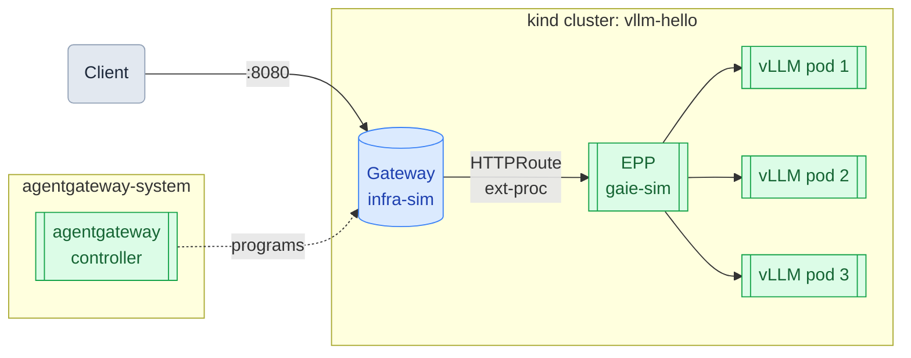

# llm-d Load Distribution on a kind Cluster

*Part 3 of 6 — [Overview](README.md) | [Getting Started](../README.md)*

This guide scales the vLLM deployment to three replicas and shows llm-d's EPP routing requests across all of them in real time.

**Prerequisite**: Complete the [Run llm-d on a kind Cluster](02-llmd.md) guide first. The `vllm-hello` cluster must be running with the llm-d stack deployed and the gateway port-forwarded on `:8080`.

## Architecture



## 1. Scale vLLM to Three Replicas

```bash
kubectl scale deployment/vllm --replicas=3
```

Watch all three pods come up:

```bash
kubectl get pods -l app=vllm -w
```

Each new pod pulls no image (already cached) but takes 2–3 minutes to load the model. Wait until all three show `1/1 Running`:

```
NAME                     READY   STATUS    RESTARTS   AGE
vllm-5d8d7cfcdd-7gv6b    1/1     Running   0          30m
vllm-5d8d7cfcdd-m2kj9    1/1     Running   0          3m
vllm-5d8d7cfcdd-p8xnr    1/1     Running   0          3m
```

## 2. Stream Logs Across All Pods

In a **separate terminal**, stream request logs from every vLLM pod simultaneously. The `--prefix` flag prepends the pod name to each line; `grep` filters out startup noise:

```bash
kubectl logs --prefix -l app=vllm -f | grep "POST /v1"
```

Leave this running — it is the live view of which pod handles each request.

## 3. Send Concurrent Requests

Back in the original terminal, fire nine requests in parallel:

```bash
for i in {1..9}; do
  curl -s http://localhost:8080/v1/completions \
    -H "Content-Type: application/json" \
    -d "{\"model\": \"facebook/opt-125m\", \"prompt\": \"Prompt $i: The future of AI is\", \"max_tokens\": 20}" \
    -o /dev/null &
done
wait
echo "done"
```

## 4. Observe Distribution

In the log terminal you will see the three pod names interleaved, confirming that llm-d's EPP spread the load across all replicas:

```
[pod/vllm-f8bc8464c-jhr6m] INFO:  10.244.0.15:60830 - "POST /v1/completions HTTP/1.1" 200 OK
[pod/vllm-f8bc8464c-jhr6m] INFO:  10.244.0.15:60844 - "POST /v1/completions HTTP/1.1" 200 OK
[pod/vllm-f8bc8464c-jhr6m] INFO:  10.244.0.15:60856 - "POST /v1/completions HTTP/1.1" 200 OK
[pod/vllm-f8bc8464c-mr2zp] INFO:  10.244.0.15:37462 - "POST /v1/completions HTTP/1.1" 200 OK
[pod/vllm-f8bc8464c-mr2zp] INFO:  10.244.0.15:37470 - "POST /v1/completions HTTP/1.1" 200 OK
[pod/vllm-f8bc8464c-6q9f8] INFO:  10.244.0.15:43174 - "POST /v1/completions HTTP/1.1" 200 OK
[pod/vllm-f8bc8464c-6q9f8] INFO:  10.244.0.15:43180 - "POST /v1/completions HTTP/1.1" 200 OK
[pod/vllm-f8bc8464c-6q9f8] INFO:  10.244.0.15:43192 - "POST /v1/completions HTTP/1.1" 200 OK
[pod/vllm-f8bc8464c-6q9f8] INFO:  10.244.0.15:43202 - "POST /v1/completions HTTP/1.1" 200 OK
```

All three pod suffixes (`jhr6m`, `mr2zp`, `6q9f8`) appear — the EPP's load-aware routing spread requests across the pool. Distribution is not strictly round-robin; pods receive varying counts based on observed queue depth.

## 5. Scale Back Down

Scale back to a single replica before continuing to the next guide:

```bash
kubectl scale deployment/vllm --replicas=1
```

---

[← Previous: Run llm-d on a kind Cluster](02-llmd.md) | [Next: Model Aliasing →](04-model-aliasing.md)
