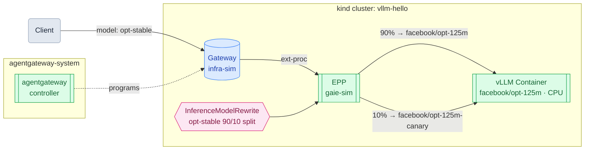

# Model Aliasing with llm-d on a kind Cluster (Mac)

*Part 4 of 6 — [Overview](README.md) | [Getting Started](../README.md)*

This guide demonstrates `InferenceModelRewrite` — a Gateway API Inference Extension resource that decouples the model name clients send from the model vLLM actually serves. This enables model aliasing, versioning, and A/B traffic splitting without changing client code.

> **What works on CPU**: Model aliasing (Sections 1–3) is fully functional. A/B weighted traffic splitting (Section 4) is defined in the API but not yet implemented in the EPP version used by this guide — the configuration is shown as a reference only.
>
> **Note on KV-cache prefix routing**: Prefix caching requires GPU and does not work with CPU-mode vLLM. Model aliasing and rewriting are the meaningful routing features demonstrable on a local kind cluster.

**Prerequisite**: Complete the [Run llm-d on a kind Cluster (Mac)](02-llmd.md) guide. The `vllm-hello` cluster must be running with the llm-d stack deployed and the gateway port-forwarded on `:8080`.

## Architecture



Clients always send `model: opt-stable` — they never need to know which model version is actually serving the request. The `InferenceModelRewrite` resource tells the EPP how to rewrite that name before forwarding to vLLM: 90% of requests go to the stable model, 10% to the canary. Changing the split or promoting the canary is a one-line config change with no client or vLLM restart required.

## 1. Create an InferenceModelRewrite

This resource tells the EPP: when a request arrives with `model: opt-stable`, rewrite it to `facebook/opt-125m` before forwarding to vLLM.

```bash
kubectl apply -f - <<EOF
apiVersion: inference.networking.x-k8s.io/v1alpha2
kind: InferenceModelRewrite
metadata:
  name: opt-stable
spec:
  poolRef:
    name: gaie-sim
  rules:
  - matches:
    - model:
        type: Exact
        value: opt-stable
    targets:
    - modelRewrite: facebook/opt-125m
      weight: 100
EOF
```

## 2. Verify Registration

```bash
kubectl get inferencemodelrewrite
```

Expected:

```
NAME         AGE
opt-stable   5s
```

## 3. Send a Request Using the Alias

Use the alias name `opt-stable` instead of `facebook/opt-125m`:

```bash
curl http://localhost:8080/v1/completions \
  -H "Content-Type: application/json" \
  -d '{
    "model": "opt-stable",
    "prompt": "San Francisco is known for",
    "max_tokens": 50
  }'
```

The EPP rewrites `opt-stable` to `facebook/opt-125m` before the request reaches vLLM. The response comes back with the backend model name:

```json
{
  "id": "cmpl-9cb518c4-eca2-4886-8cbd-d8e50e4838ae",
  "object": "text_completion",
  "model": "facebook/opt-125m",
  "choices": [
    {
      "index": 0,
      "text": " its melting pot of wealth and heritage – and there are some treasures and treasures that still group around San Francisco that are nevertheless thrilling.",
      "finish_reason": "length"
    }
  ],
  "usage": {
    "prompt_tokens": 6,
    "completion_tokens": 50,
    "total_tokens": 56
  }
}
```

## 4. A/B Traffic Splitting (Reference)

`InferenceModelRewrite` supports a `targets` list with weights for splitting traffic across model versions. The configuration syntax is:

```yaml
rules:
- matches:
  - model:
      type: Exact
      value: opt-stable
  targets:
  - modelRewrite: facebook/opt-125m
    weight: 90
  - modelRewrite: facebook/opt-125m-canary
    weight: 10
```

> **Note**: Weighted routing across multiple targets is not yet implemented in the EPP version used by this guide (`llm-d-inference-scheduler:v0.7.0`). The EPP currently always selects the first target regardless of weights. The configuration is accepted by the API but has no effect. This is expected to be supported in a future release.

When implemented, firing 10 requests with `model: opt-stable` would produce output like:

```
facebook/opt-125m
facebook/opt-125m
facebook/opt-125m
facebook/opt-125m-canary
facebook/opt-125m
facebook/opt-125m
facebook/opt-125m
facebook/opt-125m
facebook/opt-125m
facebook/opt-125m
```

~9 responses route to the stable model, ~1 to the canary — without any change to client code.

## 5. Clean Up

```bash
kubectl delete inferencemodelrewrite opt-stable
```
