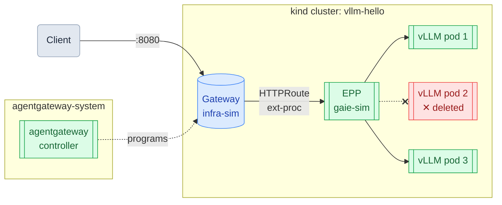

# llm-d Fault Tolerance on a kind Cluster (Mac)

*Part 5 of 6 — [Series Index](README.md)*

This guide kills a vLLM pod mid-traffic and shows that llm-d's EPP automatically routes around it. There is a brief disruption while the EPP detects the failure, then traffic recovers automatically on the remaining pods — no manual intervention required.

**Prerequisite**: Complete the [Run llm-d on a kind Cluster (Mac)](02-llmd.md) guide. The `vllm-hello` cluster must be running with the llm-d stack deployed and the gateway port-forwarded on `:8080`.

## Architecture



When a pod is deleted, the EPP detects it is no longer healthy and stops routing to it. Requests continue on the remaining pods without interruption.

## 1. Scale to Three Replicas

```bash
kubectl scale deployment/vllm --replicas=3
```

Wait for all three pods to be ready:

```bash
kubectl get pods -l app=vllm -w
```

## 2. Start a Continuous Request Stream

In a **separate terminal**, send one request every two seconds and print the result. The numbered output makes it easy to spot any failed requests:

```bash
i=1; while true; do
  response=$(curl -s http://localhost:8080/v1/completions -H "Content-Type: application/json" -d '{"model": "facebook/opt-125m", "prompt": "The future of AI is", "max_tokens": 5}')
  result=$(echo "$response" | jq -r '.choices[0].text // "ERROR"' 2>/dev/null || echo "ERROR")
  echo "Request $i: $result"
  i=$((i+1))
  sleep 2
done
```

Let it run for a few requests to confirm it is working before proceeding.

## 3. Stream Pod Logs

In a **third terminal**, watch which pod handles each request:

```bash
kubectl logs --prefix -l app=vllm -f | grep "POST /v1"
```

## 4. Delete a Pod

With both streams running, delete one of the vLLM pods:

```bash
kubectl delete pod $(kubectl get pods -l app=vllm -o name | head -1 | cut -d/ -f2)
```

## 5. Observe Fault Tolerance

There is a brief disruption immediately after the pod is deleted — a few requests return `ERROR` while the EPP detects the failure and stops routing to the dead pod. The EPP learns a pod is unhealthy through failed requests, not through instant notification, so consecutive requests may hit the dead pod before it is removed from the routing table. Traffic then recovers automatically on the two remaining pods:

```
Request 7:  Amazon's ' vendor-
Request 8:  fine. Crowdsourcing
Request 9:  now quite different. Everything
Request 10: ERROR
Request 11: ERROR
Request 12: ERROR
Request 13:  not just 'decomm
Request 14:  going to be like being
Request 15:  just much better than today
```

In the log terminal, the deleted pod's name disappears and requests shift to the surviving pods:

```
[pod/vllm-f8bc8464c-6q9f8] INFO:  10.244.0.15:52341 - "POST /v1/completions HTTP/1.1" 200 OK
[pod/vllm-f8bc8464c-mr2zp] INFO:  10.244.0.15:52342 - "POST /v1/completions HTTP/1.1" 200 OK
[pod/vllm-f8bc8464c-6q9f8] INFO:  10.244.0.15:52344 - "POST /v1/completions HTTP/1.1" 200 OK
[pod/vllm-f8bc8464c-mr2zp] INFO:  10.244.0.15:52346 - "POST /v1/completions HTTP/1.1" 200 OK
```

Kubernetes restarts the deleted pod automatically. Once it is `1/1 Running`, the EPP adds it back to the pool and its name reappears in the log stream.

## 6. Scale Back Down

```bash
kubectl scale deployment/vllm --replicas=1
```
