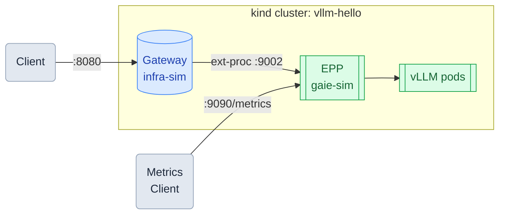

# llm-d EPP Observability on a kind Cluster (Mac)

*Part 6 of 6 — [Overview](README.md) | [Getting Started](../README.md)*

This guide explores the metrics exposed by llm-d's EPP (Endpoint Policy Processor) — the data the scheduler uses to make routing decisions. These metrics give visibility into per-pod queue depth, KV cache utilization, and request rates without any additional monitoring infrastructure.

**Prerequisite**: Complete the [Run llm-d on a kind Cluster (Mac)](02-llmd.md) guide. The `vllm-hello` cluster must be running with the llm-d stack deployed.

> **If you installed gaie-sim before this guide was updated**, the metrics endpoint may return `Unauthorized`. Upgrade with auth disabled:
>
> ```bash
> helm upgrade gaie-sim \
>   oci://registry.k8s.io/gateway-api-inference-extension/charts/inferencepool \
>   --version v1.4.0 \
>   -f <(curl -s https://raw.githubusercontent.com/llm-d/llm-d/main/guides/recipes/scheduler/base.values.yaml) \
>   -f <(curl -s https://raw.githubusercontent.com/llm-d/llm-d/main/guides/simulated-accelerators/gaie-sim/values.yaml) \
>   --set inferenceExtension.monitoring.prometheus.enabled=false \
>   --set inferenceExtension.monitoring.prometheus.auth.enabled=false
> ```
> ```bash
> kubectl rollout status deployment/gaie-sim-epp
> ```

## Architecture



The EPP exposes a Prometheus metrics endpoint on port 9090. These are the same signals the EPP uses internally to score and select pods for each request.

## 1. Port-Forward the Metrics Endpoint

In a separate terminal, forward the EPP metrics port:

```bash
kubectl port-forward svc/gaie-sim-epp 9090:9090
```

## 2. View All Metrics

Fetch the full metrics output:

```bash
curl -s http://localhost:9090/metrics
```

## 3. Key Metrics

Filter for the inference-specific metrics:

```bash
curl -s http://localhost:9090/metrics | grep "^inference_"
```

Sample output (at idle with three pods):

```
inference_extension_info{build_ref="",commit=""} 1
inference_extension_prefix_indexer_size 0
inference_pool_average_kv_cache_utilization{name="gaie-sim"} 0
inference_pool_average_queue_size{name="gaie-sim"} 0
inference_pool_per_pod_queue_size{model_server_pod="vllm-xxx-rank-0",name="gaie-sim"} 0
inference_pool_per_pod_queue_size{model_server_pod="vllm-yyy-rank-0",name="gaie-sim"} 0
inference_pool_per_pod_queue_size{model_server_pod="vllm-zzz-rank-0",name="gaie-sim"} 0
inference_pool_ready_pods{name="gaie-sim"} 3
```

The EPP exposes per-pod scheduling signals:

| Metric | Description |
|---|---|
| `inference_pool_ready_pods` | Number of healthy pods currently in the pool |
| `inference_pool_average_kv_cache_utilization` | Average KV cache fill across all pods |
| `inference_pool_average_queue_size` | Average number of requests queued per pod |
| `inference_pool_per_pod_queue_size` | Per-pod queue depth — the primary signal the EPP uses to route requests |

> **Note on CPU mode**: queue depth and KV cache utilization read 0 on CPU-mode vLLM — the model processes requests faster than the EPP polls. On a GPU cluster these metrics reflect real load. The meaningful observable metric on a local cluster is `inference_pool_ready_pods`.

## 4. Watch Pool Size Change

In a **separate terminal**, start polling the metrics endpoint every second:

```bash
while true; do curl -s http://localhost:9090/metrics | grep "^inference_pool_ready_pods"; sleep 1; done
```

Back in the original terminal, scale to three replicas:

```bash
kubectl scale deployment/vllm --replicas=3
```

The polling terminal shows `ready_pods` jump to 3 once the EPP registers the new pods. There is a delay of up to a minute after the pods reach `1/1 Running` — the EPP has its own health-check polling cycle before it adds them to the pool:

```
inference_pool_ready_pods{name="gaie-sim"} 1
inference_pool_ready_pods{name="gaie-sim"} 1
inference_pool_ready_pods{name="gaie-sim"} 1
inference_pool_ready_pods{name="gaie-sim"} 3
inference_pool_ready_pods{name="gaie-sim"} 3
inference_pool_ready_pods{name="gaie-sim"} 3
```

## 5. Scale Back Down

```bash
kubectl scale deployment/vllm --replicas=1
```

The polling terminal shows `ready_pods` drop back to 1 as the EPP detects the terminating pods:

```
inference_pool_ready_pods{name="gaie-sim"} 3
inference_pool_ready_pods{name="gaie-sim"} 3
inference_pool_ready_pods{name="gaie-sim"} 1
inference_pool_ready_pods{name="gaie-sim"} 1
```

`ready_pods` is the signal the EPP uses to decide which backends are eligible for routing — when it drops to 0, the EPP stops routing until pods recover.

---

[← Previous: Fault Tolerance](05-fault-tolerance.md)
