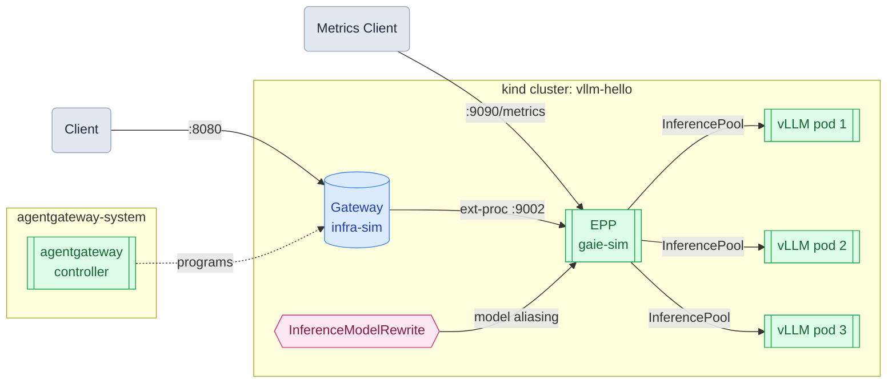

# llm-d on a kind Cluster

This series walks through deploying and exercising the full llm-d stack on a local Kubernetes cluster on macOS, **no GPU required**. Each guide builds on the previous one.

## Architecture

The full stack runs inside a single kind cluster. A Gateway accepts client requests on port 8080 and forwards them to the EPP (Endpoint Policy Processor) via the ext-proc protocol. The EPP selects the best vLLM pod for each request based on live signals — queue depth, KV cache utilization, and prefix cache hits — then routes it through the InferencePool. An `InferenceModelRewrite` policy optionally rewrites model names before routing. A separate metrics endpoint on port 9090 exposes the EPP's internal scheduling signals for observability.

## Guides

| # | Guide | What it covers |
|---|---|---|
| 1 | [Run vLLM on a kind Cluster](01-vllm.md) | Deploy vLLM in CPU mode with `facebook/opt-125m` on a local kind cluster |
| 2 | [Run llm-d on a kind Cluster](02-llmd.md) | Add the llm-d Gateway and EPP scheduling layer on top of vLLM |
| 3 | [Load Distribution](03-load-distribution.md) | Scale to three replicas and watch the EPP spread requests across pods |
| 4 | [Model Aliasing](04-model-aliasing.md) | Use `InferenceModelRewrite` to decouple client model names from backend model names |
| 5 | [Fault Tolerance](05-fault-tolerance.md) | Delete a pod mid-traffic and watch the EPP route around it automatically |
| 6 | [EPP Observability](06-observability.md) | Scrape the EPP's Prometheus metrics endpoint and watch pool size change in real time |

## Prerequisites

- macOS with [Docker Desktop](https://www.docker.com/products/docker-desktop/) running
- [Homebrew](https://brew.sh/) installed
- [Helm](https://helm.sh/docs/intro/install/) installed (`brew install helm`)

Start with Guide 1 and follow in order. Each guide assumes the cluster and components from the previous one are still running.

## Cleanup

Each guide includes a cleanup section. If you are following the series end-to-end, skip any `helm uninstall` or cluster deletion steps until the full teardown at the end of [Guide 6](06-observability.md). Other cleanup steps — such as scaling replicas back down — are safe to run between guides.
