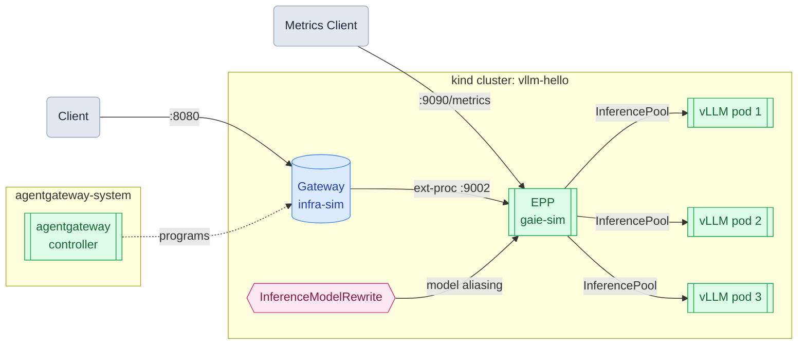

# llm-d on a kind Cluster (Mac)

LLM inferencing at scale is finding a combination of hardware, software, drivers, kernels, and routing.

[vLLM](https://docs.vllm.ai/) is the inference engine. It takes a model and a GPU and turns them into a high-throughput HTTP API. Its core innovation is PagedAttention, which manages KV cache memory the way an OS manages virtual memory, enabling continuous batching and dramatically higher GPU utilization compared to naive serving. vLLM handles everything from kernel selection to memory management to the OpenAI-compatible endpoint your application talks to.

But vLLM is a single server. When you need multiple replicas (for scale, redundancy, or cost) you need something above it that understands LLM-specific signals like KV cache state and queue depth. A standard load balancer doesn't; it just round-robins blind.

That's where [llm-d](https://llm-d.ai/) comes in. llm-d adds a scheduling layer, the **EPP (Endpoint Policy Processor)**, that sits between your gateway and your vLLM pods. The EPP routes each request to the pod best positioned to handle it, based on live signals: queue depth, KV cache utilization, and prefix cache hits. Sending a request to a pod that already has the prompt prefix cached avoids redundant computation, reduces latency, and makes better use of GPU memory.

This series walks through deploying and exercising the full llm-d stack on a local Kubernetes cluster on macOS, **no GPU required**. Each guide builds on the previous one.

## Architecture

## Guides

| # | Guide | What it covers |
|---|---|---|
| 1 | [Run vLLM on a kind Cluster](01-vllm.md) | Deploy vLLM in CPU mode with `facebook/opt-125m` on a local kind cluster |
| 2 | [Run llm-d on a kind Cluster](02-llmd.md) | Add the llm-d Gateway and EPP scheduling layer on top of vLLM |
| 3 | [Load Distribution](03-load-distribution.md) | Scale to three replicas and watch the EPP spread requests across pods |
| 4 | [Model Aliasing](04-model-aliasing.md) | Use `InferenceModelRewrite` to decouple client model names from backend model names |
| 5 | [Fault Tolerance](05-fault-tolerance.md) | Delete a pod mid-traffic and watch the EPP route around it automatically |
| 6 | [EPP Observability](06-observability.md) | Scrape the EPP's Prometheus metrics endpoint and watch pool size change in real time |

## Prerequisites

- macOS with [Docker Desktop](https://www.docker.com/products/docker-desktop/) running
- [Homebrew](https://brew.sh/) installed

Start with Guide 1 and follow in order. Each guide assumes the cluster and components from the previous one are still running.
