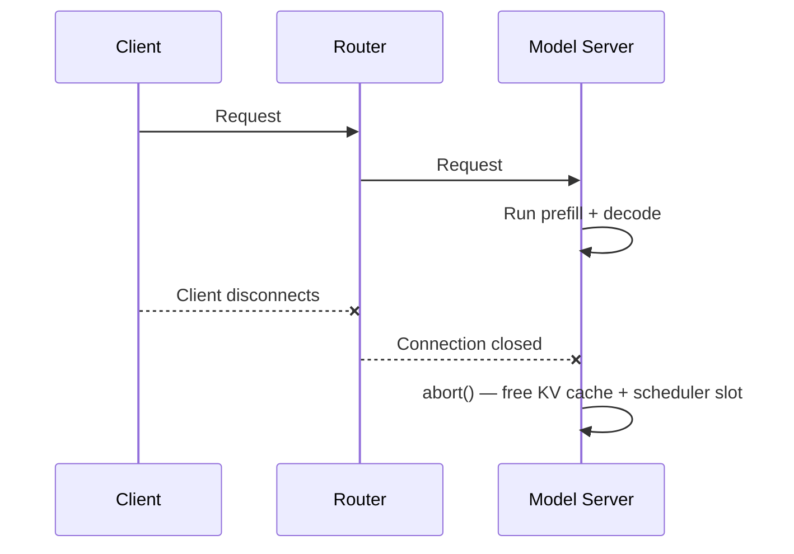
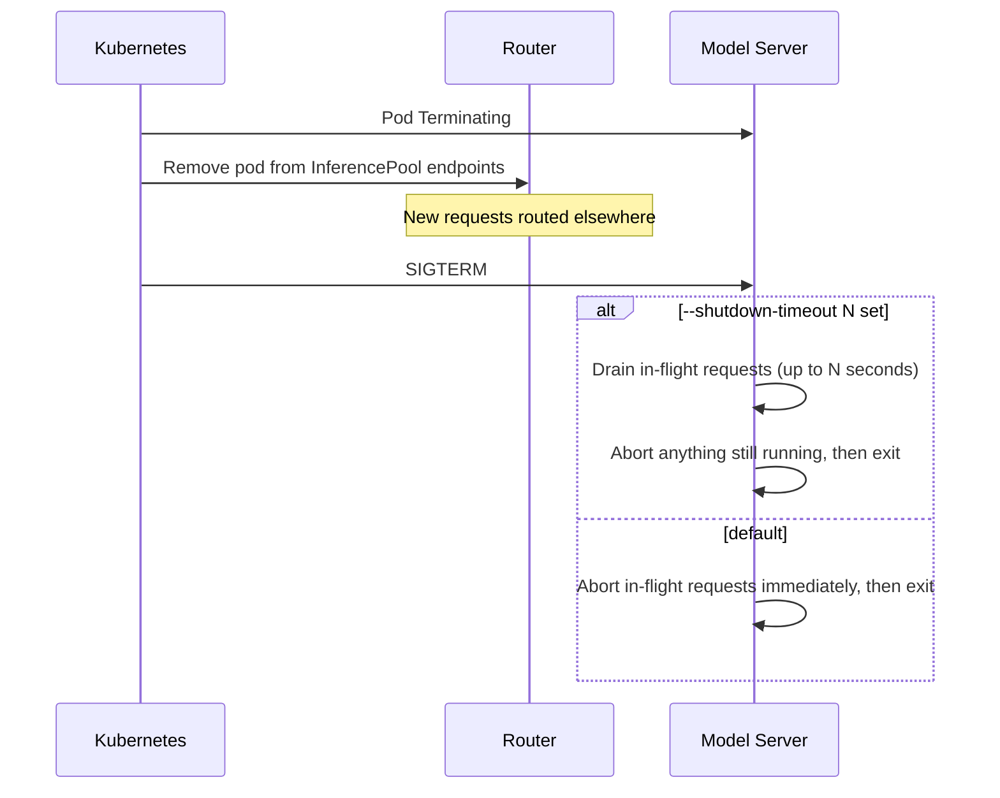

# Serving Operations

While the [Disaggregated Serving Operations](../architecture/advanced/disaggregation/operations-vllm.md) page covers the operational flows specific to prefill/decode (P/D) deployments, this page documents the operational flows that apply to **general (aggregated) serving** — where prefill and decode run on the same model server instance.

These flows are what keep a deployment stable during day-2 operations and traffic churn:

- [Request Cancellation](#request-cancellation) - how in-flight requests are freed when a client disconnects
- [Readiness & Health Probes](#readiness--health-probes) - how Kubernetes knows a pod is alive versus ready to serve
- [Graceful Shutdown & Request Draining](#graceful-shutdown--request-draining) - how to remove a pod without dropping in-flight requests

For the distributed variants of these flows (freeing KV caches across P and D instances, lease-based block management, NIXL fault tolerance), see the [Disaggregated Serving Operations](../architecture/advanced/disaggregation/operations-vllm.md) page.

## Request Cancellation

Inference requests are compute-intensive and long-running, so it is important that a model server frees the resources associated with a request as soon as the client goes away. Otherwise a burst of clients that connect, submit a long generation, and then disconnect can pin GPU memory and scheduler slots on work whose output nobody will read.

Model servers like vLLM support **request cancellation**: when the client connection for an in-flight request is closed, the server triggers its `abort` codepath, which stops generation and frees the KV cache blocks and scheduler slot held by that request.

In an aggregated deployment this is straightforward, because all of the resources for a request (the running sequence and its KV cache) live on a single instance:



Because the request never spans more than one instance, there is no cross-server cleanup to coordinate. The moment the connection closes, the local `abort` releases everything.

> [!NOTE]
> In a disaggregated deployment the resources for a single request are spread across prefill and decode instances, so cancellation additionally has to free the remote KV cache held on the prefill instance. See [Request Cancellation](../architecture/advanced/disaggregation/operations-vllm.md#request-cancellation) on the disaggregated operations page for how llm-d handles that with NIXL notifications and KV leases.

## Readiness & Health Probes

A vLLM container passes through three distinct lifecycle stages, and Kubernetes needs different probes to observe each:

1. **Container Running** — the container process has started.
2. **API Server Ready** — the OpenAI-compatible API server is accepting connections.
3. **Model Loaded** — the model is loaded into accelerator memory and ready to serve inference.

The gap between stages 1 and 3 can be many minutes for large models. If traffic is routed during that gap, requests fail. The key point is that the `/health` endpoint only reports that the *server process* is up — **not** that the model is loaded — so it is suitable for a `livenessProbe` but not a `readinessProbe`. Use the model-aware `/v1/models` endpoint for `startupProbe` and `readinessProbe`, so a pod is only marked `Ready` once it can actually serve:

```yaml
livenessProbe:
  httpGet:
    path: /health      # process is alive
    port: 8000
readinessProbe:
  httpGet:
    path: /v1/models   # model is loaded and serving
    port: 8000
```

This is a foundational operational flow — getting it wrong is the most common cause of failed requests during rollouts and scale-up. For the full probe reference, including startup-probe tuning for slow model loads, per-role port configuration, and troubleshooting, see [vLLM Model-Aware Readiness Probes](readiness-probes.md).

## Graceful Shutdown & Request Draining

Pods are removed constantly during normal operation — scale-down, rollouts, node drains, and spot-instance reclamation all terminate pods. Without care, terminating a pod fails every request it was serving at that moment. Kubernetes defines a [pod termination process](https://kubernetes.io/docs/concepts/workloads/pods/pod-lifecycle/#pod-termination) that, combined with vLLM's shutdown behavior, lets you drain in-flight work first.

When a pod is deleted:

- **Termination Triggered** — the pod moves to the `Terminating` state.
- **`InferencePool` Update** — the pod is removed from the endpoints of its `InferencePool`, so the router stops sending it **new** requests. (For standard Kubernetes objects this is equivalent to removal from a Service's endpoints.)
- **PreStop Hook** — if defined, the `preStop` hook runs before SIGTERM.
- **SIGTERM** — Kubernetes sends `SIGTERM` to the container's main process.
- **Termination Grace Period** — the pod has `terminationGracePeriodSeconds` (default `30`) to exit; if it is still running when the period elapses, Kubernetes sends `SIGKILL`.

New requests are handled automatically: because the pod is pulled from the `InferencePool` as soon as it starts terminating, the router routes new traffic elsewhere.

**In-flight requests** are governed by how vLLM handles the `SIGTERM`:

- By default, vLLM immediately **aborts** in-flight requests and exits. Those requests fail with an error status code.
- With `--shutdown-timeout N`, vLLM catches the `SIGTERM` and **drains** in-flight requests for up to `N` seconds before aborting anything still running. This lets active generations complete rather than fail.



> [!IMPORTANT]
> Set `terminationGracePeriodSeconds` on the pod to at least the vLLM `--shutdown-timeout`, plus headroom for the process to exit. If the grace period is shorter than the drain timeout, Kubernetes sends `SIGKILL` mid-drain and the in-flight requests you were trying to protect are killed anyway.

Choose the drain timeout to match your workload's typical generation length: long enough that most in-flight requests finish, but not so long that scale-down and rollouts stall waiting on terminating pods.

> [!NOTE]
> In disaggregated deployments, scaling down prefill and decode instances has additional consequences for KV cache cleanup and in-progress KV transfers. See [Scale-Down](../architecture/advanced/disaggregation/operations-vllm.md#scale-down) on the disaggregated operations page.

## Related Pages

- [vLLM Model-Aware Readiness Probes](readiness-probes.md) — full probe reference and troubleshooting.
- [Disaggregated Serving Operations (vLLM)](../architecture/advanced/disaggregation/operations-vllm.md) — the P/D variants of these flows, plus dynamic connections and fault tolerance.
- [Zero-Downtime Rollouts](rollouts/README.md) — Blue-Green updates and live LoRA adapter hot-swapping.
- [Kubernetes: Pod Lifecycle](https://kubernetes.io/docs/concepts/workloads/pods/pod-lifecycle/#pod-termination) — upstream reference for the termination sequence.
