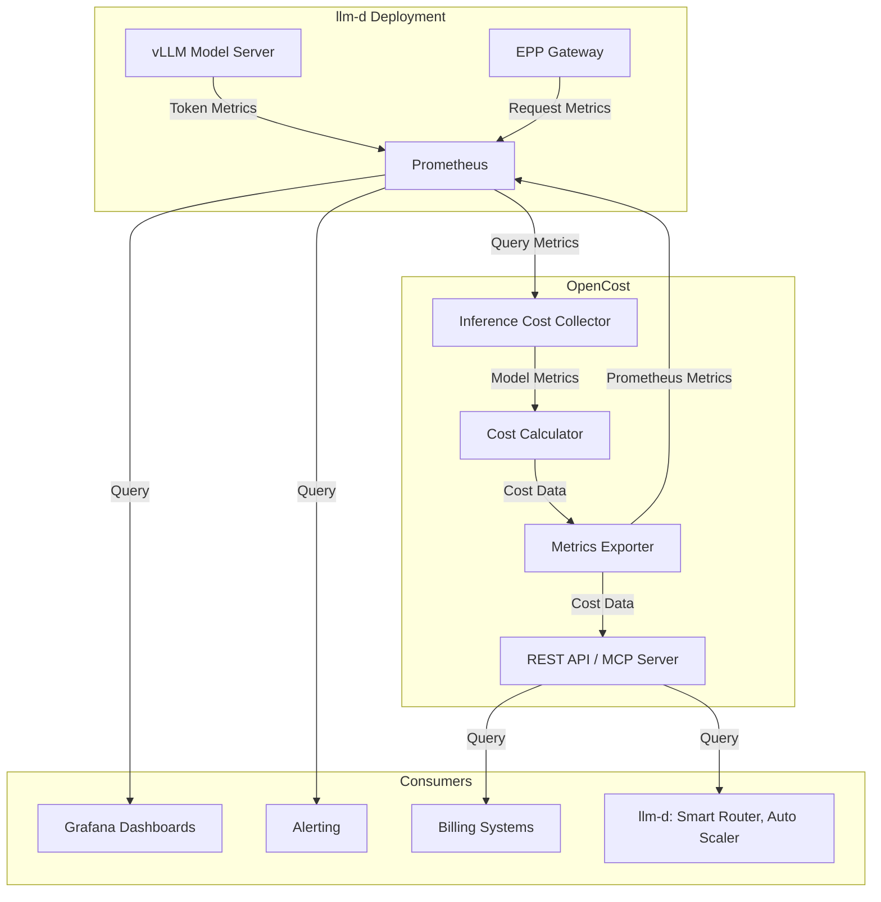

# AI Inference Cost Metrics for llm-d

Author: Sima Nadler

## Summary

This proposal introduces cost tracking for **AI inference deployed on llm-d**. The solution enables tracking of self-hosted AI model costs, enabling cost tracking across teams and workloads, and enabling optimization of inference routing and resource allocation based on actual per-token costs calculated from infrastructure usage.

Cost tracking provides unified visibility across Kubernetes infrastructure, cloud resources, and self hosted AI inference workloads, enabling organizations to make data-driven decisions about model deployment configurations, compare self-hosting costs against commercial API alternatives, and measure the return on investment of optimization techniques like KV cache and disaggregated serving.

## Motivation

As organizations scale their AI inference deployments on llm-d, understanding and optimizing  costs becomes critical. Platform teams need visibility into the actual cost of serving different models, workloads, and teams to make informed decisions about resource allocation, capacity planning, routing and optimization priorities.

Current challenges include:
- **Lack of cost visibility**: Teams don't know the actual inference cost per token for the self host models they use
- **No chargeback mechanism**: Cannot attribute costs to specific teams or workloads for internal billing
- **Optimization blindness**: Cannot measure the cost impact of optimizations like KV cache hits, disaggregated serving nor smart routing
- **Self-hosting vs API comparison**: Cannot compare self-hosting costs against commercial API alternatives because the self hosting costs are not known
- **Resource allocation**: Cannot make data-driven decisions about which models or configurations to prioritize
- **Multi-tenant cost allocation**: Cannot fairly distribute infrastructure costs across multiple teams and workloads sharing the same model servers

### Goals

1. **Infrastructure-based cost calculation**: Calculate per-token costs from actual infrastructure use (ex: GPU, CPU, memory infrastructure usage) not pre-configured pricing tables
2. **Multi-dimensional attribution**: Track costs by team, workload, model, model variant, and namespace
3. **Differentiated token pricing**: Provide separate costs for input (prompt) and output (generation) tokens based on actual compute time
4. **Seamless integration**: Integrate with existing llm-d metrics ecosystem (DCGM, vLLM, EPP, GPU metrics) without duplication
5. **Disaggregation support**: Track costs for disaggregated serving (prefill/decode) deployments
6. **Production-ready**: Provide reliable, scalable cost tracking suitable for production deployments
7. **Optimization insights**: Enable measurement of cost savings from KV cache, prefix caching, and other optimizations

### Non-Goals

1. **Not replacing existing metrics**: This proposal does not replace llm-d's existing performance and operational metrics
2. **Not a billing system**: This is not a billing/invoicing system, but provides cost data for such systems
3. **Not for training costs**: Focus is exclusively on inference costs, not model training nor fine-tuning
4. **Not real-time billing**: Cost calculations are based on recent metrics (5-minute windows), not per-request billing
5. **Not cloud billing integration**: Does not directly integrate with cloud provider billing APIs (uses OpenCost's existing integrations)
6. **Not pricing**: This proposal provides costs not prices.  If static or dynamic pricing is desired it can be generated using inference costs as a basis.

### User Stories

#### Story 1: Platform Team Cost Optimization

As an inference platform team managing multiple AI model and/or llm-d deployments, I want to track infrastructure costs per model and variant so I can identify which configurations are most cost-effective and make data-driven decisions about resource allocation.

**Acceptance Criteria**:
- View cost per million tokens for each model
- Compare costs across different infrastructure configurations - ex: GPU types and configurations
- Identify models with highest infrastructure costs
- Track cost trends over time

#### Story 2: Finance Team Chargeback

As a finance team member, I want to attribute AI inference costs to specific application teams and workloads so that I have the necessary information to perform accurate chargeback and showback for internal billing purposes.  (**Billing is out of scope**) 

**Acceptance Criteria**:
- Query costs by namespace and team labels
- Generate cost reports for billing periods
- Export cost data for integration with billing systems
- Track costs by workload type (interactive vs batch)

#### Story 3: Platform Team Cost-Based Routing Optimization

As a platform team managing llm-d deployments, I want to use cost metrics to optimize routing decisions so I can direct requests to the most cost-effective models and model variants and configurations while maintaining SLO compliance.  The models may be self-hosted or externally provided.

**Acceptance Criteria**:
- Access real-time cost per token metrics for different self-hosted models and model variants
- Route requests to lower-cost models or model variants when SLOs permit
- Track cost savings from intelligent routing decisions
- Balance cost optimization with latency and throughput requirements
- Measure cost reduction from routing optimization over time

#### Story 4: Executive Team Strategic Decisions

As an executive team, I want to compare self-hosting costs against commercial API alternatives so I can make informed decisions about our AI infrastructure strategy.

**Acceptance Criteria**:
- View total cost per million tokens for self-hosted models
- Compare against commercial API pricing - collection of commercial API bills out of scope but may be offered by OpenCost
- Understand cost breakdown (GPU, memory, network)
- Project costs at different scale levels

## Proposal

This proposal recommends adding infrastructure cost tracking for AI inference workloads on llm-d. After evaluating multiple approaches (detailed in the Alternatives section), we recommend **extending OpenCost** with a new inference cost domain that tracks AI inference costs alongside OpenCost's existing cost domains (Allocation, Asset, CloudCost, CustomCost).

### Why OpenCost?

[OpenCost](https://opencost.io/) provides a good foundation for inference cost tracking because it:
- Already integrates with Kubernetes and Prometheus
- Has proven cost allocation algorithms for GPU infrastructure
- Provides unified visibility across infrastructure, cloud, and custom costs
- Offers REST API and MCP server for programmatic access
- Is open source and widely adopted in the Kubernetes ecosystem
- Collects general infrastructure costs - CPU, memory, network, overhead, etc.

### Alternative Approaches Considered

We evaluated several approaches before recommending OpenCost:

1. **Custom metrics in llm-d**: Would duplicate OpenCost's infrastructure cost tracking
2. **Commercial tools**: Conflicts with open source philosophy and adds licensing costs
3. **Manual tracking**: Not scalable for production deployments
4. **Pre-configured pricing**: Less accurate than infrastructure-based calculation

The OpenCost approach provides the best balance of accuracy, integration, and maintainability.

### High-Level Architecture

```
┌─────────────────────────────────────────────────────────────┐
│                         OpenCost                            │
│  ┌──────────────┐  ┌──────────────┐  ┌──────────────┐       │
│  │  Allocation  │  │  CloudCost   │  │  Inference   │ NEW   │
│  │    Costs     │  │    Costs     │  │    Costs     │       │
│  └──────────────┘  └──────────────┘  └──────────────┘       │
│                            │                                │
│                   ┌────────▼────────┐                       │
│                   │   MCP Server    │                       │
│                   │   REST API      │                       │
│                   └─────────────────┘                       │
└─────────────────────────────────────────────────────────────┘
                             │
                 ┌───────────┴───────────┐
                 │                       │
         ┌───────▼────────┐     ┌───────▼────────┐
         │   Prometheus   │     │   llm-d vLLM   │
         │   (Metrics)    │     │   + EPP        │
         └────────────────┘     └────────────────┘
```

### Core Approach

In addition to collecting and calculating general infrastructure costs as is already done by OpenCost today, we will add inference specific cost metrics.

1. **Collect metrics from existing sources**:
   - Token metrics from vLLM (ex: `vllm:prompt_tokens_total`, `vllm:generation_tokens_total`)
   - GPU costs from OpenCost's existing allocation system
   - Processing time metrics from vLLM for differentiated pricing
   - KV cache hits and usage metrics
   - Namespace and model labels for attribution

2. **Calculate infrastructure-based costs**:
   - Determine GPU cost per container based on allocation and node costs
   - Calculate total tokens processed in time window
   - Compute cost per token from infrastructure costs divided by token throughput
   - Allocate costs between input and output tokens based on actual processing time
   - Calculate cache saving due to optimizations such as KV cache hits, prefill/decode separation, and smart routing

3. **Export cost metrics**:
   - Prometheus metrics for monitoring and alerting
   - REST API for programmatic access
   - MCP server integration for AI agent queries
   - Grafana dashboards for visualization

4. **Enable multi-dimensional queries**:
   - Aggregate by model, namespace, team, workload
   - Filter by time windows
   - Compare costs across different configurations - i.e. model variants

## Design Details

The proposal is to:
1. Define and standardize inference cost metrics
2. Provide a default implementation based on OpenCost that generates and provides access to the metrics

The goal is to provide a fully functional cost solution for llm-d using OpenCost, but allowing for it to be replaced as long as the replacement for OpenCost is able to generate the same metrics.


### Implementation Status

The proposal is based on a **working proof of concept**, which demonstrates:

- Basic cost metrics (total cost, cost per million tokens)
- Differentiated input/output costs with compute-time allocation - simple, gpu only, no kv cache calculations

The [POC implementation](https://github.com/simanadler/opencost/tree/initial-inference) validates the overall approach and feasibility of using OpenCost, and does not aim to provide fully accurate costs.

### High Level Design Proposal

**Cost Metrics**:

Proposed inference cost metrics:
- `opencost_inference_total_cost`: Hourly GPU infrastructure cost per model
- `opencost_inference_cost_per_million_tokens`: Blended cost per 1M tokens
- `opencost_inference_input_cost_per_million_tokens`: Cost per 1M input tokens
- `opencost_inference_output_cost_per_million_tokens`: Cost per 1M output tokens
- Additional metrics to be added related to KV cache costs and savings, and others

**Labels**: `model_name`, `model_version`, `namespace`, `model_variant`


### Architecture Diagram 

The following shows the proposed architecture.  
Note that the models running in llm-d generate input to OpenCost, while llm-d components such as the smart router (under development) and AutoScaler may be clients of the Inference costs generated by OpenCost.

View with mermaid extension



### Roadmap

**Proof of Concept** [implementation](https://github.com/simanadler/opencost/tree/initial-inference)
- ✅ Basic cost metrics (total cost, cost per million tokens)
- ✅ Multi-namespace support
- ✅ Prometheus metrics export
- ✅ Differentiated input/output token costs


**Implementation Tasks**:
- **Task 1**: Add idle, CPU, RAM, Networking and overhead costs to inference costs
- **Task 2**: Integration with OpenCost UI and APIs
- **Task 3**: Workload and team-based attribution 
- **Task 4**: Optimization cost tracking and savings calculation (KV cache, prefill/decode, smart routing)
- **Task 5**: Historical cost data storage and trending
- **Task 6**: Testing and validation framework

## Alternatives to OpenCost

### Alternative 1: Custom Metrics in llm-d

**Approach**: Add cost calculation directly to llm-d components (EPP, vLLM sidecars).

**Pros**:
- Tighter integration with llm-d
- No dependency on OpenCost

**Cons**:
- Duplicates OpenCost's proven cost allocation logic
- Requires reimplementing infrastructure cost tracking
- No unified view with Kubernetes and cloud costs
- More maintenance burden on llm-d team

**Decision**: Rejected - OpenCost provides better infrastructure for cost tracking.

### Alternative 2: Commercial Cost Management Tools

**Approach**: Use commercial tools like Kubecost, CloudHealth, or Datadog.

**Pros**:
- Feature-rich with UI and reporting
- Professional support

**Cons**:
- Not open source
- Vendor lock-in
- Additional licensing costs
- May not support AI-specific metrics

**Decision**: Rejected - Conflicts with llm-d's open source philosophy.

### Alternative 3: Manual Cost Tracking

**Approach**: Calculate costs manually using spreadsheets and periodic metric exports.

**Pros**:
- No additional infrastructure
- Full control over calculations

**Cons**:
- Not scalable
- Error-prone
- No real-time visibility
- High operational overhead

**Decision**: Rejected - Not suitable for production deployments.

### Alternative 4: Pre-configured Pricing Tables

**Approach**: Use fixed per-token pricing based on model size and GPU type.

**Pros**:
- Simpler implementation
- Predictable costs

**Cons**:
- Doesn't reflect actual infrastructure usage
- Requires manual price updates
- Doesn't account for optimizations (cache hits, utilization)
- Less accurate for cost attribution

**Decision**: Rejected - Infrastructure-based calculation is more accurate.


## Success Criteria

This proposal will be considered successful when:

1. **Adoption**: llm-d includes guidance and examples for how to provide cost using OpenCost and internal components such as AutoScaler and Smart Routing use the generated costs
2. **Integration**: llm-d guides include OpenCost deployment instructions
3. **Validation**: Cost metrics validated against cloud billing for accuracy
4. **Usage**: Multiple organizations using cost metrics in production
5. **Feedback**: Positive feedback from platform teams on cost visibility
6. **Optimization**: Documented case studies of cost optimization using metrics

## Next Steps

1. **Community Review**: Present proposal to llm-d community for feedback
2. **Upstream**: Contribute OpenCost changes to upstream OpenCost project
6. **Roadmap**: Plan implementation based on community feedback