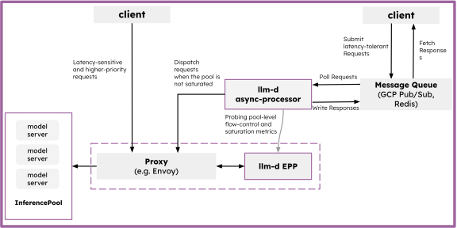

# Serve batch and offline jobs

The **Batch Serving** workload umbrella defines recommended, cohesive deployments for processing large-scale, offline, or latency-insensitive tasks on llm-d infrastructure.

Depending on your integration requirements, scale, and operational environment, llm-d offers two distinct paths for queue-based and batch inference:

- **[Batch Gateway](#batch-gateway)**: An enterprise-grade, fully managed **OpenAI-compatible Batch API** (`/v1/batches`, `/v1/files`). Best for multi-tenant environments where clients require formal asynchronous job submission, file storage, status tracking, and strict separation of interactive vs. batch compute.
- **[Asynchronous Processing](#asynchronous-processing)**: A lightweight, low-overhead queue dispatch mechanism (using Redis or GCP Pub/Sub). Best for internal microservice architectures that require low-complexity background task processing or for filling "slack" capacity in your inference pool via dynamic dispatch gating.

## Deploy

See the [Batch Serving Guide](../../guides/batch-serving/README.md) for deployment options, comparative analysis, and operational guides.

---

## Asynchronous Processing

The Asynchronous Processing path enables queue-based inference for latency-insensitive workloads or for filling "slack" capacity in your inference pool. It decouples request submission from execution, allowing clients to submit large volumes of work without maintaining a long-lived HTTP connection.

### Deploy asynchronous processing

See the [asynchronous processing guide](../../guides/batch-serving/asynchronous-processing) for deployment instructions using Helm and supported queue implementations (Redis or GCP Pub/Sub).

### Architecture

The **Async Processor** is a lightweight dispatch agent that pulls requests from a message queue and forwards them to the llm-d Router.

#### Dispatch Gating

To prevent background tasks from impacting real-time traffic, the Async Processor uses **Dispatch Gates**. These gates regulate the flow of requests based on system metrics:

* **Prometheus Gating**: Queries model server saturation (e.g., KV cache pressure, queue depth) and only dispatches when the system has available "slack" capacity.
* **Budget Gating**: Uses a pre-calculated budget to control throughput.
* **Priority & Deadlines**: Requests can be prioritized, and the processor enforces deadlines to ensure stale work is abandoned.

  <picture>
    <source media="(prefers-color-scheme: dark)">
    
  </picture>

#### Resilience

* **Retries**: Transient failures (like rate limits or network issues) are automatically re-queued with exponential backoff.
* **Concurrency Control**: Configurable worker pools allow you to tune the degree of parallelism for background processing.

### Use Cases

* **Batch Inference**: Processing large datasets where completion time is measured in minutes or hours rather than milliseconds.
* **Slack Capacity Filling**: Using idle GPU cycles between real-time request spikes to perform background tasks like document summarization or embedding generation.
* **Offline Evaluation**: Running model evaluation pipelines without competing for production resources.

### Further Reading

See the [Async Processor Architecture](../architecture/batch/async-processor.md) for more details on the internal mechanics.

---

## Batch Gateway

Process large-scale batch inference jobs via an OpenAI-compatible API, enabling batch and interactive workloads to coexist efficiently on shared infrastructure.

### When to Pick This Path

- You have **offline inference workloads** (such as evaluations, embeddings, dataset processing) that don't need real-time responses.
- You want to **utilize idle accelerator capacity** for batch work while protecting interactive traffic from interference.
- Your clients expect an **OpenAI-compatible Batch API** (`/v1/batches`, `/v1/files`) for job submission, tracking and management.
- You need **multi-tenant isolation** — each tenant's jobs, files, and results are separated.

### Prerequisites

- A working llm-d Router, inference pool, and at least one model server. If you don't have this, start with the [Quickstart](../get-started/quickstart.md).
- PostgreSQL (12+) and Redis (6+) or Valkey (8+) accessible from the cluster.
- S3-compatible storage or a shared PVC with `ReadWriteMany` (RWX) access mode for batch input/output files.
- Helm 3.0+.

### Deploy the Batch Gateway

- [Batch Gateway Deployment Guide](../../guides/batch-serving/batch-gateway) — full deployment instructions, configuration options, and troubleshooting.

## Related

- [Batch Gateway Architecture](../architecture/batch/batch-gateway.md) — components, data flow, and processing pipeline.
- [Async Processor Architecture](../architecture/batch/async-processor.md) — components, data flow, and processing pipeline.
- [Batch Gateway Repository](https://github.com/llm-d/llm-d-batch-gateway) — source code, Helm chart, platform-specific deployment guides, and demo scripts.
