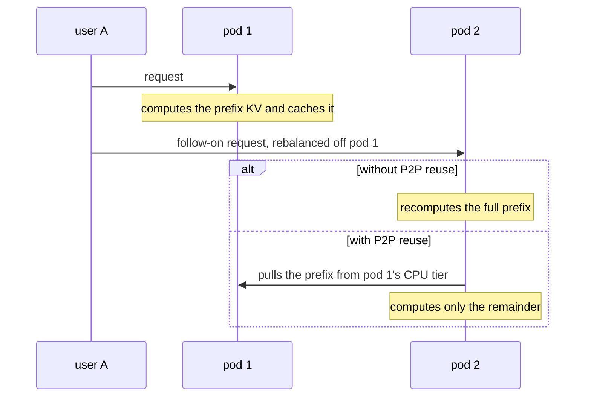

# Enable P2P Reuse

Prefix caches are per-pod, but the content they hold is often fleet-wide:
shared system prompts, common documents, session histories. Prefix-aware
routing sends each request to the pod that caches its prefix - yet routing
cannot always follow the cache: a hot prefix's owner saturates, a working
set outgrows any single pod, a session is rebalanced. Every one of those
requests recomputes KV tensors that already exist on a peer.

P2P reuse closes that gap: any model server pulls cached prefix KV blocks
directly from a peer's CPU offload tier instead of recomputing them. The
transfer is CPU-to-CPU over NIXL - the source pod's GPU is never touched,
so serving a pull costs the source no prefill capacity.

The moment P2P reuse changes is the follow-on request that lands off the
caching pod:

> [!IMPORTANT]
> P2P reuse builds on the [Tiered Prefix Cache](tiered-prefix-cache.md)
> path: peers serve pulls from their CPU offload tier, so the tier must be
> enabled and sized considerably larger than the per-pod GPU KV cache (2x
> as the working default) - the tier's value is the KV that GPU evicts and
> CPU retains. Compute the ratio from the engine's measured KV capacity,
> per role: per-pod KV grows superlinearly with the TP degree (weights are
> paid once while KV memory scales with it), so a tier that is 2x the GPU
> cache at TP=1 can be a fraction of it at TP=4. Block hashes must agree
> across pods (identical `--block-size` and `PYTHONHASHSEED` fleet-wide)
> or every lookup silently misses. Peers that serve each other must also
> run matched TP - the peer session fingerprint is TP-locked except for
> non-hybrid-attention models on the V1 model runner; in-review upstream
> work stores offloaded KV in a canonical parallelism-free layout
> ([vllm#48414](https://github.com/vllm-project/vllm/pull/48414)),
> removing the TP coupling. With data parallelism each DP replica
> gets its own tier region and P2P port (`/dev/shm` above N x
> `cpu_bytes_to_use`, port + rank), on vLLM with per-DP-rank P2P support
> ([vllm#47636](https://github.com/vllm-project/vllm/pull/47636),
> [vllm#47987](https://github.com/vllm-project/vllm/pull/47987)).

## When It Pays

Pulling and recomputing are alternatives with a measurable crossover:
recompute cost grows with prefix length while the pull is a near-flat
CPU-to-CPU copy. On `openai/gpt-oss-120b` (H200) the pull wins at every
length from 2K tokens (-31%) to 48K (-68%); on Llama-3.1-8B the lines
cross near 2K tokens. The router only requests a pull when a peer holds at
least `minCachedTokenDelta` more prefix tokens than the scheduled pod - set
it from the measured crossover.

The regime rule from the benchmarks:

- **Working set fits the fleet's GPU caches** - prefix-aware routing alone
  is optimal; a local hit is free. The P2P producer stays quiet and costs
  nothing.
- **Long prefixes oversubscribe the caches, or a hot prefix saturates its
  owner** - placement by cache location pays in queues and recomputes;
  load-aware placement plus the pull serves the same content from the whole
  fleet.
- **The binding constraint must be prefill compute or latency, with KV
  available to receive the pull.** When GPU KV capacity itself is the
  bottleneck, cache co-location wins structurally - concurrent same-prefix
  requests on one pod share a single copy of the prefix blocks, while
  spreading (with or without a pull) pays a per-pod copy, and a pulled
  prefix occupies KV for exactly as long as a recomputed one.
- **The pull is a recovery path, not a placement strategy.** Keep
  prefix-affinity placement primary and let the pull cover divergence
  (queue spills, evictions across idle gaps, cold replicas, migration).
  Placing purely by load and pulling everywhere scatters cache mass so no
  peer accumulates enough to serve from, and converts the transfer path
  into sustained per-request bandwidth - it loses to affinity at every
  measured load. The guide's `epp-affinity-p2p.yaml` is this
  configuration; reach for load-aware placement plus the pull only in the
  oversubscribed regime above.

## Deploy

See the [P2P KV Cache Sharing guide](../../../guides/p2p-kv-cache-sharing)
for manifests, verification gates, and step-by-step deployment.

## Architecture

1. **Model server pods publish KV-cache events** and run vLLM's
   `OffloadingConnector` with a CPU tier plus a P2P secondary tier: every
   pod both offloads computed KV to CPU and serves it to peers on the P2P
   port.
2. **The router builds the precise prefix index** from the KV events
   (the [Precise Prefix Cache Routing](precise-prefix-cache-routing.md)
   mechanism), so it knows per request which pods hold which prefix blocks.
3. **The `p2p-source-producer` compares** the best-cached peer against the
   pod scheduling picked; when the peer leads by at least
   `minCachedTokenDelta` tokens it sets the KV cache source header.
4. **The routing sidecar injects `kv_transfer_params.p2p`** from the
   header, and the engine pulls the prefix blocks from the peer's CPU tier
   over NIXL. Hits load as normal cache hits; misses recompute, so a
   partial or failed transfer degrades to baseline behavior instead of
   failing the request.

Under P/D disaggregation the pull applies to the **prefill leg only**: the
prefill worker computes the prompt KV and streams it to the decoder, so
that is the leg where recomputing a cached prefix is wasted work. The
sidecar runs with `--enable-p2p-pull` and injects the pull onto the
prefill leg; prefill workers pull cached prefixes from peers and compute
only the remainder, while the decode leg already receives the full KV over
NIXL and has nothing to pull.

## Further Reading

- [P2P KV Cache Sharing guide](../../../guides/p2p-kv-cache-sharing) - manifests, verification gates, benchmarking.
- [Benchmark report: gpt-oss-120b on H200](../../../guides/p2p-kv-cache-sharing/benchmark-results/gpt-oss-120b-h200.md) - crossover, shared-prefix pools, and the document Q&A comparison against precise prefix routing.
- [Tiered Prefix Cache](tiered-prefix-cache.md) - the offload tiers P2P serves from.
- [Precise Prefix Cache Routing](precise-prefix-cache-routing.md) - the index that selects the pull source.
