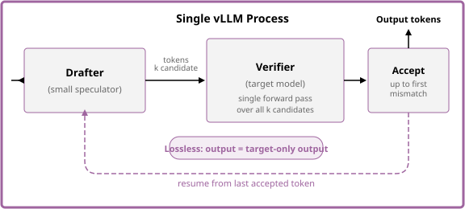

# Speculative Decoding

Speculative decoding accelerates decode by pairing a full-size **target (verifier)** model with a
small, fast **drafter (speculator)** that proposes several tokens ahead; the target verifies them
in a single forward pass. It is **lossless** — every accepted token is exactly what the target
would have generated — so it buys latency without touching output quality.

> [!IMPORTANT]
> Speculative decoding trades **compute for latency**. At low concurrency the GPU has spare
> compute to spend drafting, so inter-token latency (ITL/TPOT) drops sharply. As load rises the
> benefit erodes and aggregate throughput can regress. This path targets **latency-sensitive,
> lightly-loaded** workloads — the guide's benchmark locates the crossover point.

## Deploy

See the [speculative decoding guide](../../../guides/spec-decoding/README.md) for manifests and
step-by-step deployment.

## Architecture

The drafter and verifier run inside a single vLLM process — no separate service or sidecar.
Speculative decoding is a **model-server** capability, orthogonal to routing: it reuses the
[Optimized Baseline](optimized-baseline.md) EPP configuration unchanged and composes cleanly
with prefix-cache routing, P/D disaggregation, and tiered cache.

  <picture>
    <source media="(prefers-color-scheme: dark)">
    
  </picture>

Each step:

1. **Draft** — the drafter proposes *k* candidate tokens autoregressively.
2. **Verify** — the verifier runs a single forward pass over all *k* candidates, producing
   *k*+1 logits.
3. **Accept / reject** — tokens are accepted sequentially until the first mismatch. One
   verifier-sampled token is appended after the last accepted position.
4. **Loop** — generation resumes from the last accepted token.

When acceptance is high, multiple tokens are emitted per verifier forward pass, cutting
inter-token latency.

## Further Reading

- [speculators](https://github.com/vllm-project/speculators) — training library for speculator models
- [EAGLE-3 paper](https://arxiv.org/abs/2503.01840) — the algorithm behind the default drafter
- [vLLM speculative decoding docs](https://docs.vllm.ai/en/latest/features/spec_decode.html) — configuration reference and supported methods
- [RedHatAI speculator models](https://huggingface.co/collections/RedHatAI/speculator-models-68c39684ac2649111619f068) — pretrained drafters for popular models
