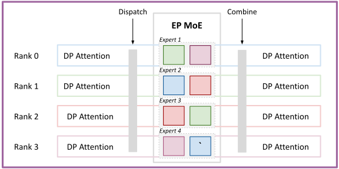
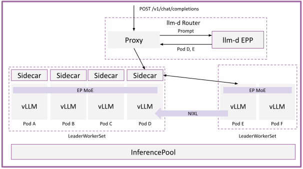

# Multi-Node Wide Expert Parallelism

Very large MoE models like DeepSeek-R1 can consume 500GB+ of RAM just to hold the weights of the model, pressuring KV cache space for long context and high throughput serving. This problem is especially magnified for models with MLA attention, which replicates the KV cache when sharded with tensor parallelism.

To address these issues, model servers support DP/EP deployments, which deploys the attention layers with data parallelism and the MLP layers with expert parallelism. This deployment pattern enables scaling the KV cache space, as the pattern:

* **Scales to multiple nodes** - since the collective operations (dispatch/combine) are sparse - tokens are only sent to the expert rank after routing - they consume much less bandwidth than the all-reduces used in TP setups, making them suitable to run over slower interconnects (IB, RoCE rather than NVLink)
* **Avoids KV replication** - since attention is data-parallel (TP=1 in every DP group), there is only one copy of each tokens' KV

The following visualizes the forward pass in a DP/EP deployment in vLLM:

  <picture>
    <source media="(prefers-color-scheme: dark)">
    
  </picture>

The following steps occurs:

* Each rank runs attention independently
* MoE router selects the `topk` experts for each token (this is sparse - in the case of DeepSeek, 8 out of 256 experts are selected)
* Tokens are "dispatched" (using the `topk_id`) to the proper expert rank (e.g, the green token on rank 1 is routed to E1 and E3)
* Each expert runs independently
* Tokens are "combined" backed to the original attention rank

> [!IMPORTANT]
> Dispatch/combine is on the critical path for every generated token. The LWS guide uses the **DeepEP** backend over NVSHMEM with GPU-initiated RDMA (`ibgda` transport), requiring full-mesh InfiniBand/RoCE connectivity. The Grove variant is validated on GB200 with MNNVL-specific backend configuration.

## Deploy

See the [Wide Expert Parallelism guide](../../../guides/wide-ep) for manifests and step-by-step deployment. The guide includes two deployment variants:

* [LeaderWorkerSet](../../../guides/wide-ep/README-lws.md), validated on H200 and B200 configurations with InfiniBand or RoCE networking.
* [Grove](../../../guides/wide-ep/README-grove.md), validated on NVIDIA GB200 hardware with Multi-Node NVLink (MNNVL).

## Architecture

Multi-node "WideEP" deployments are typically combined with disaggregated serving because:

* Disaggregation avoids "bubbles" where Rank N is computing a prefill and Rank M is computing a decode
* Specialized kernels for prefill and decode can be used (e.g. DeepEP HT vs DeepEP LL)

As a result, we leverage the following design for the deployment:

* Disaggregated prefill and decode via llm-d's EPP
* A multi-node workload controller, either LeaderWorkerSet or Grove, to manage vLLM pod groups
* DP/EP deployment configuration in vLLM

  <picture>
    <source media="(prefers-color-scheme: dark)">
    
  </picture>

The request flow works as follows:
* Request arrives at the proxy, which forwards the request to the EPP
* EPP schedules the request with P/D disaggregation, using labels to detect the decode and prefill variants. The EPP schedules to specific pods created by the selected workload controller
* Request is routed to the sidecar, which forwards the request to the prefill pods
* Prefill instance processes the prompt, executing the forward pass with DP/EP. The configured all-to-all backend executes the cross-node dispatch/combine collectives. vLLM returns metadata about how to retrieve the KV blocks
* Decode instance pulls the KVs over RDMA (IB, RoCE, EFA) with NIXL
* Decode instances process the decodes, executing the forward passes with DP/EP. The configured all-to-all backend executes the cross-node dispatch/combine collectives

## Deployment Variants

The LWS and Grove variants use the same llm-d traffic architecture. The difference is the model-server orchestration layer.

LeaderWorkerSet is the current Kubernetes-native path for H200 and B200 clusters. Grove is the GB200/MNNVL path and adds topology-aware placement, hierarchical gang scheduling, coordinated scaling and recovery, MNNVL-aware orchestration, and coherent rolling updates for multi-component AI workloads.

## Further Reading

See:

* [PD Architecture](../../architecture/advanced/disaggregation/README.md) for more details on disaggregation in llm-d
* [vLLM docs on DP deployment](https://docs.vllm.ai/en/latest/serving/data_parallel_deployment/)
* [vLLM docs on EP deployment](https://docs.vllm.ai/en/latest/serving/expert_parallel_deployment/)
* [vLLM docs on DeepEP and DeepGEMM](https://docs.vllm.ai/en/latest/design/fused_moe_modular_kernel/)
