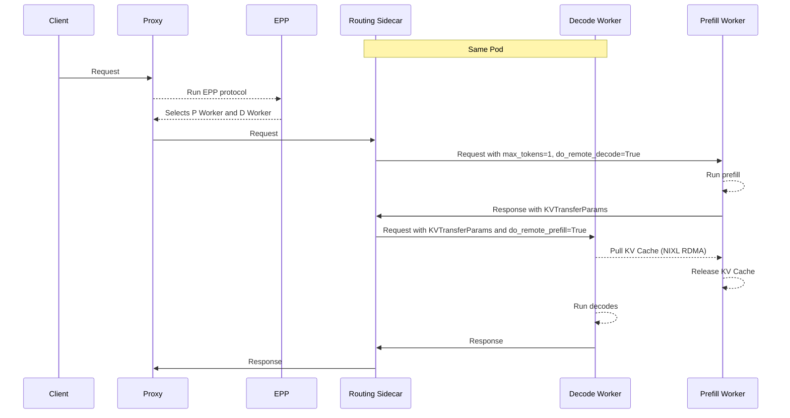
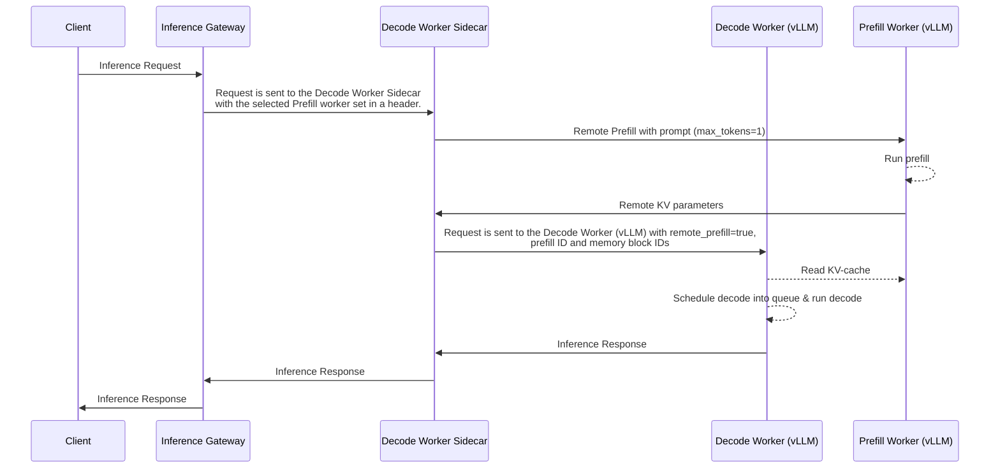

# Disaggregated Serving

## Functionality

Disaggregated serving separates the **prefill** and **decode** stages of LLM inference onto different workers, enabling:
- **Specialization of P and D workers** - For example, using a larger TP for the memory-bound decoding phase while a smaller TP for the computation-bound prefill phase allows both phases to be computed efficiently

- **Avoidance of Head-of-line-Blocking** - For long context requests, separating their prefill phase into dedicated prefill engines allows the ongoing decoding requests to be efficiently processed without being blocked by these long prefills, improving quality-of-service

- **Compatibility with DP/EP** - For DP/EP deployments of Mixture of Experts models, Disaggregated Serving is critical to avoid pipeline bubbles and leveraging the specialized "MaskedGEMM" format for decode.

## Design

An implementation of disaggregated serving requires two key components:
- **Request Flow Orchestration** - select and route the requests to the correct prefill and decode pods

- **Efficient KV Transfer** - transfer the KV cache from the P instance to the D instance. llm-d leverages NIXL integration in vLLM and SGLang for RDMA

> [!NOTE]
> Disaggregated Serving requires high performance (RDMA) interconnects between nodes for efficient KV transfer. Without RDMA, NIXL falls back to TCP for transfer which is not efficient and should only be used for testing and development.


### Request Flow Orchestration

llm-d's EPP natively supports the concept of P/D disaggregation, enabling the following request flow:




#### EPP

The llm-d EPP suppors the concept of P/D didagg

#### Routing Sidecar

#### Model Server

### Efficient KV Transfer

### 


## Architectural Details

### P/D Sequence



### Sidecar Responsibilities (Decode Only)

- Receives EPP metadata (decode pod, optional prefill pod).
- If a prefill endpoint is present, sends the prefill request to the prefill worker, waits for results, and validates them.
- Launches the local decode job.
- Sends the final response back through the proxy.

## Worker Selection Logic

- **Decode Worker** -- Prefers longest prefix match / KV-cache utilization (depending on available scorers) and low load.
- **Prefill Worker** -- Same scoring criteria as decode.

> **Skip prefill** when:
> - Prefix match / KV-cache hit on the decode pod is high.
> - The prompt is very short.

## Deciders

Deciders are EPP plugins that determine whether a disaggregated stage should run for a given request. For P/D, the decider inspects the prompt and the selected decode pod to decide if remote prefill is worthwhile.

### Prefix-Based PD Decider

The `prefix-based-pd-decider` makes the disaggregation decision based on the length of the non-cached suffix of the prompt relative to tokens already cached on the selected decode pod.

**How it works**

- Once a decode pod is selected, the decider checks how many tokens from the incoming prompt have already been sent to this pod.
- If the remaining non-cached suffix is longer than the configured threshold (`nonCachedTokens`), disaggregation is triggered: prefill runs remotely on a prefill pod and decode runs locally on the decode pod.
- If the non-cached suffix is shorter than or equal to the threshold, the full request runs locally on the decode worker without remote prefill.

**Configuration**

```yaml
- type: prefix-based-pd-decider
  parameters:
    nonCachedTokens: 8
```

**Parameters**

- `nonCachedTokens` -- Number of non-cached tokens that trigger disaggregation. Setting this to `0` always disaggregates.

**Feature gate**

The decider requires the `prepareDataPlugins` feature gate:

```yaml
featureGates:
- prepareDataPlugins
```

### Always-Disagg PD Decider

The `always-disagg-pd-decider` is a simpler alternative used mainly for testing or benchmarking. It always triggers disaggregation, regardless of prefix-cache state or prompt characteristics.

```yaml
- type: always-disagg-pd-decider
```

> [!NOTE]
> This plugin accepts no parameters.

It is useful for validating end-to-end prefill/decode splitting and comparing system performance under forced disaggregation.

## Profile Handler Configuration

The `disagg-profile-handler` plugin is the entry point for disaggregation topologies. Active stages are determined by which deciders are configured.

### Parameters

- `profiles` (optional) -- names of the scheduling profiles to use.
    - `decode` (default: `decode`)
    - `prefill` (default: `prefill`)
- `deciders` (optional) -- decider plugins that control whether each stage runs.
    - `prefill` -- enables P/D disaggregation when set.

### Examples

#### Decode-only (no disaggregation)

No deciders are configured -- all requests are handled by the decode profile alone.

```yaml
- type: disagg-profile-handler
```

#### P/D (Prefill/Decode)

```yaml
- type: disagg-profile-handler
  parameters:
    deciders:
      prefill: prefix-based-pd-decider
```

Custom profile names (if your scheduling profiles are not named `decode` / `prefill`):

```yaml
- type: disagg-profile-handler
  parameters:
    profiles:
      decode: my-decode
      prefill: my-prefill
    deciders:
      prefill: prefix-based-pd-decider
```

## Integrating External Prefill/Decode Workloads

The llm-d inference scheduler supports integration with external disaggregated prefill/decode workloads (or other inference frameworks that follow the same P/D separation pattern) that use **different Kubernetes Pod labeling conventions**.

### Labeling Convention Flexibility

By default, llm-d uses the label key `llm-d.ai/role` with values:

- `"prefill"` -- prefill-only pods
- `"decode"` -- decode-capable pods
- `"prefill-decode"` -- pods capable of both prefill and decode
- `"both"` -- **deprecated** (use `"prefill-decode"` instead)

External systems may use alternative labels like:

```yaml
role: prefill
role: decode
```

To accommodate this **without code changes**, configure the `EndpointPickerConfig` to use the generic `by-label` filter plugin instead of a hardcoded `prefill-filter` / `decode-filter`.

### Example: P/D Configuration with Custom Labels

```yaml
apiVersion: inference.networking.x-k8s.io/v1alpha1
kind: EndpointPickerConfig
featureGates:
- prepareDataPlugins
plugins:
  # Prefill selection: match Pods with label role=prefill
  - type: by-label
    name: "prefill-pods"
    parameters:
      label: "role"
      validValues: ["prefill"]
  # Decode selection: match Pods with label role=decode
  - type: by-label
    name: "decode-pods"
    parameters:
      label: "role"
      validValues: ["decode"]
  - type: prefix-cache-scorer
    parameters:
      autoTune: false
      blockSizeTokens: 5
      maxPrefixBlocksToMatch: 256
      lruCapacityPerServer: 31250
  - type: max-score-picker
  - type: disagg-headers-handler
  - type: prefix-based-pd-decider
    parameters:
      nonCachedTokens: 8
  - type: disagg-profile-handler
    parameters:
      profiles:
        prefill: prefill
        decode: decode
      deciders:
        prefill: prefix-based-pd-decider
schedulingProfiles:
  - name: prefill
    plugins:
      - pluginRef: "prefill-pods"
      - pluginRef: "max-score-picker"
      - pluginRef: "prefix-cache-scorer"
  - name: decode
    plugins:
      - pluginRef: "decode-pods"
      - pluginRef: "max-score-picker"
      - pluginRef: "prefix-cache-scorer"
```

## Drawbacks & Limitations

- Slight increase in TTFT under disaggregated P/D due to the extra network hop for prefill.
- Possibility of stranded memory on a prefill worker crash.
- Requires timeout and retry logic in the decode sidecar.

## Design Benefits

- **Flexibility** -- per-request specialization and resource balancing.
- **Scalability** -- clean separation of concerns makes prefill and decode fleets easier to scale and tune independently.
- **Upstream-ready** -- follows GAIE-compatible request handling.
- **Minimal changes** -- only the decode node requires an orchestration sidecar.

## Future Considerations

- Richer cache coordination across KV-cache and other cache tiers.
- Pre-allocation of KV blocks on the decode worker, pushing cache from the prefill worker to the decode worker during computation.

## Further Reading

- [vLLM: Disaggregated Prefill V1](https://docs.vllm.ai/en/stable/examples/offline_inference/disaggregated-prefill-v1/)
- [vLLM: Disaggregated Prefill](https://docs.vllm.ai/en/stable/examples/offline_inference/disaggregated_prefill/)
- [llm-d-inference-scheduler: disaggregation.md](https://github.com/llm-d/llm-d-inference-scheduler/blob/main/docs/disaggregation.md) -- upstream source document
- [Prefill-Decode Disaggregation well-lit path](../../well-lit-paths/prefill-decode-disaggregation.md)
