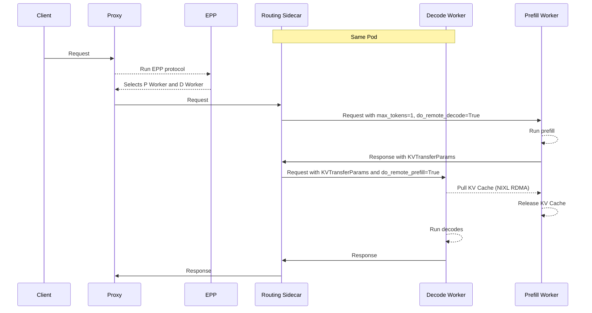
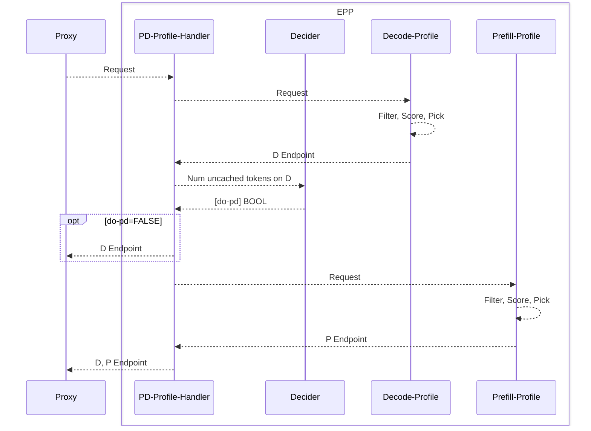

# Disaggregated Serving

## Functionality

Disaggregated serving separates the **prefill** and **decode** stages of LLM inference onto different workers, enabling:
- **Specialization of P and D workers** - For example, using a larger TP for the memory-bound decoding phase while a smaller TP for the computation-bound prefill phase allows both phases to be computed efficiently.

- **Avoidance of Request Interference** - For long context requests, long-context prefills can create head-of-line blocking challenges that slow down processing of existing requests in the decode phase. Separating the prefill phase of these long requests into dedicated prefill engines allows the ongoing decoding requests to be efficiently processed without being blocked by these long prefills, improving quality-of-service.

- **Compatibility with DP/EP** - For DP/EP deployments of Mixture of Experts models, Disaggregated Serving is critical to avoid pipeline bubbles and leveraging the specialized "MaskedGEMM" format for decode.

## Design

An implementation of disaggregated serving requires two key components:
- **Request Flow Orchestration** - select and route the requests to the correct prefill and decode pods

- **Efficient KV Transfer** - transfer the KV cache from the P instance to the D instance. llm-d leverages NIXL integration in vLLM and SGLang for RDMA.

> [!NOTE]
> Disaggregated Serving requires high performance (RDMA) interconnects between nodes for Efficient KV transfer. Without RDMA, NIXL falls back to TCP for transfer which is not efficient and should only be used for testing and development.

### Request Flow Orchestration

llm-d's EPP natively supports the concept of P/D disaggregation, enabling the following request flow:

We will discuss the design of the EPP and Routing Sidecar.

#### EPP

The llm-d EPP supports disaggregation via the `pd-profile-handler`.

> [!NOTE]
> Rather than hardcoding a single scheduling algorithm, the EPP delegates execution to one or more `Profile Handlers`, each of which represents a complete scheduling strategy with its own set of scorers and pickers. They can be thought of as "the dispatcher", which maps each incoming inference request to the right scheduling strategy before the scorers and pickers do their work of selecting the actual endpoint. By default, llm-d uses the `single-profile-handler` for simple aggregated serving.

When configured with `pd-profile-handler`, the EPP processes requests in the following steps:
- The proxy forwards request metadata to the EPP.
- The `pd-profile-handler` first runs the `decode-profile`, which runs the `filter`, `score`, `pick` lifecycle to select the D endpoint.
- The `pd-profile-handler` then consults the `decider` — given how much of the prompt is cached on the D instance, should this request run disagg?
- If `no`: the `pd-profile-handler` returns only the D endpoint to the proxy
- If `yes` (large uncached suffix), the `pd-profile-handler` also runs the `prefill-profile`, which runs the `filter`, `score`, `pick` lifecycle to select the P endpoint and returns both the P and D endpoints to the proxy.

The flow looks like this:

In this way, llm-d's disaggregated serving functionality composes neatly with the existing set of scheduling functionality, enabling use of the existing set of scorers for prefix and load aware routing in the disaggregated setting.

Note that both the prefill and decode endpoints are part of 1 `InferencePool`. The  `decode-profile` and `prefill-profile` for selecting only D workers or P workers via the `filter` step. By default, llm-d uses the label key `llm-d.ai/role` with the following values:
- `prefill` → prefill-only pods
- `decode` → decode-capable pods
- `prefill-decode` → pods capable of both prefill and decode 

> [!NOTE]
> It is possible to override the default labels. To accommodate this without code changes, you can configure the `EndpointPickerConfig` to use the generic by-label filter plugin instead of the hardcoded `prefill-filter` / `decode-filter`. TODO: provide an example of this.

#### Routing Proxy Sidecar

The llm-d Routing Proxy is deployed as a sidecar in each decode pod, with a two-fold role:
- Facilitate the multi-step inference request
- Mutate the requests to follow each model server's KV transfer protocol

##### Request Flow

When a request arrives, the sidecar inspects a routing header set by the proxy:

| Header | Purpose |
|---|---|
| `x-prefiller-host-port` | One or more prefill pod addresses (comma-separated or multi-value) |

Based on which headers are present, the sidecar selects one of two execution paths:

1. **Prefiller → Decoder (P/D)** — The standard disaggregated path. The request is sent to a remote prefiller, KV transfer metadata is collected, and the enriched request is forwarded to the local decoder.
2. **Decoder-only** — No routing headers present; the request is proxied directly to the local model server instance.

All non-completion routes (`GET /health`, and any other path) pass through to the decoder unchanged.

##### KV Transfer Protocol

vLLM and SGLang use slightly different protocols for KV Transfer between the P and D workers, accepting additional parameters in the body of the requests. The Routing Sidecar supports both of these:

- **vLLM** (`nixlv2`, default) — A two-phase sequential protocol. The sidecar generates a UUID, sends a prefill request with `kv_transfer_params` containing remote-decode metadata, and `max_tokens=1` to suppress output. It captures the KV transfer parameters from the prefiller's response and injects them into the decode request before forwarding it to the local decoder. If the prefiller returns a server error, the sidecar falls back to decoder-only mode (client errors are not retried).

**SGLang** (`sglang`) — Uses a concurrent prefill/decode model. Instead of waiting for prefill to complete, the sidecar injects bootstrap coordination parameters (`bootstrap_host`, `bootstrap_port`, `bootstrap_room`) into both requests, fires the prefill asynchronously in a goroutine (with `context.WithoutCancel` to prevent premature cancellation), and immediately sends the decode request synchronously. The decoder and prefiller coordinate KV transfer out-of-band via the bootstrap room.

### Efficient KV Transfer

