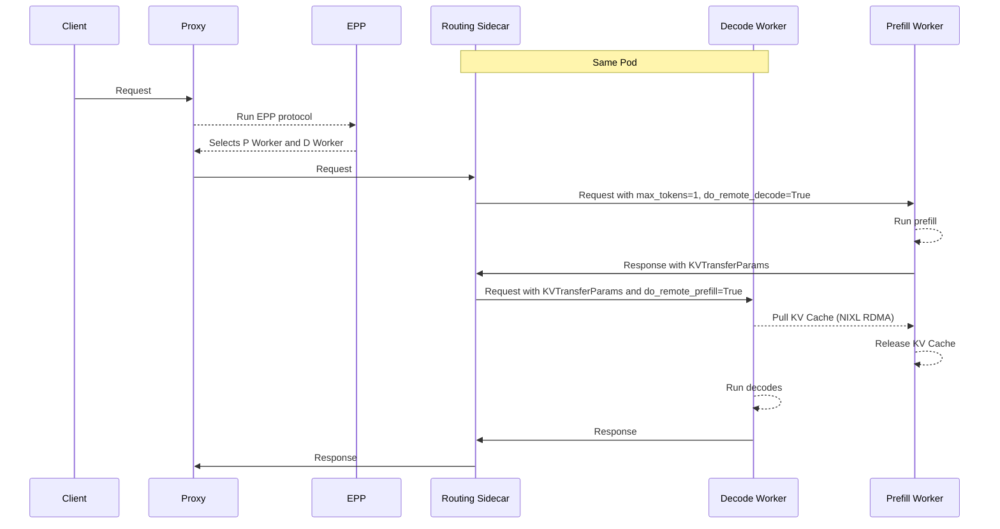
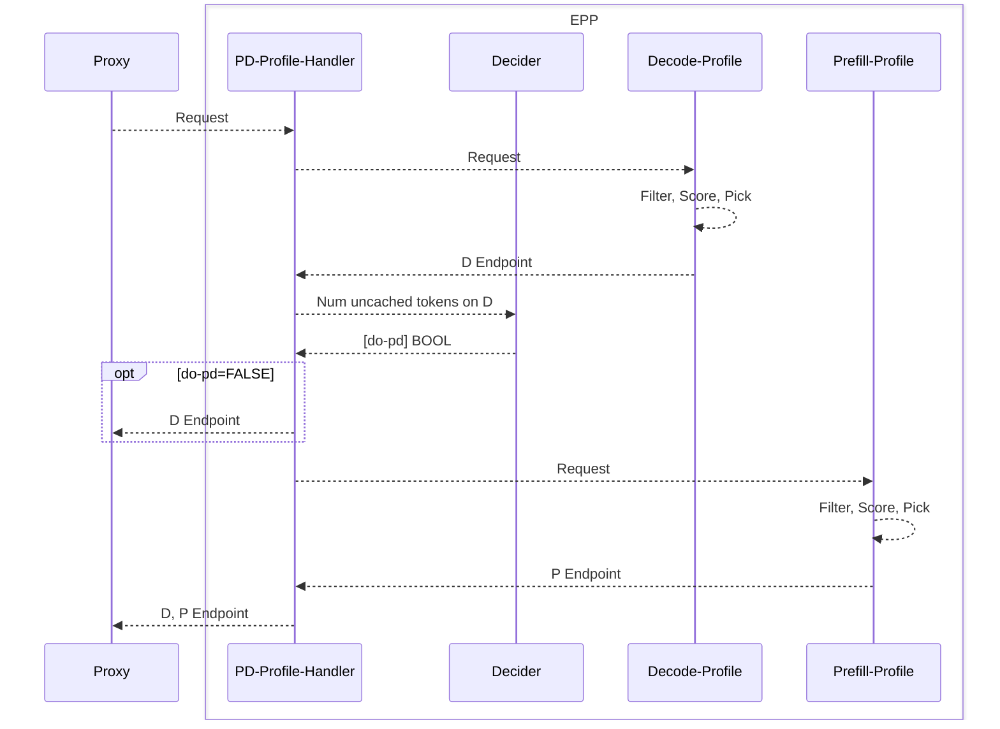

# Disaggregated Serving

## Functionality

Disaggregated serving separates the **prefill** and **decode** stages of LLM inference onto different model server instances, enabling:
- **Specialization of P and D** - LLM inference is composed of two distinct phases of inference - prefill (FLOPs-bound) and decode (Memory bandwidth-bound). Disgaggregation enables specialization, e.g. using a larger TP for the memory-bound decoding phase while a smaller TP for the computation-bound prefill phase.
- **Avoidance of Request Interference** - For long context requests, long-context prefills can slow down processing of existing requests in the decode phase. Separating the prefill phase of these long requests into dedicated prefill instances allows the ongoing decoding requests to be efficiently processed without being blocked by these long prefills, improving quality-of-service.
- **Compatibility with DP/EP** - For DP/EP deployments of Mixture of Experts models, disaggregated serving is essential to avoid pipeline bubbles and leveraging the specialized "MaskedGEMM" format for decode.

## Design

An implementation of disaggregated serving requires two key components:
- **Request Flow Orchestration** - select and route the requests to the correct prefill and decode pods
- **Efficient KV Transfer** - transfer the KV cache from the P instance to the D instance, typically over RDMA

> [!NOTE]
> Disaggregated Serving requires high performance (RDMA) interconnects between nodes for efficient KV transfer. Without RDMA, NIXL falls back to TCP for transfer which is not efficient and should only be used for testing and development.

### Request Flow Orchestration

llm-d's EPP natively supports the concept of P/D disaggregation by selecting a prefill and decode worker pair, enabling the following request flow:



Next we will discuss the design of the EPP and Routing Sidecar for disaggregated serving.

#### EPP

The llm-d EPP supports disaggregation via the `pd-profile-handler`.

> [!NOTE]
> Rather than hardcoding a single scheduling algorithm, the EPP delegates execution to one or more `Profile Handlers`, each of which represents a complete scheduling strategy with its own set of scorers and pickers. They can be thought of as "the dispatcher", which maps each incoming inference request to the right scheduling strategy before the scorers and pickers do their work of selecting the actual endpoint. By default, llm-d uses the `single-profile-handler` for simple aggregated serving.

When configured with `pd-profile-handler`, the EPP processes requests in the following steps:
- `proxy` forwards request metadata to the EPP.
- `pd-profile-handler` runs the `decode-profile`, which executes the `filter`, `score`, `pick` scheduler profile to select D endpoint.
- `pd-profile-handler` consults the `decider` — given how much of the prompt is cached on D, should this request run disagg?
- If `no`: `pd-profile-handler` returns only the D endpoint to the `proxy`
- If `yes` (large uncached suffix), `pd-profile-handler` also runs the `prefill-profile`, which executes the `filter`, `score`, `pick` scheduler profile to select the P endpoint and returns both the P and D endpoints to the proxy.


The flow looks like this:



In this way, llm-d's disaggregated serving functionality composes neatly with the existing set of scheduling functionality, enabling use of the existing set of scorers for prefix and load aware routing in the disaggregated setting.

Note that both the prefill and decode endpoints are part of one `InferencePool`. The `decode-profile` and `prefill-profile` are responsible for selecting only D workers or P workers via the `filter` step. By default, llm-d uses the label key `llm-d.ai/role` with the following values:
- `prefill` → prefill-only pods
- `decode` → decode-capable pods
- `prefill-decode` → pods capable of both prefill and decode 

> [!NOTE]
> It is possible to override the default labels by configuring the `EndpointPickerConfig` to use the generic by-label filter plugin instead of the `prefill-filter` / `decode-filter`. TODO: provide an example of this.

#### Routing Proxy Sidecar

The llm-d Routing Proxy is deployed as a sidecar in each decode pod, with a two-fold role:
- Facilitate the multi-step inference request
- Mutate the requests to follow each model server's KV transfer protocol

##### Request Flow

When a request arrives, the sidecar inspects a routing header set by the proxy:

| Header | Purpose |
|---|---|
| `x-prefiller-host-port` | One or more prefill pod addresses (comma-separated or multi-value) |

Based on which headers are present, the sidecar selects one of two execution paths:

1. **Prefiller → Decoder (P/D)** — The standard disaggregated path. The request is sent to a remote prefiller, KV transfer metadata is collected, and the enriched request is forwarded to the local decoder.
2. **Decoder-only** — No routing headers present; the request is proxied directly to the local model server instance.

All non-completion routes (`GET /health`, and any other path) pass through to the decoder unchanged.

##### KV Transfer Protocol

vLLM and SGLang use slightly different protocols for KV Transfer between the P and D workers, accepting additional parameters in the body of the requests. The Routing Sidecar supports both of these:
- **vLLM** (`nixlv2`, default) — A two-phase sequential protocol. The sidecar sends a prefill request with `kv_transfer_params` containing remote-decode metadata, and `max_tokens=1` to suppress output. It captures the KV transfer parameters from the prefiller's response and injects them into the decode request before forwarding it to the local decoder. If the prefiller returns a server error, the sidecar falls back to decoder-only mode (client errors are not retried).
- **SGLang** (`sglang`) — Uses a concurrent prefill/decode model. Instead of waiting for prefill to complete, the sidecar injects bootstrap coordination parameters (`bootstrap_host`, `bootstrap_port`, `bootstrap_room`) into both requests, fires the prefill asynchronously in a goroutine (with `context.WithoutCancel` to prevent premature cancellation), and immediately sends the decode request synchronously. The decoder and prefiller coordinate KV transfer out-of-band via the bootstrap room.


### Efficient KV Transfer

Once the EPP and Routing Sidecar have coordinated request flow, the P worker needs to hand off its computed KV cache to the D worker. Because the KV cache for a long prompt can be many gigabytes, this transfer sits directly on the critical path of TTFT — an inefficient transport will erase (or reverse) the latency benefits of disaggregation. llm-d addresses this by using [NIXL](https://github.com/ai-dynamo/nixl) (the NVIDIA Inference Xfer Library) as the transport abstraction, layered over [UCX](https://openucx.org/) and RDMA-capable hardware.

#### Why not NVLink between pods?

A natural question is: why not just use NVLink/NVSwitch, which already connects GPUs within a node at hundreds of GB/s? NVIDIA's Dynamo documentation covers this in detail — see [Why NVLink cannot be used between pods](https://docs.nvidia.com/dynamo/dev/kubernetes-deployment/deployment-guide/disagg-communication#why-nvlink-cannot-be-used-between-pods). The short version is that NVLink peer access is a *process-local* mechanism:

- **Same-process requirement.** `cudaDeviceEnablePeerAccess()` requires both GPUs to be visible to a single CUDA context. P and D workers in llm-d run in separate pods, and therefore separate Linux PID/IPC namespaces and separate processes — the CUDA runtime cannot establish peer mappings across that boundary.
- **Device isolation by Kubernetes.** The NVIDIA device plugin hands each pod an isolated view of GPUs via `CUDA_VISIBLE_DEVICES`. The P pod literally cannot name the D pod's GPUs, so there is no way to issue a peer-to-peer copy against them.
- **No cross-process virtual address mapping.** Even CUDA IPC handles, which allow sharing device pointers across processes, assume the processes live on the same host with cooperating drivers and are not designed to span pod sandboxes.

NVLink still matters *inside* a pod — it is what makes tensor parallelism and expert parallelism fast within a single worker — but for the P→D hand-off we need a transport that operates between independent processes, and typically between nodes.

#### Transport options

That leaves network-based transports. The practical options, in order of preference:

| Transport | Typical BW | GPU-Direct | Recommended for |
|---|---|---|---|
| InfiniBand (RDMA) | 20–50 GB/s | Yes | Production |
| RoCEv2 (RDMA over Ethernet) | 10–25 GB/s | Yes | Production |
| TCP (UCX fallback) | 1–3 GB/s | No | Dev / CI only |

The gap between RDMA and TCP is not subtle. NVIDIA reports ~200–500× TTFT regressions when NIXL falls back to TCP (e.g., ~98 s vs. ~200–500 ms for the same workload), which is why the note at the top of this page is emphatic: disaggregated serving in production assumes RDMA fabric between P and D nodes. See the [llm-d RDMA guide](../../../guides/rdma/README.md) for cluster setup.

#### The NIXL / UCX / driver stack

llm-d does not talk to the NIC directly. The stack looks like:

```
┌─────────────────────────────────────┐
│ vLLM / SGLang KV connector          │  ← model server
├─────────────────────────────────────┤
│ NIXL                                │  ← KV-aware transfer API (descriptors, agents)
├─────────────────────────────────────┤
│ UCX                                 │  ← transport selection, rendezvous, flow control
├─────────────────────────────────────┤
│ rc_x / dc_x / cuda_copy / cuda_ipc  │  ← UCX transport backends
├─────────────────────────────────────┤
│ InfiniBand / RoCE NIC + GPUDirect   │  ← hardware
└─────────────────────────────────────┘
```

- **NIXL** exposes a high-level API for registering GPU/CPU memory regions and describing KV blocks as transfer descriptors. vLLM's `NixlConnector` and SGLang's equivalent register the paged KV cache up-front so that individual transfers only need to reference offsets, not re-register memory.
- **UCX** is the underlying communication framework. It picks a transport at connection time (`rc_x` for reliable-connection InfiniBand, `dc_x` for dynamically-connected IB at scale, `cuda_ipc` for same-host GPUs, TCP as a last resort) and handles rendezvous, completion, and fragmentation.
- **GPUDirect RDMA** lets the NIC DMA directly into/out of GPU memory without staging through host RAM. This requires `nvidia-peermem` (or `nv_peer_mem`) to be loaded and a NIC whose firmware advertises PeerDirect support. Without it, UCX falls back to GPU→host→NIC→host→GPU copies, which doubles the PCIe traffic and burns CPU cycles.

#### Pull vs. push and the rendezvous scheme

Looking back at the sequence diagram, the decoder **pulls** the KV cache from the prefiller (`DWorker --> PWorker: Pull KV Cache`) rather than having the prefiller push it. This corresponds to UCX's `get_zcopy` rendezvous scheme:

- The P worker finishes prefill, registers the KV blocks via NIXL, and returns descriptor metadata (remote addresses + rkeys) to the D worker in `kv_transfer_params`.
- The D worker issues RDMA READs against those descriptors directly into its own paged KV cache — zero-copy on both ends when GPUDirect is available.
- The D worker signals completion, at which point the P worker can free / reuse the KV blocks.

Pulling from the receiver has two useful properties in a disaggregated scheduler: (1) the D worker already knows where in its paged allocator the blocks should land, avoiding a second copy, and (2) flow control is natural — the P worker never outruns a slow or overloaded D worker.

> [!NOTE]
> On some fabrics (notably AWS EFA on kernel ≥6.8), forcing `UCX_RNDV_SCHEME=get_zcopy` is unstable; UCX's `auto` scheme should be used instead, at the cost of roughly 3× the latency of native InfiniBand. This is a fabric-specific caveat, not a NIXL limitation.

#### When disaggregation pays off

Because every request pays a one-time KV transfer cost, there is a break-even point below which aggregated serving wins. The exact crossover depends on model size, KV dtype, prompt length, and fabric bandwidth — as a rough guide, NVIDIA observes that on an 8B model over EFA the break-even is around ~10k output tokens, while on a well-provisioned InfiniBand fabric with a large MoE model it can be a few hundred tokens. The EPP's `decider` (see above) exists precisely to make this call per-request based on how much of the prompt is already cached on the D side.


