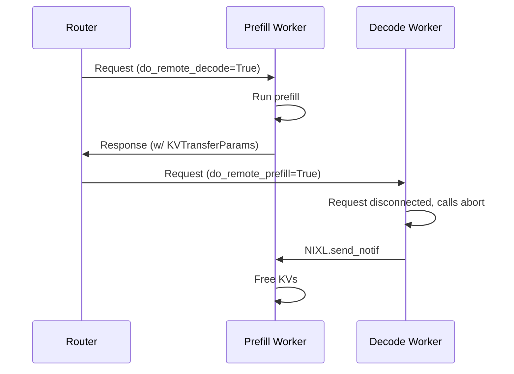
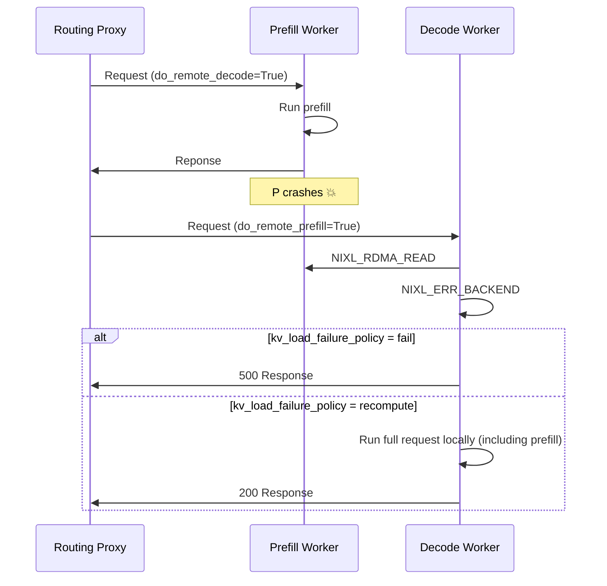
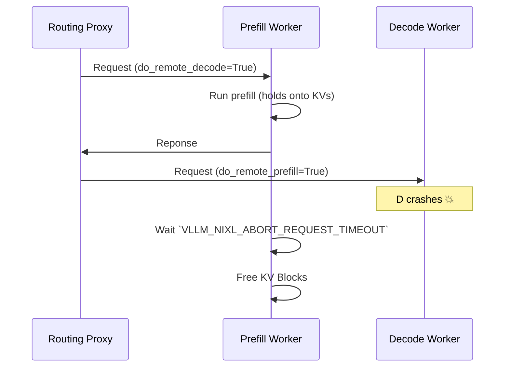

# Disaggregated Serving: Operations vLLM

While Disaggregated serving offers superior performance for high scale inference, it introduces additional operational complexity, including:
- [Dynamic Connections](#dynamic-connections) - how to add or remove P and D workers on the fly when workers require point-to-point RDMA connections
- [Request Cancellation](#request-cancellation) - how to free KV caches from the engines when requests stop, in a distributed setting
- [Fault Tolerance](#fault-tolerance) - how to ensure crashes do not create cascading failures and that resources are cleaned up 

llm-d's Kubernetes-native design simplifies these operational practices.

## Dynamic Connections

In production enviornments it is common for pods to be created and destroyed - either recovering from crashes or dynamically adjusting capacity alongside load. In a P/D enviornment, the ability to dynamically add/remove replicas from the deployment is complicated by the need to establish/destroy connections between P and D workers on the fly and the need to fee

vLLM leverages NIXL for KV transfer. A key feature of NIXL is support for dynamically adding and removing connections.

### Scale-Up - Creating New Connections

To create new P/D connections, vLLM executes a "NIXL Handshake" between the D and P worker to setup the RDMA connection. This is a relatievly expensive operation (O(~5s)) that is done once per engine pair, with all subsequent requests leveraging the existing connection. llm-d uses a "dynamic lazy" roll-out strategy, avoiding the need for a centralized bootstrap server maintaining global state.


It works like this:

```mermaid
sequenceDiagram
    participant R as Routing Proxy
    participant P as Prefill Engine
    participant D as Decode Engine

    R->>P: Request with do_remote_decode=True
    P-->>P: Run prefill
    P->>R: Response with KVTransferParams including remote_host, remote_port, and remote_kv_blocks
    R->>D: Request with KVTransferParamss
    cond No connection
        D-->>D: Spawn background thread
        D-->>P: Request NIXLMetadata (via ZMQ)
        P-->>D: Return NIXLMetadata (via ZMQ)
        D-->>D: Bootstrap RDMA connection
        deactivate D
    end

    D-->>P: NIXL READ: pull KV cache blocks via RDMA
    D-->>D: Run decodes
    D->>R: Response
```

- Prefill worker run a side channel server over ZeroMQ. When the P worker finishes processing, it constructs the `KVTransferParams` with `remote_host=VLLM_SIDE_CHANNEL_HOST` (usually the pod ip) and `remote_port=VLLM_SIDE_CHANEL_PORT` in the response body.
- Decode worker receives the request with the `KVTransferParams`, if there is not yet a connection to the remote P Worker, it runs a background thread to fetch the `NIXLMetadata` and create the RDMA connection. This action does not block core engine execution, enabling other requests to proceed as usualy.

#### Discovery

Since workers are added to an `InferencePool` via standard Kuberentes selectors and labels, new prefill and decode workers are automatically added when the pod lifecycle switches to `status: Running` in Kuberentes - there is no need for a special control plane!

### Scale-Down

> [!NOTE]
> Documentation for graceful scale down is currently work in progress.

## Request Cancellation

Given the compute intensity and duration of inference requests, model servers like vLLM support "Request Cancellation", where currently in-progress requests are freed when the client disconnects.

In a P/D disaggregation setup, this feature is more complicated, because the resources associated with an inference request are spread across multiple servers (as the P worker holds onto the KV caches until they have been retrieved by the D worker). As a result, if the request is canceled while it is still "in-flight" on the D worker but before the KV transfer occurs, we need to ensure that the resources on the P worker are properly cleaned up. llm-d accomplishes this functionality by building on top of vLLM's existing request cancellation infrastructure:
- When requests are disconnected in vLLM, it triggers the `abort` codepath, which cleans up running resources. When request with `do_remote_prefill=True` are aborted, vLLM sends a NIXL side channel message (`send_notif`), instructing the remote prefill engine to free the KV cache for the cancelled request.



> [!NOTE]
> There is a small window in which request cancellation will not trigger KV freeing on the P instance. If the request is disconnected after it is completed on the P worker but before it reaches the D worker's scheduler (for example, if it disconnects while the request is inside Routing Proxy), the D worker never knows about the request and therefore is unable to free the remote blocks on the P worker. As a result, the KV blocks are stranded on the P worker until the timeout `VLLM_NIXL_ABORT_REQUEST_TIMEOUT`, which defaults to 480s. We are currently working on a lease-extension strategy that will dramatically shorten the timeout window.

## Fault Tolerance

llm-d leverages dynamic xPyD configuration for disaggregated serving, meaning within an `InferencePool`, all D workers are connected to all P workers. This creates a critical operational risk - crashes in workers have the potential for cascading failures if the system is not tolerant of failures.

### Prefill Worker Failure

Prefill Worker failures is most critical failure mode in disaggregated deployments, as vLLM's NIXL integration uses a READ-centric KV Transfer protocol. When a P worker crashes, the D workers will attempt to execute an RDMA READ without first checking that the P worker is still running.

vLLM handles Prefill Worker failure by building on top of NIXL's error handling functionality. When a NIXL_READ is attempted and fails (including to a remote engine that has crashed), NIXL returns an error code such as `NIXL_ERR_BACKEND`. vLLM catches this error and handle it according to the [`kv_load_failure_policy`](https://docs.vllm.ai/en/stable/features/nixl_connector_usage/?h=nixl#kv-load-failure-policy):
- **fail (default, recommended)**: Immediately fail the request with an error when KV load fails. This prevents performance degradation by avoiding recomputation of prefill work on the decode instance.
- **recompute**: Recompute failed blocks locally on the decode instance. This may cause performance jitter on decode instances as the scheduled prefill will delay and interfere with other decodes. Furthermore, decode instances are typically configured with low-latency optimizations (such as DeepEP LL for Wide EP deployments).



Failed Prefill Worker pods are automatically moved to [`status: Terminated`](https://kubernetes.io/docs/concepts/workloads/pods/pod-lifecycle/#container-state-terminated) state as part of the standard Pod lifecycle. Since llm-d leverages the Kubernetes API Server for service discovery, no additional traffic will be routed to the failed worker until the pod has been restarted and returns to the `status: Running` state.

In this way, `llm-d` gracefully isolates Prefill Worker failure.

### Decode Worker Failure

While D Worker failures are unlikely to result in P worker crashes (since P workers never initiate a READ or WRITE to D workers), there is a challenge around ensuring that KV cache memory on the P instance is not stranded since the P worker holds onto the KV cache until it has been explicitly pulled from the D worker.

vLLM avoids permanent KV cache stranding by introducing a timeout on the P worker side `VLLM_NIXL_ABORT_REQUEST_TIMEOUT` (default `480s`). After `VLLM_NIXL_ABORT_REQUEST_TIMEOUT` elapses, the P worker will free the KV caches from any requests that have not been READ yet, eventually cleaning up the resources.




> [!WARNING] Robustness against Decode Worker failure is currently a major weakness of the design, since the `VLLM_NIXL_ABORT_REQUEST_TIMEOUT` defaults to a long timeout (`480s` to avoid early-free when D engines are backed up). We recommend that production users consider reducing this timeout, especially if they can ensure Decode Workers do not result in significant queuing. We are currently working on a "lease-extension" system, which will dramatically improve this situation and avoid the tradeoff.
