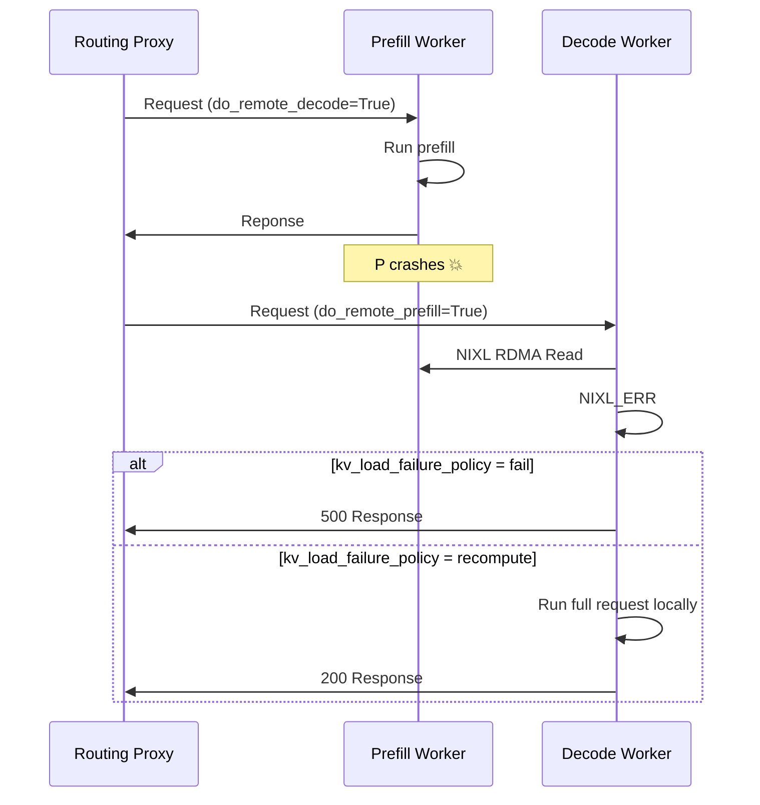

# Disaggregated Serving: Operations vLLM

While Disaggregated serving offers superior performance for high scale inference, it introduces additional operational complexity, including:
- [Dynamic Connections](#dynamic-connections) - how to add or remove P and D workers on the fly when workers require point-to-point RDMA connections
- [Request Cancellation](#request-cancellation) - how to free KV caches from the engines when requests stop, in a distributed setting
- [Fault Tolerance](#fault-tolerance) - how to ensure 

llm-d's Kubernetes-native design simplifies these operational practices.

## Dyanmic Connection

In production enviornments it is common for pods to be created and destroyed - either recovering from crashes or dynamically adjusting capacity alongside load. In a P/D enviornment, the ability to dynamically add/remove replicas from the deployment is complicated by the need to establish/destroy connections between P and D workers on the fly and the need to fee

vLLM leverages NIXL for KV transfer. A key feature of NIXL is support for bootstrapping dynamic connections enabling support for dynamic xPyD configurations.

### Scale-Up - Creating New Connections

To bootstrap new connections, we need to bootstrap a "NIXL Handshake" between the D and P worker to setup the RDMA connection. Since vLLM leverages a "READ" strategy for transfering the KVs (i.e. the KV cache are pulled by the D worker from the P worker), it supports a mechanism for the D worker to discover the P workers without a centralized bootstrap server by passing:
- Prefill workers run a side channel server over ZeroMQ. When the prefiller finishes its request and constructs the `KVTransferParams` with `remote_host=VLLM_SIDE_CHANNEL_HOST` (usually the pod ip) and `remote_port=VLLM_SIDE_CHANEL_PORT` in the response body.
- Decoder receives the request with the `KVTransferParams`, if there is not yet a connection to the remote worker, it runs a background thread to fetch the `NIXLMetadata` and bootstrap the RDMA connection

It works like this:

```mermaid
sequenceDiagram
    participant R as Routing Proxy
    participant P as Prefill Engine
    participant D as Decode Engine

    R->>P: Request with do_remote_decode=True
    P-->>P: Run prefill
    P->>R: Response with KVTransferParams including remote_host, remote_port, and remote_kv_blocks
    R->>D: Request with KVTransferParamss
    cond No connection
        D-->>D: Spawn background thread
        D-->>P: Request NIXLMetadata (via ZMQ)
        P-->>D: Return NIXLMetadata (via ZMQ)
        D-->>D: Bootstrap RDMA connection
        deactivate Decoder
    end

    D-->>P: NIXL READ: pull KV cache blocks via RDMA
    D-->>D: Run decodes
    D->>R: Response
```

Additionally, since pods are added to an `InferencePool` via standard Kuberentes selectors and labels, new prefill and decode workers are automatically added to the deployemnt when they switch to `status: Running` in Kuberentes - there is not need for a special control plane or service discovery needed!

### Scale-Down

> [!NOTE]
> Documentation for graceful scale down is currently work in progress.

## Request Cancellation

Given the compute intensity and duration of inference requests, model servers like vLLM support "Request Cancellation", where currently in-progress requests are freed when the client disconnects.

In a P/D disaggregation setup, this feature is more complicated, because the resources associated with an inference request are spread across multiple servers, as the P worker holds onto the KV caches until they have been retrieved by the D worker. As a result, if the request is canceled while it is still "in-flight" on the D worker before the KV transfer occurs, we need to ensure that the resources on the P worker are properly cleaned up.

llm-d accomplishes this functionality by building on top of vLLM's existing request cancellation infrastructure. When requests are disconnected in vLLM, it triggers the `abort` codepath, which cleans up running resources. Inside vLLM's scheduler, if requests with `do_remote_prefill=True` are aborted, vLLM sends a NIXL side channel message, instructing the remote prefill engine to free the KV cache for the cancelled request.

> [!NOTE]
> There is a small window in which request cancellation will not trigger KV freeing on the P instance. If the request is diconnected AFTER the request is completed on the P worker but BEFORE the request reaches the D worker's scheduler (e.g. if it disconnects while the request is inside Routing Proxy), the D worker never knows about the request and therefore is unable to free the remote blocks on the P worker. As a result, the KV blocks are stranded on the P worker until the timeout `VLLM_NIXL_ABORT_REQUEST_TIMEOUT`, which defaults to 480s. We are currently working on a lease-extension strategy which will dramatically shorten the timeout window.

## Fault Tolerance

llm-d leverages dynamic xPyD configuration for disaggregated serving, meaning within an `InferencePool`, all D workers are connected to all P workers via RDMA. This creates a critical operational risk - crashes in workers have the potential for cascading failures if the system is not tolerant of failures.

### Prefill Worker Failure

Prefill Worker failures is most critical failure mode to handle in disaggregated deployments, as vLLM's NIXL uses a READ-centric KV Transfer protocol. When a P worker crashes, the D workers will attempt to execute and RDMA read without first checking that the P worker is still running.

To do this, we leverage NIXL's error handling functionality to gracefully prevent cascading failure:



vLLM's [`kv_load_failure_policy`](https://docs.vllm.ai/en/stable/features/nixl_connector_usage/?h=nixl#kv-load-failure-policy) setting controls how the system handles failures when the decoder instance loads KV cache blocks from the prefiller instance:
- **fail (default, recommended)**: Immediately fail the request with an error when KV load fails. This prevents performance degradation by avoiding recomputation of prefill work on the decode instance.
- **recompute**: Recompute failed blocks locally on the decode instance. This may cause performance jitter on decode instances as the scheduled prefill will delay and interfere with other decodes. Furthermore, decode instances are typically configured with low-latency optimizations (such as DeepEP LL for Wide EP deployments).

Additionally, failed Prefill Worker pods are automatically moved to [`status: Terminated`](https://kubernetes.io/docs/concepts/workloads/pods/pod-lifecycle/#container-state-terminated) state as part of the standard Pod lifecycle. Since llm-d leverages the Kubernetes API Server for service discovery and there is no other centralized bootstrapping server for KV transfer, no additional cleanup is required to avoid routing additional traffic. The failed Prefill Workers will simply no longer be considered for additional traffic.

### Decode Worker Failure

