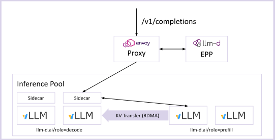
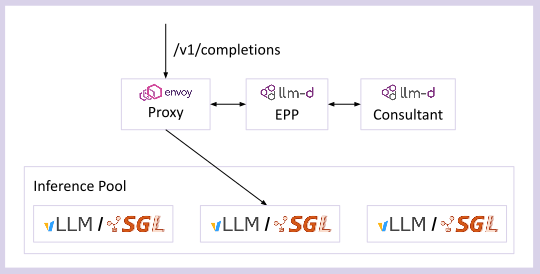

# Architecture

High-level guide to llm-d architecture. Start here, then dive into specific guides.

## Core

llm-d has a layers architecture, providing maximum flexibility for deployment automation and infrastructure selection.

At it core, llm-d contains the following key layers:

- **Proxy** - The Proxy accepts requests from the users. It can be deployed as a Standalone Envoy Proxy or via Kuberentes Gateway API. The Proxy consults an EndPoint Picker (EPP) via the ext-proc protocol to determine which pod

- **EndPoint Picker (EPP)** - An extendable component that selects which endpoint in an `InferencePool` is optimal for an specific request. The EPP is the "brains" of the scheduling decision that considers prefix-cache affinity, load signals, and (optionally) disaggregated serving.

- **InferencePool** - The InferencePool API defines a group of Model Server Pods dedicated to serving AI models. An InferencePool is conceptually similar to a Kuberentes Service. Each InferencePool has an associated EPP which selects the optimal pod for a request.

- **Model Server** - The Model Server (like vLLM or SGLang) executes the model on hardware accelerators. The Model Servers can be deployed through any deployment process, joining an `InferencePool` via Kuberentes labels and selectors.

Via this simple architecture, llm-d injects LLM-aware load balancing into production-quality request routing.

## Advanced Patterns

Beyond the core pattern, llm-d's core design composes with optional advanced deployment patterns, which can be classified in the following types:

### Disaggregation

In disaggregated serving, a single inference request is split into multiple steps (e.g. Prefill phase and Decode phase). llm-d's EPP supports the concept of disaggregation and leverages the protocols of the Model Servers (vLLM and SGLang) to execute the multi-step inference process.

See [Disaggregation](advanced/disaggregation.md) for complete details on the disaggregated serving design.

### EPP "Consultants"

In addition to leveraging the Model Server metrics and in-memory prefix-cache trees, the EPP can also call out to sidecar "consultant" pods which can execute more complicated scheduling decisions.

Examples of this include:
- [Latency Predictor](advanced/latency-predictor.md), which trains an XGBoost model online (using measured latency of previous requests) for scheduling decisions
- [KV-Cache Indexer](advanced/kv-indexer.md), which maintains a globally consistent view of each Model Server's KV cache state (which can outperform the EPP's approximated view for multi-modal and hybrid models)

### Autoscaling

- TBU
