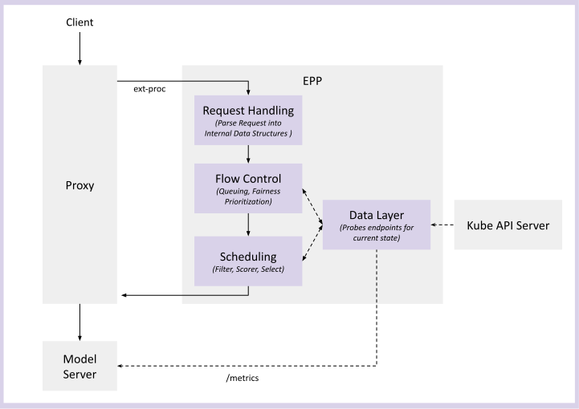

# Endpoint Picker (EPP)

## Functionality

The EPP is the "brains" of an llm-d deployment. It is focused on two key objectives:

- **Intelligent scheduling** - selecting which **model server pod** within an InferencePool should process each inference request, using the internal state of model server pods (KV-cache utilization, prefix cache locality, request queue depth, and active request counts)

- **Fairness and priortiziaton** - selecting which **inference requests** should run at any given time, enabling consolidation of multiple workloads with varying priorities onto a single set of Model Servers

The EPP is an extensible component that integrates with the proxy layer via Envoy's [External Processing (ext-proc)](https://www.envoyproxy.io/docs/envoy/latest/configuration/http/http_filters/ext_proc_filter) protocol.

When a request arrives at the proxy, the proxy calls the EPP to select a backend endpoint, and the EPP returns the optimal pod address according to the [Endpoint Picking Protocol](https://github.com/kubernetes-sigs/gateway-api-inference-extension/tree/main/docs/proposals/004-endpoint-picker-protocol).

## Design

### Request Flow

The following diagram shows the end-to-end lifecycle of a request as it flows through the EPP plugin pipeline:



The steps are:

1. **Request arrival** -- An inference request arrives at the proxy (Gateway).
2. **External processing** -- The proxy invokes the EPP via the ext-proc protocol, passing the request headers and body to the EPP.
3. **Request handling** -- Parses the request (from e.g. OpenAI format, vllm gRPC) into the internal request data structure.
3. **Flow control** -- If (optionally) enabled, queues requests and prioritizes among different priorities and ensures fairness across different tenants within a priority, and holding requests when the pool is "saturated".
4. **Scheduling** -- Selecting the optimal endpoint from the available InferencePool, which involves evaluating each request against a configured set of scheduling plugins, such as filters and scorers.
7. **Request Proxying** -- The EPP returns the address of the selected endpoint to the proxy, which then forwards the request to the corresponding model server endpoint.

Asynchronously, the **Data layer* sets up watches on the Kubernetes API server for updates to relevant objects like InferencePools and Pods for endpoint discovery. It is also responsible for model servers metrics probing, and maintaining an internal state—such as a prefix cache tree—to inform the request processing components, Flow Control and Scheduling.```

### Layers

The EPP is modular and pluggible, consisting of the following layers:

#### Ext-Proc Server

The Ext-Proc Server protocol is very well defined & specific, deviation could cause the EPP to become unusable or unstable. Extension is ill-advised. The Ext-Proc is simply the standard interface by which the Proxy talks to the EPP.

#### Data Layer (Extensible)

The **Data Layer** operates asynchronously, consuming and storing data from a variety of sources:
- Kube API Server about which pods are active in the InferencePool
- Model Servers about the current internal state (running requests, kv cache utilization)
- In-memory data structures, such as prefix cache trees for prefix-aware routing
- "Consultant" sidecars like the latency predictor, the kv-indexer or tokenizer for advanced scheduling

Other modules in the EPP consult the **Data Layer** during request processing.

#### Request Handler (Extensible)

The **Request Handler** is the first step of the request flow in the EPP. The key responsibility is to convert the user's request into the internal EPP data structure via the Parser plugin. The EPP provides out-of-the-box Parsers for common formats like the [OpenAI HTTP](https://developers.openai.com/api/reference/overview) and [vLLM gRPC](https://docs.vllm.ai/en/latest/api/vllm/entrypoints/grpc_server/).

In addition, users can write a custom Parser for their own protocol. The rest of the functionality in EPP is agnostic to the original request protocol, enabling easy adaptation of the EPP to new request formats.

See [Request Handling](request-handling.md) for more details on the design.

#### Flow Control (Extensible)

XXX

See [Flow Control](flow-control.md) for more detailson the design.

#### Schedulger (Extensible)

XXX

See [Scheduling](scheduling.md) for more details on the design.

## Configuration

The `EndpointPickerConfig` is used to cofigure the EPP deployment.

The configuration text has the following form:

```yaml
apiVersion: inference.networking.x-k8s.io/v1alpha1
kind: EndpointPickerConfig
plugins:
- ....
- ....
schedulingProfiles:
- ....
- ....
saturationDetector:
  ...
data:
  ...
flowControl:
  ...
parser:
  ...
featureGates:
  ...
```

> NOTE: While the configuration text looks like a Kubernetes CRD, it is NOT a Kubernetes CRD. Specifically, the config is not reconciled upon, and is only read on startup. This behavior is intentional, as augmenting the scheduling config without redeploying the EPP is not supported.

- The first two lines of the configuration are constant and must appear as is.
- The [`plugins`](#plugins) section defines the set of plugins that will be instantiated and their parameters.
- The [`schedulingProfiles`](#schedulingProfiles) section defines the set of scheduling profiles that can be used in scheduling requests to pods.
- The [`saturationDetector`](#saturationDetector) section configures the saturation detector.
- The [`flowControl`](#flowControl) section configures the Flow Control layer, which manages request concurrency and fairness.
- The [`data`](#data) section configures the data layer, which is used to gather information (such as metrics) used in making scheduling decisions.
- The [`parser`](#parser) section configures the parser, which is used to understand the payload of requests and responses for features like prefix-cache aware routing and 
- The [`featureGates`](#featureGates) section allows the enablement of experimental features of the IGW. This section is described in more detail in the section Feature Gates.usage tracking.

## Using the `EndpointPickerConfig`

The `EndpointPickerConfig` command line argument `--config-file` should be used to specify the full path of the file in question. For example:

```yaml
apiVersion: apps/v1
kind: Deployment
metadata:
  name: ${EPP_NAME}
  ...
spec:
  ...
  template:
    ...
    spec:
      ...
      containers:
      - name: epp
        image: ghcr.io/llm-d/llm-d-inference-scheduler:latest
        imagePullPolicy: IfNotPresent
        args:
        - --pool-name
        - "${POOL_NAME}"
        ...
        - --config-file
        - "/etc/epp/epp-config.yaml"
```

If the configuration is passed as in-line text the EPP command line argument `--config-text` should be used. For example:

```yaml
apiVersion: apps/v1
kind: Deployment
metadata:
  name: ${EPP_NAME}
  ...
spec:
  ...
  template:
    ...
    spec:
      ...
      containers:
      - name: epp
        image: ghcr.io/llm-d/llm-d-inference-scheduler:latest
        imagePullPolicy: IfNotPresent
        args:
        - --pool-name
        - "${POOL_NAME}"
        ...
        - --config-text
        - |
          apiVersion: inference.networking.x-k8s.io/v1alpha1
          kind: EndpointPickerConfig
          plugins:
          - type: prefix-cache-scorer
            parameters:
              blockSizeTokens: 5
              maxPrefixBlocksToMatch: 256
              lruCapacityPerServer: 31250
          schedulingProfiles:
          - name: default
            plugins:
            - pluginRef: prefix-cache-scorer
              weight: 50
```

## Detailed Configuration

### `plugins`

The section declares the set of plugins to be instantiated along with their parameters.

Each plugin can also be given a name, enabling the same plugin type to be instantiated multiple times, if needed (such as when configuring multiple scheduling profiles). Each entry in this section has the following form:

```yaml
- name: aName
  type: a-type
  parameters:
    parm1: val1
    parm2: val2
```

The fields in a plugin entry are:
- `name` which is optional, provides a name by which the plugin instance can be referenced. If this field is omitted, the plugin's type will be used as its name.
- `type` specifies the type of the plugin to be instantiated.
- `parameters` which is optional, defines the set of parameters used to configure the plugin in question. The actual set of parameters varies from plugin to plugin.

### `schedulingProfiles`

The `schedulingProfile` section defines how the EPP's Scheduling component works. If one is not defined, a default `schedulingProfile` named `default` will be added and will reference all of the instantiated plugins.

The number of scheduling profiles depends on the use case:
- For aggregated serving - one profile is needed
- For disaggregated servings - two profiles are required (one for prefill and one for decode).

Each `schedulingProfile` can have:
- a set of `filters` (optional -- if unset, uses no filter)
- a set of `scorers` with `weights`
- a `picker` (optional -- if unset, uses `max-score-picker`)

Each entry in this section has the following form:

```yaml
- name: aName
  plugins:
  - pluginRef: plugin1
  - pluginRef: plugin2
    weight: 50
```

Below is a simple concrete example, which configures the EPP to use aggregated serving, consider the prefix-cache hit, the queue depth, and kv cache utilization in the scheduling decision.

```yaml
pluginsConfigFile: "custom-plugins.yaml"
  pluginsCustomConfig:
    custom-plugins.yaml: |
      apiVersion: inference.networking.x-k8s.io/v1alpha1
      kind: EndpointPickerConfig
      plugins:
      - type: prefix-cache-scorer
      - type: queue-scorer
      - type: kv-cache-utilization-scorer
      - type: max-score-picker
      schedulingProfiles:
      - name: default
        plugins:
        - pluginRef: prefix-cache-scorer
          weight: 3
        - pluginRef: queue-scorer
          weight: 2
        - pluginRef: kv-cache-utilization-scorer
          weight: 2
        - pluginRef: max-score-picker
```

There are two types of plugins related to Scheduling: `Scorers` and `Pickers`

#### Scorers

During the scheduling process, each pod recieves a score for each scorer in the `schedulingProfile`:

- `prefix-cache-scorer`: Scores pods based on the amount of the prompt is believed to be in the pod's KvCache. Parameters:
    - `blockSize`: specified the size of the blocks to break up the input prompt when calculating the block hashes. If not specified defaults to 64 
    - `maxPrefixBlocksToMatch`: specifies the maximum number of prefix blocks to match. If not specified defaults to 256
    - `lruCapacityPerServer`: specifies the capacity of the LRU indexer in number of entries per server (pod). If not specified defaults to 31250

- `lora-affinity-scorer`: Scores pods based on whether the requested LoRA adapter is already loaded in the pod's HBM, or if the pod is ready to load the LoRA on demand. Parameters:
    - none

- `kv-cache-utilization-scorer`: Scores the candidate pods based on their KV cache utilization. Parameters:
    - none

- `queue-scorer`: Scores list of candidate pods based on the pod's waiting queue size. The lower the waiting queue size the pod has, the higher the score it will get (since it's more available to serve new request). Parameters:
    - none

- `running-requests-size-scorer`: Scores candidate pods based on the number of requests currently being processed (in-flight) on each pod. Pods with fewer running requests receive a higher score. Scores are normalized across the candidate set — the pod with the fewest running requests scores 1.0, the pod with the most scores 0.0, and all others are linearly interpolated. When all candidates have the same count, every pod receives a neutral score of 1.0.
    - none

---> XXX ---> What Else Is Missing?

#### Pickers

After each pod recieves a score for each scorer which are combined using the `weights`, the `picker` configures how we select the pod.

- `max-score-picker`: Picks the pod with the maximum score from the list of candidates. This is the default picker plugin if not specified. Parameters:
    - `maxNumOfEndpoints`: Maximum number of endpoints to pick from the list of candidates, based on the scores of those endpoints. If not specified defaults to 1

- `random-picker`: Picks a random pod from the list of candidates. Parameters:
    - `maxNumOfEndpoints`: Maximum number of endpoints to pick from the list of candidates. If not specified defaults to 1

- `weighted-random-picker`: Picks pod(s) from the list of candidates based on weighted random sampling using A-Res algorithm. Parameters:
    - `maxNumOfEndpoints`: Maximum number of endpoints to pick from the list of candidates. If not specified defaults to 1.

See [Scheduling](scheduling.md) for more architectural details on how the EPP's scheduler uses these components internally.

#### High Availability

#### Monitoring


```yaml
apiVersion: inference.networking.x-k8s.io/v1alpha1
kind: EndpointPickerConfig
plugins:
- ....
- ....
schedulingProfiles:
- ....
- ....
saturationDetector:
  ...
data:
  ...
flowControl:
  ...
parser:
  ...
featureGates:
  ...
```

NOTE: While the configuration text looks like a Kubernetes CRD, it is NOT a Kubernetes CRD. Specifically, the config is not reconciled upon, and is only read on startup. This behavior is intentional, as augmenting the scheduling config without redeploying the EPP is not supported.

