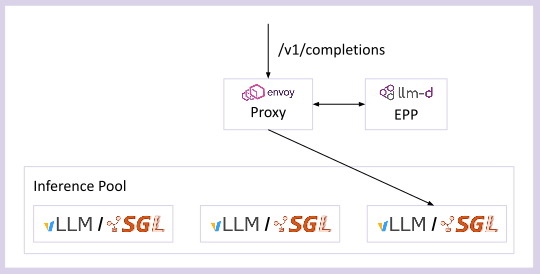

# Introduction to llm-d

llm-d is a high-performance distributed inference serving stack optimized for production deployments on Kubernetes. We help you achieve the fastest "time to state-of-the-art (SOTA) performance" for key OSS large language models across most hardware accelerators and infrastructure providers with well-tested guides and real-world benchmarks.

## Why llm-d

While inference engines like vLLM and SGLang optimize a single accelerator node, llm-d implements distributed performance optimizations, including:

- **Intelligent Inference Scheduling** LLM-aware load balancing to decrease serving latency and increase throughput with prefix-cache aware and utilization-based load balancing, fairness and prioritization for multi-tenant serving

- **Disaggregated Serving** - Reduce time to first token (TTFT) and get more predictable time per output token (TPOT) by splitting inference into prefill servers handling prompts and decode servers handling responses

- **Wide Expert-Parallelism** - Deploy large Mixture-of-Experts (MoE) models like DeepSeek-R1 for much higher throughput for RL and latency-insensitive workloads, using Data Parallelism and Expert Parallelism

- **Tiered KV Prefix Caching with CPU and Storage Offload** - Improve prefix cache hit rate by offloading KV-cache entries to CPU memory, local SSD, and remote high-performance filesystem storage.

- **Workload Autoscaling** - Autoscale multi-model workloads on heterogeneous shared hardware with SLO-aware cost optimization using the Workload Variant Autoscaler or autoscale workloads on homogeneous hardware where each model scales independently using HPA with IGW metrics

llm-d is vendor-neural CNCF sandbox project, supporting multiple inference engines (vLLM, SGLang) and multiple hardware backends (NVIDIA, AMD, Google TPU, Intel HPU).

## Modular Components

llm-d focuses on a modular design, with layered abstractions enabling customization that build on top. 

At it core, llm-d contains the following key layers:

- **Proxy** - Gateway or Standalone Envoy Proxy coupled with an EndPointer Picker extension. It provides optimized routing and load balancing for serving Kubernetes self-hosted generative Artificial Intelligence (AI) workloads.

- **EndPoint Picker (EPP)** - An extendable component that makes selects which endpoint in the `InferencePool` is optimal for an specific inference request. The EPP is the "brains" of the scheduling decision that 

- **InferencePool** - The InferencePool API defines a group of Model Server Pods dedicated to serving AI models. Pods within an `InferencePool` share the same compute configuration, accelerator, and model server.

- **Model Server** - The Model Server (like vLLM or SGLang) runs a model on a particular node. The Model Servers can be deployed through any deployment process, joining an `InferencePool` via standard Kuberentes Labels and Selections.

From these simple primitives and deep co-design with the Model Servers, llm-d can exploit the leading performance optimizations for LLM serving.

## "Well Lit Paths"

In addition to software artifacts associated with each llm-d component, the project also provides "Well-Lit Paths" for key deployment patterns. These "Well-Lit Paths" demonstrate how to compose the components of llm-d to configure and benchmark leading deployment parterns for LLM serving. The "Well-Lit Paths" are intended as starting points to be adapted for production usage.

Each "Well-Lit Paths" includes the following:
* Deployable manifests via Kustomize
* Discussion of key configurations and knobs for performance tuning
* Sample workloads and benchmarks against "naive" setups
* Example monitoring configurationsa

llm-d currently offers the following:
* [add links to each path as we go]