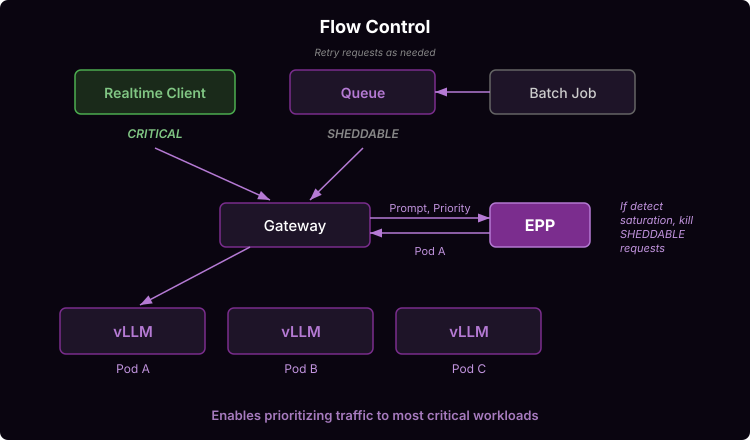

# Flow Control

Flow Control feature enables intelligent request queuing. Request queuing is useful for multiple reasons:

#### Multi-Tenant Deployments

Multi-Tenant deployments have additional considerations beyond a single workload deployment:
* Certain tenants are **higher-priority** than others (e.g. paid vs unpaid)
* Certain requests have **different-SLOs** than others (e.g. batch vs online)
* Certain tenants are more active than others - we want **fairness** between them

Flow control injects queuing logic into the EPP, proving a hook-point to consider these dynamics in scheduling requests. This enables model server operators to mitigate **noisy-neighbor** issues when consolidating high priority and low priority traffic onto the same model server resources.

```
SINGLE TENANT                    MULTI-TENANT
  ─────────────                    ────────────

  [A] ──▶ [ GPUs ]               [A] ╲
                                 [B] ──▶ [ GPUs ]
  [B] ──▶ [ GPUs ]               [C] ╱

  [C] ──▶ [ GPUs ]

  One deployment per customer    One deployment, many customers
```

#### Single Workload "No-Regret" Scheduling

In addition to inter-tenant prioritization, flow control also enables "no-regret" scheduling, holding back requests in the saturation regime until load has reduces on at least one of the model servers. By delaying the scheduling decision until the actual load subsides (rather than immediately dispatching to the model server's waiting queues after which the request can no longer be migrated), the EPP can make a better decision about where to land the request.

```
   ┌───┐  req  ┌──────────────────────────┐         ┌─────────────┐
   │ A │──────▶│   ┌──────────────────┐   │--------▶│ Server 1    │
   └───┘       │   │  Request Queue   │   │         │ [█████] FULL│
               │   │ ░░░░░░░░░░░░░░░  │   │         └─────────────┘
   ┌───┐       │   │  [R][R][R][R][R] │   │         ┌─────────────┐
   │ B │──────▶│   └──────────────────┘   │--------▶│ Server 2    │
   └───┘       │   ─ checks load          │         │ [█████] FULL│
               │   ─ queues reqs if       │         └─────────────┘
   ┌───┐       │     detects saturation   │         ┌─────────────┐
   │ C │──────▶│   ─ releases reqs when   │────────▶│ Server 3    │
   └───┘       │     capacity opens       │         │ [███░░] 60% │
               └──────────────────────────┘         └─────────────┘                         
```               

## Deploy

The well-lit path and manifests will be released shortly.

## Architecture



Requests arrive to the proxy with headers expressing their tenant ID and traffic priority. EPP leverages these headers to assign a `FlowKey` (tuple of `FairnessID` and `Priority`) to each request and maintains separate in-memory queues for each `FlowKey`. Each `FlowKey` is assigned to a `PriorityBand` (for cases when multiple tenants have the same priority).

Then, in each scheduling cycle, the EPP traverses the queues in 3 tiers:
* Priority - the system always services highest `PriorityBand` first
* Fairness - within a `PriorityBand`, the **Fairness Policy** determines which flow (i.e. tenant) is dispatched next
* Ordering - within a flow (i.e. tenant), the **Ordering Policy** determines which request to serve (e.g. FCFC or SLO-aware)

In the background EPP monitors the model servers for saturation. If it detects saturation, requests are queued until saturation subsides.

> [!WARNING]
> **Trust Boundary**: In a production system, allowing end-users to self-assert their tenant ID or traffic priority (`premium-traffic`) is an abuse vector. In production, these headers should be stripped from external requests and injected by an upstream trusted API gateway, identity provider, or Envoy AuthZ filter based on the API key.

## Further Reading

See [Flow Control architecture](../architecture/core/epp/flow-control.md) for full details of the design.