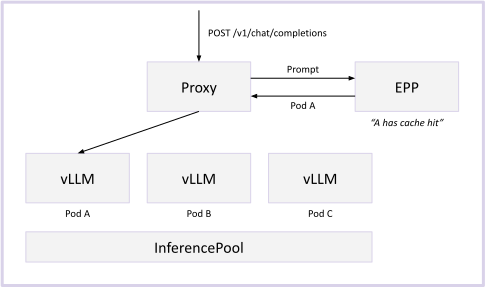
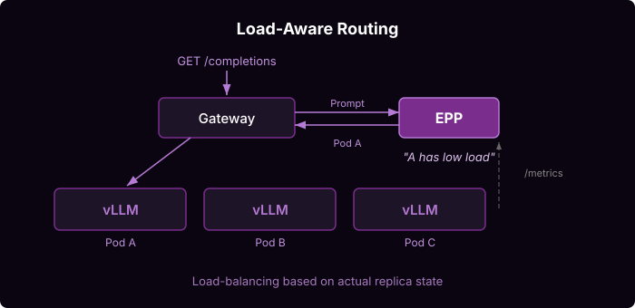

# Intelligent Inference Scheduling

Traditional HTTP requests are fast, uniform, and cheap. Kuberentes Services, which route requests with round-robin or random strategies, balance the load well.

LLM requests break all three assumptions. They are:
* **Multi-turn** - multi-turn conversations and agentic tool loops send the same growing prefix repeatedly
* **Slow** - a single request can take over a minute generating tokens
* **Non-uniform** - a short prompt with a long generation or a RAG prompt with thousands of context tokens and a short answer

llm-d's EPP injects awareness of the LLM-workload into the load-balancing layer considering **prefix-cache affinity** and **realtime server load metrics**.

## Deploy

See the [Intelligent Inference Scheduling guide](https://github.com/llm-d/llm-d/tree/main/guides/inference-scheduling) for step-by-step deployment.

## Architecture

### Prefix-Aware Routing

EPP maintains a approximated view of each pod's prefix-cache state in memory. When a request arrives, it identifies which pod already holds the matching prefix in KV-cache and routes the request there. For multi-turn workloads, this optimization is critical to avoid excessive recomputation in a scale-out setting.

### Load-Aware Routing

EPP continuously probes each pod's metrics via a PodMonitor scraping `/metrics` at 50ms intervals. It scores pods on queue depth, running requests, and KV-cache utilization to route requests to the pod with the lowest load, avoiding hotspots caused by heterogeneous request patterns.

## Futher Reading

See [PD Architecture](../architecture/core/epp/README.md) for more details.