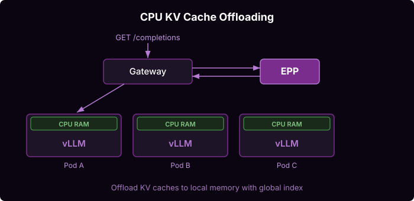
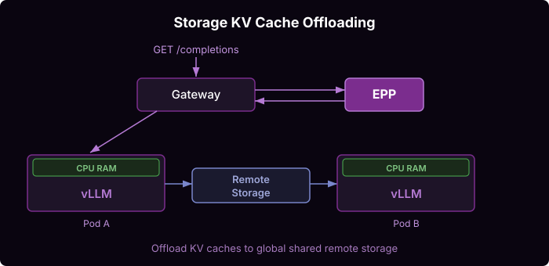

# KV Cache Management

Leverage all system resources to maximize prefix cache hit rate within the cluster.

By default, vLLM keeps KV-caches resident in GPU RAM within a least-recently-used cache. Once space runs out, cached prefixes are evicted and future matching requests must recompute from scratch. GPU nodes have heavily underutilized resources -- an H200 node has far more CPU RAM than GPU HBM, and vLLM barely uses it. Pulling KV-caches from CPU RAM back into GPU memory is much faster than recomputing the entire prompt. CPU offloading should be enabled in nearly every deployment. Storage offloading is more selective -- useful when the working set exceeds GPU + CPU capacity or when newly scaled pods need immediate cache access.

## Architecture

### CPU KV Cache Offloading

vLLM pods are configured with `OffloadingConnector` and increased CPU memory requests (e.g., 400 GB). Evicted KV-cache blocks move to host CPU memory instead of being discarded, extending the effective cache size with negligible overhead. The EPP maintains a global index of which blocks exist on which pods and tiers, adding a second `prefix-cache-scorer` plugin for CPU-tier blocks with manually configured LRU capacity (`lruCapacityPerServer`), since vLLM does not emit CPU-tier metrics. The scoring profile weights GPU and CPU cache scorers separately (2:2:1:1 for queue-depth, kv-cache-utilization, GPU-cache, CPU-cache).

### Storage KV Cache Offloading

vLLM pods mount a ReadWriteMany PVC backed by shared storage (Lustre, CephFS, or similar) at `/mnt/files-storage`. The `OffloadingConnector` is configured with a custom backend module (`llmd_fs_backend.spec`) that handles async I/O with GPU DMA transfers. This enables cross-pod cache sharing -- newly scaled pods can read existing cache immediately -- persistence across pod restarts, and capacity limited only by storage system size.

## Guide

See the [KV Cache Management guide](https://github.com/llm-d/llm-d/tree/main/guides/tiered-prefix-cache) for step-by-step deployment.
