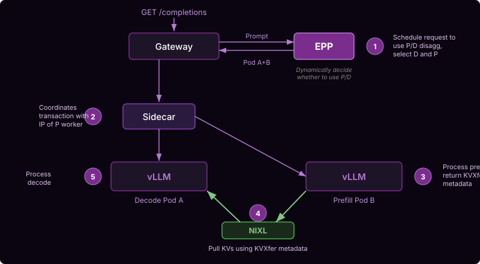

# P/D Disaggregation

LLM inference has two computationally distinct phases:
* **Prefill** processes the entire input prompt in a single forward pass -- it is compute-bound, bottlenecked by the GPU flops available.
* **Decode** generates output tokens one at a time from the KV-cache -- it is memory-bandwidth-bound, bottlenecked by how fast data moves from HBM to on-chip memory.

For long context workloads (10:1 ISL:OSL ratio) and medium-to-large models, separating prefill and decode into separate instances can enable:
* Improved throughput via specialization or prefill and decode
* Improved quality of service, as long context prefills will not block decode work

> [!IMPORTANT]
> llm-d supports TCP-based transfer for experimentation, but
> HPC networking (e.g. Infiniband, RoCE, or EFA) is **highly**
> recommended for production usage

llm-d's EPP natively supports the concept of prefill/decode disaggregation, enabling composition with other scorers (e.g. prefix-aware routing).

## Architecture

The deployment creates two separate model server pools as independent Deployments. The **prefill pool** (default: 4 replicas, TP=1) runs a single vLLM container optimized for compute throughput. The **decode pool** (default: 1 replica, TP=4) runs two containers per pod: the vLLM engine on port 8200 and a **routing sidecar** on port 8000 that coordinates the P/D transaction.

1. **EPP schedules the request** -- dynamically decides whether to use P/D disaggregation based on uncached token count (`prefix-based-pd-decider` plugin), and selects the decode and prefill workers.
2. **Sidecar coordinates the transaction** -- the decode pod's sidecar receives the request from Gateway and forwards it to the selected prefill worker with the prefill worker's IP.
3. **Prefill processes the prompt** -- runs the forward pass, produces the KV-cache, and returns KV transfer metadata (block IDs and memory locations).
4. **NIXL pulls the KV-cache** -- GPU-direct RDMA transfer of KV blocks directly from the prefill pod's GPU memory to the decode pod's GPU memory via NIXL on port 5600 -- zero-copy, without kernel involvement. Both pools request RDMA resources (`rdma/ib: 1`).
5. **Decode generates tokens** -- with the KV-cache now local, the decode pod generates output tokens autoregressively.

## Guide

See the [P/D Disaggregation guide](https://github.com/llm-d/llm-d/tree/main/guides/pd-disaggregation) for step-by-step deployment.
