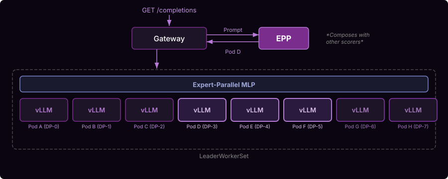

# Multi-Node Wide Expert Parallelism

llm-d's Kubernetes-native design composes the DP/EP implementation with the rest of the llm-d system.

A key trend in 2025 has been the shift from dense models like Llama 3 towards sparse Mixture-of-Experts models like DeepSeek-R1, Qwen 3, and Llama 4. In the MLP layer, each token is routed to a subset of N experts rather than passing through a single feed-forward network. Rather than Tensor Parallelism -- which shards every layer and whose communication overhead grows with node count -- MoE models can use **Data Parallel (DP) attention** where each request is processed independently on one rank with its own KV-cache, combined with **Expert Parallelism (EP)** where each expert is placed on a different rank. A sparse dispatch operation sends each token to the rank holding its routed expert; after computation, a combine operation returns it to the original DP rank. These sparse collective operations scale efficiently to multi-node deployments -- DeepSeek deploys R1 over 20 nodes with EP-144 in decode.

## Architecture

The deployment uses **LeaderWorkerSet** (LWS) instead of standard Deployments to manage multi-node pod groups. Each LWS creates a pod group with a leader and workers -- the leader coordinates the distributed collective via `LWS_LEADER_ADDRESS`, and workers join using that address. vLLM pods run with `--enable-expert-parallel`, `--data-parallel-size` (total DP ranks across all pods), `--data-parallel-size-local` (ranks per pod, typically matching GPU count), and `--data-parallel-hybrid-lb` for external load balancing across nodes.

Expert communication uses the **DeepEP** backend over NVSHMEM with GPU-initiated RDMA (`ibgda` transport), requiring full-mesh InfiniBand/RoCE connectivity. Wide EP is commonly deployed with P/D disaggregation as separate LeaderWorkerSets -- prefill uses `deepep_high_throughput` all-to-all backend; decode uses `deepep_low_latency`. Key optimizations include `--enable-dbo` (dual batch overlap) to hide collective latency by overlapping it with computation, and `--enable-eplb` (expert-parallel load balancing) to replicate popular experts across ranks.

The EPP routes requests to the LeaderWorkerSet and composes with prefix-cache-aware routing, load-aware routing, and other scorers.

## Guide

See the [Wide Expert Parallelism guide](https://github.com/llm-d/llm-d/tree/main/guides/wide-ep-lws) for step-by-step deployment.
