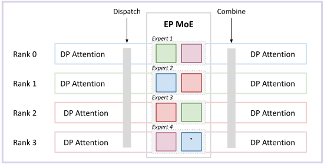
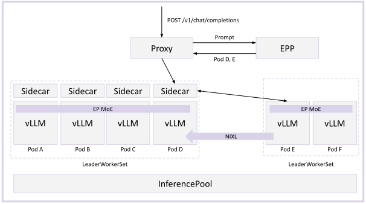

# Multi-Node Wide Expert Parallelism

Very large MoE models like DeepSeek-R1 can consume 500GB+ of RAM just to hold the weights of the model, pressuring KV cache space for long context and high throughput serving. This problem is especially magnified for models with MLA attention, which replicates the KV cache when sharded with tensor parallelism.

To address these issues, model servers like vLLM and SGLang support DP/EP deployments, which deploys the attention layers with data parallelism and the expert layers with expert parallelism. This deployment pattern enables scaling the KV cache space, as the pattern:
* Scales to multiple nodes - the key collective operations (dispatch/combine) are **sparse** - tokens are only sent to the expert rank after rtouting. The sparse collectives consume much less bandwidth than the all-reduces used in TP deplooyments, making them suitable to run over slower interconnects (IB, RoCE rather than NVLink)
* No KV cache replication - since every attention layer is deployed at TP=1, there is only one copy of each tokens's KV

> [!IMPORTANT]
> Expert communication uses the **DeepEP** backend over NVSHMEM with GPU-initiated RDMA (`ibgda` transport), requiring full-mesh InfiniBand/RoCE connectivity. 

## Deploy

See the [Wide Expert Parallelism guide](https://github.com/llm-d/llm-d/tree/main/guides/wide-ep-lws) for manifests and step-by-step deployment.

## Architecture

Multi-node "WideEP" deployments are typically combined with disaggregated serving because:
* Disaggregatation avoids "bubbles" where Rank N is computing a prefill and Rank M is computing a decode
* Specialized kernels for prefill and decode can be used (e.g. DeepEP HT vs DeepEP LL)

As a result, we leverage the following design for the deployment:
* Disaggregated prefill and decode via llm-d's EPP
* `LeaderWorkerSet` to manage multi-node pod groups (scheduling a single logical vLLM instance over multiple node)
* DP/EP deployment configuration in vLLM

The request flow works as follows:

The deployment uses **LeaderWorkerSet** (LWS) instead of standard Deployments to manage multi-node pod groups. Each LWS creates a pod group with a leader and workers -- the leader coordinates the distributed collective via `LWS_LEADER_ADDRESS`, and workers join using that address. vLLM pods run with `--enable-expert-parallel`, `--data-parallel-size` (total DP ranks across all pods), `--data-parallel-size-local` (ranks per pod, typically matching GPU count), and `--data-parallel-hybrid-lb` for external load balancing across nodes.

Expert communication uses the **DeepEP** backend over NVSHMEM with GPU-initiated RDMA (`ibgda` transport), requiring full-mesh InfiniBand/RoCE connectivity. Wide EP is commonly deployed with P/D disaggregation as separate LeaderWorkerSets -- prefill uses `deepep_high_throughput` all-to-all backend; decode uses `deepep_low_latency`. Key optimizations include `--enable-dbo` (dual batch overlap) to hide collective latency by overlapping it with computation, and `--enable-eplb` (expert-parallel load balancing) to replicate popular experts across ranks.

The EPP routes requests to the LeaderWorkerSet and composes with prefix-cache-aware routing, load-aware routing, and other scorers.

