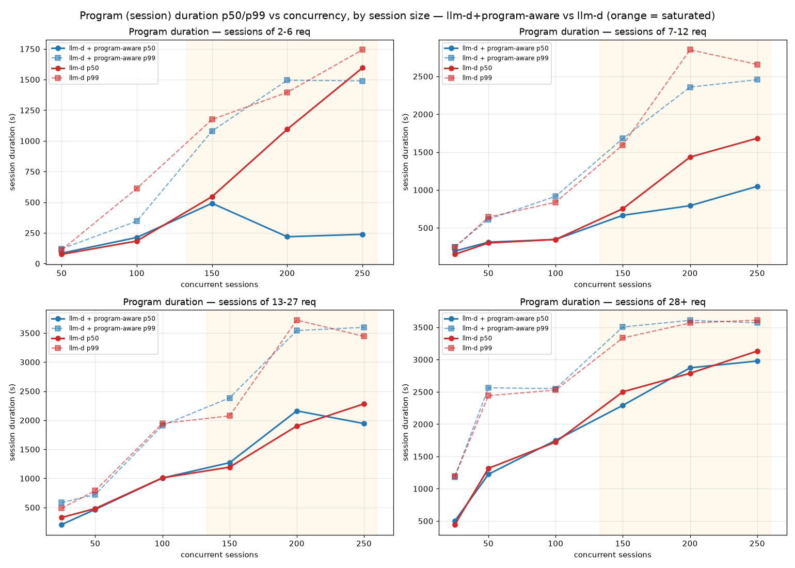
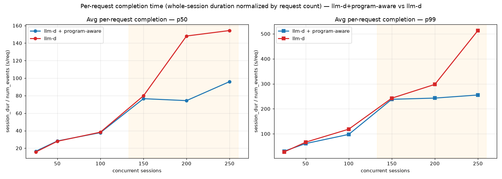
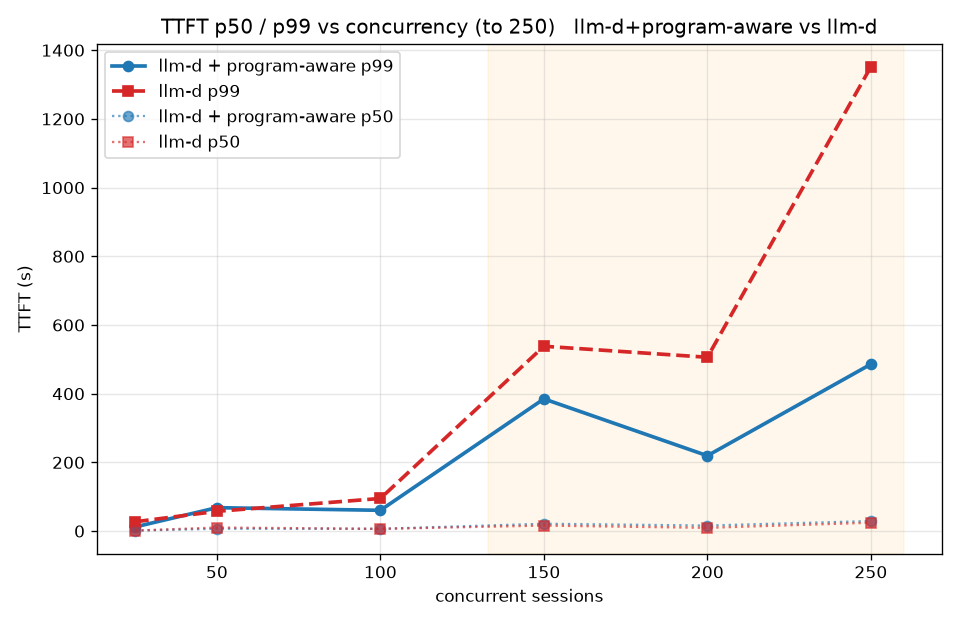

# Agentic Code Generation — Program-Aware Fairness (Nemotron-3-Super-120B on GPU)

This guide deploys the agentic code-generation workload with **program-aware, per-session fairness
scheduling** and benchmarks it, across a concurrency sweep, against the *same* optimized deployment
with fairness turned off. The result: when the model server saturates, program-aware scheduling stops
short agent sessions from being starved behind long, greedy ones — with no cost to throughput or
completion.

## Overview

Agentic coding clients (Claude Code, opencode, Codex) open **many concurrent, bursty sessions**, each
issuing many requests. When the server saturates, a few heavy sessions monopolize it and starve the
rest — a short 3-request session ends up waiting behind a 100-request one in the engine's FIFO. This
guide deploys [nvidia/NVIDIA-Nemotron-3-Super-120B-A12B-FP8](https://huggingface.co/nvidia/NVIDIA-Nemotron-3-Super-120B-A12B-FP8)
as a **single instance (TP=4)** and adds three llm-d scheduler plugins on top of the standard router:

- **`agent-identity`** — derives a per-session `FairnessID` from the client's session header
  (`x-claude-code-session-id` / Claude Code, `x-session-affinity` / opencode, `session-id` / Codex),
  so the router can tell sessions apart.
  ([plugin README](https://github.com/llm-d/llm-d-inference-scheduler/blob/main/pkg/epp/framework/plugins/requestcontrol/requestheader/agentidentity/README.md))
- **`program-aware-fairness`** (LAS: Least-Attained-Service) — a flow-control policy that gives each
  session its own queue and prioritizes sessions that have received *less* cumulative service, so
  bursty sessions cannot starve concurrent ones.
  ([plugin README](https://github.com/llm-d/llm-d-inference-scheduler/blob/main/pkg/epp/framework/plugins/flowcontrol/fairness/program-aware/README.md))
- **`concurrency-detector`** — the flow-control **saturation detector** (`maxConcurrency: 133`, just
  above the model's `--max-num-seqs=128`). It tells the flow controller when the pool is full so LAS
  admits requests only while there is a real backlog to arbitrate; without it the default
  utilization-detector throttles dispatch to zero under this load.

The deployment is evaluated as an **A/B on identical topology and workload** — only the router config
differs: the [program-aware router](router/agentic-serving-gpu-program-aware.values.yaml) (fairness
on) vs a **No-Fairness baseline** — the same router with the `agent-identity`,
`program-aware-fairness`, and `flowControl` plugins removed, applied as a deploy-time override (§1). Both replay real multi-turn agent sessions from
[`Exgentic/agent-llm-traces`](https://huggingface.co/datasets/Exgentic/agent-llm-traces) via
[`benchmark-templates/otel-trace-replay.yaml`](benchmark-templates/otel-trace-replay.yaml),
which sweeps concurrency from 25 → 250.

> This deployment uses the **released** endpoint-picker image
> `ghcr.io/llm-d/llm-d-router-endpoint-picker:v0.9.0` (pulled by the `llm-d-router-standalone` v0.9.0
> chart) — the `agent-identity`, and `program-aware-fairness` plugins all ship in that release.

## Default Configuration

| Parameter          | Value                                                                                                    |
| ------------------ | -------------------------------------------------------------------------------------------------------- |
| Model              | [nvidia/NVIDIA-Nemotron-3-Super-120B-A12B-FP8](https://huggingface.co/nvidia/NVIDIA-Nemotron-3-Super-120B-A12B-FP8) |
| Accelerator        | NVIDIA GPU (4 GPUs total)                                                                                 |
| Serving topology   | Single instance                                                                                          |
| TP size            | TP=4, expert-parallel (MoE, ~12B active)                                                                 |
| Max context        | 262,144 tokens                                                                                           |
| Max batch          | `--max-num-seqs=128`                                                                                     |
| KV cache           | FP8-quantized                                                                                            |
| Fairness           | `agent-identity` + `program-aware-fairness` (LAS) + `concurrency-detector` (maxConcurrency 133)          |
| Workload           | Exgentic agent traces — concurrency sweep 25 → 250 sessions                                              |

### Supported Hardware Backends

| Backend           | Directory                              | Notes                       |
| ----------------- | -------------------------------------- | --------------------------- |
| NVIDIA GPU (vLLM) | `modelserver/gpu/vllm/nemotron-3-super/` | 1× GPU, single instance TP=4 |

## Prerequisites

- Installed client tools (`kubectl`, `helm`).
- Set environment variables:
  ```bash
  export REPO_ROOT=$(realpath $(git rev-parse --show-toplevel))
  source ${REPO_ROOT}/guides/env.sh
  export GUIDE_NAME="agentic-serving"
  export NAMESPACE=llm-d-agentic-serving
  ```
- Install the Gateway API Inference Extension CRDs:
  ```bash
  kubectl apply -f https://github.com/kubernetes-sigs/gateway-api-inference-extension/releases/download/${GAIE_VERSION}/v1-manifests.yaml
  ```
- Create the namespace:
  ```bash
  kubectl create namespace ${NAMESPACE} --dry-run=client -o yaml | kubectl apply -f -
  ```
- [Create the `llm-d-hf-token` secret with key `HF_TOKEN`](../../helpers/hf-token.md):
<!-- llm-d-cicd:skip start -->
  ```bash
  export HF_TOKEN=<your HuggingFace token>
  kubectl create secret generic llm-d-hf-token \
    --from-literal="HF_TOKEN=${HF_TOKEN}" \
    --namespace "${NAMESPACE}" --dry-run=client -o yaml | kubectl apply -f -
  ```
<!-- llm-d-cicd:skip end -->

## Installation Instructions

### 1. Deploy the llm-d Router (program-aware fairness)

Install the router with the **program-aware** values, which add `agent-identity`,
`program-aware-fairness` (LAS), and the `concurrency-detector` saturation detector on top of the
standard scoring profile:

```bash
helm install ${GUIDE_NAME} \
    ${ROUTER_STANDALONE_CHART} \
    -f ${REPO_ROOT}/guides/recipes/router/base.values.yaml \
    -f ${REPO_ROOT}/guides/${GUIDE_NAME}/router/agentic-serving-gpu-program-aware.values.yaml \
    -n ${NAMESPACE} --version ${ROUTER_CHART_VERSION}
```

> **No-Fairness baseline arm.** There is no separate baseline values file. To run it, copy
> `router/agentic-serving-gpu-program-aware.values.yaml` to a local file and **delete these entries
> from the EPP plugins block**, then `helm install`/`upgrade -i` with that copy in place of the
> program-aware values above:
>
> - `- type: agent-identity`
> - `- type: concurrency-detector` (with its `parameters:` / `maxConcurrency`)
> - `- type: program-aware-fairness`
> - the whole `featureGates:` block (the `- flowControl` gate)
> - the whole `flowControl:` block (`saturationDetector` + `defaultPriorityBand`)
>
> Everything else stays as-is. What remains is the three scorers — `queue-scorer`,
> `kv-cache-utilization-scorer`, `prefix-cache-scorer` — under the default `schedulingProfiles`: pure
> scheduler scoring, no `agent-identity`, and no per-session flow control.

### 2. Deploy the Model Server (GPUs)

Apply the Kustomize overlay for the Nemotron-3-Super-120B deployment:

```bash
kubectl apply -n ${NAMESPACE} -k ${REPO_ROOT}/guides/${GUIDE_NAME}/modelserver/gpu/vllm/nemotron-3-super/
```

This deploys a single instance (TP=4, `--max-num-seqs=128`). Model load is large; the startup probe
allows up to an hour:

```bash
kubectl rollout status deployment/agentic-serving-gpu-vllm-decode -n ${NAMESPACE}
```

## Verification

### 1. Get the IP of the Proxy

```bash
export IP=$(kubectl get service ${GUIDE_NAME}-epp -n ${NAMESPACE} -o jsonpath='{.spec.clusterIP}')
```

### 2. Send Test Requests

Open a temporary interactive shell inside the cluster:

```bash
kubectl run curl-debug --rm -it \
    --image=cfmanteiga/alpine-bash-curl-jq \
    --env="IP=$IP" \
    --env="NAMESPACE=$NAMESPACE" \
    -- /bin/bash
```

Send a completion request:

```bash
curl -X POST http://${IP}/v1/completions \
    -H 'Content-Type: application/json' \
    -d '{
        "model": "nvidia/NVIDIA-Nemotron-3-Super-120B-A12B-FP8",
        "prompt": "Explain how a simple agent loop works in 3 sentences."
    }' | jq
```

### 3. Confirm Per-Session Fairness Queues

On the **program-aware** arm only, the flow controller creates one queue per session. While traffic
flows, check the EPP metrics endpoint — the count should approach the number of concurrent sessions
(one distinct `fairness_id` per agent session):

```bash
kubectl port-forward -n ${NAMESPACE} deploy/${GUIDE_NAME}-epp 9090:9090 &
curl -s localhost:9090/metrics | grep -cE 'flow_control_queue_size\{'
```

## Driving It with a Coding Agent

This deployment ships ready-to-use client configs for two coding agents, both pre-pointed at the
served model. First, port-forward the router's OpenAI-compatible endpoint to `localhost:8000`
(the EPP service exposes it on port `80`):

```bash
kubectl port-forward -n ${NAMESPACE} service/${GUIDE_NAME}-epp 8000:80
```

**[Claude Code](https://claude.com/product/claude-code)** — source the environment file
([`claude.env`](modelserver/gpu/vllm/nemotron-3-super/claude.env)) and launch:

```bash
# from the guide directory: guides/agentic-serving
source $(pwd)/modelserver/gpu/vllm/nemotron-3-super/claude.env && claude
```

**[opencode](https://opencode.ai/docs/)** — point `OPENCODE_CONFIG` at the provided config
([`opencode.json`](modelserver/gpu/vllm/nemotron-3-super/opencode.json)) and launch:

```bash
# from the guide directory: guides/agentic-serving
OPENCODE_CONFIG="$(pwd)/modelserver/gpu/vllm/nemotron-3-super/opencode.json" opencode
```

The `agent-identity` plugin reads the per-session header each client sends
(`x-claude-code-session-id` for Claude Code, `x-session-affinity` for opencode), so every agent
session is scheduled on its own fairness queue.

## Benchmarking

This deployment ships its own `inference-perf` preset (defined in
[`benchmark-templates/otel-trace-replay.yaml`](benchmark-templates/otel-trace-replay.yaml)).
Unlike a synthetic load, it **replays real multi-turn agent traces** (program structure + tool-call
timing) from [`Exgentic/agent-llm-traces`](https://huggingface.co/datasets/Exgentic/agent-llm-traces),
carrying per-session identity headers so the fairness stack is exercised end-to-end. It runs a
**concurrency sweep** — each stage is one point on the curve, using the same deterministic session
slice for both arms:

| Workload Characteristic | Value | Description |
| :--- | :--- | :--- |
| **Dataset** | `Exgentic/agent-llm-traces` | Real multi-turn agentic coding sessions. |
| **Concurrency sweep** | 25 / 50 / 100 / 150 / 200 / 250 | One stage per point; `num_sessions = concurrency`. |
| **Seed** | `base_seed=42` | Deterministic — each arm sees the identical session slice per point. |
| **Session rate** | 2.5 – 10 sessions/s | Gentle ramp-in to each stage's concurrency. |
| **Max output tokens** | 25,000 (per request) | With `max_sequence_length` 262,144. |
| **Request timeout** | 1800 s | Long, to accommodate large agentic turns. |
| **Session id header** | `x-claude-code-session-id` | Per-session identity the `agent-identity` plugin reads. |

> The `otel_trace_replay` datagen and `trace_session_replay` loadgen (with
> `bad_tool_call_handling: use_recorded`) are in upstream
> [`kubernetes-sigs/inference-perf`](https://github.com/kubernetes-sigs/inference-perf); run the
> workload with the official image `quay.io/inference-perf/inference-perf:latest` (pin to a digest for
> reproducible runs).

### 1. Prepare the Benchmarking Suite

- Download the benchmark script:

  ```bash
  curl -L -O https://raw.githubusercontent.com/llm-d/llm-d-benchmark/main/existing_stack/run_only.sh
  chmod u+x run_only.sh
  ```

- Prepare the HuggingFace token secret `llm-d-hf-token` in the namespace (see Prerequisites).

### 2. Download the Workload Template

```bash
curl -LJO "https://raw.githubusercontent.com/llm-d/llm-d/main/guides/${GUIDE_NAME}/benchmark-templates/otel-trace-replay.yaml"
```

### 3. Execute Benchmark

Resolve the endpoint, render the template, and run. Execute **once per router arm** (program-aware,
then baseline) to compare; each run sweeps all concurrency points in one job:

```bash
export IP=$(kubectl get service ${GUIDE_NAME}-epp -n ${NAMESPACE} -o jsonpath='{.spec.clusterIP}')
envsubst < otel-trace-replay.yaml > config.yaml
./run_only.sh -c config.yaml -o ./results
```

To run the other arm, `helm upgrade -i ${GUIDE_NAME}` with the No-Fairness values from §1 (or back to
the plain program-aware install), let the model server flush, and re-run.

## Benchmark Results

Concurrency sweep of **llm-d + program-aware** vs **llm-d** (fairness off) on the identical
single-instance TP=4 deployment (`--max-num-seqs=128`, `concurrency-detector maxConcurrency: 133`),
replaying `Exgentic/agent-llm-traces`. Only the router config differs between the two curves.

### Fairness engages only once the server saturates

The EPP flow-control queue stays **empty until in-flight requests exceed the ~133 admission
threshold**. Below that, program-aware is a pass-through and the two arms are identical; the queue —
and the fairness benefit — grow with concurrency:

| Concurrent sessions | Peak EPP queue depth | Regime |
| ---: | ---: | :--- |
| 25 / 50 / 100 | 0 | below threshold — no queuing, arms identical |
| 150 | ~30 | intermittent saturation |
| 200 | 128 | steady saturation |
| 250 | 224 | deep saturation — largest fairness effect |

At the deepest point (c=250), **completion, throughput, mean session time, and the request tail all
favor program-aware**, with the only cost being a slightly higher *median* TTFT:

| Metric @ c=250 | llm-d + program-aware | llm-d | Δ |
| :--- | ---: | ---: | :--- |
| Throughput (req/s) | 1.17 | 1.12 | +4% |
| Program (session) duration — mean | 1738 s | 2207 s | **−21%** |
| **TTFT p99** | 486 s | 1352 s | **2.8× faster** |
| **E2E p99** | 748 s | 1352 s | **1.8× faster** |

### Who benefits: short sessions stop waiting behind long ones

Splitting session duration by session size (request count) reveals the mechanism — this is textbook Least-Attained-Service:



At saturation, **short sessions (2–6 requests) finish up to 6.7× faster** under program-aware — their
median stays ~240 s at c=250 while under baseline llm-d they wait **~1600 s**, stuck behind the elephant sessions in the engine FIFO. **Long sessions (28+ requests) pay a negligible price** (they have already consumed the most service, so LAS de-prioritizes them). The aggregate "−21% mean session time" is almost
entirely short sessions being rescued from starvation — not a uniform speedup.

The same effect, normalized per request (whole-session time ÷ request count):



### The request-tail tradeoff



Program-aware makes the **median TTFT slightly worse** (head-of-line sessions wait a touch) in exchange for a **far better tail** — TTFT p99 is ~2.3× lower at c=200 and ~2.8× lower at c=250. Baseline llm-d runs with `flowControl` **off**: there are no EPP queues, so contention collapses into vLLM's single FIFO, letting a few sessions monopolize the server and dragging out everyone else's tail.

### Caveats

- **No effect below saturation.** At c ≤ 100 the EPP queue is empty, so the two arms are statistically identical — program-aware neither helps nor hurts. It activates only under real contention.

## Cleanup

```bash
helm uninstall ${GUIDE_NAME} -n ${NAMESPACE}
kubectl delete -n ${NAMESPACE} -k ${REPO_ROOT}/guides/${GUIDE_NAME}/modelserver/gpu/vllm/nemotron-3-super/
kubectl delete namespace ${NAMESPACE}
```
