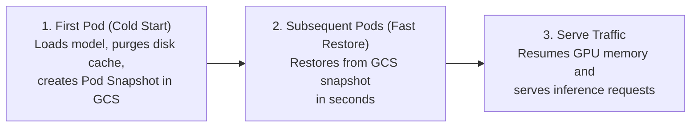

# GKE Pod Snapshots for Single-GPU Model Servers

## Overview

Deploying large language models (LLMs) on Kubernetes often incurs multi-minute cold starts due to downloading model weights from HuggingFace and loading them into memory.

This guide demonstrates how to use **GKE Pod Snapshots** with **GKE Sandbox (gVisor)** to checkpoint and restore a **single-GPU** vLLM model server (e.g., an NVIDIA H100 80GB GPU serving `Qwen/Qwen3-32B`).

### How It Works

When launched with `python3 -m docker.scripts.snapshot.launcher`, the snapshot launcher orchestrates the checkpoint and restore lifecycle automatically:



1. **First Pod (Cold Start & Snapshot Creation):** The initial replica loads the model weights (~64 GB for `Qwen/Qwen3-32B`), calls `engine.sleep(level=1)` to release physical GPU memory, purges the on-disk weight cache so the same bytes are not also captured from the container filesystem, and triggers a GKE Pod Snapshot uploaded to Google Cloud Storage (GCS).
2. **Subsequent Pods (Fast Restoration):** When pods scale out or restart, GKE automatically restores the container from the GCS snapshot in seconds—bypassing model weight downloads and engine initialization.
3. **Serve Traffic:** The restored pod immediately wakes up GPU memory and begins serving inference requests.

> [!IMPORTANT]
> **The snapshot is roughly the size of the model, not a few gigabytes.** `engine.sleep(level=1)` frees *device* memory by offloading weights to host RAM; it does not discard them. A whole-pod snapshot captures that host RAM, so the GCS artifact scales with the model's memory footprint rather than with the purged disk cache. Size the node's memory to hold the offloaded weights alongside the running process, and budget GCS storage and egress accordingly.

---

## Single-GPU Scope & Technical Caveats

1. **Single-GPU / Single-Rank Scope:**
   The snapshot launcher is designed for single-GPU / single-pod deployments (`nvidia.com/gpu: 1`). Multi-node / multi-rank distributed barrier coordination across pods during checkpointing is not supported.
2. **Sleep Mode Must Be Enabled (`--enable-sleep-mode`):**
   vLLM only routes weight allocations through `CuMemAllocator` when sleep mode is enabled at engine construction. Without this flag `engine.sleep(level=1)` still returns successfully but frees nothing, and the snapshot is taken with the GPU fully resident. This is a silent failure — confirm the sleep step reports a non-zero amount of freed GPU memory in the pod logs.
3. **Eager Safetensors Loading (`--safetensors-load-strategy eager`):**
   By default, `safetensors` uses `mmap` to memory-map weight files directly from disk. Because `MODEL_CACHE_DIR` is purged before the checkpoint is taken, memory-mapped file descriptors would become invalid. Passing `--safetensors-load-strategy eager` forces vLLM to copy weights directly into RAM so disk caches can be safely purged.
4. **Workload-Triggered Policy:**
   The GKE `PodSnapshotPolicy` sets `spec.triggerConfig.type: workload` (with `postCheckpoint: resume`). If set to `manual`, GKE ignores container-initiated writes to `/proc/gvisor/checkpoint`.
5. **Restores Are Environment-Specific:**
   GKE will only restore a snapshot onto a node matching the one that produced it — same machine series and CPU architecture, same GPU driver version, and same gVisor kernel version — and only for a pod whose distilled spec hash is unchanged. Upgrading a node pool or editing the container image, command, args, or environment variables invalidates existing snapshots, and the next pod silently cold-starts instead.
6. **gVisor Localhost Isolation:**
   Inside gVisor sandboxes, direct `kubectl port-forward pod/<pod-name>` does not route to `localhost` inside the sandbox due to network stack isolation. Connectivity should be tested via a Kubernetes `Service` or an in-cluster test pod.
7. **Hierarchical Namespace GCS Buckets:**
   GKE Pod Snapshots require a GCS bucket created with hierarchical namespace enabled (`--enable-hierarchical-namespace`).
8. **Cloud Storage FUSE CSI Driver Is Unsupported:**
   Pods using the Cloud Storage FUSE CSI sidecar cannot be snapshotted. Model weights must be downloaded to the container filesystem, as this guide does, rather than mounted from a bucket.

---

## Configuration

### Snapshot Variables

These are **container** environment variables read by [`docker/scripts/snapshot`](../../docker/scripts/snapshot). They are set on the pod by the deployment overlay, not exported in your shell. The `Default` column is the behavior when the variable is absent from the container.

| Variable | Description | Default | Set by `gke/` overlay |
| :--- | :--- | :--- | :--- |
| `SNAPSHOT_PROVIDER` | Snapshot provider backend. Selects the implementation in `providers.py`; any unrecognized value disables snapshotting. | `""` (disabled) | `gke_gvisor` |
| `MODEL_CACHE_DIR` | Local model weight cache directory purged before triggering the checkpoint, so the on-disk copy of the weights is not captured in addition to the in-memory one. Unset means no purge. | `""` (no purge) | `~/.cache/huggingface/hub` |

> [!NOTE]
> `SNAPSHOT_PROVIDER` is fixed per overlay rather than templated, because it must agree with the manifests deployed alongside it — the `gke/` overlay applies `podsnapshot.gke.io` resources that only the `gke_gvisor` provider acts on. Support for an additional backend would be added as a sibling overlay directory.

### gVisor & NCCL Compatibility Settings

Inside gVisor sandboxes, certain hardware and kernel primitives (P2P GPU memory access, host-level POSIX shared memory, external network probing) are restricted. The deployment overlay injects the following environment variables, most of them carried over from the reference pod this guide was derived from:

| Variable | Value | Purpose |
| :--- | :---: | :--- |
| `NCCL_P2P_DISABLE` | `1` | Disables GPU peer-to-peer communication, which is unsupported in gVisor. |
| `NCCL_SHM_DISABLE` | `1` | Disables host POSIX shared memory transport for NCCL to avoid sandbox permission errors. |
| `NCCL_SOCKET_IFNAME` | `lo` | Binds NCCL communication to the local loopback interface. |
| `GLOO_SOCKET_IFNAME` | `lo` | Binds Gloo communication to the local loopback interface. |
| `VLLM_HOST_IP` | `127.0.0.1` | Keeps vLLM from probing external interfaces to discover its own address. |
| `MASTER_ADDR` / `MASTER_PORT` | `127.0.0.1` / `29500` | Torch distributed rendezvous address for the single rank. |
| `TORCH_NCCL_ENABLE_MONITORING` | `0` | Asks PyTorch to skip its NCCL watchdog threads, which could otherwise fire while the sandbox is frozen. |
| `TORCH_NCCL_ASYNC_ERROR_HANDLING` | `0` | Disables asynchronous error handling threads during checkpointing. |
| `NCCL_TUNER_PLUGIN` / `NCCL_NET_PLUGIN` | `none` / `""` | Disables GKE's injected NCCL plugins, applied by the shared `disable-gke-nccl-tuner-patch` component as in the other GKE overlays. |

> [!NOTE]
> Several of these are inert in this single-GPU configuration and are kept only for parity with the known-good reference pod. At `world_size=1` vLLM selects its own rendezvous port rather than honoring `MASTER_PORT`, the `NCCL_P2P`/`SHM_DISABLE` flags gate transports a single rank never establishes, and the PyTorch NCCL watchdog threads were observed to start regardless of `TORCH_NCCL_ENABLE_MONITORING`. Revisit once a snapshot completes successfully and there is a passing baseline to compare against.

---

## Prerequisites

### GKE: Cluster Pre-provisioning (with Pod Snapshots & GKE Sandbox)

Before running this guide, make sure your GKE cluster, GPU node pool, and GCS storage bucket are configured.

> [!NOTE]
> Replace `<PROJECT_ID>`, `<REGION>`, `<ZONE>`, `<CLUSTER_NAME>`, `<NODE_POOL_NAME>`, `<GPU_MACHINE_TYPE>`, `<GPU_ACCELERATOR>`, `<DISK_SIZE>`, `<GCS_BUCKET>`, and `<NAMESPACE>` (default: `llm-d-gke-pod-snapshots`) below to match your target environment:
>
> - **GPU Machine Family & Accelerator (`<GPU_MACHINE_TYPE>`, `<GPU_ACCELERATOR>`):** See [Choose a GPU machine type on GKE](https://cloud.google.com/kubernetes-engine/docs/concepts/gpus#gpu_machine_types) and [GPU availability by region and zone](https://cloud.google.com/compute/docs/gpus/gpu-regions-zones) (for example, `--machine-type=a3-highgpu-1g` with `--accelerator=type=nvidia-h100-80gb,count=1,gpu-driver-version=latest` for `Qwen/Qwen3-32B`).
> - **Node Locations (`<ZONE>`):** GPU machine types are typically available in only a subset of a region's zones, and `--num-nodes` is applied *per zone* on a regional node pool. Pinning the pool to a single zone with `--node-locations` avoids failures in zones that lack the machine type and keeps this single-GPU guide at exactly one GPU node. Confirm your choice with `gcloud compute machine-types list --filter="name=<GPU_MACHINE_TYPE> AND zone~<REGION>" --format="value(zone)"`.
> - **Boot Disk Size (`<DISK_SIZE>`):** The node's boot disk must accommodate the container image, temporary model weights downloaded to disk during cold start (before `MODEL_CACHE_DIR` is purged), and local snapshot staging files prior to GCS upload (for example, `200GB`). See [GKE Custom Boot Disks](https://cloud.google.com/kubernetes-engine/docs/how-to/custom-boot-disks) and [GKE Pod Snapshots node pool requirements](https://cloud.google.com/kubernetes-engine/docs/how-to/pod-snapshots#create-node-pool).
> - **Default Node Pool:** The router's endpoint picker runs its EPP and Envoy sidecar containers in one pod, requesting **8 vCPU and 16 GiB in total**. GKE's default `e2-medium` pool cannot fit that, and the pod sits `Pending` forever with no error on the deploy command. The cluster below therefore requests a pool that can hold it.

1. **Create a GKE Cluster with Pod Snapshots & Workload Identity:**

   ```bash
   gcloud container clusters create "<CLUSTER_NAME>" \
     --region="<REGION>" \
     --node-locations="<ZONE>" \
     --machine-type=e2-standard-16 \
     --num-nodes=1 \
     --release-channel=rapid \
     --workload-pool="<PROJECT_ID>.svc.id.goog" \
     --enable-pod-snapshots
   ```

2. **Create a Single-GPU Node Pool with GKE Sandbox (gVisor):**

   ```bash
   gcloud container node-pools create "<NODE_POOL_NAME>" \
     --cluster="<CLUSTER_NAME>" \
     --region="<REGION>" \
     --node-locations="<ZONE>" \
     --machine-type="<GPU_MACHINE_TYPE>" \
     --disk-size="<DISK_SIZE>" \
     --image-type=cos_containerd \
     --workload-metadata=GKE_METADATA \
     --sandbox type=gvisor \
     --accelerator=type=<GPU_ACCELERATOR>,count=1,gpu-driver-version=latest \
     --num-nodes=1
   ```

3. **Create a Hierarchical Namespace GCS Bucket & Bind Workload Identity:**

   ```bash
   PROJECT_NUMBER=$(gcloud projects describe "<PROJECT_ID>" --format="value(projectNumber)")

   gcloud storage buckets create gs://<GCS_BUCKET> \
     --location="<REGION>" \
     --enable-hierarchical-namespace \
     --soft-delete-duration=0 \
     --uniform-bucket-level-access

   # Create GCP Service Account for Workload Identity
   gcloud iam service-accounts create snapshot-manager \
     --display-name="Snapshot Manager"

   # Grant bucket storage admin to the GCP Service Account
   gcloud storage buckets add-iam-policy-binding gs://<GCS_BUCKET> \
     --member="serviceAccount:snapshot-manager@<PROJECT_ID>.iam.gserviceaccount.com" \
     --role="roles/storage.admin"

   # Grant bucket object user to the GKE Service Agent (required by GKE's controller to delete snapshots)
   gcloud storage buckets add-iam-policy-binding gs://<GCS_BUCKET> \
     --member="serviceAccount:service-${PROJECT_NUMBER}@container-engine-robot.iam.gserviceaccount.com" \
     --role="roles/storage.objectUser"

   # Allow the Kubernetes Service Account (KSA) to impersonate the GCP Service Account
   gcloud iam service-accounts add-iam-policy-binding snapshot-manager@<PROJECT_ID>.iam.gserviceaccount.com \
     --role="roles/iam.workloadIdentityUser" \
     --member="serviceAccount:<PROJECT_ID>.svc.id.goog[<NAMESPACE>/gke-pod-snapshots-nvidia-gpu-vllm-sa]"
   ```

### Checkout Repo & Setups

- Have the [proper client tools installed on your local system](../../helpers/client-setup/README.md) to use this guide.

- Checkout the `llm-d` repository:

<!-- guide:prerequisites.clone start -->
<!-- llm-d-cicd:skip start -->
```bash
git clone https://github.com/llm-d/llm-d.git && cd llm-d && git checkout ${BRANCH:-main}
```
<!-- llm-d-cicd:skip end -->
<!-- guide:prerequisites.clone end -->

- Set the guide-specific environment variables:

<!-- guide:env.static start -->
```bash
export BRANCH=main
export REPO_ROOT=$(realpath $(git rev-parse --show-toplevel))
export GUIDE_NAME=gke-pod-snapshots
export NAMESPACE=llm-d-gke-pod-snapshots
```
<!-- llm-d-cicd:skip start -->
```bash
export PROJECT_ID=PROJECT_ID_PLACEHOLDER
export GCS_BUCKET=GCS_BUCKET_PLACEHOLDER
export HF_TOKEN=HF_TOKEN_PLACEHOLDER
```
<!-- llm-d-cicd:skip end -->
```bash
export MODEL=Qwen/Qwen3-32B
export CURL_TEST_IMAGE=cfmanteiga/alpine-bash-curl-jq:latest
```
<!-- guide:env.static end -->

- Source the common guide environment variables (`GAIE_VERSION`, `ROUTER_CHART_VERSION`, `ROUTER_STANDALONE_CHART`, …):

<!-- guide:env.source start -->
```bash
source ${REPO_ROOT}/guides/env.sh
```
<!-- guide:env.source end -->

- Install the Gateway API Inference Extension CRDs:

<!-- guide:prerequisites.gaie start -->
```bash
kubectl apply -f https://github.com/kubernetes-sigs/gateway-api-inference-extension/releases/download/${GAIE_VERSION}/v1-manifests.yaml
```
<!-- guide:prerequisites.gaie end -->

- Create the target namespace:

<!-- guide:prerequisites.namespace start -->
```bash
kubectl create namespace ${NAMESPACE} --dry-run=client -o yaml | kubectl apply -f -
```
<!-- guide:prerequisites.namespace end -->

- Create the HuggingFace token secret:

<!-- guide:prerequisites.secrets start -->
<!-- llm-d-cicd:skip start -->
```bash
kubectl create secret generic llm-d-hf-token \
  --from-literal="HF_TOKEN=${HF_TOKEN}" \
  --namespace "${NAMESPACE}" \
  --dry-run=client -o yaml | kubectl apply -f -
```
<!-- llm-d-cicd:skip end -->
<!-- guide:prerequisites.secrets end -->

---

## Installation Instructions

### 1. Deploy the Router

- Configure router values:

<!-- guide:deploy.router_values start -->
```bash
export ROUTER_BASE_VALUES="-f ${REPO_ROOT}/guides/recipes/router/base.values.yaml"

export ROUTER_VALUES="-f ${REPO_ROOT}/guides/${GUIDE_NAME}/router/${GUIDE_NAME}.values.yaml"
```
<!-- guide:deploy.router_values end -->

- **Option A: Standalone Router**

<!-- guide:deploy.standalone start -->
```bash
helm install ${GUIDE_NAME} \
  ${ROUTER_STANDALONE_CHART} \
  ${ROUTER_BASE_VALUES} \
  ${ROUTER_VALUES} \
  -n ${NAMESPACE} --version ${ROUTER_CHART_VERSION}
```
<!-- guide:deploy.standalone end -->

- **Option B: Gateway API Router**

<!-- guide:deploy.gateway start -->
```bash
helm install ${GUIDE_NAME} \
  ${ROUTER_GATEWAY_CHART} \
  ${ROUTER_BASE_VALUES} \
  ${ROUTER_VALUES} \
  --set provider.name=gke \
  --set httpRoute.create=true \
  --set httpRoute.inferenceGatewayName=llm-d-inference-gateway \
  -n ${NAMESPACE} --version ${ROUTER_CHART_VERSION}
```
<!-- guide:deploy.gateway end -->

### 2. Deploy the Single-GPU Model Server & Snapshot Policies

Apply the Kustomize overlay to deploy the `PodSnapshotStorageConfig`, `PodSnapshotPolicy`, and single-GPU vLLM `Deployment` running under `runtimeClassName: gvisor`:

<!-- guide:deploy.modelserver start -->
```bash
kubectl kustomize ${REPO_ROOT}/guides/${GUIDE_NAME}/modelserver/gpu/vllm/gke/ \
  | sed "s/PROJECT_ID_PLACEHOLDER/${PROJECT_ID}/g" \
  | sed "s/GCS_BUCKET_PLACEHOLDER/${GCS_BUCKET}/g" \
  | kubectl apply -n ${NAMESPACE} -f -
```
<!-- guide:deploy.modelserver end -->

> [!NOTE]
> **Workload Identity Race Condition:** The Kustomize overlay includes the `iam.gke.io/gcp-service-account` annotation directly on the `ServiceAccount` (`gke-pod-snapshots-nvidia-gpu-vllm-sa`) so that it is applied atomically alongside the `Deployment`. Running `kubectl annotate serviceaccount` as a separate step *after* `kubectl apply` can cause a race condition where the first pod starts before the Workload Identity annotation is present, resulting in GCS authentication failures during snapshot upload.

---

## How GKE Matches Pods to Snapshots

With policy-based snapshotting (`PodSnapshotPolicy`), GKE transparently matches restored pods to the correct snapshot without needing hardcoded snapshot IDs:

1. **Distilled Pod Spec Hash:** GKE computes a hash over runtime-critical pod fields (container image, commands, arguments, environment variables, and sandbox settings).
2. **Node Compatibility Metadata:** GKE captures essential node metadata (node machine type, GPU accelerator type, and driver version).
3. **Lookup & Restoration:** When a new replica is scheduled (or a pod is recreated), GKE matches the pod's distilled hash and node metadata to the most recent matching `PodSnapshot` in the cluster and restores directly from GCS.

---

## Verification

### 1. Monitor Snapshot Creation

Wait for the initial cold start to complete and check the `PodSnapshot` status:

<!-- guide:verify.tests.snapshot start -->
```bash
kubectl wait --for=condition=ready pod -l llm-d.ai/guide=${GUIDE_NAME} -n ${NAMESPACE} --timeout=600s
kubectl get podsnapshots -n ${NAMESPACE}
```
<!-- guide:verify.tests.snapshot end -->

Status progression:

1. `AwaitingCheckpoint`: GKE signaled gVisor to freeze the container runtime.
2. `AllSnapshotsAvailable`: Snapshot files have been uploaded to GCS and are ready for restoration.

### 2. Test Pod Restoration & Verify Restore Logs

Delete the running pod so the Deployment schedules a replacement replica that restores directly from the snapshot:

<!-- guide:verify.tests.restore start -->
```bash
kubectl delete pod -l llm-d.ai/guide=${GUIDE_NAME} -n ${NAMESPACE}
kubectl wait --for=condition=ready pod -l llm-d.ai/guide=${GUIDE_NAME} -n ${NAMESPACE} --timeout=180s
kubectl logs -l llm-d.ai/guide=${GUIDE_NAME} -n ${NAMESPACE} --tail=20
```
<!-- guide:verify.tests.restore end -->

A restored pod wakes the engine instead of reloading weights, producing log lines of roughly this shape:

```text
(APIServer pid=1) [vllm.snapshot.wrapper] INFO: Process restored from snapshot checkpoint. Resuming engine...
(APIServer pid=1) [vllm.snapshot.wrapper] INFO: Executing engine.wake_up() to restore VRAM...
(EngineCore pid=NN) INFO: It took N seconds to wake up tags {'kv_cache', 'weights'}.
(APIServer pid=1) INFO: Application startup complete.
```

> [!NOTE]
> The `Process restored from snapshot checkpoint` line is emitted unconditionally by the wrapper, including when the checkpoint failed, so it is not on its own evidence of a successful restore. The `wake up tags` line and the absence of weight-download output are the signals that the pod came back from a snapshot rather than cold-starting.

### 3. Verify Inference Endpoint

- Resolve the router endpoint IP for **Standalone**:

<!-- guide:verify.endpoint.standalone start -->
```bash
export IP=$(kubectl get service ${GUIDE_NAME}-epp -n ${NAMESPACE} -o jsonpath='{.spec.clusterIP}')
```
<!-- guide:verify.endpoint.standalone end -->

- Or resolve the router endpoint IP for **Gateway**:

<!-- guide:verify.endpoint.gateway start -->
```bash
export IP=$(kubectl get gateway llm-d-inference-gateway -n ${NAMESPACE} -o jsonpath='{.status.addresses[0].value}')
```
<!-- guide:verify.endpoint.gateway end -->

- Send a test inference request:

<!-- guide:verify.tests.request start -->
```bash
kubectl run curl-test --rm -i --restart=Never \
  --image=${CURL_TEST_IMAGE} \
  --namespace="${NAMESPACE}" \
  --env="IP=${IP}" \
  --env="MODEL=${MODEL}" \
  -- /bin/sh -c 'curl -sS -X POST "http://${IP}/v1/completions" -H "Content-Type: application/json" -d "{\"model\": \"${MODEL}\", \"prompt\": \"How are you today?\"}"'
```
<!-- guide:verify.tests.request end -->

---

## Cleanup

Uninstall the router, delete all `PodSnapshot` resources (so GKE's snapshot controller deletes the binary files from GCS while the storage config still exists), remove the model server deployment, and delete the namespace:

<!-- guide:cleanup start -->
```bash
helm uninstall ${GUIDE_NAME} -n ${NAMESPACE}

kubectl delete podsnapshots --all -n ${NAMESPACE} --ignore-not-found=true

kubectl kustomize ${REPO_ROOT}/guides/${GUIDE_NAME}/modelserver/gpu/vllm/gke/ \
  | kubectl delete -n ${NAMESPACE} --ignore-not-found=true -f -

kubectl delete namespace ${NAMESPACE}
```
<!-- guide:cleanup end -->

> [!NOTE]
> Deleting `PodSnapshot` custom resources before deleting `PodSnapshotStorageConfig` ensures GKE's snapshot controller can asynchronously delete the corresponding binary snapshot files from your GCS bucket. If `PodSnapshot` resources remain stuck in a `Terminating` state, ensure the GKE Service Agent (`service-<PROJECT_NUMBER>@container-engine-robot.iam.gserviceaccount.com`) has been granted `roles/storage.objectUser` on your GCS bucket as described in [Prerequisites](#prerequisites) (see [Grant Controller Permissions](https://cloud.google.com/kubernetes-engine/docs/how-to/pod-snapshots#grant-controller-permissions)).
