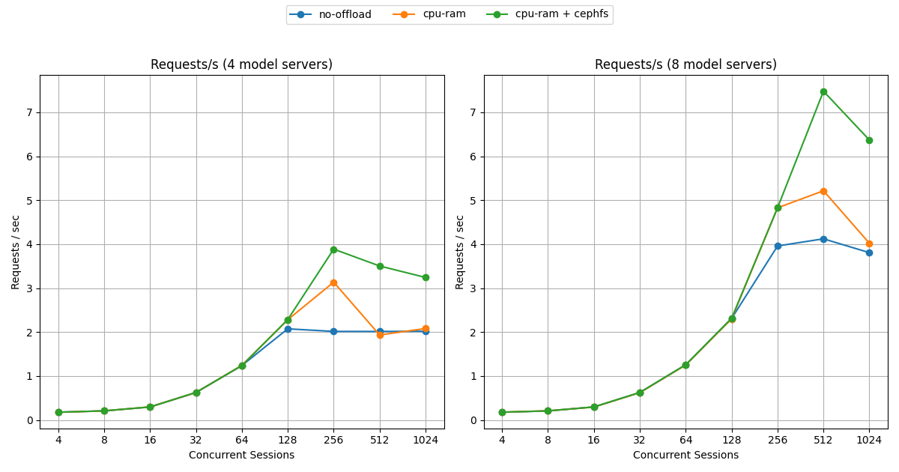
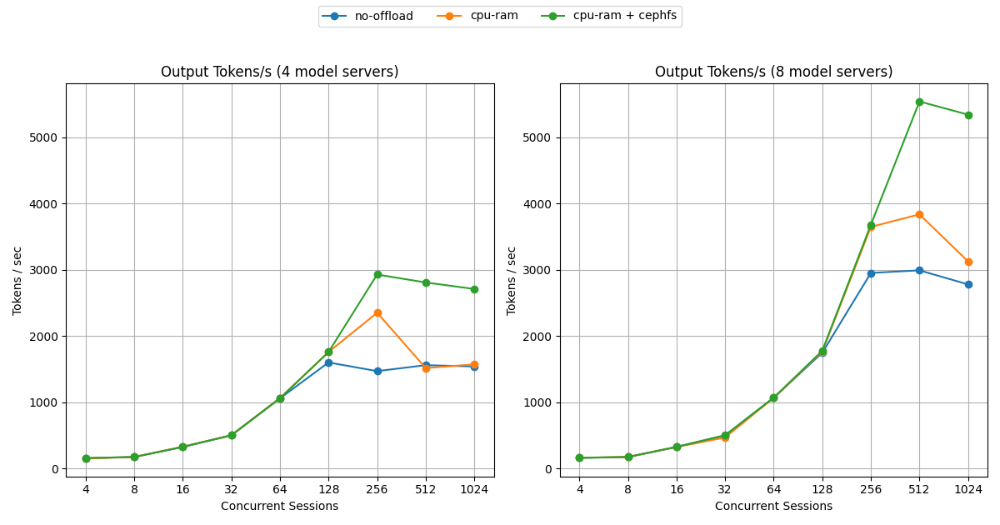
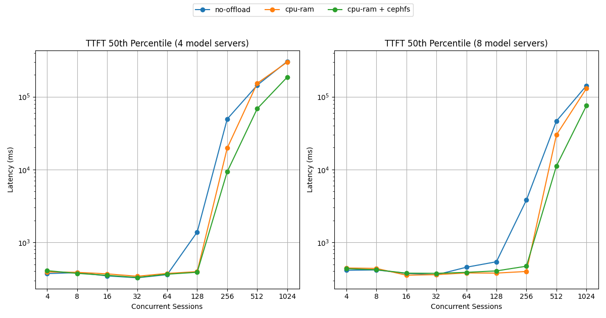
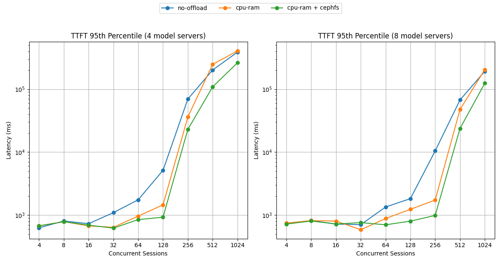

# Benchmark Report

The benchmark runs `Qwen/Qwen3.6-35B-A3B` on NVIDIA H100 GPUs with vLLM v0.23.0, 2 GPUs per model server (TP=2), `--gpu-memory-utilization=0.55` and `--max-num-seqs=256`. Two fleet sizes are measured: 4 model servers (8 GPUs) and 8 model servers (16 GPUs), with the model servers placed on two GPU nodes. The workload replays agentic coding sessions with subagents (the public `semianalysisai/cc-traces-weka-with-subagents-060826` traces) through AIPerf as a fixed number of concurrent sessions, for 30 minutes per step, on a ladder from 4 to 1,024 sessions.

Three configurations are compared on the same hardware, model, workload and router configuration:

- **No offload**: KV cache in GPU memory only. This is the baseline.
- **CPU RAM**: GPU memory, then a 256 GiB CPU RAM tier per model server.
- **CPU RAM + CephFS**: the same CPU RAM tier, then the shared CephFS filesystem described in this guide (64 read and 32 write threads per model server).

The CephFS tier runs on the three GPU nodes: Rook-managed Ceph 19.2.4, 21 NVMe OSDs (7 per node), single-copy data and metadata pools, 128 placement groups on the data pool, and Ceph traffic on six 200 Gb/s Ethernet links per node with an MTU of 9000.

## Comparing KV-cache offload tiers

Summary at each fleet's peak-throughput step.

**8 model servers, 512 concurrent sessions:**

| Metric | No offload | CPU RAM | CPU RAM + CephFS | Δ% vs no offload | Δ% vs CPU RAM |
| :-- | --: | --: | --: | --: | --: |
| Requests/sec | 4.122 | 5.215 | 7.480 | +81.5% | +43.4% |
| Output tokens/sec | 2,993 | 3,838 | 5,542 | +85.2% | +44.4% |
| TTFT p50 (s) | 46.3 | 29.9 | 11.2 | −75.8% | −62.6% |
| TTFT p95 (s) | 67.3 | 47.6 | 23.8 | −64.7% | −50.0% |
| ITL p50 (ms) | 26.3 | 18.4 | 14.7 | −44.2% | −20.6% |

**4 model servers, 256 concurrent sessions:**

| Metric | No offload | CPU RAM | CPU RAM + CephFS | Δ% vs no offload | Δ% vs CPU RAM |
| :-- | --: | --: | --: | --: | --: |
| Requests/sec | 2.015 | 3.136 | 3.887 | +92.9% | +23.9% |
| Output tokens/sec | 1,472 | 2,353 | 2,930 | +99.0% | +24.5% |
| TTFT p50 (s) | 49.4 | 19.7 | 9.3 | −81.1% | −52.7% |
| TTFT p95 (s) | 69.6 | 36.1 | 22.9 | −67.0% | −36.5% |
| ITL p50 (ms) | 23.0 | 15.1 | 12.7 | −44.9% | −15.9% |

The three configurations are indistinguishable until the fleet saturates: up to 64 sessions with 4 model servers and up to 128 with 8, throughput and latency agree within run-to-run noise, because the working set of cached prefixes still fits in GPU memory. Past that point the baseline stops scaling (about 2.0 req/s with 4 model servers, about 4.0 with 8) and its TTFT climbs into tens of seconds as evicted prefixes are recomputed.

Adding the CPU RAM tier extends the scaling range by one step and then falls back toward the baseline. With 4 model servers it reaches 3.136 req/s at 256 sessions and drops to 1.934 req/s at 512, below the baseline.

Adding CephFS keeps the gain under load. With 8 model servers it reaches 7.480 req/s at 512 sessions, 81.5% above the baseline and 43.4% above CPU RAM alone, with a median TTFT of 11.2 s against 46.3 s. At 1,024 sessions every configuration is past its peak, and CephFS still serves 6.370 req/s against 3.807 for the baseline and 4.021 for CPU RAM.

### Why the shared tier holds up

The share of prompt tokens restored from an offload tier, instead of being recomputed, explains the difference. Measured with 4 model servers (%):

| Sessions | 4 | 8 | 16 | 32 | 64 | 128 | 256 | 512 | 1024 |
| :-- | --: | --: | --: | --: | --: | --: | --: | --: | --: |
| CPU RAM | 0.9 | 1.8 | 5.3 | 19.7 | 32.2 | 36.4 | 33.6 | 12.1 | 2.0 |
| CPU RAM + CephFS | 0.9 | 1.8 | 5.6 | 28.0 | 43.4 | 49.4 | 49.5 | 38.8 | 27.5 |

With CPU RAM alone the share peaks at 36.4% and collapses to 2.0% at 1,024 sessions: under pressure, blocks are evicted from the CPU tier before they are reused. With CephFS behind it the share stays at 27.5% at the same load. These runs do not separate two effects that both favor the shared tier: more capacity behind the CPU tier, and reuse by a different model server than the one that wrote the block.

<b><i>Click</i></b> to view the per-concurrency breakdown

Requests/sec — higher is better; TTFT in seconds — lower is better.

**8 model servers**

| Sessions | No offload req/s | CPU RAM req/s | CephFS req/s | No offload TTFT p50 | CPU RAM TTFT p50 | CephFS TTFT p50 | No offload TTFT p95 | CPU RAM TTFT p95 | CephFS TTFT p95 |
| ---: | ---: | ---: | ---: | ---: | ---: | ---: | ---: | ---: | ---: |
| 4 | 0.177 | 0.178 | 0.177 | 0.4 | 0.4 | 0.4 | 0.7 | 0.7 | 0.7 |
| 8 | 0.206 | 0.208 | 0.207 | 0.4 | 0.4 | 0.4 | 0.8 | 0.8 | 0.8 |
| 16 | 0.297 | 0.294 | 0.296 | 0.4 | 0.4 | 0.4 | 0.7 | 0.8 | 0.7 |
| 32 | 0.624 | 0.623 | 0.626 | 0.4 | 0.4 | 0.4 | 0.7 | 0.6 | 0.8 |
| 64 | 1.254 | 1.251 | 1.257 | 0.5 | 0.4 | 0.4 | 1.3 | 0.9 | 0.7 |
| 128 | 2.310 | 2.301 | 2.314 | 0.5 | 0.4 | 0.4 | 1.8 | 1.2 | 0.8 |
| 256 | 3.959 | 4.827 | 4.829 | 3.8 | 0.4 | 0.5 | 10.5 | 1.7 | 1.0 |
| 512 | 4.122 | 5.215 | 7.480 | 46.3 | 29.9 | 11.2 | 67.3 | 47.6 | 23.8 |
| 1024 | 3.807 | 4.021 | 6.370 | 142 | 130 | 75.4 | 192 | 204 | 124 |

**4 model servers**

| Sessions | No offload req/s | CPU RAM req/s | CephFS req/s | No offload TTFT p50 | CPU RAM TTFT p50 | CephFS TTFT p50 | No offload TTFT p95 | CPU RAM TTFT p95 | CephFS TTFT p95 |
| ---: | ---: | ---: | ---: | ---: | ---: | ---: | ---: | ---: | ---: |
| 4 | 0.177 | 0.175 | 0.177 | 0.4 | 0.4 | 0.4 | 0.6 | 0.7 | 0.7 |
| 8 | 0.207 | 0.207 | 0.207 | 0.4 | 0.4 | 0.4 | 0.8 | 0.8 | 0.8 |
| 16 | 0.295 | 0.298 | 0.296 | 0.3 | 0.4 | 0.4 | 0.7 | 0.7 | 0.7 |
| 32 | 0.623 | 0.624 | 0.627 | 0.3 | 0.3 | 0.3 | 1.1 | 0.6 | 0.6 |
| 64 | 1.238 | 1.243 | 1.237 | 0.4 | 0.4 | 0.4 | 1.8 | 1.0 | 0.8 |
| 128 | 2.074 | 2.281 | 2.285 | 1.4 | 0.4 | 0.4 | 5.2 | 1.5 | 0.9 |
| 256 | 2.015 | 3.136 | 3.887 | 49.4 | 19.7 | 9.3 | 69.6 | 36.1 | 22.9 |
| 512 | 2.014 | 1.934 | 3.504 | 144 | 153 | 68.5 | 201 | 247 | 109 |
| 1024 | 2.019 | 2.081 | 3.243 | 305 | 299 | 186 | 387 | 406 | 262 |

## Comparing CephFS to node-local NVMe

A separate set of runs on the same cluster, with the same router configuration for every cell, adds a fourth configuration in which the filesystem tier is a local NVMe drive on each node instead of CephFS. The figures in this table come from that set and differ slightly from the ladder above; do not mix the two.

Request throughput in req/s:

| Model servers | Sessions | No offload | CPU RAM | CPU RAM + local NVMe | CPU RAM + CephFS | CephFS Δ% vs local NVMe |
| ---: | ---: | ---: | ---: | ---: | ---: | ---: |
| 2 | 128 | 1.034 | 1.711 | 1.898 | 1.901 | +0.2% |
| 4 | 256 | 1.658 | 3.079 | 3.807 | 3.849 | +1.1% |
| 4 | 512 | 1.977 | 2.388 | 3.627 | 3.588 | −1.1% |
| 4 | 1,024 | 2.005 | 2.093 | 2.902 | 3.401 | +17.2% |
| 8 | 512 | 3.797 | 4.851 | 7.215 | 7.564 | +4.8% |
| 8 | 1,024 | 4.053 | 4.178 | 6.288 | 6.439 | +2.4% |

CephFS matches local NVMe at small scale and is ahead in five of the six cells, by 17.2% at most. It is not always ahead: with 4 model servers at 512 sessions local NVMe is 1.1% faster. Local NVMe remains the lower-latency choice when requests stay on one node; the shared tier pays off as model servers spread over more nodes and prefixes are reused across them.

## Storage throughput

Synthetic CephFS throughput on this cluster after tuning, by I/O depth:

| I/O depth | Read | Write |
| ---: | ---: | ---: |
| 1 | 13.0 GB/s | 12.7 GB/s |
| 4 | 21.0 GB/s | 20.4 GB/s |
| 8 | 23.5 GB/s | 22.6 GB/s |

The untuned deployment delivered about 2 GB/s. The settings that closed the gap are the ones in the [Rook CephFS storage recipe](../../../recipes/storage/rook-cephfs/README.md#tuning): more than one placement group, a single-copy pool, the data path on the high-speed network, OSDs spread over all six links, OSD and client concurrency, and the mount options. Depth 8 doubled p99 latency compared with depth 1, so pick the depth from the serving latency target, not from bandwidth alone.

## Limitations

- One run per cell. Differences of a few percent, including most of the CephFS versus local NVMe comparison, are within what run-to-run variation could explain.
- One model and one workload shape. A two-model-server run with a different model on the same cluster showed every offload configuration behind the baseline, so the benefit depends on the model, the load and the routing.
- All configurations ran on shared nodes, so host memory, CPU and network were not isolated between them.
