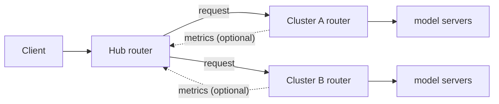

# Multi-Cluster Routing

Route requests across several llm-d deployments ("clusters") that serve the same model. A **hub** router treats each
cluster as one endpoint and sends each request to the cluster its scorers rank best; that cluster's own router then
picks the pod. What "best" means is up to the scorers you configure on the hub. The clusters can differ in model
server, hardware, and size. This guide deploys a tested example: two copies of the
[Optimized Baseline](../optimized-baseline/README.md), with a choice of two hub policies: cluster load, or the
latency the hub observes.

> [!NOTE]
> Experimental: the multicluster plugins are Alpha. The cluster list is static and maintained by hand; cluster
> registration, health checks, and failover are not part of this setup.

## Overview



The hub runs the same scheduling framework as any llm-d router, over clusters instead of pods: it reads the cluster
list, collects per-cluster metrics if its scorers use them, scores the clusters, and picks one. The routing policy is
the choice of scorers:

- **Load** (`HUB_SCORER=load`, the default): KV-cache utilization and queue depth, scraped from each cluster
  router. Traffic moves away from **congested** clusters; while every cluster has headroom they score the same and
  traffic spreads evenly.
- **Observed latency** (`HUB_SCORER=latency`): the latency-observation scorer predicts each cluster's
  time-to-first-token from the responses the hub already receives. It scrapes nothing from the clusters, and unlike
  [Predicted Latency-Based Routing](../predicted-latency-routing/README.md) it needs no predictor model.
- **Cache and session affinity**: the multicluster prefix-cache scorer and session-affinity filter keep related
  requests on the same cluster.
- **Other policies** need a scorer that implements them.

Each cluster must provide:

1. **A router address as an IP.** The multicluster plugins accept hostnames, but the router chart's Envoy forwards
   to the chosen cluster by `IP:port`, so with the standard chart a hostname fails with `503 no healthy upstream`.
2. **If the hub's scorers read cluster metrics** (`HUB_SCORER=load`): its router's `/metrics` without a
   token, via [`router/leaf.values.yaml`](router/leaf.values.yaml). The hub does not send a token, so with auth on
   it sees no load.
3. **The same model name** as the other clusters.

## Configuration

| Parameter | Example (this guide) | Alternatives |
| --- | --- | --- |
| Clusters | 2 namespaces in one Kubernetes cluster | Any number; separate clusters reachable by IP |
| Each cluster | Optimized Baseline, Qwen3-32B, TP=2 | Any llm-d router and model server |
| Model-server replicas | 1 and 3 (8 GPUs total) | Any |
| Hub scorer (`HUB_SCORER`) | `load`: KV-cache utilization and queue depth, or `latency`: observed time-to-first-token | Any scorer that ranks cluster endpoints: the multicluster prefix-cache or session-affinity plugins, or your own |
| Hub location | Its own namespace | Inside one of the clusters, listing that cluster's router as its local entry, so each request either stays local or goes to a peer |

## Prerequisites

- The [Optimized Baseline prerequisites](../optimized-baseline/README.md#prerequisites) in each cluster namespace.
- Enough accelerators for 4 model-server replicas at TP=2 (8 GPUs). To use fewer, lower `count` in
  `modelserver/cluster-{a,b}/kustomization.yaml`; keep the counts unequal to see the hub steer.
- `helm` 3.13 or later, `kubectl`, `envsubst`, Python 3.

<!-- guide:prerequisites.clone start -->
<!-- llm-d-cicd:skip start -->
```bash
export BRANCH=main
git clone https://github.com/llm-d/llm-d.git && cd llm-d && git checkout ${BRANCH}
```
<!-- llm-d-cicd:skip end -->
<!-- guide:prerequisites.clone end -->

<!-- guide:env.static start -->
```bash
export BRANCH=main
export REPO_ROOT=$(realpath $(git rev-parse --show-toplevel))
export GUIDE_NAME=multi-cluster-routing
export NS_A=llm-d-mc-a
export NS_B=llm-d-mc-b
export NS_HUB=llm-d-mc-hub
export HUB_SCORER=load # options: load, latency
export LEAF_VALUES=
```
<!-- llm-d-cicd:skip start -->
```bash
export HF_TOKEN=HF_TOKEN_PLACEHOLDER
```
<!-- llm-d-cicd:skip end -->
```bash
export MODEL=Qwen/Qwen3-32B
export CURL_TEST_IMAGE=cfmanteiga/alpine-bash-curl-jq:latest
```
<!-- guide:env.static end -->

<!-- guide:env.source start -->
```bash
source ${REPO_ROOT}/guides/env.sh
```
<!-- guide:env.source end -->

Install the Gateway API Inference Extension CRDs, then create the namespaces and the HuggingFace token secret:

<!-- guide:prerequisites.gaie start -->
```bash
# GAIE_URL is automatically calculated from GAIE_VERSION at ${REPO_ROOT}/guides/env.sh
kubectl apply -f https://github.com/kubernetes-sigs/gateway-api-inference-extension/${GAIE_URL}/v1-manifests.yaml
```
<!-- guide:prerequisites.gaie end -->

<!-- guide:prerequisites.namespace start -->
```bash
for ns in ${NS_A} ${NS_B} ${NS_HUB}; do
  kubectl create namespace ${ns} --dry-run=client -o yaml | kubectl apply -f -
done
```
<!-- guide:prerequisites.namespace end -->

<!-- guide:prerequisites.secrets start -->
<!-- llm-d-cicd:skip start -->
```bash
for ns in ${NS_A} ${NS_B}; do
  kubectl create secret generic llm-d-hf-token \
    --from-literal="HF_TOKEN=${HF_TOKEN}" \
    --namespace "${ns}" \
    --dry-run=client -o yaml | kubectl apply -f -
done
```
<!-- llm-d-cicd:skip end -->
<!-- guide:prerequisites.secrets end -->

## Step 1: Deploy the cluster routers

With `HUB_SCORER=load`, `LEAF_VALUES` adds [`router/leaf.values.yaml`](router/leaf.values.yaml) to each cluster
router so the hub can read its metrics. With `HUB_SCORER=latency`, the cluster routers need no changes.

<!-- guide:deploy.clusters start -->
```bash
# only when HUB_SCORER=load:
# Lets the hub read each cluster router's /metrics. The variable carries its own -f flag.
export LEAF_VALUES="-f ${REPO_ROOT}/guides/${GUIDE_NAME}/router/leaf.values.yaml"

for ns in ${NS_A} ${NS_B}; do
  helm install optimized-baseline ${ROUTER_STANDALONE_CHART} \
    -f ${REPO_ROOT}/guides/recipes/router/base.values.yaml \
    -f ${REPO_ROOT}/guides/optimized-baseline/router/optimized-baseline.values.yaml \
    ${LEAF_VALUES} \
    -n ${ns} --version ${ROUTER_CHART_VERSION}
done
```
<!-- guide:deploy.clusters end -->

> [!TIP]
> Already running clusters? With `HUB_SCORER=load`, add `-f .../router/leaf.values.yaml` to each router's
> `helm upgrade`; with `HUB_SCORER=latency`, change nothing. Then go to Step 3.

## Step 2: Deploy the model servers

The overlays give the clusters different capacity: 1 replica in A, 3 in B.

<!-- guide:deploy.modelserver start -->
```bash
kubectl apply -n ${NS_A} -k ${REPO_ROOT}/guides/${GUIDE_NAME}/modelserver/cluster-a/
kubectl apply -n ${NS_B} -k ${REPO_ROOT}/guides/${GUIDE_NAME}/modelserver/cluster-b/
kubectl rollout status deployment/optimized-baseline-nvidia-gpu-vllm-decode -n ${NS_A} --timeout=30m
kubectl rollout status deployment/optimized-baseline-nvidia-gpu-vllm-decode -n ${NS_B} --timeout=30m
```
<!-- guide:deploy.modelserver end -->

## Step 3: Create the cluster list

[`manifests/clusters.yaml`](manifests/clusters.yaml) has one entry per cluster: where the hub sends requests
(`address:80`) and, for the load policy, where it reads metrics (`metricsAddress:9090`). Add an entry for each extra
cluster; the hub reloads the list without a restart once Kubernetes updates the mounted ConfigMap, which can take
about a minute.

<!-- guide:deploy.cluster_list start -->
```bash
CLUSTER_A_IP=$(kubectl get svc optimized-baseline-epp -n ${NS_A} -o jsonpath='{.spec.clusterIP}')
CLUSTER_B_IP=$(kubectl get svc optimized-baseline-epp -n ${NS_B} -o jsonpath='{.spec.clusterIP}')
export CLUSTER_A_IP CLUSTER_B_IP
: "${CLUSTER_A_IP:?cluster A router Service has no clusterIP - did Step 1 run in ${NS_A}?}"
: "${CLUSTER_B_IP:?cluster B router Service has no clusterIP - did Step 1 run in ${NS_B}?}"
envsubst '${CLUSTER_A_IP} ${CLUSTER_B_IP}' < ${REPO_ROOT}/guides/${GUIDE_NAME}/manifests/clusters.yaml \
  | kubectl apply -n ${NS_HUB} -f -
```
<!-- guide:deploy.cluster_list end -->

## Step 4: Deploy the hub

[`router/hub.values.yaml`](router/hub.values.yaml) turns a standard router install into a hub and mounts the cluster
list; [`router/hub-load.values.yaml`](router/hub-load.values.yaml) or
[`router/hub-latency.values.yaml`](router/hub-latency.values.yaml) adds the routing policy.

<!-- guide:deploy.standalone start -->
```bash
helm install mc-hub ${ROUTER_STANDALONE_CHART} \
  -f ${REPO_ROOT}/guides/recipes/router/base.values.yaml \
  -f ${REPO_ROOT}/guides/${GUIDE_NAME}/router/hub.values.yaml \
  -f ${REPO_ROOT}/guides/${GUIDE_NAME}/router/hub-${HUB_SCORER}.values.yaml \
  -n ${NS_HUB} --version ${ROUTER_CHART_VERSION}
kubectl rollout status deployment/mc-hub-epp -n ${NS_HUB} --timeout=5m
```
<!-- guide:deploy.standalone end -->

## Step 5: Verify

Get the hub's address and send a request through it:

<!-- guide:verify.endpoint.standalone start -->
```bash
export IP=$(kubectl get service mc-hub-epp -n ${NS_HUB} -o jsonpath='{.spec.clusterIP}')
```
<!-- guide:verify.endpoint.standalone end -->

<!-- guide:verify.tests start -->
```bash
kubectl run curl-test --rm -i --restart=Never \
  --image=${CURL_TEST_IMAGE} \
  --namespace="${NS_HUB}" \
  --env="IP=${IP}" \
  --env="MODEL=${MODEL}" \
  -- /bin/sh -c 'set -o pipefail; curl -sS --fail -X POST "http://${IP}/v1/completions" -H "Content-Type: application/json" -d "{\"model\": \"${MODEL}\", \"prompt\": \"How are you today?\"}" | jq -e ".choices[0].text"'
```
<!-- llm-d-cicd:skip start -->
```bash
# See how the hub splits traffic across the clusters
kubectl port-forward -n ${NS_HUB} svc/mc-hub-epp 8000:80 &
PF_PID=$!
trap 'kill ${PF_PID} 2>/dev/null' EXIT
python3 ${REPO_ROOT}/guides/${GUIDE_NAME}/verify.py --base-url http://127.0.0.1:8000 \
  --scorer ${HUB_SCORER} --cluster a=${NS_A} --cluster b=${NS_B}
kill ${PF_PID}
```
<!-- llm-d-cicd:skip end -->
<!-- guide:verify.tests end -->

[`verify.py`](verify.py) sends 200 streamed requests through the hub. It passes when all of them succeed and every
cluster serves some, then prints each cluster's share of the traffic next to its share of the model servers. With
`HUB_SCORER=load`, it first checks that each cluster router serves its metrics without a token. It counts requests
with vLLM's own counter, so it needs vLLM model servers.

The split is reported, not judged. With the load scorer and clusters that have headroom, it is about even; once the
smaller cluster queues requests, it gets less traffic. To see that, raise `--concurrency` and `--max-tokens`. With
the latency scorer, the hub learns each cluster's latency from the first requests and then sends more traffic to the
faster cluster.

## Known Constraints

- **With the load policy, steering needs congestion**: clusters with headroom score equally, whatever their size.
- **The latency scorer needs streamed traffic**: it learns only from streamed responses, so with non-streamed
  requests every cluster scores the same.
- **The latency scorer needs an EPP image that includes it**: llm-d-router v0.11 or later, such as the chart's
  default `main` image. An older EPP exits at startup with
  `plugin type 'latency-observer-producer-hub' is not registered`.
- **Addresses must be IPs** with the standard router chart: if a cluster router's Service is recreated, re-run Step 3.
- **With the load policy, cluster metrics are unauthenticated and read over HTTP** in this in-cluster example.
  Across real clusters, keep the metrics source's default `https` with peer-certificate verification
  (`caCertPath`), and restrict access to port 9090 with a NetworkPolicy.
- **Hub config changes need a restart**: after a `helm upgrade` of the hub, run
  `kubectl rollout restart deployment/mc-hub-epp -n ${NS_HUB}`. The cluster list is the exception: the hub reloads it.

## Troubleshooting

- **503 `no healthy upstream`, or a cluster serves no requests**: a cluster address is a hostname, empty, or a stale
  IP. Compare `kubectl get cm mc-hub-clusters -n ${NS_HUB} -o yaml` with the cluster routers' Service IPs.
- **`verify.py` reports HTTP 401 from a router's `/metrics` (load policy)**: that router was installed without
  `leaf.values.yaml`, so the hub sees no load. `helm upgrade` it with the file.
- **Hub pod fails to start**: `kubectl logs -n ${NS_HUB} deploy/mc-hub-epp -c epp`.

## Cleanup

<!-- guide:cleanup start -->
```bash
helm uninstall mc-hub -n ${NS_HUB} --ignore-not-found
kubectl delete configmap mc-hub-clusters -n ${NS_HUB} --ignore-not-found=true
kubectl delete -n ${NS_A} -k ${REPO_ROOT}/guides/${GUIDE_NAME}/modelserver/cluster-a/ --ignore-not-found=true
kubectl delete -n ${NS_B} -k ${REPO_ROOT}/guides/${GUIDE_NAME}/modelserver/cluster-b/ --ignore-not-found=true
for ns in ${NS_A} ${NS_B}; do helm uninstall optimized-baseline -n ${ns} --ignore-not-found; done
```
<!-- llm-d-cicd:skip start -->
```bash
for ns in ${NS_A} ${NS_B} ${NS_HUB}; do kubectl delete namespace ${ns} --ignore-not-found=true; done
```
<!-- llm-d-cicd:skip end -->
<!-- guide:cleanup end -->
