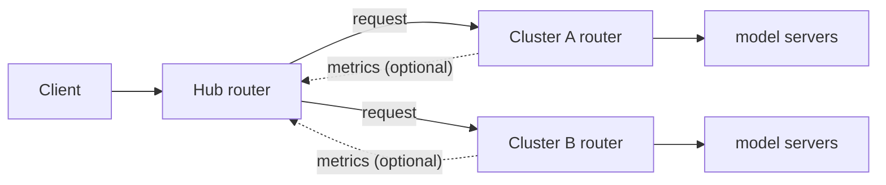

# Multi-Cluster Routing

Route requests across several llm-d deployments ("clusters") that serve the same model. A **hub** router treats each
cluster as one endpoint and sends each request to the cluster its scorers rank best; that cluster's own router then
picks the pod. What "best" means is up to the scorers you configure on the hub. The clusters can differ in model
server, hardware, and size. This guide deploys a tested example across two Kubernetes clusters: two copies of the
[Optimized Baseline](../optimized-baseline/README.md), with a choice of two hub policies: cluster load, or the
latency the hub observes.

> [!NOTE]
> Experimental: the multicluster plugins are Alpha. The cluster list is static and maintained by hand; cluster
> registration, health checks, and failover are not part of this setup.

## Overview



The hub runs the same scheduling framework as any llm-d router, over clusters instead of pods: it reads the cluster
list, collects per-cluster metrics if its scorers use them, scores the clusters, and picks one. The routing policy is
the choice of scorers:

- **Load** (`HUB_SCORER=load`, the default): KV-cache utilization and queue depth, scraped from each cluster
  router. The hub prefers the cluster that reports the lower utilization and the shorter queue; clusters that report
  the same values, such as idle ones, score the same, whatever their size.
- **Observed latency** (`HUB_SCORER=latency`): the latency-observation scorer predicts each cluster's
  time-to-first-token from the responses the hub already receives. It scrapes nothing from the clusters, and unlike
  [Predicted Latency-Based Routing](../predicted-latency-routing/README.md) it needs no predictor model.
- **Cache and session affinity**: the multicluster prefix-cache scorer and session-affinity filter keep related
  requests on the same cluster.
- **Other policies** need a scorer that implements them.

Each cluster must provide:

1. **A router address the hub can reach, as an IP.** In the hub's own Kubernetes cluster that is the router's
   Service; in another one, a load balancer in front of the router that publishes an IP (Step 3). The multicluster
   plugins accept hostnames, but the router chart's Envoy forwards to the chosen cluster by `IP:port`, so with the
   standard chart a hostname fails with `503 no healthy upstream`.
2. **If the hub's scorers read cluster metrics** (`HUB_SCORER=load`): its router's `/metrics` without a
   token, via [`router/leaf.values.yaml`](router/leaf.values.yaml). The hub does not send a token, so with auth on
   it sees no load.
3. **The same model name** as the other clusters.

## Configuration

| Parameter | Example (this guide) | Alternatives |
| --- | --- | --- |
| Clusters | 2 Kubernetes clusters: the hub and cluster A in one, cluster B in another | Any number; or namespaces of one Kubernetes cluster ([appendix](#appendix-one-kubernetes-cluster)) |
| Each cluster | Optimized Baseline, Qwen3-32B, TP=2 | Any llm-d router and model server |
| Model-server replicas | 1 in cluster A and 2 in cluster B (6 GPUs total) | Any |
| Hub scorer (`HUB_SCORER`) | `load`: KV-cache utilization and queue depth, or `latency`: observed time-to-first-token | Any scorer that ranks cluster endpoints: the multicluster prefix-cache or session-affinity plugins, or your own |
| Reaching cluster B | A load balancer limited to the hub cluster's source addresses, plain HTTP (internal where the clusters share a network) | TLS or mutual TLS in front of the router, or private connectivity between the clusters |

## Prerequisites

- Two Kubernetes clusters with a kubeconfig context for each (`CTX_HUB`, `CTX_B`), each meeting the
  [Optimized Baseline prerequisites](../optimized-baseline/README.md#prerequisites).
- LoadBalancer Services in cluster B that publish an **IP address**, and connectivity from the hub's cluster to
  them. Providers that publish only a hostname, such as AWS, are not supported yet.
- Accelerators for the model servers: 2 GPUs in the hub's cluster and 4 in cluster B (TP=2). To change the
  sizes, edit `count` in `modelserver/cluster-{a,b}/kustomization.yaml`.
- `helm` 3.13 or later, `kubectl`, `envsubst`, Python 3.

<!-- guide:prerequisites.clone start -->
<!-- llm-d-cicd:skip start -->
```bash
export BRANCH=main
git clone https://github.com/llm-d/llm-d.git && cd llm-d && git checkout ${BRANCH}
```
<!-- llm-d-cicd:skip end -->
<!-- guide:prerequisites.clone end -->

<!-- guide:env.static start -->
```bash
export BRANCH=main
export REPO_ROOT=$(realpath $(git rev-parse --show-toplevel))
export GUIDE_NAME=multi-cluster-routing
export CTX_HUB=$(kubectl config current-context)
export CTX_B=$(kubectl config current-context)
export NS_A=llm-d-mc-a
export NS_B=llm-d-mc-b
export NS_HUB=llm-d-mc-hub
export HUB_SCORER=load # options: load, latency
export LEAF_VALUES=
export CLUSTER_B_ACCESS=clusterip # options: clusterip, loadbalancer
export HUB_EGRESS_CIDR=
export CLUSTER_B_LB_ANNOTATIONS={}
```
<!-- llm-d-cicd:skip start -->
```bash
export HF_TOKEN=HF_TOKEN_PLACEHOLDER
```
<!-- llm-d-cicd:skip end -->
```bash
export MODEL=Qwen/Qwen3-32B
export CURL_TEST_IMAGE=cfmanteiga/alpine-bash-curl-jq:latest
```
<!-- guide:env.static end -->

These defaults put everything in the current cluster ([appendix](#appendix-one-kubernetes-cluster)). For two
Kubernetes clusters, the tested setup, override them:

```bash
export CTX_HUB=<hub cluster context>          # the hub and cluster A
export CTX_B=<cluster B context>
export CLUSTER_B_ACCESS=loadbalancer
export HUB_EGRESS_CIDR=<CIDR>                 # the hub cluster's outbound addresses, as cluster B sees them
export CLUSTER_B_LB_ANNOTATIONS='{"service.beta.kubernetes.io/coreweave-load-balancer-type": "public"}'
```

`HUB_EGRESS_CIDR` is the only source range cluster B's load balancer accepts. Behind NAT, the hub cluster's traffic
can leave from several addresses, and a lookup service run from the hub cluster may show only one of them, so
confirm the range with your network or cloud provider. `CLUSTER_B_LB_ANNOTATIONS` is your provider's annotation for
an internal or public load balancer: the example is CoreWeave's public one, which the tested setup used; on GKE,
`{"networking.gke.io/load-balancer-type": "Internal"}` makes it internal.

<!-- guide:env.source start -->
```bash
source ${REPO_ROOT}/guides/env.sh
```
<!-- guide:env.source end -->

Install the Gateway API Inference Extension CRDs in both clusters (skip this on a shared cluster that already has
them), then create the namespaces and the HuggingFace token secrets:

<!-- guide:prerequisites.gaie start -->
```bash
# GAIE_URL is automatically calculated from GAIE_VERSION at ${REPO_ROOT}/guides/env.sh
for ctx in ${CTX_HUB} ${CTX_B}; do
  kubectl --context ${ctx} apply -f https://github.com/kubernetes-sigs/gateway-api-inference-extension/${GAIE_URL}/v1-manifests.yaml
done
```
<!-- guide:prerequisites.gaie end -->

<!-- guide:prerequisites.namespace start -->
```bash
for ns in ${NS_A} ${NS_HUB}; do
  kubectl --context ${CTX_HUB} create namespace ${ns} --dry-run=client -o yaml | kubectl --context ${CTX_HUB} apply -f -
done
kubectl --context ${CTX_B} create namespace ${NS_B} --dry-run=client -o yaml | kubectl --context ${CTX_B} apply -f -
```
<!-- guide:prerequisites.namespace end -->

<!-- guide:prerequisites.secrets start -->
<!-- llm-d-cicd:skip start -->
```bash
kubectl --context ${CTX_HUB} create secret generic llm-d-hf-token \
  --from-literal="HF_TOKEN=${HF_TOKEN}" \
  --namespace "${NS_A}" \
  --dry-run=client -o yaml | kubectl --context ${CTX_HUB} apply -f -
kubectl --context ${CTX_B} create secret generic llm-d-hf-token \
  --from-literal="HF_TOKEN=${HF_TOKEN}" \
  --namespace "${NS_B}" \
  --dry-run=client -o yaml | kubectl --context ${CTX_B} apply -f -
```
<!-- llm-d-cicd:skip end -->
<!-- guide:prerequisites.secrets end -->

## Step 1: Deploy the cluster routers

Cluster A's router goes into the hub's Kubernetes cluster and cluster B's into the other one. With
`HUB_SCORER=load`, `LEAF_VALUES` adds [`router/leaf.values.yaml`](router/leaf.values.yaml) to each cluster router so
the hub can read its metrics. With `HUB_SCORER=latency`, the cluster routers need no changes.

<!-- guide:deploy.clusters start -->
```bash
# only when HUB_SCORER=load:
# Lets the hub read each cluster router's /metrics. The variable carries its own -f flag.
export LEAF_VALUES="-f ${REPO_ROOT}/guides/${GUIDE_NAME}/router/leaf.values.yaml"

helm install optimized-baseline ${ROUTER_STANDALONE_CHART} --kube-context ${CTX_HUB} \
  -f ${REPO_ROOT}/guides/recipes/router/base.values.yaml \
  -f ${REPO_ROOT}/guides/optimized-baseline/router/optimized-baseline.values.yaml \
  ${LEAF_VALUES} \
  -n ${NS_A} --version ${ROUTER_CHART_VERSION}
helm install optimized-baseline ${ROUTER_STANDALONE_CHART} --kube-context ${CTX_B} \
  -f ${REPO_ROOT}/guides/recipes/router/base.values.yaml \
  -f ${REPO_ROOT}/guides/optimized-baseline/router/optimized-baseline.values.yaml \
  ${LEAF_VALUES} \
  -n ${NS_B} --version ${ROUTER_CHART_VERSION}
```
<!-- guide:deploy.clusters end -->

> [!TIP]
> Already running clusters? With `HUB_SCORER=load`, add `-f .../router/leaf.values.yaml` to each router's
> `helm upgrade`; with `HUB_SCORER=latency`, change nothing. Then go to Step 3.

## Step 2: Deploy the model servers

The overlays give the clusters different capacity: 1 replica in A, 2 in B.

<!-- guide:deploy.modelserver start -->
```bash
kubectl --context ${CTX_HUB} apply -n ${NS_A} -k ${REPO_ROOT}/guides/${GUIDE_NAME}/modelserver/cluster-a/
kubectl --context ${CTX_B} apply -n ${NS_B} -k ${REPO_ROOT}/guides/${GUIDE_NAME}/modelserver/cluster-b/
kubectl --context ${CTX_HUB} rollout status deployment/optimized-baseline-nvidia-gpu-vllm-decode -n ${NS_A} --timeout=30m
kubectl --context ${CTX_B} rollout status deployment/optimized-baseline-nvidia-gpu-vllm-decode -n ${NS_B} --timeout=30m
```
<!-- guide:deploy.modelserver end -->

## Step 3: Expose cluster B to the hub

The hub's cluster cannot reach cluster B's router Service, so [`manifests/cluster-b-lb.yaml`](manifests/cluster-b-lb.yaml)
puts a load balancer in front of it: port 80 for requests, port 9090 for the metrics the load scorer reads,
accepted only from `HUB_EGRESS_CIDR`. Create it once and keep it: a recreated Service can receive a recycled IP that
takes a while to route. With `CLUSTER_B_ACCESS=clusterip`, this step does nothing.

> [!WARNING]
> This exposes cluster B's inference endpoint and its unauthenticated metrics over plain HTTP, guarded only by
> `HUB_EGRESS_CIDR`. Prefer an internal load balancer when the clusters share a private network. Use a public one only
> for testing, and remove it afterwards (Cleanup).

<!-- guide:deploy.expose start -->
```bash
# only when CLUSTER_B_ACCESS=loadbalancer:
: "${HUB_EGRESS_CIDR:?set HUB_EGRESS_CIDR to the source addresses cluster B sees from the hub cluster}"
envsubst '${HUB_EGRESS_CIDR} ${CLUSTER_B_LB_ANNOTATIONS}' < ${REPO_ROOT}/guides/${GUIDE_NAME}/manifests/cluster-b-lb.yaml \
  | kubectl --context ${CTX_B} apply -n ${NS_B} -f -
# Wait up to 5 minutes for the load balancer's IP
for _ in $(seq 60); do
  LB_IP=$(kubectl --context ${CTX_B} get service cluster-b-lb -n ${NS_B} -o jsonpath='{.status.loadBalancer.ingress[0].ip}')
  [ -n "${LB_IP}" ] && break
  sleep 5
done
echo "cluster B load balancer IP: ${LB_IP:-none after 5 minutes (a load balancer that publishes only a hostname is not supported)}"
```
<!-- guide:deploy.expose end -->

## Step 4: Create the cluster list

[`manifests/clusters.yaml`](manifests/clusters.yaml) has one entry per cluster: where the hub sends requests
(`address:80`) and, for the load policy, where it reads metrics (`metricsAddress:9090`). Cluster A's address is its
router Service; cluster B's is the load balancer from Step 3, or its router Service with `CLUSTER_B_ACCESS=clusterip`.
Add an entry for each extra cluster; the hub reloads the list without a restart once Kubernetes updates the mounted
ConfigMap, which can take about a minute.

<!-- guide:deploy.cluster_list start -->
```bash
CLUSTER_A_IP=$(kubectl --context ${CTX_HUB} get svc optimized-baseline-epp -n ${NS_A} -o jsonpath='{.spec.clusterIP}')

# only when CLUSTER_B_ACCESS=loadbalancer:
CLUSTER_B_IP=$(kubectl --context ${CTX_B} get svc cluster-b-lb -n ${NS_B} -o jsonpath='{.status.loadBalancer.ingress[0].ip}')

# only when CLUSTER_B_ACCESS=clusterip:
CLUSTER_B_IP=$(kubectl --context ${CTX_B} get svc optimized-baseline-epp -n ${NS_B} -o jsonpath='{.spec.clusterIP}')

export CLUSTER_A_IP CLUSTER_B_IP
: "${CLUSTER_A_IP:?cluster A router Service has no clusterIP - did Step 1 run in ${NS_A}?}"
: "${CLUSTER_B_IP:?cluster B has no address - did Steps 1 and 3 run in ${NS_B}?}"
envsubst '${CLUSTER_A_IP} ${CLUSTER_B_IP}' < ${REPO_ROOT}/guides/${GUIDE_NAME}/manifests/clusters.yaml \
  | kubectl --context ${CTX_HUB} apply -n ${NS_HUB} -f -
```
<!-- guide:deploy.cluster_list end -->

## Step 5: Deploy the hub

[`router/hub.values.yaml`](router/hub.values.yaml) turns a standard router install into a hub and mounts the cluster
list; [`router/hub-load.values.yaml`](router/hub-load.values.yaml) or
[`router/hub-latency.values.yaml`](router/hub-latency.values.yaml) adds the routing policy.

<!-- guide:deploy.standalone start -->
```bash
helm install mc-hub ${ROUTER_STANDALONE_CHART} --kube-context ${CTX_HUB} \
  -f ${REPO_ROOT}/guides/recipes/router/base.values.yaml \
  -f ${REPO_ROOT}/guides/${GUIDE_NAME}/router/hub.values.yaml \
  -f ${REPO_ROOT}/guides/${GUIDE_NAME}/router/hub-${HUB_SCORER}.values.yaml \
  -n ${NS_HUB} --version ${ROUTER_CHART_VERSION}
kubectl --context ${CTX_HUB} rollout status deployment/mc-hub-epp -n ${NS_HUB} --timeout=5m
```
<!-- guide:deploy.standalone end -->

## Step 6: Verify

Get the hub's address and send a request through it:

<!-- guide:verify.endpoint.standalone start -->
```bash
export IP=$(kubectl --context ${CTX_HUB} get service mc-hub-epp -n ${NS_HUB} -o jsonpath='{.spec.clusterIP}')
```
<!-- guide:verify.endpoint.standalone end -->

<!-- guide:verify.tests start -->
```bash
kubectl --context ${CTX_HUB} run curl-test --rm -i --restart=Never \
  --image=${CURL_TEST_IMAGE} \
  --namespace="${NS_HUB}" \
  --env="IP=${IP}" \
  --env="MODEL=${MODEL}" \
  -- /bin/sh -c 'set -o pipefail; curl -sS --fail -X POST "http://${IP}/v1/completions" -H "Content-Type: application/json" -d "{\"model\": \"${MODEL}\", \"prompt\": \"How are you today?\"}" | jq -e ".choices[0].text"'
```
<!-- llm-d-cicd:skip start -->
```bash
# See how the hub splits traffic across the clusters
kubectl --context ${CTX_HUB} port-forward -n ${NS_HUB} svc/mc-hub-epp 8000:80 &
PF_PID=$!
trap 'kill ${PF_PID} 2>/dev/null' EXIT
python3 ${REPO_ROOT}/guides/${GUIDE_NAME}/verify.py --base-url http://127.0.0.1:8000 \
  --scorer ${HUB_SCORER} --cluster a=${NS_A}@${CTX_HUB} --cluster b=${NS_B}@${CTX_B}
kill ${PF_PID}
```
<!-- llm-d-cicd:skip end -->
<!-- guide:verify.tests end -->

[`verify.py`](verify.py) sends 200 streamed requests through the hub. It passes when all of them succeed and every
cluster serves some, then prints each cluster's share of the traffic next to its share of the model-server replicas,
along with the time to first token. It reads each cluster's counters through its own context
(`--cluster b=NAMESPACE@CONTEXT`). With `HUB_SCORER=load`, it first checks, inside each cluster, that the cluster
router serves its metrics without a token; that check does not cover the hub's path to cluster B's load balancer. It
counts requests with vLLM's own counter, so it needs vLLM model servers.

The split is reported, not judged: it depends on the scorer, the prompt sizes, how busy the clusters are, the hardware
behind each replica, and for the latency scorer the network distance to each cluster. The prompts are one line by
default; `--prompt-words 3000` makes each about 3,000 tokens, as in [Tested on](#tested-on).

## Tested on

The hub and cluster A on OpenShift (1 replica on H100), cluster B on CoreWeave (2 replicas on H200), Qwen3-32B.
Each run was the Step 6 `verify.py` command with `--prompt-words 3000`: 200 streamed requests with prompts of about
3,000 tokens, 32 at a time. All of them succeeded:

| Hub scorer | Runs | Cluster A (1 of 3 replicas) | Cluster B (2 of 3 replicas) |
| --- | --- | --- | --- |
| `load` | 5 | 25.5 to 42.5% | 57.5 to 74.5% |
| `latency` | 3 | 15.5 to 23.0% | 77.0 to 84.5% |

Both scorers sent most requests to cluster B, which has more replicas.

## Known Constraints

- **The latency scorer needs streamed traffic**: it learns only from streamed responses, so with non-streamed requests every cluster scores the same.
- **Cluster B is reached over plain HTTP**, accepted only from the hub cluster's source addresses. That is enough for a
  test; across untrusted networks, use an internal load balancer on a private network, or put TLS or mutual TLS in
  front of the router. The router chart's Envoy cannot open TLS to a remote cluster today.
- **Addresses must be IPs** with the standard router chart: cluster B's load balancer must publish an IP, so providers that publish only a hostname (AWS) are not supported yet. If cluster A's router Service or cluster B's load balancer is recreated, re-run Step 4.
- **With the load policy, cluster metrics are unauthenticated** (`leaf.values.yaml`). Keep the metrics port reachable only from the hub: the LoadBalancer's source range does this for cluster B; restrict port 9090 in the hub's cluster with a NetworkPolicy.
- **Hub config changes need a restart**: after a `helm upgrade` of the hub, run `kubectl --context ${CTX_HUB} rollout restart deployment/mc-hub-epp -n ${NS_HUB}`. The cluster list is the exception: the hub reloads it.

## Cleanup

<!-- guide:cleanup start -->
```bash
helm uninstall mc-hub --kube-context ${CTX_HUB} -n ${NS_HUB} --ignore-not-found
kubectl --context ${CTX_HUB} delete configmap mc-hub-clusters -n ${NS_HUB} --ignore-not-found=true
kubectl --context ${CTX_B} delete service cluster-b-lb -n ${NS_B} --ignore-not-found=true
kubectl --context ${CTX_HUB} delete -n ${NS_A} -k ${REPO_ROOT}/guides/${GUIDE_NAME}/modelserver/cluster-a/ --ignore-not-found=true
kubectl --context ${CTX_B} delete -n ${NS_B} -k ${REPO_ROOT}/guides/${GUIDE_NAME}/modelserver/cluster-b/ --ignore-not-found=true
helm uninstall optimized-baseline --kube-context ${CTX_HUB} -n ${NS_A} --ignore-not-found
helm uninstall optimized-baseline --kube-context ${CTX_B} -n ${NS_B} --ignore-not-found
```
<!-- llm-d-cicd:skip start -->
```bash
for ns in ${NS_A} ${NS_HUB}; do kubectl --context ${CTX_HUB} delete namespace ${ns} --ignore-not-found=true; done
kubectl --context ${CTX_B} delete namespace ${NS_B} --ignore-not-found=true
```
<!-- llm-d-cicd:skip end -->
<!-- guide:cleanup end -->

## Appendix: one Kubernetes cluster

To try the guide in a single Kubernetes cluster, keep the defaults: `CTX_HUB` and `CTX_B` are the current context
and `CLUSTER_B_ACCESS=clusterip`. Step 3 does nothing, and the hub reaches cluster B through its router Service, like
cluster A. `HUB_EGRESS_CIDR` and `CLUSTER_B_LB_ANNOTATIONS` are not needed.
