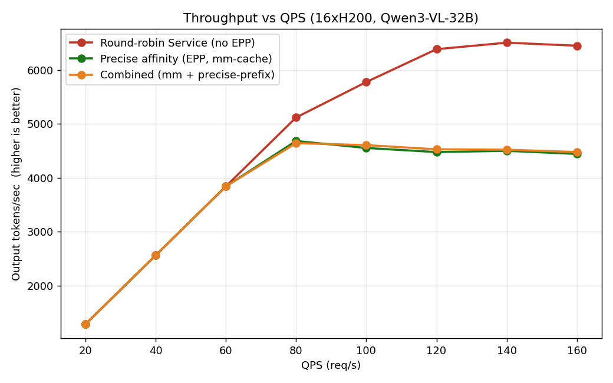
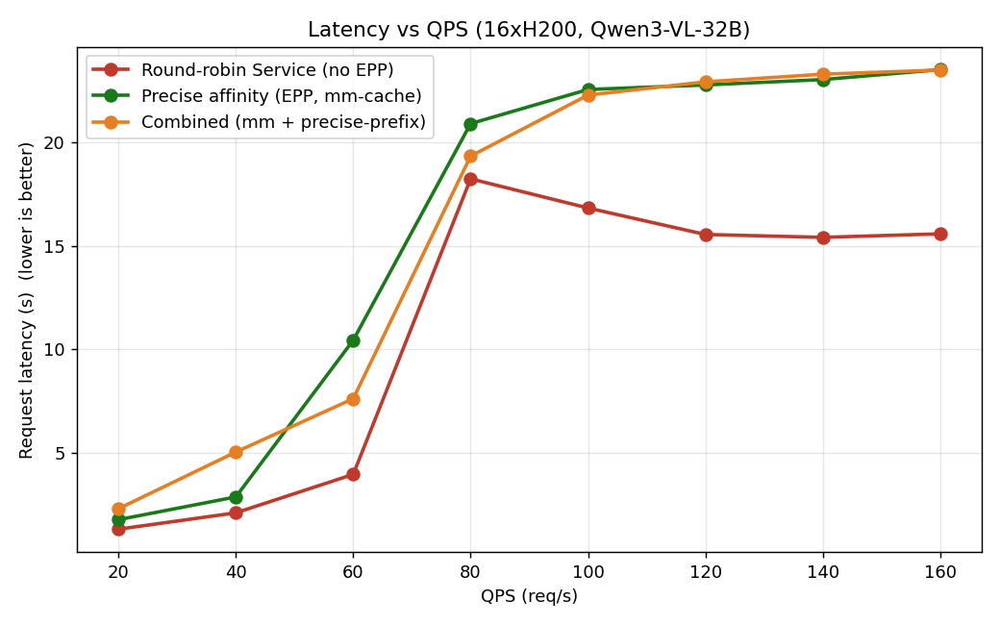
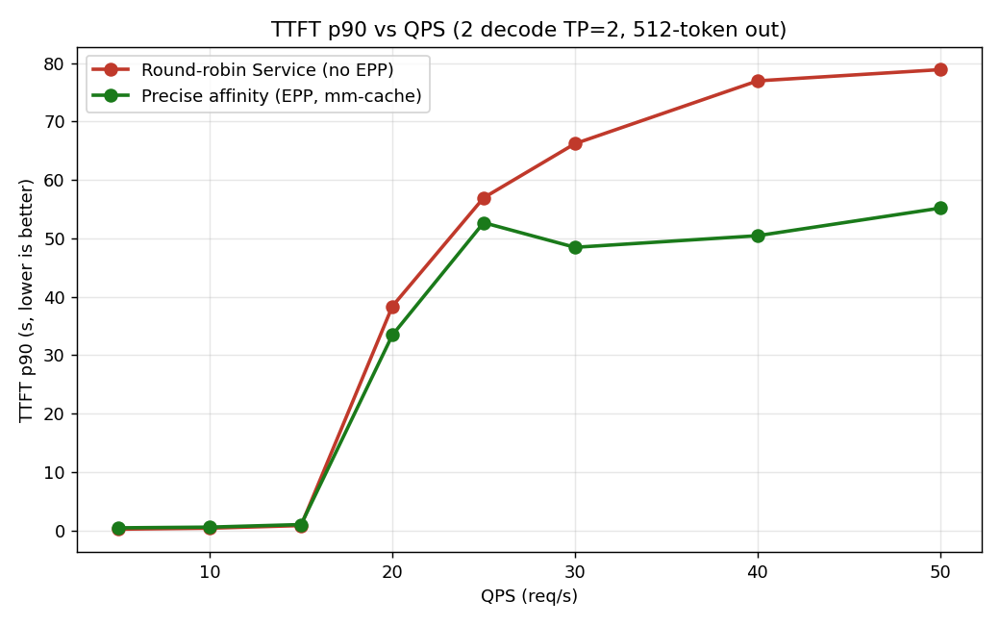
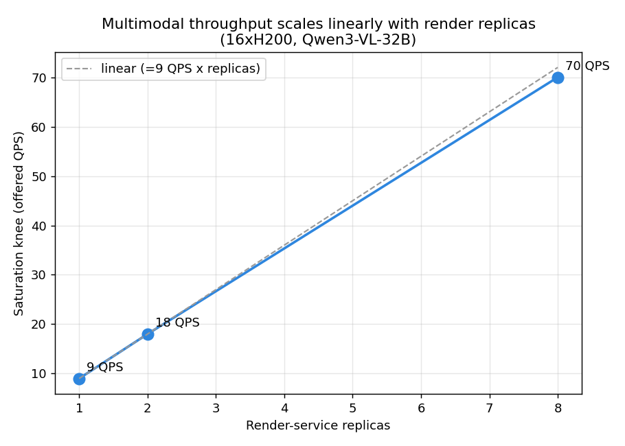

# Multimodal Precise Affinity

## Overview

Repeated multimodal content is a routing opportunity: a single image expands to ~1500+ vision tokens through the render/encoder stage before prefill, so when the same image or video recurs across requests, routing the repeat to the pod that already encoded it skips that work, cutting TTFT and freeing encoder and prefill cycles.

This guide routes on per-pod **encoder-cache** affinity: the router tracks, per pod, which multimodal items were most recently routed there (a best-effort estimate of encoder-cache residency, built from its own routing decisions rather than a read of the model server's cache) and sends a request to the pod holding the largest resident fraction. It is a routing capability over the encoder cache; which modalities the endpoint accepts is the model's concern, not the guide's (the reference model serves image and video).

Unlike [optimized-baseline](../optimized-baseline/), which estimates reuse from approximate hashes, this tracks exact multimodal item hashes per pod. The trade is a render call on the routing path, served by a standalone render Service.

- **Precise multimodal-cache aware**: the `token-producer` calls the vLLM render endpoint (`/v1/chat/completions/render`) to resolve the multimodal prefix exactly. The [mm-embeddings-cache-producer](https://github.com/llm-d/llm-d-router/tree/main/pkg/epp/framework/plugins/requestcontrol/dataproducer/multimodal) records, per pod, which item hashes were last routed there (a bounded LRU); the [mm-embeddings-cache-scorer](https://github.com/llm-d/llm-d-router/tree/main/pkg/epp/framework/plugins/scheduling/scorer/mmcacheaffinity) scores candidates by resident-item fraction.
- **Load-aware**: the kv-cache-utilization and queue scorers balance against pod pressure so a warm pod is not overloaded.

## Default Configuration

| Parameter           | Value |
| ------------------- | ----- |
| Model               | [Qwen/Qwen3-VL-32B-Instruct](https://huggingface.co/Qwen/Qwen3-VL-32B-Instruct) (vision: image + video) |
| Replicas            | 2 |
| Tensor Parallelism  | 2 |
| GPUs per replica    | 2 |
| Total GPUs          | 4 |
| Render              | standalone `mm-render` Service (CPU) |

### Supported Hardware Backends

| Backend    | Directory               | Notes                 |
| ---------- | ----------------------- | --------------------- |
| NVIDIA GPU | `modelserver/gpu/vllm/` | Default configuration |

> [!NOTE]
> The `token-producer` `modelName` in [`router/precise-affinity.values.yaml`](router/precise-affinity.values.yaml) must match the model the overlay deploys, or render output will not match resident cache state.

## Prerequisites

- A cluster with at least 4 GPUs (2 replicas x 2 GPUs) of the chosen backend, plus CPU headroom for the `mm-render` Service.
- Have the [proper client tools installed on your local system](../../../helpers/client-setup/README.md) to use this guide.
- Checkout the llm-d repo:

  ```bash
  export branch="main" # branch, tag, or commit hash
  git clone https://github.com/llm-d/llm-d.git && cd llm-d && git checkout ${branch}
  ```

- Set the following environment variables:

  ```bash
  export GAIE_VERSION=v1.5.0
  export ROUTER_CHART_VERSION=v0
  export GUIDE_NAME="precise-affinity"
  export NAMESPACE="llm-d-multimodal-precise-affinity"
  export REPO_ROOT=$(realpath $(git rev-parse --show-toplevel))
  ```

- Install the Gateway API Inference Extension CRDs:

  ```bash
  kubectl apply -f https://github.com/kubernetes-sigs/gateway-api-inference-extension/releases/download/${GAIE_VERSION}/v1-manifests.yaml
  ```

- Create the namespace:

  ```bash
  kubectl create namespace ${NAMESPACE} --dry-run=client -o yaml | kubectl apply -f -
  ```

- Create the `llm-d-hf-token` secret in the namespace so the model server and render Service can pull the model. See [helpers/hf-token.md](../../../helpers/hf-token.md).

## Installation Instructions

### 1. Deploy the llm-d Router

#### Standalone Mode

Deploy the llm-d Router in Standalone Mode. The release name `${GUIDE_NAME}` is mandatory; the inference pool selector matches a guide label that pairs with this release. Render runs as a standalone Service (deployed in step 3), so `router.tokenizer.enabled` is `false` and `token-producer.vllm.url` points at the `mm-render` Service.

```bash
helm install ${GUIDE_NAME} \
  oci://ghcr.io/llm-d/charts/llm-d-router-standalone-dev \
  -f ${REPO_ROOT}/guides/recipes/router/base.values.yaml \
  -f ${REPO_ROOT}/guides/multimodal-serving/${GUIDE_NAME}/router/${GUIDE_NAME}.values.yaml \
  -n ${NAMESPACE} --version ${ROUTER_CHART_VERSION}
```

<details>
<summary><b>Gateway Mode</b></summary>

To use a Kubernetes Gateway managed proxy instead of the standalone Envoy sidecar:

1. **Deploy a Kubernetes Gateway** named `llm-d-inference-gateway`. See [the gateway guides](../../prereq/gateways).
2. **Deploy the llm-d Router and HTTPRoute** via the `llm-d-router-gateway` chart:

```bash
export PROVIDER_NAME=istio # options: none, gke, agentgateway, istio
helm install ${GUIDE_NAME} \
  oci://ghcr.io/llm-d/charts/llm-d-router-gateway-dev \
  -f ${REPO_ROOT}/guides/recipes/router/base.values.yaml \
  -f ${REPO_ROOT}/guides/recipes/router/features/httproute-flags.yaml \
  -f ${REPO_ROOT}/guides/multimodal-serving/${GUIDE_NAME}/router/${GUIDE_NAME}.values.yaml \
  --set provider.name=${PROVIDER_NAME} \
  -n ${NAMESPACE} --version ${ROUTER_CHART_VERSION}
```

</details>

### 2. Deploy the Model Server

```bash
kubectl apply -n ${NAMESPACE} -k ${REPO_ROOT}/guides/multimodal-serving/${GUIDE_NAME}/modelserver/gpu/vllm/base/
```

### 3. Deploy the Render Service

The EPP `token-producer` calls this Service to resolve the multimodal prefix. It is CPU-only and scales independently of the decode pods.

```bash
kubectl apply -n ${NAMESPACE} -f ${REPO_ROOT}/guides/multimodal-serving/${GUIDE_NAME}/render/render.yaml
```

## Verification

### 1. Get the IP of the Proxy

#### Standalone Mode

```bash
export IP=$(kubectl get service ${GUIDE_NAME}-epp -n ${NAMESPACE} -o jsonpath='{.spec.clusterIP}')
```

<details>
<summary><b>Gateway Mode</b></summary>

```bash
export IP=$(kubectl get gateway llm-d-inference-gateway -n ${NAMESPACE} -o jsonpath='{.status.addresses[0].value}')
```

</details>

### 2. Send a Multimodal Test Request

Open a debug container in the namespace, then send the same text + image request twice. The router resolves the prefix via the render Service on the first request, then routes the second to the pod that already holds it; confirm both land on the same pod via the `x-inference-pod` response header:

```bash
curl -i -X POST http://${IP}/v1/chat/completions \
    -H 'Content-Type: application/json' \
    -d '{
        "model": "Qwen/Qwen3-VL-32B-Instruct",
        "messages": [
            {
                "role": "user",
                "content": [
                    { "type": "text", "text": "What details are present in this photo?" },
                    { "type": "image_url", "image_url": { "url": "https://picsum.photos/id/237/640/360" } }
                ]
            }
        ]
    }'
```

On repeated content, `llm_d_router_epp_encoder_cache_hits_total{pod=...}` increments for each pod estimated to hold the item (it is counted at scoring time, before the pick).

## How It Works

1. The `token-producer` calls the vLLM render endpoint (`/v1/chat/completions/render`) to resolve the request's multimodal prefix.
2. The `mm-embeddings-cache-producer` records, per pod, which multimodal item hashes were last routed there, in a bounded per-pod LRU. Its size is set by `cacheSizeInMBPerServer` in [`router/precise-affinity.values.yaml`](router/precise-affinity.values.yaml). The producer is self-contained: it tracks live pods via the framework pod list and updates the LRU from its own routing decisions; no endpoint-notification or data-layer wiring is required.
3. The `mm-embeddings-cache-scorer` returns the resident-item fraction per candidate; the `max-score-picker` routes to the highest-scoring pod.

> [!NOTE]
> The render call runs synchronously on the routing hot path on every request, served by the CPU-only `mm-render` Service. Scale that Service (see Render-Service Scaling) so render stays off the critical path. Affinity is best-effort: the per-pod LRU is the router's estimate of residency, so it can mis-route after the model server's encoder cache evicts an item, and a router or model-server restart resets it until pods re-warm.

## Cleanup

```bash
helm uninstall ${GUIDE_NAME} -n ${NAMESPACE}
kubectl delete -n ${NAMESPACE} -f ${REPO_ROOT}/guides/multimodal-serving/${GUIDE_NAME}/render/render.yaml
kubectl delete -n ${NAMESPACE} -k ${REPO_ROOT}/guides/multimodal-serving/${GUIDE_NAME}/modelserver/gpu/vllm/base/
kubectl delete namespace ${NAMESPACE}
```

## Benchmarking Report

The benchmark serves Qwen3-VL-32B-Instruct on vLLM 0.23 with 2 decode model servers (TP=2) and an
8-replica CPU `vllm launch render` Service. Outputs are 512 tokens, a decode-heavy operating point
where the decode GPUs, not render, are the bottleneck (with 8 render replicas the render stage
saturates near 70 QPS, well above the decode knee at ~15 QPS). The workload is a shared-prefix
multimodal mix (cached and fresh images) swept over an offered-QPS ladder.

### Comparing Precise Affinity to a Simple Kubernetes Service

Graphs below compare precise-affinity routing to a stock Kubernetes Service that round-robins requests
across the same decode pods (no EPP, no scoring). Throughput is matched; under saturation precise
affinity holds a lower TTFT p90 (~30% at the top of the ladder). The mm-embeddings cache hit ~50% of
items; at these saturated TTFTs the gain comes from affinity reusing encoder output and shaping per-pod
load, not from per-request encode savings alone (a few hundred ms cannot explain a tens-of-seconds
gap that is dominated by queue wait).





<details>
<summary><b><i>Click</i></b> to view the per-rate breakdown</summary>

Output tokens/sec, higher is better; TTFT in seconds, lower is better.

| Offered QPS | k8s Output | Precise-affinity Output | k8s TTFT p90 | Precise-affinity TTFT p90 |
|-----:|-----------:|------------------------:|-------------:|--------------------------:|
| 15 | 7,684 | 7,680 | 0.9 | 1.0 |
| 20 | 8,928 | 8,682 | 38.4 | 33.5 |
| 30 | 8,398 | 8,223 | 66.2 | 48.5 |
| 50 | 7,351 | 7,241 | 78.9 | 55.2 |

</details>

### Render-Service Scaling

The render call runs on the routing path for every multimodal request, so render is a horizontal
scaling axis: swept across 1, 2, and 8 render-Service replicas the render saturation knee moves 9, 18,
70 QPS. Deploy render as a Service sized to peak multimodal QPS rather than a single co-located
sidecar.


