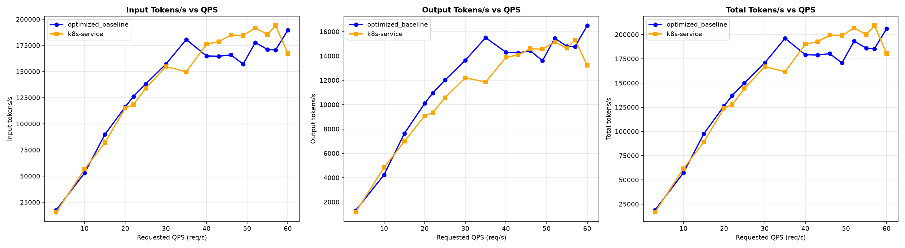
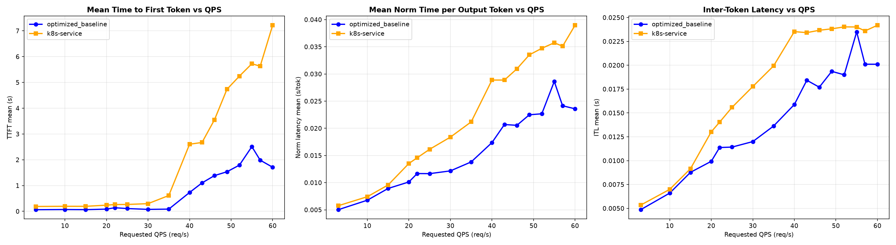
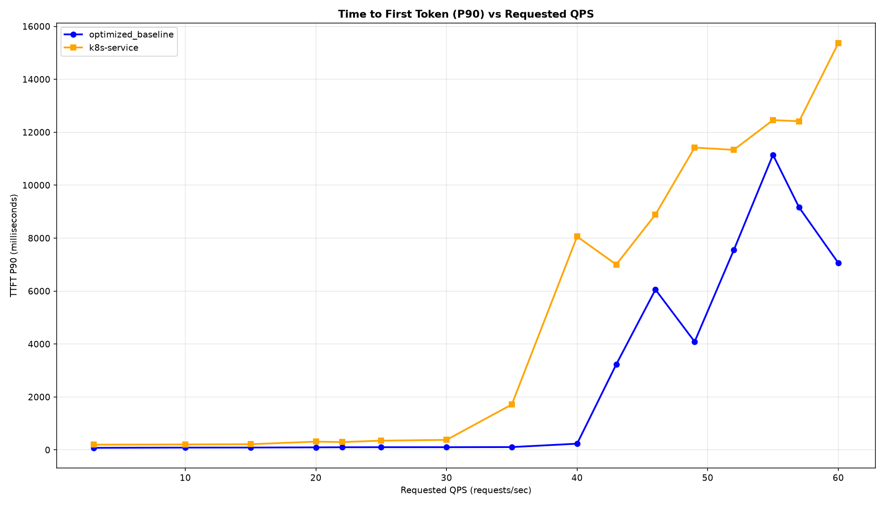

# Benchmark Report

The benchmark runs with decoders model openai/gpt-oss-120b on 16 × H100 GPUs, distributed across 16 H100 model servers with TP=1 and a modified workload template:
Update [guide_optimized-baseline_1.yaml workload template](../../README.md#3-run-the-benchmark-profile-for-optimized-baseline) with: `workload.shared_prefix.data.shared_prefix.output_len`: 500 and `workload.shared_prefix.data.shared_prefix.question_len`: 500.

> [!NOTE]
> These results use the `prefix-cache-affinity-filter` with `peakPrefillThroughput: 39065` — the gpt-oss value from the
> [calibration matrix](../../../recipes/router/calibration/configuration-matrix.md) (`gpu/vllm/gpt-oss` row), which a live
> `calibrate.sh` run reproduces to within 1% (measured 38,980 and 39,364 across two runs). The model servers run with
> `--gpu-memory-utilization=0.95` (the vLLM 0.9 default leaves too little KV headroom for gpt-oss-120b's 128k context on an
> 80&nbsp;GB H100). Both arms below were measured on the **same 16 pods with the same server config** — only the routing differs.

## Comparing llm-d Routing to a Simple Kubernetes Service (vLLM Additional Configuration: gpt-oss-120b)

Graphs below compare optimized-baseline routing to a stock Kubernetes Service that round-robins requests across the same 16 vLLM pods (no EPP, no scoring).

Summary across the full ladder (rates 3 → 60), 0 failed requests on either arm:

| Metric            | k8s service (RR) | llm-d Optimized | Δ% vs k8s |
| :---------------- | :--------------- | :-------------- | :-------- |
| Output tokens/sec | 7,018            | 7,594           | +8.2%     |
| TTFT mean (s)     | 3.368            | 1.166           | −65.4%    |
| TTFT p90 (s)      | 10.110           | 2.508           | −75.2%    |
| ITL mean (ms)     | 20.94            | 16.82           | −19.7%    |

The routing win is clearest in the tail: a stock Service degrades badly once the fleet saturates (TTFT p90 climbs past 8&nbsp;s from rate 40 on, reaching 15&nbsp;s at rate 60), while prefix-cache-affinity routing holds first-token latency an order of magnitude lower through the same range.

<b><i>Click</i></b> to view the per-rate breakdown across the full ladder

Output tokens/sec — higher is better; TTFT in seconds — lower is better.

| Rate | k8s Output | llm-d Output | k8s TTFT mean | llm-d TTFT mean | k8s TTFT p90 | llm-d TTFT p90 |
| ---: | ---------: | -----------: | ------------: | --------------: | -----------: | -------------: |
|  3   | 1,160      | 1,301        | 0.176         | 0.063           | 0.198        | 0.078          |
| 10   | 4,836      | 4,240        | 0.180         | 0.070           | 0.206        | 0.087          |
| 15   | 6,986      | 7,639        | 0.184         | 0.065           | 0.215        | 0.089          |
| 20   | 9,077      | 10,104       | 0.243         | 0.086           | 0.313        | 0.097          |
| 22   | 9,346      | 10,967       | 0.245         | 0.140           | 0.296        | 0.100          |
| 25   | 10,579     | 12,021       | 0.263         | 0.108           | 0.350        | 0.102          |
| 30   | 12,211     | 13,654       | 0.285         | 0.076           | 0.378        | 0.103          |
| 35   | 11,861     | 15,505       | 0.598         | 0.086           | 1.715        | 0.107          |
| 40   | 13,889     | 14,311       | 2.588         | 0.731           | 8.060        | 0.235          |
| 43   | 14,089     | 14,262       | 2.664         | 1.103           | 7.002        | 3.232          |
| 46   | 14,603     | 14,425       | 3.545         | 1.386           | 8.892        | 6.057          |
| 49   | 14,562     | 13,615       | 4.727         | 1.535           | 11.420       | 4.088          |
| 52   | 15,158     | 15,465       | 5.238         | 1.793           | 11.336       | 7.551          |
| 55   | 14,644     | 14,796       | 5.735         | 2.510           | 12.459       | 11.146         |
| 57   | 15,330     | 14,775       | 5.630         | 1.984           | 12.415       | 9.160          |
| 60   | 13,234     | 16,501       | 7.194         | 1.711           | 15.365       | 7.063          |

