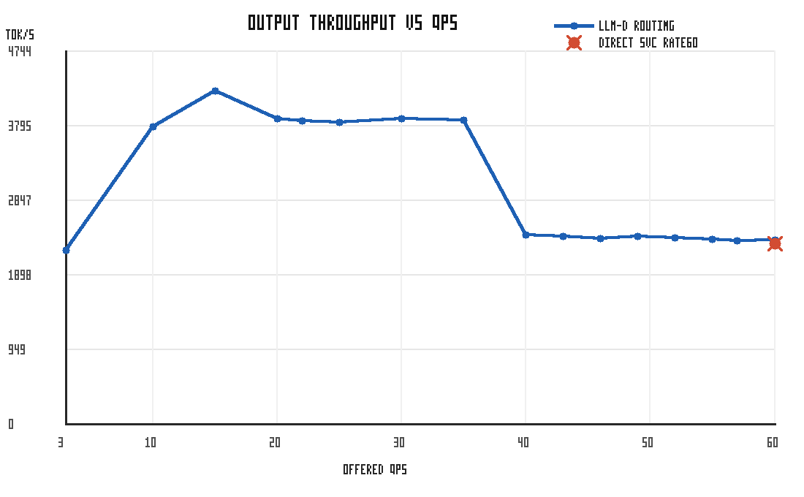
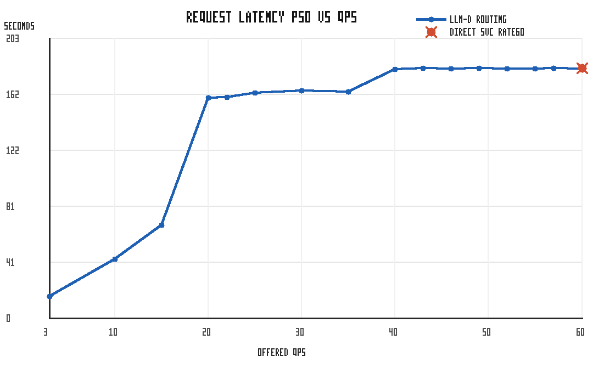
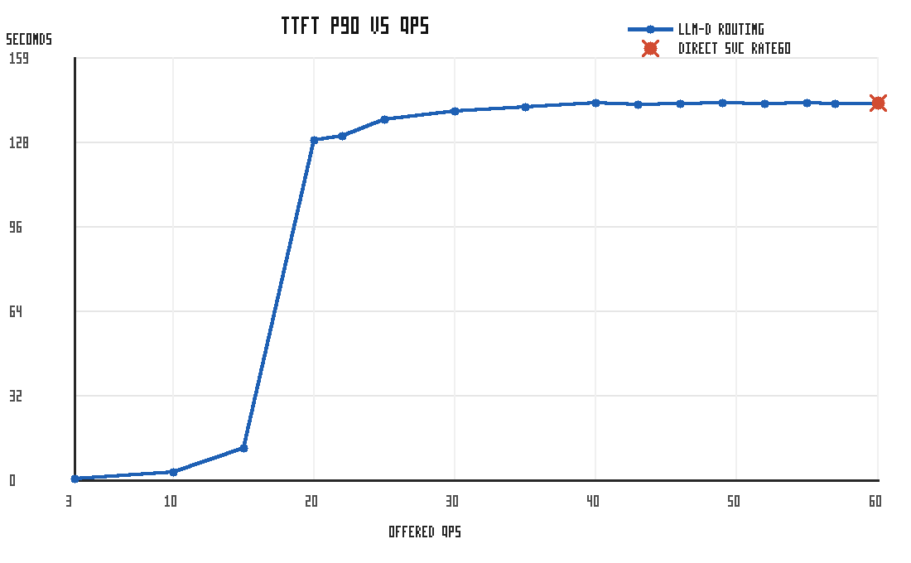

# Qwen3.5-4B RTX PRO 6000 Reduced-Footprint Benchmark Report

The benchmark runs with decoder model Qwen/Qwen3.5-4B on NVIDIA RTX PRO 6000 Blackwell Server Edition GPUs, using native NVIDIA Kubernetes device-plugin allocation. The deployment uses 2 vLLM model servers, 1 GPU per server, and TP=1. Workload is the guide's `guide_optimized-baseline_1.yaml` shared-prefix profile (6,000-token shared system prompt + 1,200-token question, 1,000-token target output) driven as a Poisson rate ladder.

This report is reduced-footprint validation data for the Qwen/Qwen3.5-4B, TP=1, 2-replica configuration. It is intentionally not presented as a replacement for the existing optimized-baseline Qwen3-32B/H100 benchmark data, and it does not show a clear EPP acceleration result for this smaller setup.

> [!IMPORTANT]
> The llm-d routing arm completed the full ladder. The plain Kubernetes Service arm timed out during the final full-ladder stage before stage metrics were written, so the direct-Service data shown here is a targeted retest of the final `rate=60` point using `guide_optimized-baseline_stage16_only.yaml` (warmup + rate 60 only). Treat the direct point as saturation evidence for the final QPS point, not as a complete direct-Service curve.

## Comparing llm-d Routing to a Plain Kubernetes Service (vLLM)

Graphs below compare the full llm-d optimized-routing ladder against the direct-Service `rate=60` retest point on the same two vLLM pods.

Summary:

| Metric | llm-d optimized routing | Plain Service retest | Notes |
| :----- | :---------------------- | :--------------- | :---- |
| Peak output tokens/s | 4,236 @ rate 15 | - | direct full ladder did not complete |
| Output tokens/s @ rate 60 | 2,343 | 2,292 | both saturated at this point |
| Requests/sec @ rate 60 | 2.12 | 2.12 | offered QPS was 60 |
| TTFT p50 @ rate 60 | 35.9s | 36.4s | lower is better |
| TTFT p90 @ rate 60 | 142.1s | 142.3s | lower is better |
| Request latency p50 @ rate 60 | 180.9s | 181.0s | lower is better |
| Failures @ rate 60 | 805/1500 (53.7%) | 811/1500 (54.1%) | request timeout was 300s |

The RTX PRO 6000 / Qwen3.5-4B two-replica setup saturates before the top of this workload's rate ladder. At the final `rate=60` point, both routing modes drain at roughly 2.1 requests/sec and report about half of requests as failed due to the 300s request timeout. The llm-d full ladder remains useful for showing where saturation begins, but this data should not be presented as a clean full-curve Service comparison.

This result should also not be read as evidence that EPP always accelerates every deployment. EPP routing helps when the router has useful signal to act on, such as uneven endpoint load, prefix-cache locality, or saturation differences between replicas. In this run, the final comparison point is already globally GPU-bound: both endpoints process roughly the same completed request rate and both hit high timeout failure rates. The router values also use the guide defaults, whose `peakPrefillThroughput` is calibrated for the reference Qwen3-32B on H100 TP=2 setup rather than this RTX PRO 6000 / Qwen3.5-4B TP=1 setup.

For a future acceleration-focused report, calibrate `peakPrefillThroughput` for this model and hardware, then rerun both EPP and direct Service arms on the same feasible rate ladder before saturation dominates. Points with high timeout failure rates are useful for locating capacity limits, but they are not good evidence for routing speedup.

## PR Interpretation

This data supports a narrow conclusion: the reduced Qwen/Qwen3.5-4B, TP=1, 2-replica setup lowers the hardware footprint, but this particular benchmark environment does not demonstrate the optimized-baseline routing benefit seen in larger reference runs. The main limiter is capacity: the two RTX PRO 6000 replicas saturate early on this long shared-prefix workload, and the final direct-Service comparison point is already dominated by request timeouts.

Therefore, this report should be used as disclosure for the reduced-footprint configuration, not as proof of EPP performance improvement. The existing Qwen3-32B/H100 benchmark remains the better reference for optimized-baseline routing behavior on the original full-size setup.

<b><i>Click</i></b> to view the per-rate breakdown

Output tokens/sec is higher-is-better. TTFT p90 is in seconds and lower-is-better. Direct-Service data is available only for the retested `rate=60` point.

| Rate | llm-d output tok/s | llm-d req/s | llm-d TTFT p90 | llm-d failures | Direct output tok/s | Direct req/s | Direct TTFT p90 | Direct failures |
| ---: | -----------------: | ----------: | -------------: | ------------: | ------------------: | -----------: | --------------: | --------------: |
| 3 | 2,208 | 2.06 | 0.3s | 0/60 | - | - | - | - |
| 10 | 3,783 | 3.59 | 2.9s | 0/200 | - | - | - | - |
| 15 | 4,236 | 3.82 | 12.1s | 0/300 | - | - | - | - |
| 20 | 3,883 | 3.52 | 128.3s | 0/760 | - | - | - | - |
| 22 | 3,856 | 3.52 | 130.0s | 0/748 | - | - | - | - |
| 25 | 3,839 | 3.52 | 136.2s | 0/750 | - | - | - | - |
| 30 | 3,887 | 3.52 | 139.3s | 0/750 | - | - | - | - |
| 35 | 3,861 | 3.50 | 140.9s | 0/735 | - | - | - | - |
| 40 | 2,409 | 2.16 | 142.4s | 786/1520 | - | - | - | - |
| 43 | 2,391 | 2.14 | 141.8s | 830/1548 | - | - | - | - |
| 46 | 2,356 | 2.14 | 141.9s | 800/1518 | - | - | - | - |
| 49 | 2,388 | 2.15 | 142.3s | 759/1470 | - | - | - | - |
| 52 | 2,366 | 2.14 | 142.0s | 801/1508 | - | - | - | - |
| 55 | 2,345 | 2.13 | 142.3s | 786/1485 | - | - | - | - |
| 57 | 2,333 | 2.12 | 142.1s | 792/1482 | - | - | - | - |
| 60 | 2,343 | 2.12 | 142.1s | 805/1500 | 2,292 | 2.12 | 142.3s | 811/1500 |

## Reproduction Notes

- Model: `Qwen/Qwen3.5-4B`
- Hardware: NVIDIA RTX PRO 6000 Blackwell Server Edition
- GPU allocation: native NVIDIA Kubernetes device plugin
- vLLM replicas: 2
- GPUs per replica: 1
- Tensor parallelism: 1
- Workload storage: static local PV with `local-storage`
- llm-d routing run: `/tmp/ob-qwen35-rtxpro-epp-recover/latest/results/inference-perf-1786612061-6i3res_1`
- Direct-Service retest run: `/tmp/ob-qwen35-rtxpro-direct-stage16/latest/results/inference-perf-1786676500-n5vapi_1`
