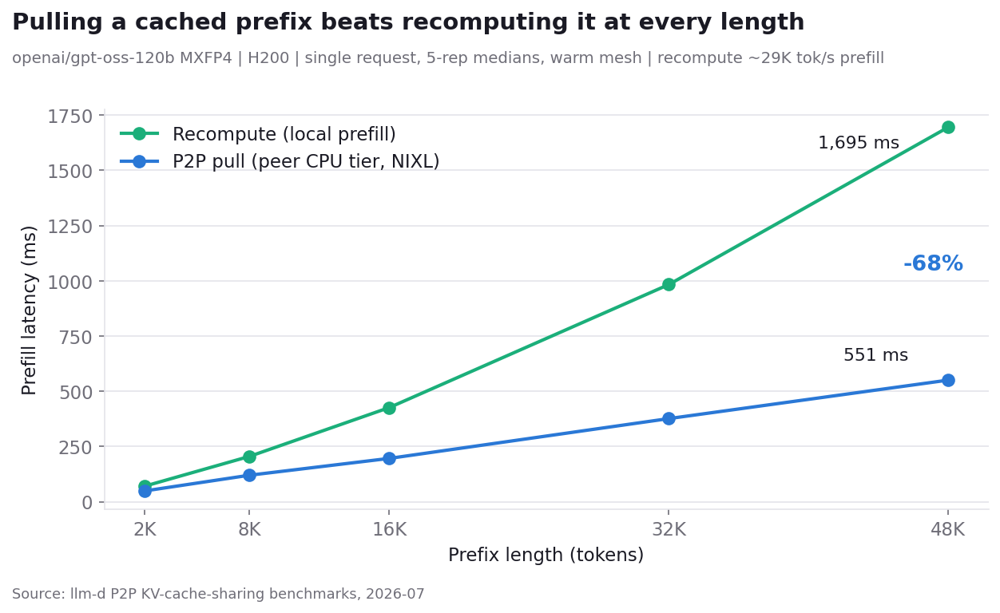
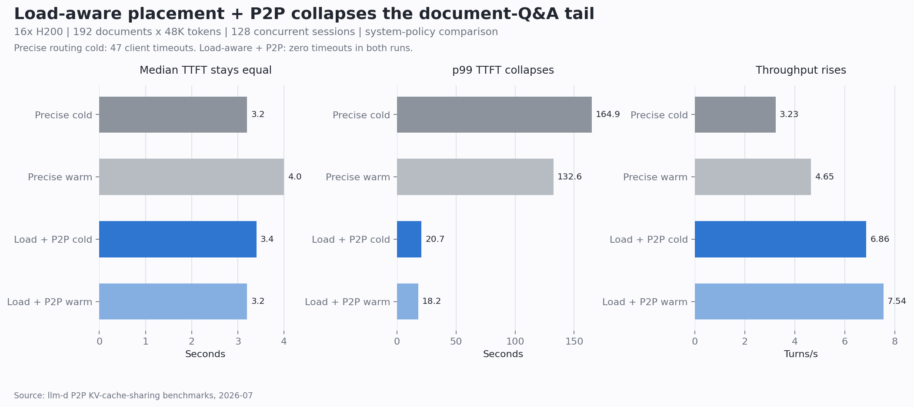

# openai/gpt-oss-120b P2P KV Cache Sharing Benchmark on vLLM (H200)

The benchmark runs `openai/gpt-oss-120b` (MXFP4) aggregated, one H200 per
pod (TP=1), ~1.22M tokens of GPU KV per pod (measured from the engine
startup log at `--gpu-memory-utilization=0.85`, `--max-model-len=65536`),
an 88 GiB CPU offload tier per pod (~1.8x the GPU KV cache), vLLM block
size 64, KV transfers over NIXL. Routing uses the llm-d
inference gateway with the precise (KV-event-fed) prefix index; the P2P arm
adds the `p2p-source-producer` with `minCachedTokenDelta: 2048`. The
document Q&A scenario ran on 14 pods; the pool scenarios on 16. Workload
profiles, EPP arm configurations, and the run protocol are in
[../benchmarking/README.md](../benchmarking/README.md).

## Pull versus recompute (single request)

Single source-consumer pod pair, fresh prefix seeded on the source,
prefill latency measured on a cold consumer, 5-rep medians:

| prefix tokens | recompute | P2P pull | delta |
|---|---|---|---|
| 2,048 | 70.6 ms | 49.0 ms | -31% |
| 8,192 | 205.4 ms | 120.1 ms | -42% |
| 16,384 | 426.3 ms | 196.2 ms | -54% |
| 32,768 | 983.0 ms | 376.3 ms | -62% |
| 49,152 | 1,695 ms | 550.5 ms | -68% |

The pull wins at every measured length and the gap grows with the prefix;
the smallest winning length sets the router's `minCachedTokenDelta: 2048`.

## Document Q&A (the headline)

192 conversations, each with a private 48K-token document prefix, 6 short
questions (256-token answers), 128 conversations concurrent. The
~9.2M-token corpus fits inside the fleet's aggregate GPU KV (14 pods x
~1.22M tokens/pod ~= 17M) with room to spare - so the displacement here is
not capacity scarcity. The likelier driver: the baseline's composite
scorer (prefix-cache weight 3, queue weight 2, kv-util weight 2,
no-hit-lru weight 2) trades a document's cache locality for load-balancing
under 128 concurrent sessions spread across only 14 owner pods, so a burst
of turns can still queue behind an overloaded owner or land on a colder
pod that recomputes. This is consistent with the P2P arm moving 30-32M
prefix tokens per run - more than 3x the corpus - implying repeated
cross-pod placement rather than one-time cold misses. Load-aware placement
plus the pull removes the tradeoff: every question goes to whichever pod
is least loaded, and that pod pulls the prefix instead of recomputing or
queueing for it. Adding the pull to precise placement instead only
partially closes the gap - it recovers the cache-locality cost of a
cross-pod placement but not the queueing cost of a decision that still
prefers a busy owner. All six runs across the three arms completed
1,152/1,152 turns with zero errors and zero restarts.

TTFT p50 / p95 / p99 (s); throughput (turns/s):

| run | Precise prefix routing | Precise + P2P (recommended default) | Load-aware + P2P (wins this scenario) |
|---|---|---|---|
| 1 | 4.1 / 41.0 / 80.5; 5.98 | 4.0 / 27.7 / 48.8; 5.6 | 4.5 / 13.0 / 20.9; 7.02 |
| 2 (order reversed / 2nd run) | 4.2 / 17.3 / 37.2; 7.66 | 2.6 / 33.6 / 67.2; 5.7 | 3.9 / 12.5 / 26.7; 7.76 |

Precise + P2P sits between the other two arms on tail latency in both
runs: it improves on precise-only's worst case but its p95/p99 never
reach load-aware + P2P's range here. On the uniform pool below, the
result reverses - load-aware + P2P is the one that degrades. The guide
ships precise + P2P as the default because it is the safer general-purpose
choice across both regimes; reach for load-aware + P2P specifically for
workloads shaped like this one.

Medians are equal; the arms separate on tails and stability: p99 TTFT
21-27 s versus 37-81 s, up to +17% throughput, and 10% run-to-run spread
versus 28%. The P2P arm moved 30-32M prefix tokens between pods per run.

## Uniform shared-prefix pool (three arms)

128 shared prefixes x 48K tokens (~5x one pod's GPU cache), 256-token
questions, 64-token outputs, constant-rate stages, `rdma/ib` on every pod.
Achieved rate (req/s) / request latency p50:

| offered | Affinity | Load, no P2P | Load + P2P |
|---|---|---|---|
| 6 req/s | 5.97 / 0.50 s | 5.59 / 5.6 s | 5.96 / 0.64 s |
| 12 req/s | 11.92 / 0.49 s | 9.02 / 26.2 s | 11.49 / 0.98 s |
| 18 req/s | 17.87 / 0.48 s | 8.58 / 45.7 s | 17.46 / 0.67 s |
| 24 req/s | 23.82 / 0.48 s | 9.01 / 63.4 s | 21.93 / 0.70 s |
| 30 req/s | 29.76 / 0.48 s | 9.21 / 81.2 s | 29.19 / 0.73 s |

A uniform pool is affinity's best case and it is near-ideal here: flat
sub-half-second p50 through 30 req/s (affinity + P2P matches it within
noise; the pull idles under affinity placement). The recompute control
saturates near 9 req/s - every cross-pod placement re-prefills 48K tokens.
The pull sets load placement's floor: load + P2P tracks offered rate
through 30 req/s at sub-second p50, +143% over the recompute floor at rate
24 (21.93 vs 9.01 req/s; 0.70 s vs 63.4 s p50) and +217% at rate 30, on
120 P2P sessions moving 210M prefix tokens. Affinity stays ahead by a
constant factor (0.48 vs 0.73 s) because scattering pays transfer work
affinity never pays; zero failures and zero restarts in all arms.

## Hot set (the payoff case)

8 shared prefixes x 48K tokens, 512-token outputs, rates past what the 8
owner pods can absorb. Achieved rate (req/s) / latency p50 (s) / failures:

| offered | Affinity (8 owners) | Load + P2P (16 pods) |
|---|---|---|
| 24 req/s | 14.7 / 27.0 / 0 | 20.9 / 9.6 / 0 |
| 36 req/s | 15.3 / 53.8 / 0 | 29.1 / 15.9 / 0 |
| 48 req/s | 13.1 / 75.3 / 672 | 34.3 / 26.0 / 0 |

The owners cap near 15 req/s and shed 672 requests to the client timeout;
load-aware placement plus the pull serves the same hot content from the
whole fleet at 2.6x the throughput with zero failures.
