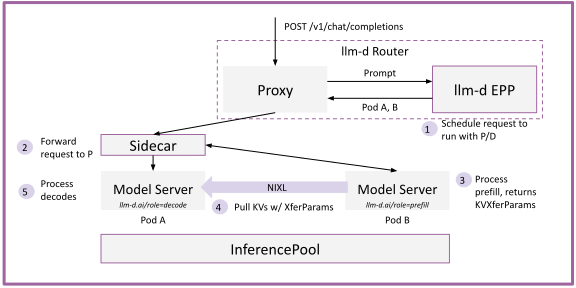

# P/D Disaggregation

[](https://github.com/llm-d/llm-d/actions/workflows/consolidate-status-pd-disaggregation-cks-acc-gpu-vllm-x.yaml)
[](https://github.com/llm-d/llm-d/actions/workflows/consolidate-status-pd-disaggregation-gke-acc-gpu-vllm-x.yaml)
[](https://github.com/llm-d/llm-d/actions/workflows/consolidate-status-pd-disaggregation-gke-acc-gpu-sglang-x.yaml)
[](https://github.com/llm-d/llm-d/actions/workflows/consolidate-status-pd-disaggregation-gke-acc-tpu-vllm-x.yaml)
[](https://github.com/llm-d/llm-d/actions/workflows/consolidate-status-pd-disaggregation-ibm-acc-gpu-vllm-x.yaml)
[](https://github.com/llm-d/llm-d/actions/workflows/consolidate-status-pd-disaggregation-intel-acc-xpu-vllm-x.yaml)
[](https://github.com/llm-d/llm-d/actions/workflows/consolidate-status-pd-disaggregation-amd-ci-acc-rocm-vllm-nixl.yaml)
[](https://github.com/llm-d/llm-d/actions/workflows/consolidate-status-pd-disaggregation-amd-ci-acc-rocm-vllm-moriio.yaml)

## Overview

This guide splits inference into separate **prefill** and **decode** pools. Prefill pods process the prompt and produce its KV cache; decode pods pull that KV cache over a KV transfer connector (NIXL by default) and generate the output tokens. Both pools belong to one `InferencePool`, and the llm-d Router schedules every request twice: once onto a prefill pod and once onto a decode pod. Because disaggregation is built into the router, it composes with its other scorers:

- **Prefill** — the `prefix-cache-affinity-filter` keeps prefix groups on cache-warm prefill pods (gated by a calibrated `peakPrefillThroughput`), and the `token-load-scorer` picks the prefill pod with the least queued prompt work.
- **Decode** — the `active-request-scorer` picks the decode pod with the fewest in-flight requests, since pure decode is bound by concurrency rather than prompt throughput.

The default deployment serves `openai/gpt-oss-120b` on NVIDIA GPUs with **1 prefill pod (TP=1) and 1 decode pod (TP=4)**, 5 GPUs in total: the smallest topology that exercises the full P/D path. Production deployments scale the two pools independently (see [P/D Best Practices](#pd-best-practices)).

How the two pools are deployed depends on the accelerator:

- **NVIDIA GPU** (vLLM and SGLang): one LWS [`DisaggregatedSet`](https://lws.sigs.k8s.io/docs/concepts/disaggregatedset/) (`pd-disagg-vllm` or `pd-disagg-sglang`) with a `prefill` and a `decode` role, in a single slice. The set rolls both roles out as one version and can replicate the whole topology into independent copies (`slices`); it requires the LeaderWorkerSet controller (see [Prerequisites](#prerequisites)) and is covered in [Operating the DisaggregatedSet](#operating-the-disaggregatedset).
- **All other accelerators** (AMD, Intel XPU, Google TPU, Iluvatar, MetaX, Rebellions NPU): a prefill and a decode `Deployment` (`LeaderWorkerSet` groups for TPU7x dynamic sub-slices).

### Why P/D disaggregation

LLM inference has two computationally distinct phases:

- **Prefill** processes the entire input prompt in a single forward pass - it is compute-bound, bottlenecked by the GPU flops available.
- **Decode** generates output tokens one at a time from the KV-cache - it is memory-bandwidth-bound, bottlenecked by how fast data moves from HBM to on-chip memory.

For long context workloads (10:1 ISL:OSL) and medium-to-large models, separating prefill and decode into separate instances enables:

- Improved throughput via specialization of prefill and decode
- Improved quality of service, as long context prefills will not block decode work

### Architecture

<p align="center">
  <picture>
    <source media="(prefers-color-scheme: dark)">
    
  </picture>
</p>

The model server overlay creates a prefill and a decode role (all pods are part of the same `InferencePool`): the `prefill` and `decode` roles of a `DisaggregatedSet` on NVIDIA GPU, two `Deployments` on the other accelerators.

- The **prefill** role runs the prefill instances, labeled with `llm-d.ai/role=prefill`.
- The **decode** role runs the decode instances, labeled with `llm-d.ai/role=decode`. These pods have a routing proxy sidecar in front of the engine.

During the standard request flow:

- Request arrives at the proxy, which forwards the request to the router (EPP)
- The router schedules the request with P/D disaggregation, using the labels to detect the decode and prefill pods
- Request is routed to the decode pod's sidecar, which forwards the request to the selected prefill instance
- Prefill instance processes the prompt, returning metadata about how to retrieve the KV blocks
- Decode instance pulls the KVs with the KV transfer connector (NIXL by default, over RDMA such as IB, RoCE or EFA where available)
- Decode instance processes the decodes

See [PD Architecture](../../docs/architecture/advanced/disaggregation/README.md) for more details.

### P/D Best Practices

P/D disaggregation provides more flexibility in navigating the trade-off between throughput and interactivity ([ref](https://arxiv.org/html/2506.05508v1)).
In particular, due to the elimination of prefill interference to the decode phase, P/D disaggregation can achieve lower inter token latency (ITL), thus
improving interactivity. For a given ITL goal, P/D disaggregation can benefit overall throughput by:

- Specializing P and D workers for compute-bound vs latency-bound workloads
- Reducing the number of copies of the model (increasing KV cache RAM) with wide parallelism

However, P/D disaggregation is not a target for all workloads. We suggest exploring P/D disaggregation for workloads with:

- Medium-large models (e.g. gpt-oss-120b)
- Longer input sequence lengths (e.g 10k ISL | 1k OSL, not 200 ISL | 200 OSL)
- Sparse MoE architectures with opportunities for wide-ep

As a result, as you tune your P/D deployments, we suggest focusing on the following parameters:

- **Heterogeneous Parallelism**: deploy P workers with less parallelism and more replicas and D workers with more parallelism and fewer replicas, see the TP ratio warning below.
- **xPyD Ratios**: tuning the ratio of P workers to D workers to ensure balance for your ISL|OSL ratio. Scale the two roles independently (per-role `replicas` in the NVIDIA GPU `disaggregatedset.yaml`, `replicas` in the other overlays' `patch-prefill.yaml` / `patch-decode.yaml`); for example, 8 TP=1 prefill pods and 2 TP=4 decode pods (16 GPUs) suit a 5k ISL | 250 OSL workload on gpt-oss-120b.

> [!WARNING]
> The NixlConnector has known issues and limitations around TP ratio direction and stale agent caching after prefill pod restarts. See [Known NIXL Connector Issues and Limitations](../../docs/operations/disaggregation/vllm.md#known-nixl-connector-issues-and-limitations) for details.

## Supported Accelerators and Model Servers

This guide includes configurations for the following accelerator and model server combinations (set `ACCELERATOR_TYPE` and `MODEL_SERVER` accordingly). Each accelerator serves one model; `INFRA_PROVIDER` selects the platform overlay and, where an accelerator offers more than one, the KV transfer connector:

<!-- guide:support start -->
| Accelerator | `ACCELERATOR_TYPE` | Served model | vLLM | SGLang | Notes |
| --- | --- | --- | --- | --- | --- |
| NVIDIA GPU | `gpu` | `openai/gpt-oss-120b` | ✅ validated | ✅ validated | Default. H200 reference · 1 prefill (TP=1) + 1 decode (TP=4), 5 GPUs · `INFRA_PROVIDER`: `base`, `gke`, `gke/a4x`, `gke/a4xmax`, `coreweave`, `aws`, `cks-mooncake` (MooncakeConnector, vLLM only) · SGLang: 1 prefill (TP=2) + 1 decode (TP=2) |
| AMD GPU | `amd` | `amd/Llama-3.3-70B-Instruct-FP8-KV` | ✅ validated | — | 1 prefill (TP=1) + 1 decode (TP=4) · `INFRA_PROVIDER`: `base`, `amd-ci`, `oci`, `tensorwave`; MoRIIOConnector: `moriio/base`, `moriio/amd-ci`, `moriio/amd-ci-1p1d-tp8` (serve `Qwen/Qwen3-32B`) |
| Intel XPU | `xpu` | `Qwen/Qwen3-0.6B` | ✅ validated | — | 1 prefill + 1 decode × 1 GPU via DRA · `INFRA_PROVIDER`: `base`, `rdma` (NIXL over RDMA) |
| Google TPU v6e | `tpu/v6` | `Qwen/Qwen3-32B` | ✅ validated | — | GKE only (`INFRA_PROVIDER=gke`) · 1 prefill + 1 decode × 8 chips (`2x4`, TP=8) · `TPUConnector` |
| Google TPU v7 | `tpu/v7` | `Qwen/Qwen3.5-397B-A17B-FP8` | 🟡 community | — | GKE only (`INFRA_PROVIDER=gke`) · 1 prefill + 1 decode × 4 chips (`2x2x1`, TP=8) · `TPUConnectorHMA` · vLLM 0.26 |
| Google TPU v7 (dynamic slicing) | `tpu/v7-dynamic-slice` | `Qwen/Qwen3-Coder-480B-A35B-Instruct-FP8` | 🟡 community | — | GKE only (`INFRA_PROVIDER=gke`) · dynamic slicing + Kueue · 1 prefill + 1 decode, one `2x2x1` sub-slice each; see [below](#dynamic-sub-slices-tpu7x) |
| Iluvatar GPU | `iluvatar` | `Qwen/Qwen3-32B` | 🟡 community | — | BI-V150 · 1 prefill + 1 decode × 2 boards (TP=4) · `IluNixlConnector` |
| MetaX GPU | `metax` | `Qwen/Qwen3-32B` | 🟡 community | — | C500X · 1 prefill (TP=2) + 1 decode (TP=4) · NIXL over TCP |
| Rebellions NPU | `npu` | `MiniMaxAI/MiniMax-M2.7` | 🟡 community | — | 1 prefill (PP=4) + 1 decode (DP=4, EP) × 4 NPUs + 1 RoCE VF via DRA; see [below](#rebellions-npu) |

✅ validated: covered by a nightly E2E workflow · 🟡 community: maintained by the hardware vendor or community, not covered by nightly E2E · ❌ not supported: tracked in the linked issue · — no configuration.
<!-- guide:support end -->

> [!NOTE]
> Some hardware variants use reduced configurations (smaller models, fewer accelerators) to enable CI testing for compatibility and regression checks. These configurations are maintained by their respective hardware vendors and are not guaranteed as production-ready examples. Users deploying on non-default hardware should review and adjust the configurations for their environment.

### KV Transfer Connectors

P/D disaggregation requires a KV transfer connector to move KV cache blocks from prefill workers to decode workers. On vLLM it is configured with the `--kv-transfer-config` flag:

| Connector | Overlays | Transport | Notes |
| --------- | -------- | --------- | ----- |
| NixlConnector | default on NVIDIA GPU, AMD GPU, Intel XPU, MetaX and Rebellions NPU | UCX (RDMA / TCP) | Supports heterogeneous TP across P/D. |
| MooncakeConnector | `gpu/vllm/cks-mooncake` | RDMA via Mooncake Transfer Engine | CKS with InfiniBand. See the details below. |
| MoRIIOConnector | `amd/vllm/moriio/*` | RDMA via MoRI-IO | AMD GPU. |
| TPUConnector / TPUConnectorHMA | `tpu/*` | TPU ICI / DCN | From `tpu_inference`; HMA on TPU7x. |
| IluNixlConnector | `iluvatar/vllm/base` | UCX with CUDA-aware transports | Iluvatar's fork of NixlConnector. See the note below. |

> [!IMPORTANT]
> NIXL supports TCP transfer, but high-bandwidth networking (IB, RoCE, EFA) is **highly recommended** for production usage.

**MetaX C500X** is a compatibility configuration over `NixlConnector` and the llm-d routing sidecar, not a production xPyD sizing example:

- It needs the MetaX device plugin exposing `metax-tech.com/gpu` and the public MetaX vLLM image (`ghcr.io/project-hami/vllm-metax`; air-gapped sites can retag it from a private registry).
- The pod network must allow Prefill↔Decode **TCP 5600** (NIXL side channel) in addition to HTTP 8000/8200. There is no RDMA requirement; TCP is enough for functional validation.
- UCX on this path is `maca_ipc,maca_copy,tcp`. Do not copy NVIDIA `cuda_ipc` / `cuda_copy` values.
- `kv_load_failure_policy=fail` makes a failed KV pull error out instead of decode silently recomputing the prompt (which looks like HTTP 200 without a real P/D transfer).
- Qwen3 chat completions may emit a `<think>` channel unless the client sets `chat_template_kwargs.enable_thinking=false`.

> [!NOTE]
> **Iluvatar fork (`IluNixlConnector`)**: The `iluvatar` overlay uses Iluvatar's fork of vLLM's `NixlConnector` — `IluNixlConnector` — with `kv_buffer_device=cuda` (KV stays in VRAM). It requires CUDA-aware UCX transports (`UCX_TLS=cuda_copy,cuda_ipc,tcp,self,posix,sysv` plus `UCX_CUDA_IPC_ENABLE_SAME_PROCESS=y`); without them UCX misdetects VRAM as host memory and the prefill engine crashes (SIGSEGV) during the KV read.
>
> Each BI-V150 board is dual-die (32&nbsp;GiB per die, 64&nbsp;GiB per board). With the default ix-device-plugin `splitboard: false`, `iluvatar.com/gpu` counts boards; vLLM `--tensor-parallel-size` counts CUDA devices (2 per board). The overlay requests 2 boards per role (4 CUDA devices, TP=4) and expands `IX_VISIBLE_DEVICES` from `ixsmi`. Decode sets `VLLM_ENFORCE_CUDA_GRAPH=1` so `--compilation-config '{"cudagraph_mode":"FULL_DECODE_ONLY","mode":0}'` is not overridden to eager. Prefill keeps `max-model-len` / `block-size` aligned with decode and does not enable `FULL_DECODE_ONLY`.

<details>
<summary><b>MooncakeConnector details</b></summary>

The `cks-mooncake` overlay uses [Mooncake Transfer Engine](https://github.com/kvcache-ai/Mooncake) as the KV transfer backend. Mooncake provides point-to-point RDMA-based transfer of KV cache blocks between prefill and decode workers. It is used here as a transport layer — llm-d remains responsible for routing, orchestration, and scheduling.

> [!IMPORTANT]
> This overlay configures `MooncakeConnector` for P/D KV transfer only. It does **not** configure Mooncake Store (`MooncakeStoreConnector`), which provides distributed KV storage for tiered cache offloading and is a separate integration.

**Constraints:**

- `mooncake-transfer-engine` must be installed in the vLLM container image. The standard `vllm/vllm-openai` image may not include it — you may need a custom image. See the [Mooncake installation docs](https://kvcache-ai.github.io/Mooncake/).

**CKS / RDMA prerequisites:**

- NVIDIA GPU Operator (or equivalent) with GPUs visible to pods via `nvidia.com/gpu`.
- InfiniBand / RDMA devices available on worker nodes and exposed **inside pods** (host-level RDMA alone is not sufficient).
- RDMA device plugin exposing `rdma/ib` resources. Typically provided by the NVIDIA Network Operator, Multus with SR-IOV, or your CKS provider's equivalent.

Validate RDMA from inside a test pod before deploying:

<!-- llm-d-cicd:skip start -->
```bash
kubectl run rdma-test --rm -it \
    --image=mellanox/rping-test \
    --overrides='{"spec":{"containers":[{"name":"rdma-test","image":"mellanox/rping-test","command":["ibv_devinfo"],"resources":{"limits":{"rdma/ib":"1"}}}]}}' \
    -- ibv_devinfo
```
<!-- llm-d-cicd:skip end -->

**Request flow:** client request → llm-d routing → vLLM prefill (`kv_producer`) → MooncakeConnector (RDMA) → vLLM decode (`kv_consumer`) → response.

**kv-transfer-config reference:**

| Field | Prefill | Decode | Description |
| :---- | :------ | :----- | :---------- |
| `kv_connector` | `MooncakeConnector` | `MooncakeConnector` | Selects Mooncake Transfer Engine |
| `kv_role` | `kv_producer` | `kv_consumer` | Prefill produces KV blocks, decode consumes |
| `kv_connector_extra_config.mooncake_protocol` | `rdma` | `rdma` | Transport protocol |

**Environment variables:**

| Variable | Default | Description |
| :------- | :------ | :---------- |
| `VLLM_MOONCAKE_BOOTSTRAP_PORT` | `8998` | Mooncake bootstrap server port. Must be unique per instance if co-located. |
| `VLLM_MOONCAKE_ABORT_REQUEST_TIMEOUT` | `480` | Seconds before a prefiller releases KV cache if the decoder does not acknowledge. |

**Troubleshooting:**

- **No RDMA in pod**: Check that `rdma/ib` appears in `kubectl describe node` allocatable resources and that the RDMA device plugin is running.
- **MooncakeConnector fails to init**: Verify `mooncake-transfer-engine` is installed (`pip show mooncake-transfer-engine` inside the pod) and the bootstrap port is free.
- **KV transfer failures**: Confirm prefill and decode can reach each other over the RDMA network.

</details>

### Rebellions NPU

The Rebellions configuration serves [MiniMax-M2.7](https://huggingface.co/MiniMaxAI/MiniMax-M2.7)
with heterogeneous parallelism across the two roles. Prefill uses pipeline parallelism because it
measured faster per prefill chunk than data parallelism on the same four NPUs.

| Parameter | Prefill | Decode |
| --- | --- | --- |
| Parallelism | Pipeline, 4 stages | Data, 4 ranks, expert parallel on |
| NPUs | 4 | 4 |
| API servers per pod | 1 (port 8000) | 4 (ports 8200-8203, fronted by the sidecar on 8000-8003) |
| `--num-gpu-blocks-override` | 201 | 51 |
| `--max-num-seqs` | 4 | 4 |

Both roles share `--block-size=4096`, automatic prefix caching, and the on-device sampler.
Neither sets `--max-model-len`, since the model already declares its 204800-token context.
Neither sets `--kv-cache-dtype` either: the runtime accepts `fp8` here, but the
`--num-gpu-blocks-override` counts below were measured at the backend default, and halving the
bytes per block would leave them describing something else.
KV transfer uses NIXL with `kv_buffer_device=rbln`.
Expert parallelism is on for decode only: a pipeline-parallel prefill rank holds one stage, so
there is no expert group to split.

Because the decode role runs one API server per data-parallel rank, the router must be given every
rank port: with `ACCELERATOR_TYPE=npu`, the router step layers
[`router/npu.rbln.values.yaml`](./router/npu.rbln.values.yaml) over the guide's own values file.

**NUMA alignment.** Each role claims four NPUs and one RoCE VF, and NIXL moves KV blocks over
that VF. The claim constrains all five devices to one NUMA node on
`resource.kubernetes.io/numaNode`, which both the NPU driver and dranet advertise. Without that
constraint the scheduler may pair a NUMA-1 NPU with a NUMA-0 VF: the pods reach ready and the
transfer is what fails, with `no usable data-plane RoCE NIC on numa=1`.

Confirm the host can place four NPUs and a VF on a single NUMA node before deploying — the
constraint requires all five devices in a role to agree, and a pod whose node cannot supply
them stays Pending on `0/3 nodes are available: 1 cannot allocate all claims`.

Neither the DRA allocation nor the NIXL transfer can be checked by a server dry-run against a
cluster without these DeviceClasses. Both need a run on the real hardware.

**Cluster prerequisites** beyond the [RBLN NPU Operator](https://docs.rbln.ai/latest/software/system_management/kubernetes/about_npu_operator.html):

- A network DRA driver publishing a `dranet` DeviceClass, so each role can claim a RoCE VF
  alongside its NPUs. The DeviceClass config has to give that VF an IPv4 address (for example
  `interface.dhcp`); without one the NIXL side channel cannot bind.
- Kubernetes 1.34 or later for the `resource.k8s.io/v1` DRA APIs.

### SGLang

The SGLang overlays (NVIDIA GPU, `INFRA_PROVIDER`: `base`, `gke`, `coreweave`, `aws`) run the same router configuration:

- **Topology**: one slice of 1 prefill (TP=2) and 1 decode (TP=2) in the `pd-disagg-sglang` DisaggregatedSet (the `aws` overlay runs prefill at TP=4).
- **Engine flags**: prefill and decode pods launch with `--disaggregation-mode={prefill,decode}` and `--disaggregation-transfer-backend=nixl`. The decode pod's routing-proxy sidecar is configured with `--kv-connector=sglang`.
- **Bootstrap server**: each prefill instance runs a bootstrap server on port `8998` (the default). To use a different port, set `SGLANG_BOOTSTRAP_PORT` on the sidecar and `--disaggregation-bootstrap-port` on the SGLang engine so the two match. P/D peers discover each other through this server rather than vLLM's peer-to-peer negotiation; the KV transfer itself still runs directly over NIXL/RDMA.
- **Unconditional disaggregation**: SGLang P/D disaggregates every request (`always-disagg-pd-decider`); `prefix-based-pd-decider` and the Coordinator's `conditional-decode` step cannot be used because an SGLang decode worker has no local-prefill path. See [Unconditional Disaggregation](../../docs/operations/disaggregation/sglang.md#unconditional-disaggregation).
- **Operations**: scale up/down, request cancellation, fault tolerance, and rollout behavior differ from vLLM. See [Disaggregated Serving: Operations (SGLang)](../../docs/operations/disaggregation/sglang.md).
- **Known limitation**: on the NIXL transfer backend, SGLang has no explicit prefill-side free-notification (as vLLM does) and no prefill-side reclaim timeout, so a request cancelled before the decode initiates the transfer can strand KV cache on the prefill until the pod restarts.

## Prerequisites

- Have the [proper client tools installed on your local system](../../helpers/client-setup/README.md) to use this guide.

- Ensure your cluster has enough accelerators for your configuration (default NVIDIA GPU configuration: 1 prefill pod with tensor parallelism 1 and 1 decode pod with tensor parallelism 4, 5 GPUs in total). The prefill and decode pods exchange KV cache over the network, so place them on nodes connected by a high-bandwidth fabric.

- Create a [HuggingFace token](../../helpers/hf-token.md) and export it as `HF_TOKEN` in your shell.

- (Optional) Install the [monitoring stack](../../docs/operations/observability/setup.md) if you plan to enable Prometheus monitoring.

- For NVIDIA GPU, the [LeaderWorkerSet controller](https://lws.sigs.k8s.io/docs/installation/) `v0.11.1` or newer with the `DisaggregatedSet` API enabled (`--set enableDisaggregatedSet=true` when installing with Helm, which also installs its validating webhook and RBAC). The [environment step](#configure-the-environment) below installs it for `ACCELERATOR_TYPE=gpu`; skip that step if your cluster already runs it.

### GKE: Cluster Pre-provisioning (with DRA & RDMA/RoCE)

The NVIDIA GPU `gke` overlays use Dynamic Resource Allocation (DRA) for GPUs and managed **DRANET** (network DRA) for high-performance RoCE networking. GPU DRA is not yet fully managed by GKE and requires manual node label configuration and driver installation. This section does not apply to the TPU overlays.

> [!IMPORTANT]
> The current recipe targets the **GKE A3/A4** platform. The **DRANet** (network DRA) setup requires support for both **Hairpin** (direct loopback transfer on the same node) and **Cross-rail** (inter-node multi-rail transfers) routing to ensure proper KV cache exchange between Prefill and Decode nodes.

To create the cluster, node pool, and install the required GPU DRA / network DRA drivers, follow the step-by-step instructions in the [GKE Infrastructure Guide](../../docs/infrastructure/providers/gke/README.md#gpu-dynamic-resource-allocation-dra-and-dranet-roce-on-gke). For the GKE A4X / A4X Max (GB200 / GB300) platforms, use `INFRA_PROVIDER=gke/a4x` or `gke/a4xmax`.

### Get the guide

Every command below runs from a local clone of the [llm-d repository](https://github.com/llm-d/llm-d): the manifests, Helm values, and Kustomize overlays it applies live next to this guide. Set the branch and clone the repo (if you already have a checkout, skip this and run the remaining commands from inside it):

<!-- guide:prerequisites.clone start -->
<!-- llm-d-cicd:skip start -->
```bash
export BRANCH=main
git clone https://github.com/llm-d/llm-d.git && cd llm-d && git checkout ${BRANCH}
```
<!-- llm-d-cicd:skip end -->
<!-- guide:prerequisites.clone end -->

### Configure the environment

**Set the guide-specific environment variables:**

<!-- guide:env.static start -->
```bash
export REPO_ROOT=$(realpath $(git rev-parse --show-toplevel))
export GUIDE_NAME=pd-disaggregation
export NAMESPACE=llm-d-pd-disaggregation
export MONITORING=false # options: false, true
export MONITORING_VALUES=
export ACCELERATOR_VALUES=
export ACCELERATOR_TYPE=gpu # options: gpu, amd, xpu, tpu/v6, tpu/v7, tpu/v7-dynamic-slice, iluvatar, metax, npu
export MODEL_SERVER=vllm # options: vllm, sglang
export INFRA_PROVIDER=base # options: base, gke, gke/a4x, gke/a4xmax, coreweave, aws, cks-mooncake, amd-ci, oci, tensorwave, moriio/base, moriio/amd-ci, moriio/amd-ci-1p1d-tp8, rdma; valid values per accelerator: table above
export MODEL=openai/gpt-oss-120b # set to the model your accelerator serves (table above); the AMD MoRIIO overlays (INFRA_PROVIDER=moriio/*) serve Qwen/Qwen3-32B
source ${REPO_ROOT}/guides/env.sh # defines GAIE_VERSION, ROUTER_CHART_VERSION, router chart URLs, and CURL_TEST_IMAGE
```
<!-- guide:env.static end -->

**(NVIDIA GPU only) Install the LeaderWorkerSet controller with the `DisaggregatedSet` API** (skip if your cluster already runs LWS `v0.11.1` or newer with `enableDisaggregatedSet=true`):

<!-- guide:prerequisites.lws start -->
<!-- variants:start -->
<details open data-when="ACCELERATOR_TYPE=gpu">
<summary><b>NVIDIA GPU</b></summary>

<!-- llm-d-cicd:skip start -->
```bash
helm upgrade --install lws oci://registry.k8s.io/lws/charts/lws \
  --version=0.11.1 \
  --namespace lws-system --create-namespace \
  --set enableDisaggregatedSet=true \
  --wait --timeout 300s
```
<!-- llm-d-cicd:skip end -->

</details>
<!-- variants:end -->
<!-- guide:prerequisites.lws end -->

**Install the Gateway API Inference Extension CRDs:**

<!-- guide:prerequisites.gaie start -->
```bash
# GAIE_URL is automatically calculated from GAIE_VERSION at ${REPO_ROOT}/guides/env.sh
kubectl apply -f https://github.com/kubernetes-sigs/gateway-api-inference-extension/${GAIE_URL}/v1-manifests.yaml
```
<!-- guide:prerequisites.gaie end -->

**Create a target namespace for the installation:**

<!-- guide:prerequisites.namespace start -->
```bash
kubectl create namespace ${NAMESPACE} --dry-run=client -o yaml | kubectl apply -f -
```
<!-- guide:prerequisites.namespace end -->

**Create the `llm-d-hf-token` secret** in your target namespace with the key [`HF_TOKEN`](../../helpers/hf-token.md) matching a valid HuggingFace token to pull models:

<!-- guide:prerequisites.secrets start -->
<!-- llm-d-cicd:skip start -->
```bash
kubectl create secret generic llm-d-hf-token \
  --from-literal="HF_TOKEN=${HF_TOKEN}" \
  --namespace "${NAMESPACE}" \
  --dry-run=client -o yaml | kubectl apply -f -
```
<!-- llm-d-cicd:skip end -->
<!-- guide:prerequisites.secrets end -->

## Installation Instructions

### 1. Deploy the llm-d Router

**Prepare the paths to the `helm` values files** for the `llm-d` router (used in the deployment command below):

<!-- guide:deploy.router_values start -->
```bash
# Paths to values files
export ROUTER_BASE_VALUES="${REPO_ROOT}/guides/recipes/router/base.values.yaml"
export ROUTER_VALUES="${REPO_ROOT}/guides/${GUIDE_NAME}/router/${GUIDE_NAME}.values.yaml"
```
<!-- guide:deploy.router_values end -->

The router configuration in [`router/pd-disaggregation.values.yaml`](router/pd-disaggregation.values.yaml) disaggregates every request (`always-disagg-pd-decider`) and schedules it with a `prefill` and a `decode` profile, which select pods by their `llm-d.ai/role` label.

> [!NOTE]
> The `prefix-cache-affinity-filter` uses a `peakPrefillThroughput` of `33821`, calibrated for gpt-oss-120b on TP=1 H200 prefill workers through the full P/D path (including the NIXL KV transfer). On a different model or accelerator, measure and set your value with the [calibration guide](../recipes/router/calibration/README.md) before performance work.

**(Optional) Enable Prometheus monitoring on the `llm-d` router** by defining the `helm` values file (requires installing the monitoring stack mentioned in [Prerequisites](#prerequisites)):

<!-- guide:deploy.monitoring_values start -->
<!-- llm-d-cicd:skip start -->
```bash
# only when MONITORING=true:
export MONITORING_VALUES="-f ${REPO_ROOT}/guides/recipes/router/features/monitoring.values.yaml"
```
<!-- llm-d-cicd:skip end -->
<!-- guide:deploy.monitoring_values end -->

**(Rebellions NPU only) Layer the NPU router values**, which list every decode rank port:

<!-- guide:deploy.accelerator_values start -->
<!-- variants:start -->
<details data-when="ACCELERATOR_TYPE=npu">
<summary><b>Rebellions NPU</b></summary>

<!-- llm-d-cicd:skip start -->
```bash
export ACCELERATOR_VALUES="-f ${REPO_ROOT}/guides/${GUIDE_NAME}/router/npu.rbln.values.yaml"
```
<!-- llm-d-cicd:skip end -->

</details>
<!-- variants:end -->
<!-- guide:deploy.accelerator_values end -->

**Deploy the router** in [Standalone Mode](../../docs/architecture/core/router/proxy.md), with an Envoy sidecar in front of the router. The release name `${GUIDE_NAME}` is mandatory: the `InferencePool` selector matches a guide label that pairs with this release. To front the router with a Kubernetes Gateway instead, see Gateway Mode in the [Optimized Baseline](../optimized-baseline/README.md#1-deploy-the-llm-d-router).

<!-- guide:deploy.standalone start -->
```bash
helm install ${GUIDE_NAME} \
  ${ROUTER_STANDALONE_CHART} \
  -f ${ROUTER_BASE_VALUES} \
  ${MONITORING_VALUES} \
  -f ${ROUTER_VALUES} \
  ${ACCELERATOR_VALUES} \
  -n ${NAMESPACE} --version ${ROUTER_CHART_VERSION}
```
<!-- guide:deploy.standalone end -->

### 2. Deploy the Model Server

For model sources, caching, and startup optimization, see the [Model Loading and Startup Acceleration operations guide](../../docs/operations/startup/model-loading-and-startup.md).

**(TPU v7 dynamic slicing only) Create the Kueue `LocalQueue`** in the guide namespace (see [Dynamic sub-slices](#dynamic-sub-slices-tpu7x) below):

<!-- guide:deploy.localqueue start -->
<!-- variants:start -->
<details data-when="ACCELERATOR_TYPE=tpu/v7-dynamic-slice">
<summary><b>Google TPU v7 (dynamic slicing)</b></summary>

<!-- llm-d-cicd:skip start -->
```bash
kubectl apply -n ${NAMESPACE} -f ${REPO_ROOT}/docs/infrastructure/providers/gke/dynamic-slicing/kueue-localqueue.yaml
```
<!-- llm-d-cicd:skip end -->

</details>
<!-- variants:end -->
<!-- guide:deploy.localqueue end -->

**Apply the Kustomize overlay** for your backend. Each overlay deploys a prefill role (pods labeled `llm-d.ai/role=prefill`) and a decode role (`llm-d.ai/role=decode`, with the routing sidecar in front of the engine): the `prefill` and `decode` roles of a `DisaggregatedSet` on NVIDIA GPU, two `Deployments` elsewhere. See [Supported Accelerators and Model Servers](#supported-accelerators-and-model-servers) for the `INFRA_PROVIDER` values of each accelerator:

<!-- guide:deploy.modelserver start -->
```bash
kubectl apply -n ${NAMESPACE} \
  -k ${REPO_ROOT}/guides/${GUIDE_NAME}/modelserver/${ACCELERATOR_TYPE}/${MODEL_SERVER}/${INFRA_PROVIDER}/
```
<!-- guide:deploy.modelserver end -->

#### TPU

The TPU overlays use the `TPUConnector` (v6e) or `TPUConnectorHMA` (TPU7x) KV connector from `tpu_inference` in place of `NixlConnector`, and run on GKE only (`INFRA_PROVIDER=gke`). The [GKE cluster pre-provisioning](#gke-cluster-pre-provisioning-with-dra--rdmaroce) step (GPU DRA / DRANet) does not apply. Node pool requirements:

- **TPU v6e**: nodes with `2x4` topology (`tpu-v6e-slice`, 8 chips per node, 1 core per chip). Each prefill and decode pod requests all 8 chips (`google.com/tpu: 8`).
- **TPU7x**: nodes with `2x2x1` topology (`tpu7x`, 4 chips per node, 2 cores per chip). Each prefill and decode pod requests 4 chips (`google.com/tpu: 4`).

> [!NOTE]
> The TPU7x overlays pin `vllm/vllm-tpu:v0.26.0` through the `tpu-vllm/release-v0.26.0` image component. In `v0.27.0` through `v0.29.0` the vLLM scheduler reads `connector._kv_transfer_config`, which the bundled `TPUConnectorHMA` never initializes, and EngineCore fails at startup. The fix is [tpu-inference#3566](https://github.com/vllm-project/tpu-inference/pull/3566); the pin is removed once a `vllm-tpu` release includes it. The TPU v6e overlay uses the non-HMA `TPUConnector` and is unaffected.

The GPU overlays enable tool calling and reasoning parsing with `--enable-auto-tool-choice --tool-call-parser=openai --reasoning-parser=openai_gptoss`.
Those parser names are properties of `gpt-oss-120b`, not of the deployment, so the TPU overlays do not set them and tool calling is unavailable there.
To enable it for the Qwen models above, add `--enable-auto-tool-choice` together with the tool parser for your variant from vLLM's [tool-calling docs](https://github.com/vllm-project/vllm/blob/main/docs/features/tool_calling.md#automatic-function-calling) (`hermes` per [Qwen's own guidance](https://qwen.readthedocs.io/en/latest/framework/function_call.html#vllm), `qwen3_xml` for Qwen3-Coder) and `--reasoning-parser=qwen3` for the Qwen3 series ([reasoning outputs](https://github.com/vllm-project/vllm/blob/main/docs/features/reasoning_outputs.md)).
Tracked in #2640.

Model weights are cached on the node under `/var/cache/huggingface` (a `hostPath` volume, as in the GKE GPU overlays), so restarts and re-creations of a pod do not download them again. The TPU7x model is 406 GB on disk; size the TPU node boot disk so that this much space remains free above the kubelet ephemeral-storage eviction threshold, or the pod is evicted during the first download.

##### Dynamic sub-slices (TPU7x)

`ACCELERATOR_TYPE=tpu/v7-dynamic-slice` deploys `Qwen/Qwen3-Coder-480B-A35B-Instruct-FP8` (`TP=8` per `2x2x1` sub-slice) with prefill and decode as `LeaderWorkerSet` groups. Kueue Topology-Aware Scheduling places each replica on a sub-slice that [GKE dynamic slicing](../../docs/infrastructure/providers/gke/dynamic-slicing/README.md) forms on demand from pre-provisioned `4x4x4` sub-blocks, instead of a statically provisioned `2x2x1` node pool.

Cluster preparation, the cluster-scoped Kueue resources, the per-pod workload requirements, and the mapping from slice shape to LWS `size` and maximum TP are documented in that provider page. After those prerequisites are in place and the router is deployed, create the `LocalQueue` and apply the overlay as shown above.

Pods are admitted once their `Slice` resources are `ACTIVE` (`kubectl get slices -n ${NAMESPACE}`). Adjust `spec.replicas` of the `prefill` and `decode` LeaderWorkerSets independently for other xPyD ratios; each replica receives its own `2x2x1` sub-slice. For a worked multi-host (`2x2x2`) example, see the [aggregated dynamic-slice recipes](../optimized-baseline/README.md#2-deploy-the-model-server).

> [!NOTE]
> The dynamic-slice variant is not in the nightly e2e matrix: an end-to-end run requires one full TPU7x `4x4x4` sub-block (64 chips, 16 `tpu7x-standard-4t` nodes) in an All Capacity mode reservation, which is not available to llm-d CI. The manifests are validated by kustomize dry-run in CI and were load tested on internal Google Cloud capacity during the dynamic-slicing beta.

### 3. Enable Monitoring (optional)

**(Optional) Deploy the monitoring resources for model servers** (requires installing the monitoring stack mentioned in [Prerequisites](#prerequisites) and `MONITORING=true` when deploying the router):

<!-- guide:deploy.monitoring start -->
```bash
# only when MONITORING=true:
kubectl apply -n ${NAMESPACE} -k ${REPO_ROOT}/guides/recipes/modelserver/components/monitoring-pd
```
<!-- guide:deploy.monitoring end -->

### 4. Observability & Troubleshooting

Once monitoring is enabled, use the signals below to operate P/D disaggregation. This section covers the metrics that matter **for this path** and how to read them; full metric definitions live in the [metric reference](../../docs/operations/observability/metrics.md#metric-reference) and ready-to-run queries in the [PromQL reference](../../docs/operations/observability/promql.md).

In a P/D deployment the prefill and decode pools scale and fail independently, and every decode step depends on a KV transfer from a prefill worker over NIXL. Most problems show up as an **imbalance between the two pools** or as **KV-transfer stalls**, so watch them as a pair rather than as a single aggregate.

#### Key metrics for this path

| Signal | Why it matters for P/D | Where to look |
|--------|------------------------|---------------|
| Prefill worker utilization (`vllm:num_requests_running{pod=~".*prefill.*"}`) | Prefill is short and bursty. Sustained saturation here means prompts queue before decode can even start, inflating TTFT | [PromQL → Prefill/Decode](../../docs/operations/observability/promql.md#prefilldecode-disaggregation) |
| Decode KV cache utilization (`vllm:kv_cache_usage_perc{pod=~".*decode.*"}`) | Decode holds KV for the full generation. Above ~0.9 the decode pool preempts or rejects, so decode — not prefill — is usually the scaling bottleneck | [PromQL → Prefill/Decode](../../docs/operations/observability/promql.md#prefilldecode-disaggregation) |
| P/D decision ratio (`llm_d_epp_disagg_decision_total`) | Confirms the router is actually splitting prefill and decode (`decision_type="prefill-decode"`). A ratio drifting toward `decode-only` means requests are falling back to aggregated serving | [PromQL → Prefill/Decode](../../docs/operations/observability/promql.md#prefilldecode-disaggregation) |
| EPP scheduler e2e latency (`llm_d_epp_scheduler_e2e_duration_seconds`) | Rising scheduler latency with healthy pools points at the routing layer, not the model servers | [PromQL → Tier 1](../../docs/operations/observability/promql.md) |
| TTFT vs. ITL split (`vllm:time_to_first_token_seconds`, `vllm:inter_token_latency_seconds`) | TTFT regressions localize to prefill or KV transfer; ITL regressions localize to decode. Splitting them tells you which pool to investigate | [Metrics → vLLM](../../docs/operations/observability/model-server-metrics.md#vllm) |

> SGLang deployments expose the equivalent signals under `sglang_*` (`sglang_num_running_reqs`, `sglang_token_usage`); the PromQL reference lists both.

#### Common failure modes

- **TTFT regression, decode healthy** — prefill pool is saturated or KV transfer is stalling. Check prefill utilization and TTFT together; if prefill is idle but TTFT is high, suspect NIXL transfer (see the [SGLang operations doc](../../docs/operations/disaggregation/sglang.md) for the prefill-side KV-strand caveat).
- **ITL regression, prefill healthy** — decode pool is the bottleneck. Check decode KV cache utilization; sustained values near 1.0 mean the decode role needs more replicas or a larger TP degree.
- **Both pools underutilized but latency high** — routing problem. Check the P/D decision ratio and EPP scheduler e2e latency before touching the model servers.

For alert rules covering these signals, see [Alerting](../../docs/operations/observability/alerting.md).

## Operating the DisaggregatedSet

The NVIDIA GPU overlays run prefill and decode as one LWS [DisaggregatedSet](https://lws.sigs.k8s.io/docs/concepts/disaggregatedset/) (`pd-disagg-vllm`, or `pd-disagg-sglang` for SGLang) with `groupIdentity: Hash`.
This guide ships `slices: 1` with one prefill and one decode replica; each role of each slice runs as its own LeaderWorkerSet (of size 1 here, so every pod is a leader).
Raise the per-role `replicas` to change the xPyD ratio, or `slices` to add complete, independently rolled copies of the topology.
Scaling, rollouts, placement policy, router slice affinity, and per-role autoscaling are covered in [Disaggregated Serving: Operations (DisaggregatedSet)](../../docs/operations/disaggregation/disaggregatedset.md).

## Verification

### 1. Get the IP of the Proxy

<!-- guide:verify.endpoint.standalone start -->
```bash
export IP=$(kubectl get service ${GUIDE_NAME}-epp -n ${NAMESPACE} -o jsonpath='{.spec.clusterIP}')
```
<!-- guide:verify.endpoint.standalone end -->

### 2. Send Test Requests

**Send a completion request from a temporary pod inside the cluster** (`MODEL` must be the model your accelerator serves, see [Supported Accelerators and Model Servers](#supported-accelerators-and-model-servers)):

<!-- guide:verify.tests.request start -->
```bash
kubectl run curl-test --rm -i --restart=Never \
  --image=${CURL_TEST_IMAGE} \
  --namespace="${NAMESPACE}" \
  --env="IP=${IP}" \
  --env="MODEL=${MODEL}" \
  -- /bin/sh -c 'curl -sS -X POST "http://${IP}/v1/completions" -H "Content-Type: application/json" -d "{\"model\": \"${MODEL}\", \"prompt\": \"How are you today?\"}"'
```
<!-- guide:verify.tests.request end -->

### 3. Verify P/D disaggregation

A served request only proves the stack is up: the decode pod's routing sidecar can also run a request end to end on its own. To confirm that requests are actually split, send a few requests with a long prompt, then check that the prefill pod processed them and the decode pod received their KV cache from it.

**Send 5 requests with a ~1k-token prompt:**

<!-- guide:verify.tests.pd_requests start -->
```bash
# 5 requests with a ~1k-token prompt: each is prefilled on a prefill
# pod, and its KV cache is transferred to a decode pod
kubectl run pd-test --rm -i --restart=Never \
  --image=${CURL_TEST_IMAGE} \
  --namespace="${NAMESPACE}" \
  --env="IP=${IP}" \
  --env="MODEL=${MODEL}" \
  -- /bin/sh -c 'P=$(for i in $(seq 1 60); do printf "The prefill pod computes the KV cache and the decode pod pulls it to generate tokens. "; done)
    for i in $(seq 1 5); do
      curl -sS -o /dev/null -w "request ${i}: HTTP %{http_code}\n" -X POST "http://${IP}/v1/completions" \
        -H "Content-Type: application/json" \
        -d "{\"model\": \"${MODEL}\", \"prompt\": \"${P} Question ${i}: what is llm-d?\", \"max_tokens\": 16}"
    done'
```
<!-- guide:verify.tests.pd_requests end -->

**Read the request and KV-transfer counters** of the prefill and decode pods:

<!-- guide:verify.tests.pod_metrics start -->
```bash
# Request and KV-transfer counters of the prefill and decode pods, read
# through the Kubernetes API server proxy (no port-forward needed).
# Prefill engines serve on port 8000; decode engines on 8200, behind
# the routing sidecar on 8000.
for role in prefill decode; do
  port=8000; [ "${role}" = decode ] && port=8200
  for pod in $(kubectl get pods -n ${NAMESPACE} -l llm-d.ai/guide=${GUIDE_NAME},llm-d.ai/role=${role} -o jsonpath='{.items[*].metadata.name}'); do
    echo "== ${role}: ${pod}"
    kubectl get --raw "/api/v1/namespaces/${NAMESPACE}/pods/${pod}:${port}/proxy/metrics" \
      | grep -E '^(vllm:(request_success_total|prompt_tokens_total|external_prefix_cache_hits_total)|sglang:(num_requests_total|prompt_tokens_total))' || true
  done
done
```
<!-- guide:verify.tests.pod_metrics end -->

On Rebellions NPU the decode pod runs one API server per data-parallel rank (ports 8200-8203); the loop reads rank 0, which serves a share of the requests.

What to expect:

<!-- tabs:start group=engine -->
<details open>
<summary><b>vLLM</b></summary>

The prefill pods' `vllm:request_success_total` counts the requests (prefill runs them with `max_tokens=1`), and the decode pods' `vllm:external_prefix_cache_hits_total` grows by roughly the prompt length of each request: those tokens were loaded through the KV transfer connector instead of being recomputed.

</details>
<details>
<summary><b>SGLang</b></summary>

`sglang:num_requests_total` and `sglang:prompt_tokens_total` grow on both the prefill and the decode pods: the prefill pod computes each prompt, and the decode pod receives its KV cache over NIXL.

</details>
<!-- tabs:end -->

If the prefill pods count no requests, the router is not disaggregating: check that the pods carry the `llm-d.ai/role` labels (on NVIDIA GPU, also that the DisaggregatedSet's LeaderWorkerSets are ready: `kubectl get leaderworkerset -n ${NAMESPACE}`) and the router logs (`kubectl logs -n ${NAMESPACE} deploy/${GUIDE_NAME}-epp`). If prefill counts the requests but decode reports no external prefix-cache hits, the KV transfer is failing and decode recomputes the prompt: check the decode pod's logs for connector errors.

**(Optional) Read the router's P/D decisions** (`MONITORING=true` only: without the monitoring values the router's metrics endpoint requires authentication). Each request disaggregated by the router counts under `decision_type="prefill-decode"`:

<!-- guide:verify.tests.router_metrics start -->
```bash
# only when MONITORING=true:
# P/D decisions taken by the router, read through the API server service proxy
kubectl get --raw "/api/v1/namespaces/${NAMESPACE}/services/${GUIDE_NAME}-epp:9090/proxy/metrics" \
  | grep -E '^llm_d_epp_disagg_decision_total' || true
```
<!-- guide:verify.tests.router_metrics end -->

Performance benchmarks for this configuration are not part of this guide: they live with the model-specific guides.

## Cleanup

To remove the deployed components:

<!-- guide:cleanup.modelserver start -->
```bash
kubectl delete -n ${NAMESPACE} -k ${REPO_ROOT}/guides/${GUIDE_NAME}/modelserver/${ACCELERATOR_TYPE}/${MODEL_SERVER}/${INFRA_PROVIDER}
```
<!-- guide:cleanup.modelserver end -->

On NVIDIA GPU, deleting the DisaggregatedSet cascades to its LeaderWorkerSets, their pods, and per-slice Services. For TPU dynamic sub-slices, delete the overlay (the `LeaderWorkerSet` resources) before removing any node pools so that Kueue releases the `Slice` resources it created.

<!-- guide:cleanup.rest start -->
```bash
helm uninstall ${GUIDE_NAME} -n ${NAMESPACE}

kubectl delete -n ${NAMESPACE} -k ${REPO_ROOT}/guides/recipes/modelserver/components/monitoring-pd --ignore-not-found=true
```
<!-- llm-d-cicd:skip start -->
```bash
kubectl delete namespace ${NAMESPACE}
```
<!-- llm-d-cicd:skip end -->
<!-- guide:cleanup.rest end -->
