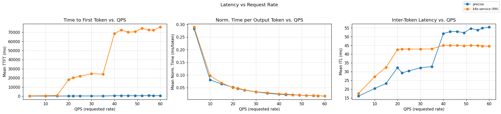
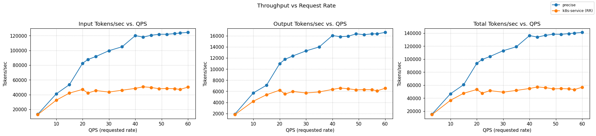

# Precise Prefix Cache Aware Routing

[](https://github.com/llm-d/llm-d/actions/workflows/nightly-e2e-precise-prefix-cache-ocp.yaml)

## Overview

This guide routes requests on precise per-pod KV-cache state rather than request-traffic heuristics. Each vLLM pod publishes [KV-cache events](https://github.com/vllm-project/vllm/issues/16669) over ZMQ; the scheduler subscribes, builds an index keyed by block hash, and scores candidate pods by the fraction of an incoming request's prefix that is already resident.

Two scorers make up the routing decision alongside the load-aware stack:

- **Precise prefix-cache aware** — the [precise-prefix-cache-scorer](https://github.com/llm-d/llm-d-inference-scheduler/tree/main/pkg/epp/framework/plugins/scheduling/scorer/preciseprefixcache) indexes real KV-block events from vLLM and returns the exact resident-block fraction.
- **Load-aware** — the [kv-cache utilization](https://github.com/llm-d/llm-d-inference-scheduler/tree/main/pkg/epp/framework/plugins/scheduling/scorer/kvcacheutilization) and [queue size](https://github.com/llm-d/llm-d-inference-scheduler/tree/main/pkg/epp/framework/plugins/scheduling/scorer/queuedepth) scorers balance against pod pressure.

## Default Configuration

| Parameter           | Value                                                   |
|---------------------|---------------------------------------------------------|
| Model               | [Qwen/Qwen3-32B](https://huggingface.co/Qwen/Qwen3-32B) |
| Replicas            | 8                                                       |
| Tensor Parallelism  | 2                                                       |
| GPUs per replica    | 2                                                       |
| Total GPUs          | 16                                                      |
| vLLM `--block-size` | 64 (must match scorer `tokenProcessorConfig.blockSize`) |
| Scheduler image     | `ghcr.io/llm-d/llm-d-inference-scheduler:v0.8.0-rc.1`   |

### Supported Hardware Backends

| Backend              | Directory                  | Default model                           | Notes                                      |
| -------------------- | -------------------------- | --------------------------------------- | ------------------------------------------ |
| NVIDIA GPU           | `modelserver/gpu/vllm/`    | Qwen/Qwen3-32B                          | Default configuration                      |
| AMD GPU              | `modelserver/amd/vllm/`    | Qwen/Qwen3-32B                          | AMD GPU                                    |
| Intel XPU            | `modelserver/xpu/vllm/`    | Qwen/Qwen3-0.6B                         | CI-sized; update scheduler `modelName` for real use |
| Intel Gaudi (HPU)    | `modelserver/hpu/vllm/`    | Qwen/Qwen3-8B                           | `--block-size=128`; update scorer `blockSize` to match |
| Google TPU v6e       | `modelserver/tpu-v6/vllm/` | Llama-3.1-70B-Instruct                  | GKE TPU                                    |
| Google TPU v7        | `modelserver/tpu-v7/vllm/` | Qwen3-Coder-480B-FP8                    | GKE TPU                                    |
| CPU                  | `modelserver/cpu/vllm/`    | Llama-3.2-3B-Instruct                   | CI-sized                                   |

> [!NOTE]
> Some hardware variants use reduced configurations (fewer replicas, smaller models) to enable CI testing for compatibility and regression checks. For precise prefix cache scoring to match reality, the `tokenizer` `modelName` and the scorer's `indexerConfig.tokenizersPoolConfig.modelName` in [`scheduler/precise-prefix-cache-aware.values.yaml`](scheduler/precise-prefix-cache-aware.values.yaml) must match the model the overlay deploys. HPU and anything that tunes `--block-size` also requires updating `tokenProcessorConfig.blockSize` on the scheduler side.

## Prerequisites

- Have the [proper client tools installed on your local system](../../helpers/client-setup/README.md) to use this guide.
- Check out the llm-d repo:

  ```bash
  export branch="main" # branch, tag, or commit hash
  git clone https://github.com/llm-d/llm-d.git && cd llm-d && git checkout ${branch}
  ```

- Create the `llm-d-hf-token` secret (the UDS tokenizer sidecar reads `HF_TOKEN` to reach gated tokenizers — Qwen/Qwen3-32B is public but the secret makes swapping in a gated model a no-op):

  ```bash
  kubectl -n ${NAMESPACE} create secret generic llm-d-hf-token --from-literal=HF_TOKEN="${HF_TOKEN}"
  ```

- (Optional) Have the [Monitoring stack](../../docs/monitoring/README.md) installed on your system.

## Installation Instructions

### 1. Prepare a Target Namespace

```bash
export NAMESPACE=llm-d-precise
kubectl create namespace ${NAMESPACE}
```

### 2. Deploy the Standalone Inference Scheduler

This deploys the inference scheduler with an Envoy sidecar. For gateway deployments, see [Gateway recipes](../recipes/gateway).

**Helm v4** (current release):

```bash
helm plugin install guides/precise-prefix-cache-aware/scheduler/patches/uds-tokenizer   # once
helm install precise-prefix-cache-aware-scheduler \
  oci://registry.k8s.io/gateway-api-inference-extension/charts/standalone \
  -f guides/recipes/scheduler/base.values.yaml \
  -f guides/precise-prefix-cache-aware/scheduler/precise-prefix-cache-aware.values.yaml \
  --post-renderer uds-tokenizer \
  -n ${NAMESPACE} --version v1.4.0
```

**Helm v3** (takes a path directly):

```bash
helm install precise-prefix-cache-aware-scheduler \
  oci://registry.k8s.io/gateway-api-inference-extension/charts/standalone \
  -f guides/recipes/scheduler/base.values.yaml \
  -f guides/precise-prefix-cache-aware/scheduler/precise-prefix-cache-aware.values.yaml \
  --post-renderer ./guides/precise-prefix-cache-aware/scheduler/patches/uds-tokenizer/post-renderer.sh \
  -n ${NAMESPACE} --version v1.4.0
```

The post-renderer attaches the UDS tokenizer sidecar to the scheduler pod. The standalone chart's `sidecar.*` slot is occupied by its Envoy proxy — overriding it would lose HTTP serving — so the UDS container is appended via helm's post-render hook instead. Under the hood, the post-renderer runs `kustomize build` on the chart's rendered manifests with a small strategic merge patch that adds the `tokenizer-uds` container (image `ghcr.io/llm-d/llm-d-uds-tokenizer:v0.7.1`), two `emptyDir` volumes (`tokenizers`, `tokenizer-uds`), and a `/tmp/tokenizer` volumeMount on the existing `epp` container so the `tokenizer` plugin can reach the UDS socket.

The release name `precise-prefix-cache-aware-scheduler` is load-bearing: the vLLM patches hardcode `KV_EVENTS_ENDPOINT=tcp://<release>-epp.<ns>.svc.cluster.local:5556`. If you use a different release name, patch the `KV_EVENTS_ENDPOINT` env value in your modelserver overlay to match `<release-name>-epp`.

To enable Prometheus monitoring, add `-f guides/recipes/scheduler/features/monitoring.values.yaml` to the helm command.

### 3. Deploy the Model Server

Apply the Kustomize overlay for your backend (defaulting to NVIDIA GPU / vLLM):

```bash
kubectl apply -n ${NAMESPACE} -k guides/precise-prefix-cache-aware/modelserver/gpu/vllm/
```

### 4. (Optional) Enable Active-Active High Availability

The default single-replica install uses central ZMQ — vLLM publishers connect into the scheduler service. To run two scheduler replicas simultaneously (each with its own Envoy gateway sidecar) behind a single load-balancing Service, see [active-active.md](active-active.md).

## Verification

### 1. Port-Forward to the Scheduler Service

```bash
kubectl port-forward -n ${NAMESPACE} svc/precise-prefix-cache-aware-scheduler-epp 8000:8081
```

### 2. Send Test Requests

In a separate terminal:

**List available models:**
```bash
curl -s http://localhost:8000/v1/models | jq
```

**Send a completion request** (long prompt so the prefix cache has something to grip on):
```bash
export LONG_TEXT_200_WORDS="Lorem ipsum dolor sit amet, consectetur adipiscing elit. Sed do eiusmod tempor incididunt ut labore et dolore magna aliqua. Ut enim ad minim veniam, quis nostrud exercitation ullamco laboris nisi ut aliquip ex ea commodo consequat. Duis aute irure dolor in reprehenderit in voluptate velit esse cillum dolore eu fugiat nulla pariatur. Excepteur sint occaecat cupidatat non proident, sunt in culpa qui officia deserunt mollit anim id est laborum. Lorem ipsum dolor sit amet, consectetur adipiscing elit. Sed do eiusmod tempor incididunt ut labore et dolore magna aliqua. Ut enim ad minim veniam, quis nostrud exercitation ullamco laboris nisi ut aliquip ex ea commodo consequat. Duis aute irure dolor in reprehenderit in voluptate velit esse cillum dolore eu fugiat nulla pariatur. Excepteur sint occaecat cupidatat non proident, sunt in culpa qui officia deserunt mollit anim id est laborum."

curl -s http://localhost:8000/v1/completions \
  -H "Content-Type: application/json" \
  -d '{
    "model": "Qwen/Qwen3-32B",
    "prompt": "'"$LONG_TEXT_200_WORDS"'",
    "max_tokens": 50
  }' | jq
```

### 3. Inspect Precise-Prefix-Cache Scores

```bash
kubectl logs -l app=precise-prefix-cache-aware-scheduler-epp -n ${NAMESPACE} --tail 200 \
  | grep "Calculated score" | grep "precise-prefix-cache-scorer"
```

On the first request through a fresh deployment all pods return `score: 0`. Re-send the **same** prompt — the pod that served it first should now return `score: 1`, confirming the KV blocks it allocated were indexed via the event stream.

## Benchmarking

The benchmark launches a pod (`llmdbench-harness-launcher`) that uses `inference-perf` with a shared-prefix synthetic workload. Each experiment is saved under the specified output folder, e.g. `./results/<experiment ID>/inference-perf_<experiment ID>_shared_prefix_precise-guide-<model name>`. See the [benchmark instructions doc](../../helpers/benchmark.md) for details.

### 1. Prepare the Benchmarking Suite

```bash
curl -L -O https://raw.githubusercontent.com/llm-d/llm-d-benchmark/main/existing_stack/run_only.sh
chmod u+x run_only.sh
```

### 2. Download the Workload Template

```bash
curl -LJO "https://raw.githubusercontent.com/llm-d/llm-d/main/guides/precise-prefix-cache-aware/benchmark-templates/guide.yaml"
```

### 3. Execute Benchmark

```bash
export GATEWAY_SVC=precise-prefix-cache-aware-scheduler-epp
envsubst < guide.yaml > config.yaml
./run_only.sh -c config.yaml -o ./results
```

## Cleanup

```bash
helm uninstall precise-prefix-cache-aware-scheduler -n ${NAMESPACE}
kubectl delete -n ${NAMESPACE} -k guides/precise-prefix-cache-aware/modelserver/gpu/vllm/
```

## How It Works

1. **vLLM pods publish KV-cache events** — each pod runs `vllm serve ... --kv-events-config '{...,"publisher":"zmq","endpoint":"$(KV_EVENTS_ENDPOINT)","topic":"kv@$(POD_IP):$(POD_PORT)@<model>"}'`. On every KV block allocation/eviction, vLLM emits a ZMQ message.
2. **Scheduler subscribes** — in central mode the scheduler's scorer binds `tcp://*:5556` and all vLLM publishers connect in. A single `kv@`-prefixed topic filter passes all events through.
3. **Index is keyed by block hash** — the scorer hashes tokens using `blockSize=64` + `hashSeed="42"` (must match vLLM's `PYTHONHASHSEED=42` env var) to produce the same block IDs vLLM emits. Incoming requests are tokenized via the UDS tokenizer sidecar, hashed with the same parameters, and looked up in the index.
4. **Scoring** — the `precise-prefix-cache-scorer` returns the fraction of the request's prefix blocks that are resident on each candidate pod. The `max-score-picker` routes to the highest-scoring pod.

The `tokenizer` plugin and the scorer's internal `tokenizersPoolConfig` both point at `/tmp/tokenizer/tokenizer-uds.socket` — a UDS tokenizer sidecar (`ghcr.io/llm-d/llm-d-uds-tokenizer`) owns tokenizer model downloads and caching, keeping tokenization out of the EPP main container.

## Benchmarking Report

The benchmark runs on 16× H100 GPUs, distributed across 8 model servers (2 H100s per server with TP=2).

<details>
<summary><b><i>Click</i></b> to view the report for <code>rate=60</code></summary>

```yaml
metrics:
  latency:
    request_latency:
      mean: 63.34
      p50: 60.84
      p90: 75.70
      p99: 77.97
      units: s
    time_to_first_token:
      mean: 0.192
      p50: 0.178
      p90: 0.260
      p99: 0.564
      units: s
    time_per_output_token:
      mean: 0.063
      p50: 0.061
      p90: 0.075
      p99: 0.078
      units: s/token
  requests:
    failures: 0
    input_length: {mean: 7584}
    output_length: {mean: 937}
    total: 1500
  throughput:
    requests_per_sec: 14.87
    output_tokens_per_sec: 13932.0
    total_tokens_per_sec: 126727.5
  time:
    duration: 24.92
```

</details>

### Comparing LLM-d Scheduling to a Simple Kubernetes Service

Graphs below are from `inference-perf --analyze` comparing the precise path to a stock Kubernetes service routing directly to the vLLM pods.




Stage at `rate=60`:

- **Throughput**: Requests/sec **+159.5%**; Output tokens/sec **+159.8%**
- **Latency**: TTFT (mean) **-99.5%**; E2E request latency (mean) **-39.9%**
- **Per-token speed**: Inter-token latency (mean) **-10.4%** (faster)

| Metric                  | k8s (Mean) | llm-d precise (Mean) | Δ (llm-d − k8s) | Δ% vs k8s |
| :---------------------- | :--------- | :------------------- | :-------------- | :-------- |
| Requests/sec            | 5.7306     | 14.8719              | +9.1413         | +159.5%   |
| Input tokens/sec        | 43,417.86  | 112,795.47           | +69,377.61      | +159.8%   |
| Output tokens/sec       | 5,362.16   | 13,931.99            | +8,569.83       | +159.8%   |
| Total tokens/sec        | 48,780.02  | 126,727.46           | +77,947.44      | +159.8%   |
| Request latency (s)     | 105.4133   | 63.3376              | -42.0757        | -39.9%    |
| TTFT (s)                | 34.9145    | 0.1916               | -34.7229        | -99.5%    |
| Inter-token latency (ms)| 70.42      | 63.07                | -7.35           | -10.4%    |
