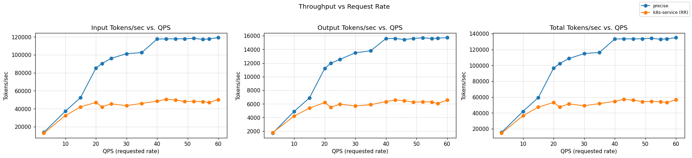
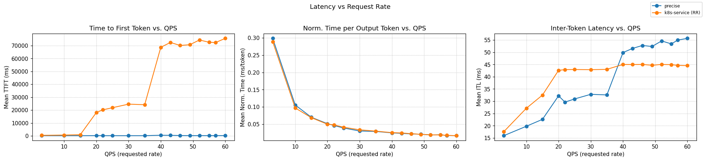
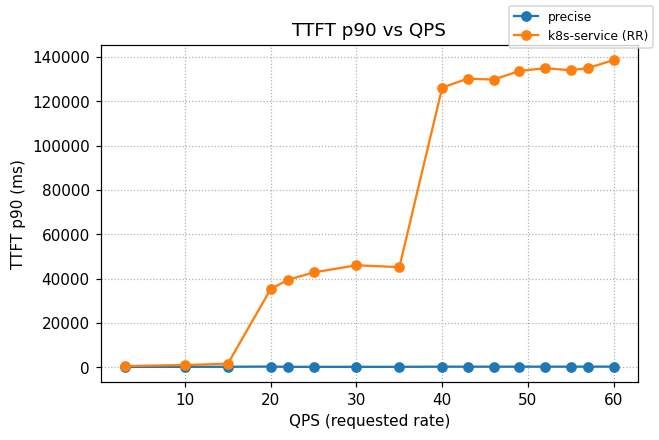

# Precise Prefix Cache Routing

[](https://github.com/llm-d/llm-d/actions/workflows/nightly-e2e-precise-prefix-cache-ocp.yaml) [](https://github.com/llm-d/llm-d/actions/workflows/nightly-e2e-precise-prefix-cache-cks.yaml) [](https://github.com/llm-d/llm-d/actions/workflows/nightly-e2e-precise-prefix-cache-gke.yaml) [](https://github.com/llm-d/llm-d/actions/workflows/nightly-e2e-precise-prefix-cache-xpu.yaml)

## Overview

This guide routes requests on precise per-pod KV-cache state rather than request-traffic heuristics. Each vLLM pod publishes [KV-cache events](https://github.com/vllm-project/vllm/issues/16669) over ZMQ; the router subscribes, builds an index keyed by block hash, and scores candidate pods by the fraction of an incoming request's prefix that is already resident.

Two scorers make up the routing decision alongside the load-aware stack:

- **Precise prefix-cache aware** — the [precise-prefix-cache-producer](https://github.com/llm-d/llm-d-router/tree/main/pkg/epp/framework/plugins/requestcontrol/dataproducer/preciseprefixcache) indexes real KV-block events from vLLM and publishes the exact resident-block fraction. The generic [prefix-cache-scorer](https://github.com/llm-d/llm-d-router/tree/main/pkg/epp/framework/plugins/scheduling/scorer/prefix) then reads `prefixMatchInfoProducerName`. Indexer internals (event ingestion, block hashing, dual-key design) are documented in [llm-d-kv-cache architecture](https://github.com/llm-d/llm-d-kv-cache/blob/main/docs/architecture.md).
- **Load-aware** — such as the [kv-cache utilization](https://github.com/llm-d/llm-d-router/tree/main/pkg/epp/framework/plugins/scheduling/scorer/kvcacheutilization) and [queue size](https://github.com/llm-d/llm-d-router/tree/main/pkg/epp/framework/plugins/scheduling/scorer/queuedepth) scorers balance against pod pressure.

## Default Configuration

| Parameter           | Value                                                   |
|---------------------|---------------------------------------------------------|
| Model               | [Qwen/Qwen3-32B](https://huggingface.co/Qwen/Qwen3-32B) |
| Replicas            | 8 (reduce for smaller fleets — see notes below)         |
| Tensor Parallelism  | 2                                                       |
| GPUs per replica    | 2                                                       |
| Total GPUs          | 16                                                      |
| vLLM `--block-size` | 64 (must match scorer `tokenProcessorConfig.blockSize`) |

## Additional Configuration

### GPU 

| Parameter                 | Value                                                   |
| ------------------------- | ------------------------------------------------------- |
| Model                     | [openai/gpt-oss-120b](https://huggingface.co/openai/gpt-oss-120b) |
| GPUs per replica (TP)     | 1                                                       |
| GPU Accelerator           | NVIDIA H100                                             |
| CPU Cache Offload Size    | 100 GB                                                  |

### Supported Hardware Backends

| Backend              | Directory                  | Default model                           | Notes                                                    |
| -------------------- | -------------------------- | --------------------------------------- | -------------------------------------------------------- |
| NVIDIA GPU           | `modelserver/gpu/vllm/`    | Qwen/Qwen3-32B                          | Default configuration                                    |
| AMD GPU              | `modelserver/amd/vllm/`    | Qwen/Qwen3-32B                          | AMD GPU                                                  |
| Intel XPU            | `modelserver/xpu/vllm/`    | Qwen/Qwen3-0.6B                         | CI-sized; update router `modelName` for real use         |
| Intel Gaudi (HPU)    | `modelserver/hpu/vllm/`    | Qwen/Qwen3-8B                           | `--block-size=128`; update scorer `blockSize` to match   |
| Google TPU v6e       | `modelserver/tpu-v6/vllm/` | Llama-3.1-70B-Instruct                  | GKE TPU                                                  |
| Google TPU v7        | `modelserver/tpu-v7/vllm/` | Qwen3-Coder-480B-FP8                    | GKE TPU                                                  |
| CPU                  | `modelserver/cpu/vllm/`    | Llama-3.2-3B-Instruct                   | CI-sized                                                 |

> [!NOTE]
> Some hardware variants use reduced configurations (fewer replicas, smaller models) to enable CI testing for compatibility and regression checks.
>
> [!NOTE]
> For precise prefix cache scoring to match reality, the `token-producer` `modelName` in [`router/precise-prefix-cache-routing.values.yaml`](router/precise-prefix-cache-routing.values.yaml) must match the model the overlay deploys.
>
> [!NOTE]
> The `gpu/vllm/` overlay defaults to 8 replicas to match the canonical 16×H100 benchmark. For smaller fleets (or quick smoke tests), reduce `replicas` in the deployment patch (`modelserver/gpu/vllm/patch-vllm.yaml`) before applying.
>
> [!NOTE]
> The router runs in **active-active HA** by default — two replicas behind one Service, each subscribing to every vLLM pod via pod-discovery so both indexes converge. Scale to a single replica with `--set router.epp.replicas=1` if HA isn't needed (small fleets, smoke tests).

## Prerequisites

- Have the [proper client tools installed on your local system](../../helpers/client-setup/README.md) to use this guide.
- Checkout llm-d repo:

```bash
  export branch="main" # branch, tag, or commit hash
  git clone https://github.com/llm-d/llm-d.git && cd llm-d && git checkout ${branch}
```

- Set the following environment variables:

```bash
export GAIE_VERSION=v1.5.0
export ROUTER_CHART_VERSION=v0
export GUIDE_NAME="precise-prefix-cache-routing"
export NAMESPACE="llm-d-${GUIDE_NAME}"
export REPO_ROOT=$(realpath $(git rev-parse --show-toplevel))
export PROVIDER_NAME=istio   # options: none, gke, agentgateway, istio
```

- Install the Gateway API Inference Extension CRDs:

```bash
kubectl apply -f https://github.com/kubernetes-sigs/gateway-api-inference-extension/releases/download/${GAIE_VERSION}/v1-manifests.yaml
```

- Create a target namespace for the installation

```bash
kubectl create namespace ${NAMESPACE} --dry-run=client -o yaml | kubectl apply -f -
```

## Installation Instructions

### 1. Prepare HF Token

Create the `llm-d-hf-token` secret in the namespace. The router reads `HF_TOKEN` to reach gated tokenizers — Qwen/Qwen3-32B is public but the secret makes swapping in a gated model a no-op. See [helpers/hf-token.md](../../helpers/hf-token.md) for the full helper.
<!-- llm-d-cicd:skip start -->
```bash
export HF_TOKEN=<your HuggingFace token>
kubectl create secret generic llm-d-hf-token \
  --from-literal="HF_TOKEN=${HF_TOKEN}" \
  --namespace "${NAMESPACE}" \
  --dry-run=client -o yaml | kubectl apply -f -
```
<!-- llm-d-cicd:skip end -->

### 2. Deploy the llm-d Router

#### Standalone Mode

This deploys the llm-d Router in the simple [Standalone Mode](placeholder-link). The release name `${GUIDE_NAME}` is mandatory — the inference pool selector matches a guide label that pairs with this release.

The chart auto-injects the `vllm-render` sidecar when `router.tokenizer.enabled: true` is set in the values file.

```bash
helm install ${GUIDE_NAME} \
  oci://ghcr.io/llm-d/charts/llm-d-router-standalone-dev \
  -f ${REPO_ROOT}/guides/recipes/router/base.values.yaml \
  -f ${REPO_ROOT}/guides/${GUIDE_NAME}/router/${GUIDE_NAME}.values.yaml \
  -n ${NAMESPACE} --version ${ROUTER_CHART_VERSION}
```

<details>
<summary><b>Gateway Mode</b></summary>

To use a Kubernetes Gateway managed proxy instead of the standalone Envoy sidecar, do **not** apply the standalone chart above. Instead:

1. **Deploy a Kubernetes Gateway**. See [the gateway guides](../prereq/gateways) for step-by-step deployment of a Gateway named `llm-d-inference-gateway`.

2. **Deploy the llm-d Router and HTTPRoute** via the `llm-d-router-gateway` chart with `httpRoute.create=true`:

```bash
helm install ${GUIDE_NAME} \
  oci://ghcr.io/llm-d/charts/llm-d-router-gateway-dev \
  -f ${REPO_ROOT}/guides/recipes/router/base.values.yaml \
  -f ${REPO_ROOT}/guides/recipes/router/features/httproute-flags.yaml \
  -f ${REPO_ROOT}/guides/${GUIDE_NAME}/router/${GUIDE_NAME}.values.yaml \
  --set provider.name=${PROVIDER_NAME} \
  -n ${NAMESPACE} --version ${ROUTER_CHART_VERSION}
```

</details>

### 3. Deploy the Model Server

Apply the Kustomize overlay for your backend (defaulting to NVIDIA GPU / vLLM):

```bash
export INFRA_PROVIDER=base # base | gke
kubectl apply -n ${NAMESPACE} -k ${REPO_ROOT}/guides/${GUIDE_NAME}/modelserver/gpu/vllm/${INFRA_PROVIDER}/
```

### 4. (Optional) Enable Monitoring

> [!NOTE]
> GKE provides [automatic application monitoring](https://docs.cloud.google.com/kubernetes-engine/docs/how-to/configure-automatic-application-monitoring) out of the box. The llm-d [Monitoring stack](../../docs/resources/observability/setup.md) is not required for GKE, but it is available if you prefer to use it.

- Install the [Monitoring stack](../../docs/resources/observability/setup.md).
- Deploy the monitoring resources for this guide:

  ```bash
  kubectl apply -n ${NAMESPACE} -k ${REPO_ROOT}/guides/recipes/modelserver/components/monitoring
  ```

- Enable Prometheus scrape for the router by layering `-f ${REPO_ROOT}/guides/recipes/router/features/monitoring.values.yaml` onto the helm command in step 2.

## Verification

### 1. Get the IP of the Proxy

#### Standalone Mode

```bash
export IP=$(kubectl get service ${GUIDE_NAME}-epp -n ${NAMESPACE} -o jsonpath='{.spec.clusterIP}')
```

<details>
<summary><b>Gateway Mode</b></summary>

```bash
export IP=$(kubectl get gateway llm-d-inference-gateway -n ${NAMESPACE} -o jsonpath='{.status.addresses[0].value}')
```

</details>

### 2. Send Test Requests

**Open a temporary interactive shell inside the cluster:**

```bash
kubectl run curl-debug --rm -it \
    --image=cfmanteiga/alpine-bash-curl-jq \
    --env="IP=$IP" \
    --env="NAMESPACE=$NAMESPACE" \
    -- /bin/bash
```

**Send a completion request:**

```bash
curl -X POST http://${IP}/v1/completions \
    -H 'Content-Type: application/json' \
    -d '{
        "model": "Qwen/Qwen3-32B",
        "prompt": "How are you today?"
    }' | jq
```

## Benchmarking

The benchmark launches a pod (`llmdbench-harness-launcher`) that uses `inference-perf` with a shared-prefix synthetic workload. Each experiment is saved under the specified output folder, e.g. `./results/<experiment ID>/inference-perf_<experiment ID>_precise-guide-<model name>`. See the [benchmark instructions doc](../../helpers/benchmark.md) for details.

### 1. Prepare the Benchmarking Suite

- Download the benchmark script:

  ```bash
  curl -L -O https://raw.githubusercontent.com/llm-d/llm-d-benchmark/main/existing_stack/run_only.sh
  chmod u+x run_only.sh
  ```

### 2. Download the Workload Template

```bash
curl -LJO "https://raw.githubusercontent.com/llm-d/llm-d/main/guides/precise-prefix-cache-routing/benchmark-templates/guide.yaml"
```

### 3. Execute Benchmark

```bash
export IP=$(kubectl get service ${GUIDE_NAME}-epp -n ${NAMESPACE} -o jsonpath='{.spec.clusterIP}')
envsubst < guide.yaml > config.yaml
./run_only.sh -c config.yaml -o ./results
```

## Cleanup

```bash
helm uninstall ${GUIDE_NAME} -n ${NAMESPACE}
kubectl delete -n ${NAMESPACE} -k guides/${GUIDE_NAME}/modelserver/gpu/vllm/${INFRA_PROVIDER}/
```

## How It Works

1. **vLLM pods publish KV-cache events** — each pod runs `vllm serve ... --kv-events-config '{...,"publisher":"zmq","endpoint":"$(KV_EVENTS_ENDPOINT)","topic":"kv@$(POD_IP):$(POD_PORT)@<model>"}'` with `KV_EVENTS_ENDPOINT=tcp://*:5556`, binding its own ZMQ socket. On every KV block allocation/eviction, vLLM emits a ZMQ message.
2. **Router subscribes per pod** — pod-discovery (`kvEventsConfig.discoverPods: true`) registers the `precise-prefix-cache-producer` as an extractor on the data-layer `endpoint-notification-source`, so each router replica installs a ZMQ subscriber per vLLM pod independently. All replicas converge to the same index.
3. **Scoring** — the `prefix-cache-scorer` returns the fraction of the request's prefix blocks that are resident on each candidate pod. The `max-score-picker` routes to the highest-scoring pod.

## Benchmarking Report

The benchmark runs on 16× H100 GPUs, distributed across 8 model servers (2 H100s per server with TP=2).

### Comparing llm-d Scheduling to a Simple Kubernetes Service

Graphs below compare the precise path to a stock Kubernetes Service that round-robins requests across the same 8 vLLM pods (no EPP, no scoring).





Summary across the full ladder (rates 3 → 60):

| Metric              | k8s service (RR) | llm-d Precise | Δ% vs k8s |
| :------------------ | :--------------- | :------------ | :-------- |
| Output tokens/sec   | 5,722            | 12,598        | +120.2%   |
| Requests/sec        | 35.87            | 36.01         | +0.4%     |
| TTFT mean (s)       | 58.10            | 0.247         | −99.57%   |
| TTFT p90 (s)        | 107.43           | 0.262         | −99.76%   |
| ITL mean (ms)       | 44.0             | 47.0          | +6.8%     |

<details>
<summary><b><i>Click</i></b> to view the per-rate breakdown across the full ladder</summary>

Output tokens/sec — higher is better; TTFT in seconds — lower is better.

| Rate | k8s Output | llm-d Output | k8s TTFT mean | llm-d TTFT mean | k8s TTFT p90 | llm-d TTFT p90 |
| ---: | ---------: | -----------: | ------------: | --------------: | -----------: | -------------: |
|  3   | 1,797      | 1,707        | 0.415         | 0.155           | 0.522        | 0.187          |
| 10   | 4,215      | 4,904        | 0.630         | 0.150           | 1.014        | 0.199          |
| 15   | 5,381      | 6,887        | 0.881         | 0.155           | 1.593        | 0.225          |
| 20   | 6,205      | 11,224       | 18.103        | 0.206           | 35.344       | 0.320          |
| 22   | 5,517      | 11,980       | 20.171        | 0.152           | 39.436       | 0.191          |
| 25   | 5,965      | 12,548       | 21.842        | 0.158           | 42.813       | 0.200          |
| 30   | 5,702      | 13,507       | 24.597        | 0.155           | 46.036       | 0.193          |
| 35   | 5,890      | 13,803       | 24.162        | 0.157           | 45.190       | 0.202          |
| 40   | 6,336      | 15,593       | 68.673        | 0.494           | 126.238      | 0.272          |
| 43   | 6,588      | 15,612       | 72.429        | 0.422           | 130.275      | 0.265          |
| 46   | 6,459      | 15,462       | 70.084        | 0.257           | 129.810      | 0.273          |
| 49   | 6,265      | 15,607       | 70.659        | 0.200           | 133.718      | 0.267          |
| 52   | 6,303      | 15,728       | 74.326        | 0.208           | 134.981      | 0.279          |
| 55   | 6,290      | 15,612       | 72.564        | 0.199           | 134.034      | 0.272          |
| 57   | 6,089      | 15,667       | 72.329        | 0.211           | 135.023      | 0.293          |
| 60   | 6,551      | 15,733       | 75.586        | 0.214           | 138.663      | 0.300          |

</details>

### Benchmarking Results for gpt-oss-120B

The benchmark runs on 16 × H100 GPUs, distributed across 16 model servers (1 H100s per server with TP=2) using gpt-oss-120B and the same workload as in [default configuration benchmark results](#benchmarking-results). The benchmark compares both to k8s service and to optimized baseline configuration, and uses its default weight configuration of 2:2:3:2 (Queue Scorer : KV Cache Utilization Scorer : GPU Prefix Cache Scorer : CPU Prefix Cache Scorer : LRU Scorer). The benchmark was executed using a code assistant and [llm-d skills](https://github.com/llm-d-incubation/llm-d-skills) running on top of llm-d-benchmark tooling.

#### Performance Results

> Metrics aggregated over all 17 load stages (stages 1–16 plus warmup stage 0).
> All latency values are in **milliseconds**. Throughput is measured over the full run.

| Metric | Run A — no-llm-d-baseline | Run B — optimized-baseline | Run C — precise-prefix-cache-routing |
|---|---:|---:|---:|
| **Throughput (req/s)** | **10.10** | 6.96 | 9.95 |
| **Output tokens/s** | **10,314** | 7,185 | 9,880 |
| **Total tokens/s** | **85,239** | 58,842 | 83,707 |
| **Total successes** | 17,084 | 17,084 | 17,084 |
| **Total failures** | 0 | 0 | 0 |
| **Error rate** | 0.00% | 0.00% | 0.00% |
| **Request latency P50 (ms)** | 28,265 | **24,629** | 26,366 |
| **Request latency P90 (ms)** | 52,573 | **37,043** | 41,003 |
| **Request latency P99 (ms)** | 63,693 | 126,156 | **65,203** |
| **TTFT mean (ms)** | 12,256 | **3,364** | 6,741 |
| **TTFT P50 (ms)** | 8,089 | **164** | 993 |
| **TTFT P90 (ms)** | 31,668 | **15,283** | 21,522 |
| **TTFT P99 (ms)** | 47,506 | 26,217 | **49,560** |
| **ITL mean (ms)** | **20.1** | 24.7 | 21.4 |
| **ITL P50 (ms)** | **16.4** | 17.1 | 17.0 |
| **ITL P90 (ms)** | **17.5** | 28.7 | 22.3 |
| **ITL P99 (ms)** | 165.2 | 147.8 | **158.1** |
| **TPOT mean (ms)** | **20.1** | 24.7 | 21.4 |
| **TPOT P50 (ms)** | **21.1** | 21.7 | 21.9 |
| **TPOT P90 (ms)** | **23.3** | 27.3 | 27.3 |
| **Avg output len (tokens)** | 1,021 | 1,032 | 993 |

---

<details>
<summary><b><i>Click</i></b> to view the per-rate hroughput breakdown across the full ladder</summary>

> Stage 0 = warmup (15 rps × 50s). Stages 1–16 correspond to load steps 3/10/15/20/22/25/30/35/40/43/46/49/52/55/57/60 rps.

| Stage | Target (rps) | Run A output tok/s | Run A req/s | Run B output tok/s | Run B req/s | Run C output tok/s | Run C req/s |
|---|---:|---:|---:|---:|---:|---:|---:|
| 1 | 3 | 2,103 | 2.16 | 2,559 | 2.66 | 2,085 | 2.15 |
| 2 | 10 | 6,288 | 6.44 | 6,224 | 6.37 | 6,651 | 6.85 |
| 3 | 15 | 8,829 | 9.05 | 6,030 | 5.92 | 9,108 | 9.37 |
| 4 | 20 | 13,385 | 13.08 | 8,735 | 8.46 | 13,886 | 13.99 |
| 5 | 22 | 14,406 | 14.09 | 8,938 | 8.67 | 14,533 | 14.62 |
| 6 | 25 | 12,390 | 12.12 | 8,594 | 8.32 | 15,095 | 15.16 |
| 7 | 30 | 13,444 | 13.19 | 9,079 | 8.79 | 15,846 | 15.97 |
| 8 | 35 | 15,777 | 15.40 | 9,064 | 8.76 | 18,064 | 18.16 |
| 9 | 40 | 15,065 | 14.75 | 8,430 | 8.17 | 14,935 | 15.02 |
| 10 | 43 | 16,344 | 15.99 | 9,601 | 9.32 | 15,381 | 15.52 |
| 11 | 46 | 16,662 | 16.30 | 9,426 | 9.12 | 17,745 | 17.86 |
| 12 | 49 | 15,744 | 15.39 | 9,598 | 9.27 | 13,474 | 13.55 |
| 13 | 52 | 17,100 | 16.71 | 9,784 | 9.47 | 17,475 | 17.59 |
| 14 | 55 | 16,265 | 15.88 | 9,753 | 9.41 | 13,610 | 13.70 |
| 15 | 57 | 17,429 | 17.04 | 9,580 | 9.27 | 12,927 | 13.01 |
| 16 | 60 | 17,556 | 17.17 | 9,700 | 9.40 | 13,178 | 13.25 |

</details>


<details>
<summary><b><i>Click</i></b> to view the per-rate latency breakdown across the full ladder</summary>

> All latencies in milliseconds.

| Stage | Target (rps) | A p50 lat | A TTFT p50 | B p50 lat | B TTFT p50 | C p50 lat | C TTFT p50 |
|---|---:|---:|---:|---:|---:|---:|---:|
| 1 | 3 | 5,814 | 216 | 4,816 | 101 | 5,305 | 141 |
| 2 | 10 | 9,809 | 224 | 8,858 | 101 | 9,321 | 249 |
| 3 | 15 | 13,531 | 231 | 11,173 | 73 | 11,062 | 134 |
| 4 | 20 | 19,524 | 244 | 13,306 | 108 | 15,710 | 155 |
| 5 | 22 | 20,058 | 249 | 13,893 | 119 | 18,632 | 255 |
| 6 | 25 | 20,510 | 318 | 14,281 | 115 | 19,495 | 376 |
| 7 | 30 | 22,103 | 364 | 15,930 | 121 | 19,097 | 258 |
| 8 | 35 | 22,278 | 405 | 17,548 | 128 | 20,200 | 254 |
| 9 | 40 | 34,000 | 12,173 | 25,399 | 157 | 29,830 | 1,741 |
| 10 | 43 | 35,223 | 13,268 | 28,026 | 272 | 28,706 | 1,751 |
| 11 | 46 | 36,550 | 14,051 | 24,946 | 245 | 29,428 | 1,699 |
| 12 | 49 | 37,365 | 15,131 | 25,036 | 226 | 28,267 | 1,442 |
| 13 | 52 | 37,654 | 16,084 | 26,206 | 230 | 28,946 | 1,286 |
| 14 | 55 | 37,199 | 15,782 | 25,943 | 232 | 29,117 | 1,676 |
| 15 | 57 | 38,083 | 16,516 | 25,785 | 225 | 29,043 | 1,999 |
| 16 | 60 | 38,394 | 16,441 | 25,405 | 227 | 29,002 | 1,735 |

</details>


#### KV-Cache Performance Analysis

#### Actual Cache Totals (Cumulative over full run)

Metrics are `vllm:prefix_cache_hits_total` and `vllm:prefix_cache_queries_total`, measured in KV blocks (block_size=128 tokens). Values are **sum of per-pod final (max) cumulative counters** across all 16 decoder pods. The counters measure KV block-level hits and queries; the denominator includes every token position checked against the cache throughout the entire run.

| Metric | Run A — no-llm-d-baseline | Run B — optimized-baseline | Run C — precise-prefix-cache-routing |
|---|---:|---:|---:|
| **Total block hits** | 2,829,056 | 74,948,736 | 50,215,168 |
| **Total block queries** | 2,418,963,873 | 1,209,567,759 | 1,525,981,454 |
| **Overall hit rate** | **0.12%** | **6.20%** | **3.29%** |
| **Prompt tokens cached (max)** | 2,709,888 | 73,867,648 | 49,688,448 |

> **Note on scale differences:** Run A has ~2× the total query volume of Runs B and C because random round-robin routing distributes requests uniformly across all 16 pods, so each pod accumulates a full share of prompt-token queries with almost no cache reuse. Runs B and C use EPP-based routing, which concentrates traffic from the same prefix group onto the same pod, reducing per-pod query volume while increasing hit rate.

#### Time-Averaged Cache Hit Rates

Using the mean (time-averaged) cumulative values per pod, averaged over the benchmark duration:

| Metric | Run A | Run B | Run C |
|---|---:|---:|---:|
| **Sum of pod hit means** | 1,465,425 | 40,095,064 | 27,161,563 |
| **Sum of pod query means** | 960,824,182 | 417,282,801 | 546,031,931 |
| **Time-averaged hit rate** | **0.15%** | **9.61%** | **4.97%** |
| **Average per-pod hit rate** | **0.12%** | **10.83%** | **3.36%** |

#### Per-Pod Hit Rate Distribution

**Run B** shows high variance across pods (range 3.95%–79.71%), indicating that the optimized-baseline EPP concentrates traffic very unevenly — one pod (hm5xm) received only 7.6M queries but accumulated a 79.7% hit rate, suggesting it was pinned to a small subset of hot prefixes. Most pods cluster in the 4%–9% range.

**Run C** (precise-prefix-cache-routing with KV events) shows uniform distribution across pods (2.90%–3.96%), consistent with the prefix-aware scheduler routing each prefix group to its designated pod regardless of which EPP replica handled the request. The uniformity reflects the KV event-driven cache state awareness working as intended.

For the shared_prefix workload at scale on gpt-oss-120b, **precise-prefix-cache-routing (Run C)** is the recommended configuration: it recovers essentially all of Run A's throughput while adding meaningful KV cache reuse and cutting tail latency, without the EPP-induced throughput ceiling seen in Run B.