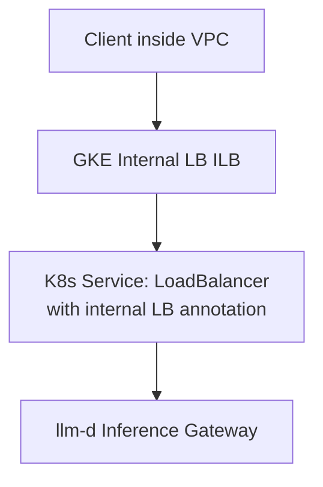

# GKE Internal Load Balancer Gateway Recipe

This recipe configures the llm-d inference gateway to use a **Google Kubernetes Engine (GKE) Internal Load Balancer (ILB)**, ensuring the gateway is accessible **only inside your VPC**.

It integrates with all well-lit path guides (Inference Scheduling, PD Disaggregation, Wide EP LWS) and is installed via Kustomize overlays.

## Architecture



## Folder Structure

- `base/` — Common Gateway + HTTPRoute resources for GKE
- `internal-lb/` — Adds internal load balancer configuration:
  - GKE ILB gateway class (`gke-l7-regional-internal-managed`)
  - Optional Gateway address patches

## Usage

From the guide directory (e.g. `guides/inference-scheduling`):

```bash
kubectl apply -k ../../recipes/gateway/gke-internal-lb-gateway/internal-lb -n ${NAMESPACE}
```

Or integrate into your Helmfile environment:

```yaml
bases:
  - ../../recipes/gateway/gke-internal-lb-gateway/internal-lb
```

The `httproute.gke.yaml` from your guide still applies normally.

## Notes

- The internal gateway uses the gateway class: `gke-l7-regional-internal-managed`
- Clients must be inside the VPC (or connected via VPN/Interconnect)
- The Gateway controller automatically provisions an internal load balancer
