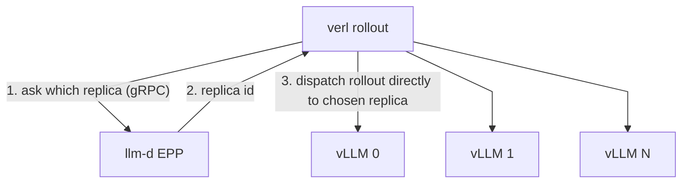
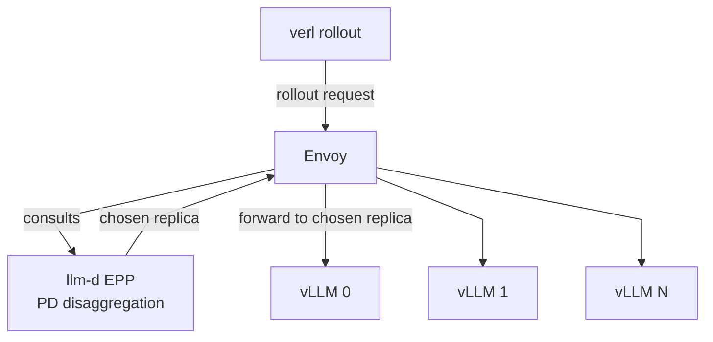

# llm-d verl Integration (EPP routing)

This integration points [verl][verl] rollout generation at llm-d's Endpoint
Picker (EPP), so each rollout request is routed by the same prefix-cache- and
load-aware logic llm-d uses for production inference. It is wired up through
configuration alone - no changes to verl's source - and works whether verl
calls EPP directly or sends generation to an llm-d serving endpoint (see
[Integration modes](#integration-modes) below).

> [!NOTE]
> verl is the first framework supported by llm-d-rl, but the integration is
> framework-agnostic by design. This guide is a high-level overview; the
> implementation, supported versions, and end-to-end examples live in the
> [llm-d-rl repository][llm-d-rl].

## How it works

Instead of least-requests routing, each rollout request is scored by EPP,
which ranks every candidate model server replica on prefix-cache hit rate, queue
depth, and KV utilization and steers the request to the replica most likely
to already have a warm cache. For the large, prefix-sharing sample groups
that GRPO and PPO produce, this is a meaningful throughput win and reduces the
long-tail latency that stalls synchronous training steps.

Because llm-d runs in its [no-Kubernetes mode](../no-kubernetes-deployment/README.md) -
EPP, Envoy, and the model servers are deployed as plain processes rather than
Kubernetes resources - the stack drops cleanly into a **Ray or Slurm** cluster
without requiring a control plane. Prefill/decode (P/D) disaggregation is
supported in both integration modes.

## Integration modes

- **EPP as the endpoint picker** - the framework calls EPP directly to pick a
  replica, then dispatches the request itself. Fewer moving parts and lower
  latency; the place to start.
- **llm-d as an inference backend endpoint** - the framework sends generation
  to a single llm-d serving endpoint (Envoy) that consults EPP and forwards.
  Closest to a production llm-d serving deployment.

## Architecture

**EPP as the endpoint picker** - verl asks EPP which replica to use, then
dispatches the rollout to that replica itself:

**llm-d as an inference backend endpoint** - verl sends the rollout to a
single Envoy endpoint, which consults EPP and forwards to the chosen replica:

In both modes the EPP, Envoy, and vLLM workers run as plain processes in the
Ray or Slurm cluster (no Kubernetes), and both support P/D disaggregation.

## Deploy

See the [llm-d-rl README][llm-d-rl] for prerequisites, the KubeRay example,
configuration overrides, and step-by-step setup for each integration mode.

## Further Reading

- [llm-d-rl repository][llm-d-rl] - integration modes, configuration, and examples
- [No-Kubernetes Deployment guide](../no-kubernetes-deployment/README.md) - deploying the EPP + Envoy + vLLM stack without Kubernetes
- [py-scheduler verl integration](./py-scheduler-verl-integration.md) - the alternative verl integration via the inference request scheduler

[verl]: https://github.com/volcengine/verl
[llm-d-rl]: https://github.com/llm-d-incubation/llm-d-rl/blob/main/README.md
