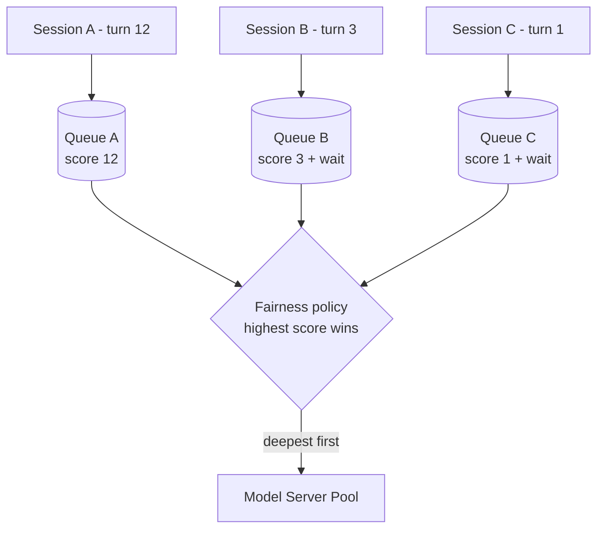
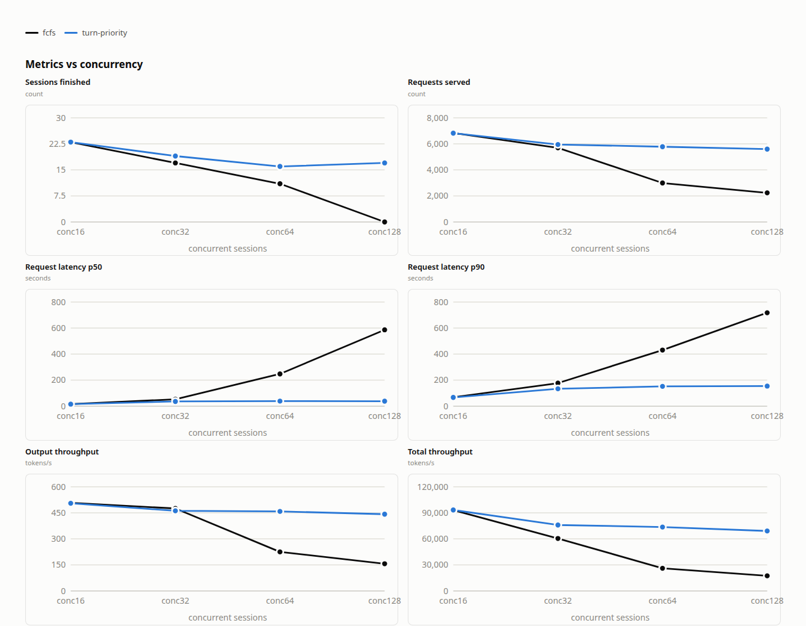

# Turn-Priority Fairness

> [!IMPORTANT]
> **Experimental.** The `turn-priority` strategy is **Beta** in the llm-d Router. It deliberately
> trades admission fairness for prefix retention, so read [Tuning: the weight-TTL
> product](#tuning-the-weight-ttl-product) and [Limitations](#limitations) before deploying it.

```text
Tier: 2 (Deployable)
Reference environment: one Qwen3-30B-A3B-Instruct-2507 replica at TP4, vLLM 0.26.
Deploy and verification executed on two clusters: OpenShift 4.19 on H100-80GB (Helm
and llm-d-benchmark paths) and Kubernetes 1.32 on H200 (llm-d-benchmark path), the
latter being the fleet the benchmark below ran on.
Gaps to Tier 3: no nightly end-to-end job, so no status badge in the release
matrix. The guide.yaml already validates under scripts/guide.py.
Gaps to Tier 4: the benchmark was run on a separate fleet, not against this
guide's own overlay.
```

See [Guides: Definition and Policy](../../docs/well-lit-paths/guides-definition.md) for what the
tiers mean.

## Overview

Turn-priority orders queued requests by **how deep their conversation already is**. A session that
has taken many turns most likely still has its prefix resident in the KV cache, so serving it again
costs less prefill — and finishing it frees the slot sooner. Under contention that ordering keeps
those prefixes resident instead of letting capacity pressure evict them mid-session.

It is a scoring **strategy** of the `program-aware-fairness` flow-control plugin, not a standalone
feature. Each waiting flow is scored:

```
score = turnNumber + turnPriorityTimeWeight * headWaitSeconds
```

where `turnNumber` is the count of requests already dispatched for that session plus the one
waiting. The highest score is dispatched, and a shallower session ages up as its head request waits.

> [!WARNING]
> **Turn-priority requires one fairness ID per session.** It reads a flow's dispatched count as the
> depth of a single conversation, which only holds when the ID identifies one session. Requests
> carrying no session ID all share a single `default-flow` whose count sums unrelated clients — a
> depth no real session can match. Route unlabeled traffic to a different priority band, as the
> shipped [values file](./router/turn-priority-fairness.values.yaml) does.

Clients that cannot send the header can still be identified: the `agent-identity` plugin, also in the
values file, derives the ID from a coding agent's own session header. It is Alpha, one tier below the
fairness plugin, which is why the values file sets `allow-experimental-plugins` — without it the EPP
refuses to start. Drop both if every client sends `x-llm-d-inference-fairness-id` itself.

This guide builds on the queuing layer described in the [Flow Control guide](../flow-control/README.md);
the plugin's full reference is its
[README](https://github.com/llm-d/llm-d-router/blob/main/pkg/epp/framework/plugins/flowcontrol/fairness/program-aware/README.md).

### How It Works

Flow control dispatches through three tiers. Turn-priority is **tier 2 only** — it never crosses
priority bands, and it never reorders requests inside one flow.

| Tier | Decides | This guide uses |
| :--- | :--- | :--- |
| 1. Priority | which band is served first | two bands: sessions (-1), unlabeled (0) |
| 2. **Fairness** | **which flow within the band dispatches next** | **`program-aware-fairness` / `turn-priority`** |
| 3. Ordering | which request within that flow | `fcfs-ordering-policy` |



A session idle longer than `turnPriorityInactivitySeconds` (default `120`) has its next request
scored as turn one: a conversation dormant that long has stopped competing for its own prefix, and
dispatching it re-prefills anyway. The gap is measured from the session's last completion to the new
request's arrival, so time spent queuing does not itself trigger a reset.

## Default Configuration

Inherited from the [Optimized Baseline](../optimized-baseline/README.md), matching the fleet the
[benchmark report](#benchmarking-report) below was measured on:

| Parameter          | Value                                                                                       |
| ------------------ | ------------------------------------------------------------------------------------------- |
| Model              | [Qwen/Qwen3-30B-A3B-Instruct-2507](https://huggingface.co/Qwen/Qwen3-30B-A3B-Instruct-2507) |
| Tensor Parallelism | 4                                                                                           |
| Accelerator        | H200                                                                                        |
| KV offload         | 512 GiB CPU                                                                                 |

Flow-control settings in [`router/turn-priority-fairness.values.yaml`](./router/turn-priority-fairness.values.yaml):

Only values that differ from the defaults are set; everything else is omitted.

| Setting | Value | Why |
| :--- | :--- | :--- |
| `strategy` | `turn-priority` | Selects this strategy over the plugin's default `las`. |
| `defaultRequestTTL` (band `-1`) | `9000s` | Queue-wait budget for session traffic. Bounds the wait term above. |
| `maxConcurrency` | `32` | Holds the backlog in llm-d instead of vLLM. See [why](#why-maxconcurrency-matters). |
| `fairnessPolicyRef` | band `-1` | Turn-priority for sessions; other bands keep the default. |

Left at their defaults, and worth knowing: `turnPriorityTimeWeight` (`0.05`),
`turnPriorityInactivitySeconds` (`120`), the global `defaultRequestTTL` (`60s`), and
`evictionTtlSeconds` (`3600`), which is shorter than a long replay stage — a session idle past it
re-enters at depth one.

### Supported Hardware Backends

Turn-priority is a software scheduling policy in the EPP and is hardware-agnostic. It supports every
accelerator listed in the
[Optimized Baseline guide](../optimized-baseline/README.md#supported-hardware-backends).

## Tuning: the weight-TTL product

`turnPriorityTimeWeight` converts one second of waiting into a number of turns, so the two terms of
the score are a raw count and raw seconds. Head wait is bounded by `defaultRequestTTL`, because a
request that exceeds it is shed. A waiting request therefore accrues at most:

```
turnPriorityTimeWeight * defaultRequestTTL
```

turn-equivalents before it is shed — **and that product is the maximum depth a newcomer can
overcome.** Session traffic sits in band `-1`, whose own `9000s` budget is the one that counts here,
so `0.05 × 9000s` gives 450 turns — far beyond any depth this workload reaches, meaning a newcomer is
never shed in favour of a deeper session. The bound assumes the deeper session's own head wait is
near zero; one that is itself starved accrues the same wait term, so treat it as an upper bound rather
than a guarantee.

To let a newcomer overtake depth *D* within the TTL:

```
turnPriorityTimeWeight >= D / defaultRequestTTL
```

| Target depth | At the band's `9000s` TTL |
| :--- | :--- |
| 45 turns | `0.005` |
| 90 turns | `0.010` |
| 450 turns | `0.05` (shipped) |

> [!IMPORTANT]
> Only the product matters, so changing either value means revisiting both. Shortening the TTL
> without raising the weight shrinks the depth a newcomer can overcome, and on traces deeper than
> the product sustained contention **sheds new sessions** with a `503` and a `rejected-ttl-expired`
> drop reason, rather than admitting
> them ahead of established ones. At the stock 60 s TTL the shipped weight covers only 3 turns,
> which is why this guide raises the budget and targets batch workloads instead.

## Why `maxConcurrency` matters

The fairness policy can only reorder requests it still holds. Without an admission limit, the
router forwards everything it receives and the backlog forms **inside vLLM's own queue**, where
arrival order is fixed and no llm-d policy can touch it — turn-priority would be configured but
inert.

`concurrency-detector` supplies the saturation signal that closes this gap: it caps the in-flight
requests per replica, so once the batch is full the queue builds **in llm-d instead of vLLM** and
the strategy gets a real backlog to order. Set it too high and the backlog drains into vLLM; too
low and the accelerator starves.

```yaml
- type: concurrency-detector
  parameters:
    maxConcurrency: 32
flowControl:
  saturationDetector:
    pluginRef: concurrency-detector
```

No usage-limit policy is set, which leaves that ceiling at `1.0` so `maxConcurrency` alone decides
when the queue moves. The in-flight load producer it depends on is created automatically.

> [!IMPORTANT]
> `maxConcurrency` is fleet-specific — it is a count of concurrent requests one replica can hold
> without starving, so it does not transfer across models, accelerators or context lengths. Derive
> your own with the [Flow Control tuning guide](../flow-control/tuning.md); the value here is only
> the reference fleet's.

## Negative session band

Session traffic sits at priority `-1`, below the unlabeled band at `0`. Two reasons:

* **A long wait belongs to traffic that can be dropped.** A band can set its own
  `defaultRequestTTL`, and this one takes `9000s`, the budget deep sessions need. On interactive
  traffic such a budget would hide real stalls behind a long queue wait, so it goes here instead,
  where waiting is acceptable. The global budget stays at the stock `60s`.
* **Below zero is what makes this traffic reclaimable.** The eviction filter only accepts requests
  under priority `0`, so the sign is also what lets a higher band take capacity back.

`flowControl.enableEviction` is on, which lets a higher-band request arriving into a saturated pool
reclaim capacity from this band.

> [!IMPORTANT]
> An evicted request gets a `429` mid-generation: tokens already produced are dropped, and the
> session's prefix goes with them, so its next turn re-prefills. That is a fair trade for batch
> traffic whose clients retry, and the wrong one for interactive traffic. Turn it off if a mid-stream
> `429` is worse for your callers than queueing behind this band.

## Prerequisites

* Have the [proper client tools installed on your local system](../../helpers/client-setup/README.md) to use this guide.
* Checkout llm-d repo:

<!-- guide:prerequisites.clone start -->
<!-- llm-d-cicd:skip start -->
```bash
export BRANCH=main # branch, tag, or commit hash
git clone https://github.com/llm-d/llm-d.git && cd llm-d && git checkout ${BRANCH}
```
<!-- llm-d-cicd:skip end -->
<!-- guide:prerequisites.clone end -->

* Set the guide environment variables:

<!-- guide:env.static start -->
```bash
export REPO_ROOT=$(realpath $(git rev-parse --show-toplevel))
export GUIDE_NAME=turn-priority-fairness
export NAMESPACE=llm-d-turn-priority
export MODEL_NAME=Qwen/Qwen3-30B-A3B-Instruct-2507
export INFRA_PROVIDER=base # options: base, gke
export ROUTER_VALUES=${REPO_ROOT}/guides/${GUIDE_NAME}/router/${GUIDE_NAME}.values.yaml
export EXTRA_HELM_ARGS=
```
<!-- guide:env.static end -->

* Source the common guide environment variables:

<!-- guide:env.source start -->
```bash
source ${REPO_ROOT}/guides/env.sh
```
<!-- guide:env.source end -->

* Install the required CRDs (GAIE InferencePool + llm-d.ai InferenceObjective):

<!-- guide:prerequisites.crds start -->
```bash
# GAIE_URL is automatically calculated from GAIE_VERSION at ${REPO_ROOT}/guides/env.sh
kubectl apply -f https://github.com/kubernetes-sigs/gateway-api-inference-extension/${GAIE_URL}/v1-manifests.yaml

# ROUTER_RELEASE_URL is automatically calculated from ROUTER_RELEASE_VERSION at ${REPO_ROOT}/guides/env.sh
kubectl apply -f https://github.com/llm-d/llm-d-router/${ROUTER_RELEASE_URL}/manifests.yaml
```
<!-- guide:prerequisites.crds end -->

* Create a target namespace for the installation:

<!-- guide:prerequisites.namespace start -->
```bash
kubectl create namespace ${NAMESPACE} --dry-run=client -o yaml | kubectl apply -f -
```
<!-- guide:prerequisites.namespace end -->

* [Create the `llm-d-hf-token` secret in your target namespace with the key `HF_TOKEN` matching a valid HuggingFace token](../../helpers/hf-token.md) to pull models.

<!-- guide:prerequisites.secrets start -->
<!-- llm-d-cicd:skip start -->
```bash
export HF_TOKEN=<your HuggingFace token>
kubectl create secret generic llm-d-hf-token \
  --from-literal="HF_TOKEN=${HF_TOKEN}" \
  --namespace "${NAMESPACE}" \
  --dry-run=client -o yaml | kubectl apply -f -
```
<!-- llm-d-cicd:skip end -->
<!-- guide:prerequisites.secrets end -->

## Installation Instructions

> [!TIP]
> The steps below use `helm upgrade --install`, so every piece of the stack stays visible and you can
> tweak it. If you would rather not use Helm at all, `llmdbenchmark` stands the same stack up from the
> scenario it benchmarks against — router values, model servers and the objective included:
>
> ```bash
> llmdbenchmark --spec guides/turn-priority-fairness standup  --namespace <NAMESPACE>
> llmdbenchmark --spec guides/turn-priority-fairness teardown --namespace <NAMESPACE>
> ```
>
> That path needs the CLI installed first, as in [Benchmarking](#benchmarking). Once it reports the
> stack is up, skip to [Verification](#verification).

### 1. Deploy the Router

#### Standalone Mode

<!-- guide:deploy.standalone start -->
```bash
helm upgrade --install ${GUIDE_NAME} \
    ${ROUTER_STANDALONE_CHART} \
    -f ${REPO_ROOT}/guides/recipes/router/base.values.yaml \
    -f ${ROUTER_VALUES} \
    ${EXTRA_HELM_ARGS} \
    -n ${NAMESPACE} --version ${ROUTER_CHART_VERSION}
```
<!-- guide:deploy.standalone end -->

<details>
<summary><b>Gateway Mode</b></summary>

<!-- guide:deploy.gateway start -->
```bash
export PROVIDER_NAME=gke # options: none, gke, agentgateway, istio
helm upgrade --install ${GUIDE_NAME} \
    ${ROUTER_GATEWAY_CHART} \
    -f ${REPO_ROOT}/guides/recipes/router/base.values.yaml \
    -f ${REPO_ROOT}/guides/recipes/router/features/httproute-flags.yaml \
    -f ${ROUTER_VALUES} \
    ${EXTRA_HELM_ARGS} \
    --set provider.name=${PROVIDER_NAME} \
    -n ${NAMESPACE} --version ${ROUTER_CHART_VERSION}
```
<!-- guide:deploy.gateway end -->

</details>

### 2. Deploy the Model Server

Serves the model the [report](#benchmarking-report) below was measured on, at the same tensor
parallelism:

<!-- guide:deploy.modelserver start -->
```bash
kubectl apply -k ${REPO_ROOT}/guides/${GUIDE_NAME}/modelserver/gpu/vllm/${INFRA_PROVIDER}/ -n ${NAMESPACE}
```
<!-- guide:deploy.modelserver end -->

### 3. Route the session traffic to the negative band

Turn-priority only runs on band `-1`, and a request reaches that band through an
`InferenceObjective`. Without this, every request defaults to priority `0`, lands on the band that
keeps the default fairness policy, and the strategy never runs:

<!-- guide:deploy.objectives start -->
```bash
kubectl apply -f ${REPO_ROOT}/guides/${GUIDE_NAME}/objectives.yaml -n ${NAMESPACE}
```
<!-- guide:deploy.objectives end -->

Clients then name that objective per request:

```
x-llm-d-inference-objective: agentic-sessions
```

The benchmark profile sends it for you (`api.headers` in
[`benchmark-templates/weka_traces.yaml`](./benchmark-templates/weka_traces.yaml)), alongside the
session header. The two are independent: the objective header picks the **band**, the fairness ID
picks the **queue within it**.

### 4. Enable monitoring (optional)

<!-- guide:deploy.monitoring start -->
```bash
kubectl apply -n ${NAMESPACE} -k ${REPO_ROOT}/guides/recipes/modelserver/components/monitoring
```
<!-- guide:deploy.monitoring end -->

## Verification

### 1. Get the IP of the Proxy

<!-- guide:verify.endpoint.standalone start -->
```bash
export IP=$(kubectl get service ${GUIDE_NAME}-epp -n ${NAMESPACE} -o jsonpath='{.spec.clusterIP}')
```
<!-- guide:verify.endpoint.standalone end -->

<details>
<summary><b>Gateway Mode</b></summary>

<!-- guide:verify.endpoint.gateway start -->
```bash
export IP=$(kubectl get gateway llm-d-inference-gateway -n ${NAMESPACE} -o jsonpath='{.status.addresses[0].value}')
```
<!-- guide:verify.endpoint.gateway end -->

</details>

### 2. Confirm the flow-control layer is active

<!-- guide:verify.tests.feature_gate start -->
```bash
# -c epp: in standalone mode kubectl defaults to the Envoy sidecar, whose log never matches
kubectl logs deploy/${GUIDE_NAME}-epp -c epp -n ${NAMESPACE} | grep "Initializing Flow Control layer"
```
<!-- guide:verify.tests.feature_gate end -->

<!-- guide:verify.tests.fairness_plugin start -->
```bash
kubectl logs deploy/${GUIDE_NAME}-epp -c epp -n ${NAMESPACE} | grep "program-aware-fairness"
```
<!-- guide:verify.tests.fairness_plugin end -->

### 3. Grant the metrics reader access

The EPP's metrics port authenticates through the API server, so the checks below need this first —
without it every scrape returns `500 Authentication failed`:

<!-- guide:verify.tests.metrics_rbac start -->
```bash
kubectl create clusterrole ${GUIDE_NAME}-metrics-reader \
    --verb=get --non-resource-url=/metrics \
    --dry-run=client -o yaml | kubectl apply -f -
kubectl create clusterrolebinding ${GUIDE_NAME}-metrics-reader \
    --clusterrole=${GUIDE_NAME}-metrics-reader \
    --serviceaccount=${NAMESPACE}:default \
    --dry-run=client -o yaml | kubectl apply -f -
kubectl create clusterrolebinding ${GUIDE_NAME}-epp-auth-delegator \
    --clusterrole=system:auth-delegator \
    --serviceaccount=${NAMESPACE}:${GUIDE_NAME}-epp \
    --dry-run=client -o yaml | kubectl apply -f -
```
<!-- guide:verify.tests.metrics_rbac end -->

### 4. Confirm `turn-priority` is the live strategy

No metric names the strategy, but the exported gauges give it away.
`llm_d_epp_program_aware_attained_service_tokens` is owned by `las`, and turn-priority registers no
collectors of its own, so that gauge must be **absent**. Probe for the plugin with
`llm_d_epp_program_aware_jains_fairness_index`, which is exported as soon as the plugin loads — the
per-program gauges stay empty until traffic arrives.

<!-- guide:verify.tests.strategy_signature start -->
```bash
# The metrics port needs a service-account token, so scrape from a pod.
kubectl run curl-debug --rm -i --restart=Never \
    --image=cfmanteiga/alpine-bash-curl-jq \
    --namespace="${NAMESPACE}" --env="GUIDE_NAME=${GUIDE_NAME}" \
    -- /bin/bash -c '
  TOKEN=$(cat /var/run/secrets/kubernetes.io/serviceaccount/token)
  curl -s -H "Authorization: Bearer ${TOKEN}" \
    http://${GUIDE_NAME}-epp:9090/metrics > /tmp/m.txt
  # This one is exported as soon as the plugin loads, unlike the
  # per-program gauges, which stay empty until traffic arrives.
  grep -q "llm_d_epp_program_aware_jains_fairness_index" /tmp/m.txt \
    || echo "program-aware fairness is not loaded" >&2
  # Owned by the las strategy, so its absence is what turn-priority looks like.
  grep -q "llm_d_epp_program_aware_attained_service_tokens" /tmp/m.txt \
    && echo "attained_service_tokens present: las is running, not turn-priority" >&2
'
```
<!-- guide:verify.tests.strategy_signature end -->

### 5. Send session-tagged traffic

Both headers matter: `x-llm-d-inference-objective` selects the band, `x-llm-d-inference-fairness-id`
the queue within it. Sharing one fairness ID across both requests scores the second at depth 2:

<!-- guide:verify.tests.session_ordering start -->
```bash
# Two turns are the minimum that exercises depth ordering. Both headers
# are needed: one picks the band, the other the queue inside it.
for turn in 1 2; do
  curl -sS "http://${IP}/v1/chat/completions" \
    -H "Content-Type: application/json" \
    -H "x-llm-d-inference-objective: agentic-sessions" \
    -H "x-llm-d-inference-fairness-id: demo-session-a" \
    -d '{"model":"'"${MODEL_NAME}"'","messages":[{"role":"user","content":"count to three"}],"max_tokens":16}' \
    -o /dev/null -w "turn ${turn}: HTTP %{http_code}\n"
done
```
<!-- guide:verify.tests.session_ordering end -->

### 6. Confirm the traffic landed in band `-1`

<!-- guide:verify.tests.band_routing start -->
```bash
# The per-request log line sits at v=3, above the level the chart
# deploys, so read the band off the flow-control metrics instead.
kubectl run curl-debug --rm -i --restart=Never \
    --image=cfmanteiga/alpine-bash-curl-jq \
    --namespace="${NAMESPACE}" --env="GUIDE_NAME=${GUIDE_NAME}" \
    -- /bin/bash -c '
  TOKEN=$(cat /var/run/secrets/kubernetes.io/serviceaccount/token)
  curl -s -H "Authorization: Bearer ${TOKEN}" \
    http://${GUIDE_NAME}-epp:9090/metrics \
    | grep "llm_d_epp_flow_control_request_queue_duration_seconds_count"
'   # expect a series with priority="-1"
```
<!-- guide:verify.tests.band_routing end -->

Expect a series labelled `priority="-1"` alongside the session's `fairness_id`. A `priority="0"`
series instead means the objective header did not take effect, so the requests were ordered by the
default fairness policy and turn-priority never ran.

## Benchmarking

This guide uses [`llmdbenchmark`](https://github.com/llm-d/llm-d-benchmark) — the supported standard CLI for llm-d performance benchmarking.

> [!IMPORTANT]
> **For more in-depth explanation and features for benchmarking llm-d guides, see [`helpers/benchmark.md`](../../helpers/benchmark.md).**
>
> The Benchmarking section below contains only the **turn-priority-specific commands** needed to drive the stack you just deployed — for everything else (and especially when something goes wrong), start at [`helpers/benchmark.md`](../../helpers/benchmark.md).

> [!TIP]
> If you stood the stack up with `llmdbenchmark` rather than Helm (see
> [Installation Instructions](#installation-instructions)), `experiment` chains standup, run and
> teardown per treatment, sweeping the whole concurrency ladder in one invocation rather than four:
>
> ```bash
> llmdbenchmark --spec guides/turn-priority-fairness experiment \
>   --namespace <NAMESPACE> \
>   --experiments experiments/turn-priority-fairness.yaml \
>   --wait-timeout 9300
> ```

The workload is a **trace replay of real multi-turn agentic sessions**
([`benchmark-templates/weka_traces.yaml`](./benchmark-templates/weka_traces.yaml)), which is what
makes this feature measurable at all: a synthetic workload with no session identity puts every
request in one flow and turn-priority has nothing to order.

> [!WARNING]
> The line that makes it work is `session_id_header_key: x-llm-d-inference-fairness-id`. Without it
> every request lands in `default-flow` and the strategy is inert. `request_timeout` mirrors the
> session band's TTL: a shorter client deadline drops the request before the queue budget being
> measured runs out, and the harness counts that as a failure rather than a shed. Sweep
> `concurrent_sessions` to reproduce the ladder below.

### 1. Install the `llmdbenchmark` CLI

<!-- guide:benchmark.setup.install start -->
```bash
curl -sSL https://raw.githubusercontent.com/llm-d/llm-d-benchmark/main/install.sh | bash
```
<!-- guide:benchmark.setup.install end -->

<!-- guide:benchmark.setup.activate start -->
```bash
cd llm-d-benchmark
source .venv/bin/activate
llmdbenchmark --version
```
<!-- guide:benchmark.setup.activate end -->

### 2. Resolve the endpoint of the stack you just deployed

<!-- guide:benchmark.endpoint.standalone start -->
```bash
export ENDPOINT_URL="http://$(kubectl get service ${GUIDE_NAME}-epp -n ${NAMESPACE} -o jsonpath='{.spec.clusterIP}')"
export GATEWAY_CLASS=epponly # standalone mode
```
<!-- guide:benchmark.endpoint.standalone end -->

<details>
<summary><b>Gateway Mode</b></summary>

<!-- guide:benchmark.endpoint.gateway start -->
```bash
export ENDPOINT_URL="http://$(kubectl get gateway llm-d-inference-gateway -n ${NAMESPACE} -o jsonpath='{.status.addresses[0].value}')"

# Match whichever provider you used when deploying the gateway (e.g. istio, agentgateway, gke).
export GATEWAY_CLASS=istio
```
<!-- guide:benchmark.endpoint.gateway end -->

</details>

### 3. Run the benchmark profile

<!-- guide:benchmark.execute start -->
```bash
llmdbenchmark \
    --spec           guides/turn-priority-fairness \
    run \
    --endpoint-url   "${ENDPOINT_URL}" \
    --gateway-class  "${GATEWAY_CLASS}" \
    --model          "${MODEL_NAME}" \
    --namespace      "${NAMESPACE}" \
    --harness        inference-perf \
    --workload       weka_traces.yaml \
    --analyze
```
<!-- guide:benchmark.execute end -->

## Benchmarking Report

Measured on the corpus of deep agentic coding sessions this guide's workload replays, over two
independent runs that agree within a few percent; the figures below are the later one. Both arms run
the same stack, plugin set and fleet, and differ **only** in the fairness policy: **fcfs** orders by
arrival, **turn-priority** by session depth. The session band keeps the `9000s` TTL this guide ships,
so queue-wait shedding is not what separates them.



At concurrency 128, out of 200 sessions offered to each arm:

| Metric | fcfs | turn-priority | Δ |
| :--- | ---: | ---: | ---: |
| Sessions finished | 0 | **17** | — |
| Requests served | 2,239 | **5,592** | **+150%** |
| Request latency p50 | 586.7 s | **37.8 s** | **−94%** |
| Request latency p90 | 717.6 s | **154.4 s** | **−78%** |
| Output throughput | 157 tok/s | **442 tok/s** | **+182%** |
| Total throughput | 17,414 tok/s | **69,116 tok/s** | **+297%** |

**Summary.** The two arms are indistinguishable at concurrency 16, where the pool is not contended.
As concurrency rises, fcfs degrades steadily and turn-priority stays nearly flat: p50 grows **37.4×**
under fcfs (15.7 s → 586.7 s) against **2.4×** under turn-priority (15.6 s → 37.8 s), and total
throughput falls to a fifth under fcfs while turn-priority keeps about three-quarters of its starting
value.

The clearest result is sessions finished. Both arms were offered the same 200 sessions; at
concurrency 128 fcfs finished **none** of them inside the stage, while turn-priority finished 17.
Spreading capacity across every session at once means each one holds a growing prefix that keeps
getting evicted, so no session reaches its end; serving the deepest first lets sessions finish and
release their slots.

> [!NOTE]
> Under 0.2% of requests failed in either arm, so these are comparisons of work completed, not of
> work admitted. That is the point of pairing the long band TTL with the weight: the queue absorbs
> the backlog instead of shedding it. Shorten the TTL and the same weight covers only a few turns,
> so new sessions are shed rather than queued.

> [!NOTE]
> `fcfs` here is the `global-strict-fairness-policy`, running the same `flowControl` gate,
> `maxConcurrency` and band layout as the other arm. It is the fairness policy alone that differs, so
> the gap is not an artifact of one arm queueing in llm-d and the other in vLLM.

## Observability

Turn-priority **registers no collectors of its own**, so there is no turn-depth gauge and no
inactivity-reset counter. Use these instead:

| Metric | Why it matters here |
| :--- | :--- |
| `llm_d_epp_flow_control_queue_size{fairness_id=...}` | Per-session queue depth — which sessions are backed up. |
| `llm_d_epp_flow_control_request_queue_duration_seconds` | Queue wait, the input to the score's wait term. |
| `llm_d_epp_flow_control_requests_total{outcome="EvictedTTL"}` | Requests shed at the TTL. **Rising on shallow sessions is the expected symptom of this configuration under contention**, not a misconfiguration. |
| `llm_d_epp_program_aware_avg_wait_time_milliseconds{program_id=...}` | Mean queue wait per session. |
| `vllm:gpu_prefix_cache_hit_rate` | The mechanism the strategy is optimizing. |

> [!WARNING]
> `llm_d_epp_program_aware_jains_fairness_index` measures how *equal* per-session wait times are. Turn-priority
> is deliberately inequitable — deep sessions win — so a low index is expected behavior here. **Do
> not tune it toward 1.0.** Use `round-robin-fairness-policy` if equal waits are the goal.

Because `fairness_id` comes from a client-controlled header, the metrics layer bounds its cardinality.
The `program_id` label on the plugin's own gauges is not bounded that way; only the eviction sweep
retires those series. See [flow control architecture](../../docs/architecture/core/router/epp/flow-control.md) for
the full metric set.

## Limitations

* **Beta stability**, and no turn-priority-specific metrics exist yet.
* **Requires one fairness ID per session.** Unlabeled traffic must be routed to a band on a
  different fairness policy, or `default-flow` accumulates a depth no real session can match.
* **New sessions are shed under sustained contention** when the workload is deeper than
  `turnPriorityTimeWeight × defaultRequestTTL`. This is the core trade, not a bug.
* **The weight is scale-dependent.** It converts seconds into turns, so a value tuned for one
  traffic profile does not transfer to a workload with a different depth or wait distribution.
* **Turn depth is read one dispatch behind** — the dispatched count is incremented after the pick,
  so consecutive picks for one session can score against a count that has not caught up.
* **An abandoned in-flight request pins a session at full depth indefinitely**: non-zero in-flight
  blocks both the eviction sweep and the inactivity reset.

## Cleanup

<!-- guide:cleanup start -->
```bash
helm uninstall ${GUIDE_NAME} -n ${NAMESPACE}

kubectl delete clusterrolebinding ${GUIDE_NAME}-metrics-reader ${GUIDE_NAME}-epp-auth-delegator
kubectl delete clusterrole ${GUIDE_NAME}-metrics-reader

kubectl delete -f ${REPO_ROOT}/guides/${GUIDE_NAME}/objectives.yaml -n ${NAMESPACE}

# INFRA_PROVIDER must match the value used at deploy time
kubectl delete -k ${REPO_ROOT}/guides/${GUIDE_NAME}/modelserver/gpu/vllm/${INFRA_PROVIDER}/ -n ${NAMESPACE}
```
<!-- guide:cleanup end -->

## Further Reading

* [Flow Control guide](../flow-control/README.md) — the queuing layer beneath this strategy, and `maxConcurrency` tuning.
* [Flow Control architecture](../../docs/architecture/core/router/epp/flow-control.md) — full design and metric reference.
* [Agentic Serving](../agentic-serving/README.md) — the broader workload stack this composes with.
* [`program-aware-fairness` plugin reference](https://github.com/llm-d/llm-d-router/blob/main/pkg/epp/framework/plugins/flowcontrol/fairness/program-aware/README.md) — including the `las` alternative.
